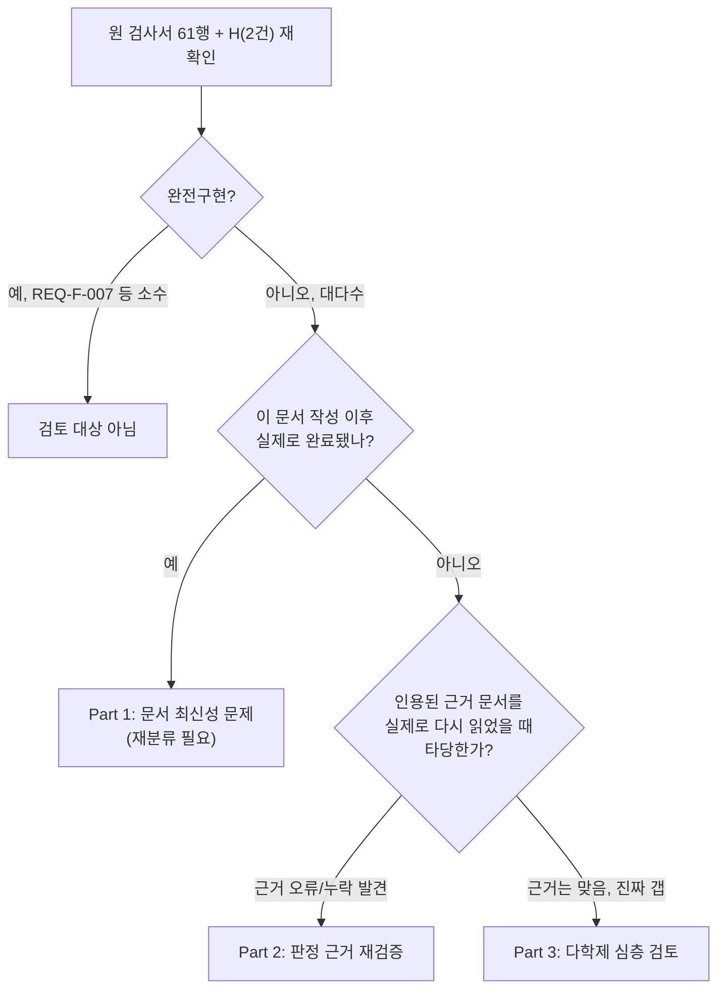
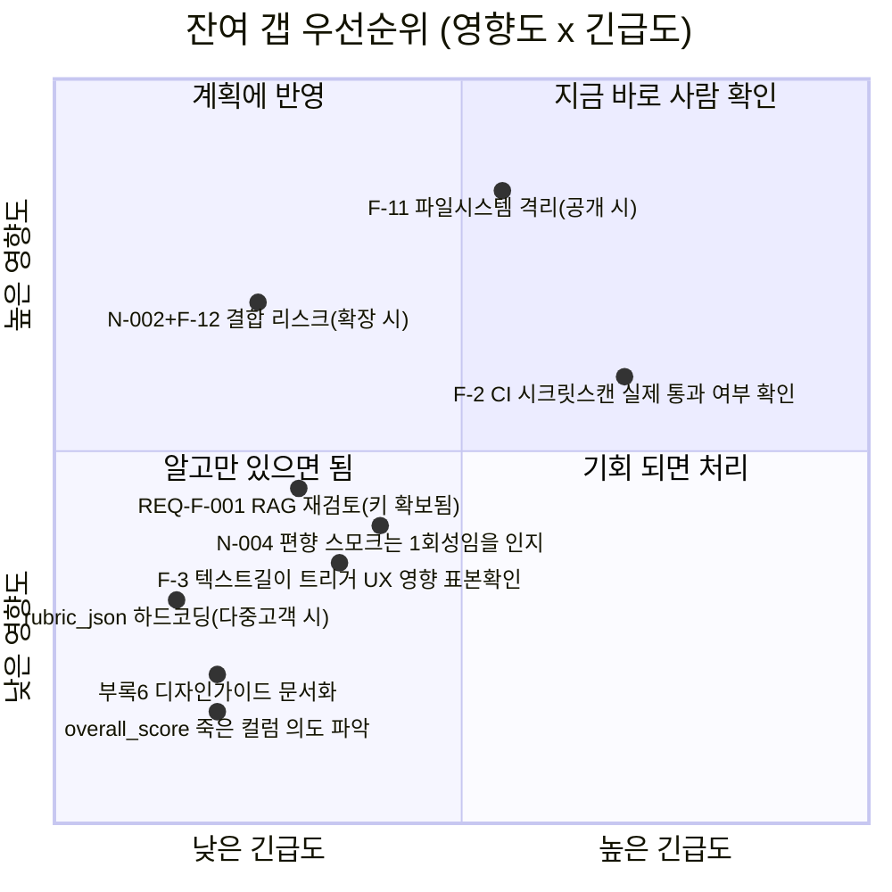

# 전수검사결과 후속 검토 — "완전구현 안 된 항목"의 실제 미적용 범위 심층 분석

- 검토일: 2026-09-09 15:38:20
- 검토 대상: `99.모의면접_전수검사/전수검사결과_20260909101218.md`(이하 "원 검사서")
- 검토 성격: **순수 검토 문서다. 코드/문서를 일절 수정하지 않았다**(Read/Grep/Glob만
  사용, 원 검사서와 동일한 방법론). 사용자 지시("작업은 하지 마세요")에 따라
  이 검토에서 발견한 항목 중 어느 것도 이 세션에서 고치지 않았다 — 전부
  사람 판단·승인 대기 항목으로 남긴다.
- 검토 관점: 개발/기획/설계(아키텍처)/보안/디자인(UX) 5개 관점을 각 항목에
  교차 적용. "ADR/TRD 근거가 있으니 문제없다"고 그대로 받아들이지 않고,
  그 근거 자체가 실제로 그 항목을 정당화하는지 재검증했다.



---

## Part 1 — 문서 최신성 문제 (가장 시급함: 원 검사서가 스스로를 앞지른 항목)

원 검사서는 `2026-09-09` 오전~정오 사이 상태(F-1/F-4/F-10 보안조치까지는
반영됨)의 스냅샷이다. **같은 날 오후 이 세션에서 진행된 작업들이 원
검사서의 "미구현"/"부분구현" 판정 3건을 이미 무효화했다.** 이건 원
검사서의 실수가 아니라(시점상 알 수 없었던 게 당연함) 지금 시점에
그대로 참고하면 잘못된 결론을 내리게 되는 살아있는 리스크다.

| 원 검사서 항목 | 원 판정 | 실제 현재 상태(코드로 재확인) | 근거 |
|---|---|---|---|
| REQ-F-005(화이트보드) | 미구현 | **완전구현** — 라우트/서비스/프론트/테스트 전부 존재, 실제 Docker+실제 Gemini Vision API로 AC-1~6 전부 검증 완료 | `app/services/whiteboard_service.py`, `app/api/routes/whiteboard.py`, `WhiteboardPage.tsx`, `docs/trd/aimock_u2c_trd.md`, `내부테스트결과서/U2c_화이트보드시스템설계평가_실Docker및실Gemini검증_20260909142120.md` (완료 시각 14:21, 원 검사서보다 늦음) |
| REQ-F-002(드로잉/화이트보드 부분) | "모델만 존재... 순수 미구현" | 위와 동일 사유로 해소 | 상동 |
| REQ-F-004(지원 언어 수) | "Python 1종만 지원" | **Python+JavaScript 2종** — PDF 사양(Python+JS)과 이제 일치 | `app/services/coding_service.py:14` `SUPPORTED_LANGUAGES = {"python", "javascript"}`(직접 grep 재확인), `내부테스트결과서/U2b라이브코딩JS지원_및_seccomp치명적버그발견수정_20260909131513.md`(완료 13:15, 원 검사서보다 늦음) |
| G. Phase 5(화이트보드) | "없음" | 완료(위와 동일) | 상동 |
| G. Phase 6(부하테스트/편향성테스트) | "전무"/"자동화 테스트 케이스 전무" | **스모크 수준 1회 산출물 생김**(정식 상시 자동화는 여전히 없음 — 이 부분은 원 검사서 판정이 여전히 대체로 유효) | `내부테스트결과서/부하테스트_편향성테스트_20260909144442.md`(완료 14:44, 원 검사서보다 늦음). 단, **일회성 수동 스모크테스트이지 CI에 편입된 상시 회귀 테스트가 아니므로 "충분하다"고 착각하면 안 됨** — 아래 Part 3-6 참조 |
| 전체 요약 3~4줄 | "미구현: REQ-F-005(화이트보드)..." 등 | 위 항목들 갱신 필요 | 상동 |

**권고**: 원 검사서를 다음에 다시 열어볼 사람(사람이든 AI 세션이든)이
"화이트보드 미구현"이라는 문장만 보고 잘못된 전제로 작업을 시작하지
않도록, 이 검토 문서의 존재를 원 검사서 상단에 한 줄로 교차 참조해
두는 것을 권장한다(단, 이 실행 자체는 "작업"이므로 이번엔 하지 않고
사람 승인 대기).

---

## Part 2 — 판정 근거 자체의 오류 (인용을 다시 확인해보니 안 맞는 것)

원 검사서 §0(판정 원칙)은 "ADR 근거가 있으면 의도적, 없으면 미구현"이라는
명확한 규칙을 스스로 세워놓았다. 이 규칙을 엄격히 적용해 인용된 근거
문서를 실제로 다시 열어봤더니, 2건에서 근거가 부정확했다.

### 2-1. REQ-F-001 — "ADR-002 근거"는 오인용, 실제 근거는 TRD의 "미결" 메모

원 검사서는 REQ-F-001(RAG/벡터검색 미구현)을 **"설계와 다르게 구현됨
(의도적, ADR-002 근거)"**로 분류했다. 그런데 `docs/adr/adr-002-ai-pipeline-stack.md`
전문을 다시 읽어봐도 RAG·벡터·embedding이라는 단어가 **단 한 번도
등장하지 않는다**(grep 0건, 직접 재확인). ADR-002는 LLM/STT/TTS/감정분석
"스택 선택"만 다루는 문서다.

실제 근거는 `docs/trd/aimock_u3a_trd.md §7`인데, 그 문서 원문은 이렇게
말한다:

> "`retrieve_candidates`는 MVP에서 임베딩 벡터 검색을 쓰지 않고... 임베딩은
> Gemini Embedding API 호출이 필요한데 API 키 확보 전이라..." / 미결
> 항목 표: "질문은행 임베딩 기반 벡터 검색 | 카테고리/난이도 필터로
> 대체(MVP) | **아니오(API 키 확보 후 재검토)**"

이건 원 검사서 §0 규칙이 말하는 "확정된 의도적 설계 결정(ADR)"이 아니라
**"나중에 하려고 미뤄둔 미결 항목"**이다. 게다가 "API 키 확보 전"이라는
유예 사유는 지금 시점엔 **이미 무효화**됐다 — Gemini/Groq API 키는
현재 실사용 중이다(면접 진행, 리포트 생성, 화이트보드 평가 전부 실제
LLM 호출). 즉 이 항목을 계속 "의도적 축소"라고 부르는 것은 원 검사서
자신의 분류 규칙에 어긋나며, 정확히는 **"미구현(사유: 애초에 API 키
문제로 미뤘으나, 그 사유가 이제 해소됐음에도 재검토가 안 이뤄짐)"**에
더 가깝다.

**20년차 관점 추가**: pgvector `embedding` 컬럼은 스키마에 존재하지만
어떤 질문 등록 경로로도 값이 채워지지 않는다(등록 파이프라인 자체가
없음). 지금 재검토해서 벡터검색을 붙이려면 ① 임베딩 생성 배치 작업 ②
기존 질문 전체에 대한 1회성 backfill ③ `retrieve_candidates`를
`ORDER BY embedding <-> $1 LIMIT N`으로 교체 — 이 3단계가 전부 필요한데,
질문은행 규모가 현재 몇십 문항 수준이라면 무작위 필터 방식과 체감
품질 차이가 크지 않을 수 있다. 즉 "기술적으로 안 된 것"과 "지금 규모에서
실질적으로 급한가"는 별개 판단이며, 이건 사람이 "질문은행을 얼마나
키울 계획인가"에 달린 **제품 로드맵 결정**이지 코드 문제가 아니다.

### 2-2. REQ-F-006 — "시선 처리 확인 불가"는 원 검사서의 확인 누락

원 검사서는 "시선 처리"에 대해 **"그 문서에도 언급이 없어 확인 불가"**
라고 적었다. 그런데 `docs/trd/aimock_master_trd.md:106`의 F-006 행을
다시 읽으면 다음 문구가 이미 명시돼 있다:

> "'시선처리'는 프레임 표정분석 범위로 축소(눈동자 추적 아님)"

즉 근거 문서에 실제로 적혀 있는데 원 검사서가 이를 놓쳤다. **정정하면**:
시선 처리는 "미구현"도 "확인 불가"도 아니라, "발화속도"와 동일하게
**설계와 다르게 구현됨(의도적, TRD 근거 명시 — 눈동자 추적이 아니라
프레임 단위 표정분석에 포함시키는 것으로 범위를 좁힘)**으로 재분류해야
한다.

### 2-3. F-2 — "커밋 이력 전수 스캔은 범위 밖"이라는 결론이 이미 있는 자동화를 놓침

원 검사서 F-2는 "확인 불가... 저장소 전체 히스토리 스캔은 시간상
수행하지 않음"이라고 적었다. 그런데 `.github/workflows/ci.yml:38-49`를
다시 읽으면:

```yaml
secret-scan:
  steps:
    - uses: actions/checkout@v4
      with:
        fetch-depth: 0      # 전체 히스토리 체크아웃
    - run: ./gitleaks detect --source . ... --exit-code 1
```

`gitleaks detect`는 기본 동작이 **git 로그 전체(모든 커밋)를 스캔**하는
것이고, `fetch-depth: 0`으로 전체 히스토리를 받아왔으니, 이 CI 잡은
매 push마다 **저장소 전체 커밋 이력에 대한 시크릿 스캔을 이미 자동
수행하고 있다.** 즉 "확인 불가"가 아니라 "자동화된 확인 수단이 이미
존재함"이 더 정확한 결론이다.

**단, 여기서 멈추지 않고 한 겹 더 파야 한다(20년차라면 당연히 의심할
지점)**: ① 이 CI 잡이 실제로 초록불(passing)인지, 아니면 이미 실패
상태인데 아무도 안 보고 있는 건 아닌지는 **이 세션에서 GitHub Actions
실행 이력에 접근할 수단(`gh` CLI 미설치)이 없어 확인하지 못했다** —
이건 사람이 GitHub 저장소의 Actions 탭에서 직접 확인해야 하는 항목으로
남긴다. ② gitleaks 기본 룰셋은 AWS 키처럼 알려진 패턴과 고엔트로피
문자열은 잘 잡지만, Groq/Gemini API 키처럼 상대적으로 짧고 형식이
단순한 키는 놓칠 수 있다(오탐/누락 가능성은 어느 스캐너나 있음) —
"자동화가 있다"가 "완벽히 안전하다"를 의미하지 않는다는 점을 분리해서
봐야 한다.

---

## Part 3 — 남은 진짜 갭 심층 검토 (다학제 관점)

Part 1/2에서 정리·정정한 항목을 제외하고, 실제로 여전히 유효한 갭들을
다룬다. 원 검사서가 이미 잘 짚은 것은 반복하지 않고, **"그래서 이게
실제로 왜 문제가 되거나 안 되는지"**를 각 관점에서 추가한다.

### 3-1. REQ-F-003 — VAD 대신 "텍스트 800자 초과" 트리거의 실사용 함의 (기획/UX)

원 검사서는 메커니즘 차이(VAD vs 텍스트 길이)까지는 정확히 짚었으나,
그 결과로 생기는 **사용자 경험 문제**는 다루지 않았다:

- 이 방식은 "장황하지만 알맹이 없는 답변"과 "훌륭하고 상세한 답변"을
  구분하지 못한다 — 둘 다 글자 수만 많으면 똑같이 잘린다. 실제 채용
  면접에서 좋은 지원자일수록 상세하게 답하는 경향이 있다는 걸 감안하면,
  **우수 답변이 조기 차단당해 오히려 손해 보는 역설적 상황**이 생길 수
  있다.
- 800자라는 임계값은 한국어 기준으로 정해졌을 텐데(`config.py:27`
  `turn_max_answer_chars`), 다국어 지원을 염두에 둔다면 언어별 정보
  밀도 차이로 형평성 문제가 생길 수 있다(지금은 한국어 단일 지원이라
  당장은 아님).
- **권고**: 코드 수정 없이도, 이 임계값에 걸리는 실사용 답변 로그를
  몇 건 뽑아 "정말 장황한 답변"인지 "그냥 성실하고 긴 답변"인지 사람이
  한 번 확인해보는 것을 제안한다(이건 데이터 확인이지 코드 작업은
  아니라 원한다면 다음 세션에서 바로 해볼 수 있음).

### 3-2. REQ-F-004 + F-11 — 코드 평가 비구조화와 샌드박스 파일시스템 격리 부재 (보안 중심)

언어 지원(Python+JS)은 Part 1에서 이미 해소로 정정했으나, 두 가지는
그대로 유효하다:

1. **코드 품질 평가가 구조화 필드가 아니라 LLM 요약 텍스트에 녹아있음**
   — 이건 "채용담당자가 화면에서 필터링/정렬"(예: "시간복잡도 O(n)
   이하만 필터")을 할 수 없다는 뜻이다. 지금 화면(대시보드)에 그런
   기능이 없다면 당장은 문제 아니지만, 나중에 채용담당자 대시보드에
   정렬/필터 기능을 넣으려 하면 이 비구조화가 발목을 잡는다 — **지금
   미리 알아두면 되는 종류의 기술부채**.
2. **F-11(샌드박스 파일시스템 격리 없음)** — 원 검사서가 이미 "인프라
   제약으로 코드 수정만으로는 해결 안 됨"이라고 정확히 짚었다. 보안
   담당자 관점에서 하나 더 짚을 것: 지금은 "본인 전용/제한적 공개"
   단계라 위험이 낮지만, **만약 이 서비스 URL을 다른 사람에게 공유하는
   순간(데모/시연 포함) 위험 수준이 질적으로 달라진다.** 다른 지원자가
   업로드한 코드 제출 이력이나 서버 파일시스템의 다른 부분을 읽는 코드를
   작성해 제출하면(예: `open('/etc/passwd')` 류) seccomp가 `execve`/
   `socket`은 막아도 **파일 읽기 자체는 막지 않을 가능성이 높다** —
   실제로 이 세션에서 파일 읽기 시도를 exploit 테스트한 이력이 있는지
   원 검사서/내부테스트결과서에서 확인되지 않았다(지금까지의 exploit
   검증은 소켓 생성 차단 위주였음). **이건 이번 세션에서 코드를 만지지
   않기로 했으므로 검증도 하지 않았다 — "파일 읽기 시도가 실제로 막히는지
   안 막히는지조차 아직 실측된 적이 없다"는 사실 자체를 리스크로
   기록한다.**

### 3-3. REQ-N-002 + F-12 — 수평 확장 없음과 인메모리 레이트리밋의 결합 리스크 (보안/운영)

두 항목이 원 검사서엔 별도 행으로 나뉘어 있지만, 실제로는 서로 강하게
얽혀 있다: **지금은 인스턴스가 1개뿐이라 F-12(인메모리라 다중 인스턴스에서
무력화됨)가 "실질적 리스크 낮음"이라는 원 검사서 결론이 맞다.** 하지만
이건 "지금은 괜찮다"이지 "앞으로도 괜찮다"가 아니다 — Render에서
인스턴스 수를 늘리는 순간(트래픽 증가 대응으로 가장 먼저 시도할 조치)
브루트포스 방어가 **아무도 모르는 사이에 조용히 무력화**된다. 이건
"수평 확장을 도입할 때 반드시 같이 검토해야 할 체크리스트 항목"으로
지금 미리 기록해 두는 게 맞다(코드 변경 없이 문서화만으로 충분).

### 3-4. REQ-N-004 — 편향성 스모크테스트 이후 상태 (기획/보안)

Part 1에서 언급했듯 이제 1회성 스모크테스트 산출물이 있다
(`내부테스트결과서/부하테스트_편향성테스트_20260909144442.md`, 이름의
성별 신호 3쌍×3회=18회 실측). **이걸 "편향성 검증 완료"로 해석하면
안 된다** — 그 결과서 자체가 명시하듯: ① 축이 1개(이름/성별)뿐이고
연령/지역/장애 등은 다루지 않았다, ② 표본이 작아 통계적 결론이
불가능하다, ③ **일회성 수동 스크립트라 CI에 편입돼 있지 않아, 앞으로
프롬프트나 모델을 바꿔도 자동으로 재검증되지 않는다**. 20년차 관점:
이런 "한 번 해봤다"류 검증은 시간이 지나면 "예전에 확인했으니 괜찮다"는
잘못된 안도감을 주기 쉽다 — 만약 이 프로젝트가 계속 유지된다면, 이
스모크테스트를 CI에 편입시켜 상시 회귀 검사로 만들지, 아니면 "1회성
확인이었다"는 걸 문서에 명확히 유효기간 표시해둘지는 사람이 결정할
일이다.

### 3-5. D. `Interviews.overall_score` 죽은 컬럼, `Questions.rubric_json` 부재 (설계/개발)

- `overall_score`: 코드 전체에서 정의 라인(`interview.py:24`) 외에
  대입/조회가 전혀 없음을 이번에도 재확인했다(`grep -rn "overall_score"
  app/` → 정의 1건뿐). 이건 "죽은 컬럼"이 맞다. 문제는 이게 그냥
  방치된 건지, 원래 리포트의 `technical_score` 등 3개 세부 점수의
  평균치를 여기 채워 넣을 계획이었는데 잊힌 건지 알 수 없다는 것 —
  **의도가 기록돼 있지 않다는 것 자체가 문서화 부채**다. 지금 당장
  기능 장애는 아니지만, DB 스키마 리뷰를 하는 사람이라면 누구나 "이건
  뭐지?"라고 물을 컬럼이다.
- `rubric_json` 부재(루브릭이 시스템 프롬프트에 하드코딩): 채용
  기준(루브릭)을 바꾸려면 **코드 배포가 필요**하다는 뜻이다. 회사마다,
  직무마다 평가 기준이 다를 수 있는 채용 도구의 특성상, 이건 "지금
  당장은 1인 개발/단일 사용 시나리오라 문제없음"이지만 여러 채용
  담당자가 서로 다른 기준으로 쓰고 싶어지는 순간 구조적 병목이 된다.

### 3-6. 부록#6 — UI/UX 와이어프레임/디자인 가이드 미구현 (디자인, 증거 기반 재평가)

원 검사서는 이 항목을 "미구현"이라고만 적었는데, **실제 리스크가
얼마나 현실화됐는지**를 코드로 확인해봤다:

- **완화 요인 발견**: `index.css`(338줄) 하나에 `--color-*` CSS 커스텀
  프로퍼티(디자인 토큰)가 정의돼 있고, 9개 페이지 전체에서 인라인
  `style={{...}}` 사용이 0건, 하드코딩된 색상 hex 값도 전체에서 1건뿐
  이었다. 즉 **공식 디자인 가이드 문서는 없지만, 실질적으로는 단일
  토큰 기반 스타일시트로 어느 정도 일관성이 유지되고 있다** — 여러
  세션에 걸쳐 개발됐는데도 "화면마다 색이 제각각"인 최악의 시나리오는
  피한 상태다.
- **여전히 남는 진짜 리스크**: (1) 공식 문서가 없으므로 새 개발자/AI
  세션이 합류하면 이 암묵적 규칙(토큰만 쓰고 인라인 금지)을 모르고
  깨뜨릴 수 있다 — 강제하는 린트 규칙이 없다(디자인 일관성이 "관행"에만
  의존). (2) 접근성(a11y) 속성(`aria-*`/`role`/`alt`)이 페이지당
  1~4개 수준으로 매우 적어(전체 15건), 스크린리더/키보드 내비게이션에
  대한 체계적 고려는 사실상 없었다고 봐야 한다. (3) 반응형(모바일)
  레이아웃 검토 여부도 이번 검토 범위에서 확인하지 못했다(원 검사서
  범위 밖이기도 함).

### 3-7. E. API 스키마 필드명 전면 불일치 (설계, 재확인)

원 검사서가 이미 잘 정리했다(`key_observations`/`rubric_match` 필드
자체가 없음, 마스터 TRD가 자체 발견해 정정해둔 사실도 재확인됨). 여기
추가할 것: 이건 **내부적으로 일관되게 쓰이고 있다면 실사용에 문제가
없는 종류의 불일치**다(프론트-백엔드가 서로 같은 실제 스키마를 참조).
다만 "PDF 스펙 그대로 구현했다"고 외부에 설명해야 하는 상황(예: 계획서
심사, 투자 설명)이 생기면 이 차이를 반드시 먼저 설명해야 한다 — 숨기면
나중에 더 큰 신뢰 문제가 된다.

---

## Part 4 — 우선순위 매트릭스 (20년차 PM 관점, 판단만 제시·실행 안 함)



**해석**: "지금 바로 사람 확인"에 들어간 2건(F-11 공개 배포 시 파일
읽기 검증 여부, F-2 CI 실제 통과 이력)은 **보안 관련이고 확인 비용이
낮은데 방치 시 파급이 크기 때문**이다. 나머지는 이 프로젝트가 "1인
개발/제한적 공개 MVP"라는 현재 스코프를 유지하는 한 급하지 않다 —
스코프가 바뀌는 순간(공개 범위 확대, 다중 고객, 인스턴스 확장) 우선순위가
바뀌는 항목들이라 별도로 표시했다.

---

## 결론

1. **원 검사서 61+2행 중 3건은 이미 이 세션에서 해소돼 재분류가
   필요하다**(REQ-F-005, REQ-F-002 일부, REQ-F-004 언어수) — Part 1.
2. **2건은 인용 근거 자체가 부정확했다**(REQ-F-001의 ADR-002 오인용,
   REQ-F-006 "시선처리" 확인불가 처리) + **1건은 이미 존재하는 자동화를
   놓쳤다**(F-2 CI gitleaks) — Part 2.
3. 나머지 실제 잔여 갭들은 원 검사서의 사실관계 자체는 대체로 정확했고,
   이번 검토는 **"그래서 이게 왜/언제 문제가 되는가"라는 실무적 함의**를
   추가했다 — Part 3. 그중 보안 2건(F-11 실사용 검증 부재, F-2 CI 통과
   이력 미확인)은 확인 비용이 낮으니 사람이 다음에 직접 보는 것을 권한다.
4. 코드/문서는 전혀 수정하지 않았다. 이 문서에서 언급한 모든 후속 조치
   (원 검사서 재분류, RAG 재검토, exploit 재검증, CI 이력 확인 등)는
   전부 사람의 지시를 받은 뒤 별도 세션에서 진행해야 한다.
