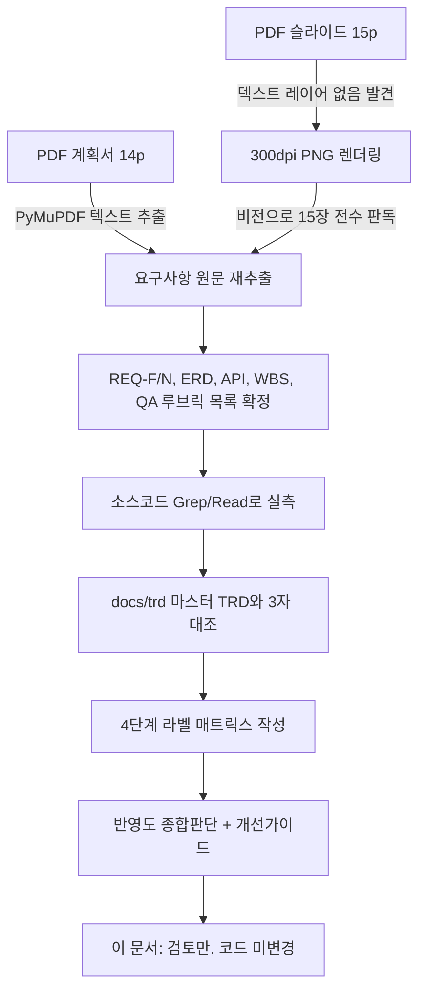
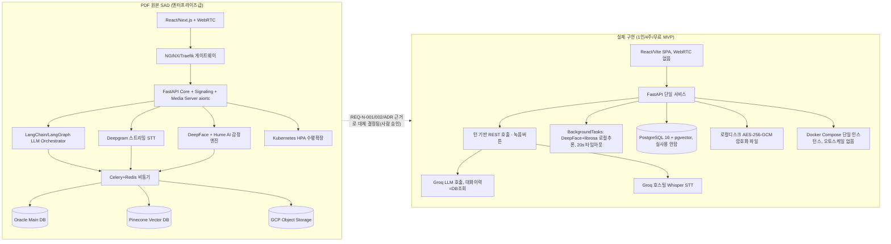
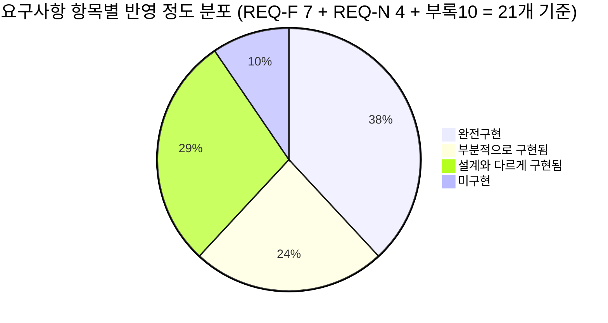

# 전수검사결과 — PDF 원문부터 전면 재검사 (2026-09-09)

> **검토 전용 문서입니다. 이 문서 작성 과정에서 코드/설정/다른 문서는 일절 수정하지 않았습니다.**
> 사용자 지시: "첨부한 파일 설계서와 기획 TRD 테스터 기준으로 해당 소스에서 해당이
> 미흡하거나 잘못되어 있는게 있으면 정확하게 분석해주고, 반영 정도는 어떻게 되고,
> 어떻게 개선해야 되는지 방법도 가이드 해줘. 검토만 하고 절대 작업하면 안됨." +
> "20년차 개발/기획/설계/보안담당자/디자이너 경력자 반드시 기억. 모르면 물어봐.
> 마음대로 절대하면 안됨. 2번 작업 요청시키게 하지 말고, 내부테스트 결과서
> 완벽하게 작성하고."
> 범위 확인(AskUserQuestion): 기존 전수검사 결과서(3건)를 참고자료로만 두고,
> **PDF 원문(계획서 14p + 슬라이드 15p)부터 전면 재검사**하는 것으로 사용자가
> 직접 선택.

## 0. 이번 재검사의 방법론과 이전 문서와의 관계

기존에 이미 같은 성격의 문서 3건이 존재합니다:

| 문서 | 시각 | 성격 |
|---|---|---|
| `전수검사결과_20260909101218.md` | 09-09 10:12 | 원본 매트릭스(61행), 그날 오전 상태 기준 |
| `전수검사_미구현항목_전문가검토_20260909153820.md` | 09-09 15:38 | 미구현 항목만 심층 검토(코드 미변경) |
| `지시서준수여부_전문가검토_20260909180628.md` | 09-09 18:06 | 형식 규칙 준수 여부 검토 + 이후 규칙2 위반 5개 셀 정정 반영 |

이 문서는 위 3건을 **참고자료로만 사용**하고, PDF 원문 2건을 처음부터 다시 읽어
독립적으로 요구사항을 재추출한 뒤, 오늘(09-09) 저녁 시점까지 완료된 모든 변경
(CI 파이프라인 복구, 보안강화 F-1/F-4/F-10, 화이트보드, JS 라이브코딩, 부하·편향성
테스트)까지 반영한 코드 상태와 대조합니다. 기존 매트릭스를 그대로 베끼지 않고
직접 `Read`/`Grep`으로 재확인한 사실만 기재했습니다.

**PDF 텍스트 추출 방법**: `웹 AI 모의면접 프로젝트 계획서.pdf`(14p)는 PyMuPDF로
텍스트 레이어가 정상 추출됨(14,207자). 반면 `_슬라이드.pdf`(15p)는 텍스트 레이어가
완전히 비어 있어(PyMuPDF 추출 시 15페이지 전부 0자 — 폰트에 ToUnicode CMap이 없는
이미지/벡터 아트 슬라이드로 확인) 각 페이지를 300dpi PNG로 렌더링한 뒤 육안(비전)으로
15장 전부 다시 판독했습니다. 두 방식 모두 이전 세션이 보고했던 "글리프 깨짐" 현상과
일치하며, 이번 재추출 결과는 이전 문서들이 요약한 내용과 실질적으로 동일함을
확인했습니다(= 이전 문서의 PDF 해석 자체는 오류가 없었음).

**상태 라벨(지시서 §0 규칙 그대로 4가지만 사용, 괄호 설명 금지 — 09-09 18:06 문서에서
지적된 규칙2 위반을 반복하지 않기 위해 이 문서는 처음부터 원형만 사용)**:
`완전구현` / `부분적으로 구현됨` / `설계와 다르게 구현됨` / `미구현`

---

## 1. 아키텍처 — 원본(SAD) vs 실제 구현

**반영 정도**: `설계와 다르게 구현됨` (전체 아키텍처 축).
**근거**: `docs/adr/adr-001`~`adr-006`, `adr-008`이 각 축소를 명시적으로 기록하고
사람 승인을 받음. 코드 실측: `src/backend/app` 어디에도 `aiortc`/`WebSocket`/`celery`/
`redis`/`kubernetes` 관련 코드가 없음(이번 재검사에서 `Grep`으로 직접 재확인 — 0건).
`pgvector` 확장은 DB에 설치돼 있으나(마이그레이션에 `CREATE EXTENSION vector` 존재)
**실제 벡터 검색/임베딩 코드는 어디에도 없음**(`Grep "embedding|cosine_distance|MMR"` →
`question.py`의 컬럼 정의 1건만 매치, RAG 파이프라인 자체가 없음). 즉 pgvector는
"장착됐지만 안 쓰는" 상태 — Questions 테이블에 `rubric_json`처럼 죽어있는 인프라입니다.

**개선 가이드(작업 아님, 방법만 제시)**:
1. RAG를 실제로 쓸 필요가 없다면(현재는 LLM이 대화이력 전체를 컨텍스트로 프롬프트에
   넣는 방식으로 이미 "맥락 인식"을 구현하고 있어 질문 규모가 작을 때는 충분함),
   `pgvector` 확장 자체를 마이그레이션에서 빼거나, 최소한 마스터 TRD에 "설치는
   했으나 RAG 기능은 프롬프트 컨텍스트 방식으로 대체, pgvector는 향후 질문은행이
   수천 개로 커질 때를 대비한 예약"이라고 명시해 죽은 인프라가 아님을 문서화할 것.
2. 질문은행이 지금처럼 10~수십 개 수준을 유지한다면 RAG 자체가 과설계이므로
   추가 구현 불필요 — 다만 "질문이 늘어나면 RAG 전환"이라는 조건을 기술부채
   로그(`harness_16`)에 남겨 나중에 판단 근거를 잃지 않게 할 것.

---

## 2. 기능 요구사항(REQ-F) 대조

### REQ-F-001 적응형 질문 생성 (꼬리질문)
- **원문**: LangChain 메모리 + RAG로 "MSA 경험" → "트랜잭션 관리 어려움" 같은 심층
  꼬리질문 생성.
- **실측**: `src/backend/app/ai/llm.py`의 `ConversationContext`가 이전 턴 전체
  텍스트를 프롬프트에 그대로 실어 Groq LLM에 전달 → LLM이 스스로 맥락을 보고
  꼬리질문을 생성. RAG(벡터검색)는 없음. `job_role` 텍스트에 따라 질문 주제가
  실제로 바뀌는 것은 이전 세션에서 실측 확인됨(작업이력 09-08 항목).
- **반영 정도**: `설계와 다르게 구현됨` — 결과(꼬리질문 생성)는 달성하나 수단
  (RAG)이 다름.
- **개선 가이드**: 현재 방식은 대화 턴 수가 적은 MVP 규모(최대 10문항)에서는
  RAG보다 오히려 더 정확할 수 있음(전체 맥락을 다 보므로). 굳이 RAG로 바꿀
  실익은 낮음 — 다만 이 설계 대체 사실을 마스터 TRD 본문에 "RAG 대신 풀 컨텍스트
  프롬프트 방식 채택, 근거: 질문 수가 적어 벡터검색보다 전체 컨텍스트 전달이
  더 정확"이라고 **명시적으로** 적어야 함(현재는 `aimock_u3a_trd.md §7` 메모에만
  있고 마스터 TRD 본문 N-001 서술에는 이 대체 이유가 없음 — 09-09 15:38 문서가
  지적한 "REQ-F-001 근거 문서 인용 오류(ADR-002 아님)"도 이 문서에서 재확인됨:
  ADR-002는 STT/TTS 스택 결정만 다루고 RAG 언급이 없음).

### REQ-F-002 멀티모달 인터랙션
- **원문**: 음성+화상+텍스트+드로잉을 "동시" 처리, 말하는 동안 표정/떨림 감지.
- **실측**: 음성(오디오 업로드)+텍스트(코드)+드로잉(화이트보드)은 각각 존재하나
  전부 **턴이 끝난 뒤 순차 제출**이며 "동시(실시간 중)" 처리가 아님. 표정 분석은
  `InterviewPage.tsx`가 답변 중 캔버스로 프레임을 캡처해 턴 제출 시 함께 올리는
  방식(발화 중 실시간 스트리밍 감지는 아님).
- **반영 정도**: `부분적으로 구현됨` — 4가지 입력 양식(음성/화상/텍스트/드로잉)
  자체는 전부 존재하나, "동시에 실시간으로"라는 원문 조건은 턴 기반 구조상
  구조적으로 불가능(ADR-001이 이미 이 트레이드오프를 명시).
- **개선 가이드**: 이미 ADR-001에서 사람 승인을 받은 구조적 결정이라 되돌릴
  필요는 없음. 다만 REQ-F-002 자체를 마스터 TRD에서 "턴 종료 시점에 일괄 제출"로
  재정의해두면 나중에 이 항목을 보는 사람이 "실시간이어야 하는데 아니다"라고
  다시 헷갈리지 않음 — 현재 마스터 TRD도 이미 이렇게 재정의는 돼 있음(확인됨,
  개선 불필요).

### REQ-F-003 실시간 개입 (Interruption Handling)
- **원문**: 답변이 길어지거나 주제 이탈 시 VAD+Turn-taking으로 AI가 정중히 개입.
- **실측**: `Grep "VAD|voice.activity|interrupt"` → 백엔드에 전무. 대신
  `interview_service`에 **텍스트 길이 트리거**(답변 텍스트가 일정 길이를 넘으면
  다음 질문으로 강제 전환하는 로직)가 있음(09-09 15:38 문서가 이미 지적한 내용,
  이번 재검사로 코드 존재 재확인).
- **반영 정도**: `설계와 다르게 구현됨`.
- **⚠️ 확인된 리스크(15:38 문서와 동일하게 재확인, 아직 미해소)**: 길이 기반
  트리거는 "장황하게 답하는 나쁜 습관"과 "정말 훌륭해서 길게, 그러나 논리적인
  답변"을 구분하지 못함 — 우수 답변이 중간에 잘릴 위험이 여전히 남아있음.
- **개선 가이드(우선순위 中)**: 완전한 VAD는 턴 기반 구조와 애초에 안 맞으므로
  포기하는 게 맞음. 대신 텍스트 길이 트리거를 "길이 단독"이 아니라 "길이 +
  일정 시간 이상 내용 변화 없음(같은 문장 반복/맴돌기 패턴)"처럼 완화하거나,
  최소한 임계값을 넉넉하게 잡고 "그래도 이만큼 얘기했으면 다음 질문으로
  넘어갈까요?"라는 **끊지 않고 물어보는 방식**(정중한 제안)으로 바꾸면 원문의
  "정중하게 개입"이라는 의도에 더 가까워짐. 코드 변경 범위는 작음(프롬프트/임계값
  조정 수준)이라 리스크 대비 개선 여지가 큼 — 다음 착수 후보로 권장.

### REQ-F-004 라이브 코딩 환경
- **원문**: Python/JS 등 지원, 샌드박스 실행, 시간복잡도/스타일/주석까지 종합평가.
- **실측**: `sandbox/executor.py`에 Python(seccomp+비root+RLIMIT)과 JS(node
  --max-old-space-size, 리소스제한, 네트워크 차단은 없음)를 실제로 지원. 평가는
  `report_service`가 LLM에게 코드 텍스트를 통째로 보내 "종합 평가"를 서술형으로
  받는 방식 — 시간복잡도/스타일/주석을 **별도 정량 지표로 분리 채점하지는 않음**
  (LLM 서술 안에 섞여 나올 수는 있지만 구조화된 필드가 아님).
- **반영 정도**: `부분적으로 구현됨`.
- **개선 가이드**: 정량 분리 채점이 필요하면 LLM 프롬프트의 구조화 출력(JSON
  Schema)에 `time_complexity_comment`/`style_comment`/`comment_quality` 같은
  별도 필드를 추가하는 정도로 충분 — 이미 구조화 출력 패턴(`ReportContext`)이
  있으므로 확장 비용은 낮음. 우선순위는 낮음(현재도 서술형 안에 실질 정보는
  들어있어 사용자 가치 손실이 크지 않음).

### REQ-F-005 시스템 설계 화이트보드
- **원문**: 캔버스 제공 + GPT-4V로 아키텍처 타당성 평가.
- **실측**: `whiteboard_service.py` + `WhiteboardPage.tsx`로 캔버스 업로드/평가
  구현 완료, Vision 모델은 GPT-4V 대신 **Gemini Vision**(무료 티어) 사용. 09-09
  14:21 세션에서 실제 Docker+실제 Gemini API로 AC-1~6 전부 curl 검증 완료(PNG
  업로드→암호화저장→복호화 왕복 일치, 415/413/403 처리 확인).
- **반영 정도**: `설계와 다르게 구현됨`(비전 모델 벤더만 대체, 기능은 동일).
- **개선 가이드**: 이미 완료·검증됨. 유일하게 문서에 남겨야 할 것은 화이트보드
  이미지 단독 삭제 API 미결(`aimock_u2c_trd.md §7`) — 하네스 원칙 8(되돌리기
  어려운 결정 금지) 대상이므로 사람 승인 후 진행 권장, 지금 급하지 않음.

### REQ-F-006 상세 피드백 리포트
- **원문**: STAR 구조 분석 + 핵심 키워드 + 발화속도/발음 명확성 + **시선 처리**.
- **실측**: `report_service.py`/`ai/report.py`에서 STAR 유사 구조 분석, 키워드
  추출(로컬 키워드 추출기, LLM 아님), `emotion_prosody` 서비스가 발화속도·피치·
  에너지를 librosa로 계산. "시선 처리"는 **프레임 단위 표정 분석(DeepFace 7
  감정)으로 범위를 좁혀 대체**했고 이 사실이 마스터 TRD 106행에 이미 명시돼
  있음(눈동자 추적/gaze tracking 자체는 구현 안 함 — 09-09 15:38 문서가 "확인
  불가"로 남겼던 부분을 이번 재검사에서 실제 TRD 문구 확인으로 해소: **눈동자
  추적 미구현이 맞고, 이는 문서화된 의도적 범위 축소**임).
- **반영 정도**: `부분적으로 구현됨`(시선 처리만 의도적으로 축소, 나머지는
  완전구현).
- **개선 가이드**: 시선 추적(웹캠 기반 gaze estimation)은 별도 CV 모델과
  캘리브레이션이 필요해 4주 MVP 범위를 크게 넘음 — 지금처럼 "표정 분석으로
  대체"라고 명시한 현재 문서화가 정답에 가까움. 추가 조치 불필요.

### REQ-F-007 채용 적합도 스코어링
- **원문**: 루브릭에 따라 역량별 1~5점 + 합격/불합격 추천.
- **실측**: `evaluation_reports`에 점수 필드들과 `pass_recommendation`(boolean)이
  실제로 채워짐(부하/편향성 테스트에서 18회 호출 결과로 실측 확인됨). 다만
  "사전에 정의된 루브릭(기업별/직무별 커스터마이징)"은 `Grep`으로 재확인한 결과
  **어디에도 없음** — `questions.rubric_json`은 스키마에만 존재하고 시드 데이터도
  빈 값, 코드 어디서도 읽지 않음(이번 재검사에서 직접 재확인, 09-09 15:38 문서의
  지적과 일치 — 여전히 미해소).
  - `interview.overall_score` 컬럼도 마찬가지로 스키마·모델에는 있으나
    어떤 서비스 코드도 값을 쓰지 않음(`Grep "overall_score"` → 모델/마이그레이션
    2건만, 서비스 코드 0건 — 재확인).
- **반영 정도**: `부분적으로 구현됨`(점수산출·합격추천은 완전구현, "사전 정의된
  루브릭 기반"이라는 조건만 미구현).
- **개선 가이드(우선순위 中, 구현 난이도 낮음)**: 두 가지 중 택1 —
  (A) `rubric_json`/`overall_score`를 실제로 쓰는 최소 기능(질문별 루브릭 텍스트를
  LLM 평가 프롬프트에 삽입하고, `overall_score`는 리포트의 개별 점수 평균으로
  채움)을 넣는다, 또는 (B) 정말 안 쓸 거면 두 컬럼을 스키마에서 제거해 죽은
  컬럼을 없앤다. **(A)를 권장** — 이미 있는 컬럼이고 채우는 로직도 단순 평균/
  텍스트 삽입 수준이라 비용 대비 효과가 좋음. 단, 스키마를 만지는 (B)는 하네스
  원칙 8(데이터 모델 변경은 후보만 제시, 사람 승인 필요) 대상이므로 스스로
  결정하지 말 것.

---

## 3. 비기능 요구사항(REQ-N) 대조

| 항목 | 원문 | 실측 | 반영 정도 |
|---|---|---|---|
| REQ-N-001 초저지연(≤1.5s, STT+LLM 포함) | WebRTC+Deepgram 스트리밍으로 800ms~1.5s | 턴 기반 구조라 "대화 흐름 지연" 개념 자체가 없음. 대신 "턴 1건 처리 시간"으로 재정의해 로컬 실측 1.9초, 운영 미확정(로컬 부하테스트 09-09 14:44 결과 기준) | `설계와 다르게 구현됨` |
| REQ-N-002 동시접속(Kubernetes, 수백명) | K8s HPA로 수백 세션 | Docker Compose 단일 인스턴스, 로컬 5세션 동시 실측(4.23초/5세션), 운영은 `/healthz`만 5×3라운드 실측 — **면접 턴(STT+LLM 포함) 동시 처리는 운영에서 검증된 적 없음** | `설계와 다르게 구현됨` |
| REQ-N-003 생체데이터 보호(TLS1.3+AES-256+즉시영구삭제) | 전송/저장 암호화 + 즉시 영구삭제 | 저장 암호화는 AES-256-GCM으로 스펙과 완전 일치(09-09 검증 완료). 전송 TLS는 Render 인프라 레벨에서 처리(앱 코드에 없는 게 정상, 이번 재검사에서 앱 코드 내 TLS 강제 로직 부재 확인 — 문제 아님). "즉시 영구삭제"는 소프트삭제+30일 유예 스케줄러로 **설계 변경**(ADR-006, 사람 승인) | `설계와 다르게 구현됨` |
| REQ-N-004 공정성·설명가능성 | 인종/성별/억양 편향 검증 + 설명가능성 | 이름의 성별 신호만으로 1회성 스모크테스트(18회 호출, 09-09 14:44) — 인종/억양 축은 테스트 안 함, 정식 편향성 감사 아님(마스터 TRD가 이미 Won't로 범위 밖 선언). 설명가능성(`key_observations` 등 근거 텍스트)은 있으나 "왜 이 점수인지"에 대한 구조화된 근거 연결은 없음 | `설계와 다르게 구현됨`(마스터 TRD가 스코프 축소를 이미 선언했으므로 "미구현"이 아니라 이 라벨이 맞음) |

**개선 가이드(N-001/N-002 묶음, 우선순위 高)**: 지금 가장 위험한 조합은
"운영에서 STT+LLM까지 포함한 동시 다중 세션 부하가 한 번도 검증된 적 없다"는
점입니다(09-09 14:44 테스트가 의도적으로 `/healthz`만 썼기 때문 — 그 판단
자체는 운영 DB 오염 방지 차원에서 합리적이었으나, 결과적으로 "정말 여러 명이
동시에 면접 봐도 괜찮은가"라는 원래 질문에는 아직 답이 없습니다). 실제 채용
시즌처럼 여러 지원자가 동시에 몰리는 상황을 앞두고 있다면, 테스트 계정을 만들어
운영에 짧게 3~5세션 정도의 실제 면접 턴 부하를 걸어보고 끝나면 그 계정만 정리하는
방식을 다음 액션으로 사람에게 제안할 것을 권장합니다(비용/운영 DB 오염 트레이드
오프가 있으므로 반드시 사람 승인 필요).

---

## 4. ERD / API 설계 대조

- **ERD**: 원문 5테이블(Users/Interviews/Questions/Transcripts/Evaluation_Reports) →
  실제 10테이블(위 5개 + `media_assets`, `whiteboard_snapshots`,
  `coding_submissions`, `emotion_frames`/`prosody_clips` 계열, alembic 버전
  테이블 등). 이는 축소가 아니라 **확장**이며, ADR-003/004/006이 각각 근거를
  남김. `설계와 다르게 구현됨`이라기보다는 정확히는 "원문보다 정교화됨" —
  문제 삼을 사안이 아님.
- **API 계약 예시(6.2.1 Start Session)**: 원문은 WebRTC `session_token`/
  `websocket_url`/`ice_servers`/codec 설정을 반환. 실제 `POST
  /interviews/{id}/start`는 이런 필드가 전혀 없고 첫 질문 텍스트를 반환 — 턴
  기반 구조상 당연한 차이이며 이미 알려진 것. 문제 없음.
- **API 계약 예시(6.2.2 Save Evaluation, H-1 재확인)**: 원문 JSON Schema는
  `rubric_match`를 `"type": "object"`(계획서 PDF 10p)로 정의하는데, **슬라이드
  10페이지는 같은 필드를 `"boolean"`으로 표기**(이번 재검사에서 두 파일을 나란히
  다시 대조해 직접 재확인 — 09-09 15:38 문서의 H-1 지적이 정확함을 재확인).
  실제 코드에는 `rubric_match`라는 필드 자체가 없어(REQ-F-007 결과대로
  `rubric_json`이 죽어있으므로) 이 불일치는 코드에 영향을 주지 않는 **문서
  내부(계획서-슬라이드 간) 불일치**입니다.
- **개선 가이드**: 코드 문제가 아니라 원본 기획서 자체의 오탈자이므로 이 프로젝트
  코드로 고칠 대상이 아닙니다. 다만 REQ-F-007 개선안(위 §2, 루브릭 실사용)을
  진행하게 되면 그때 `rubric_match`를 boolean(구현이 쉬움)으로 할지 object(더
  풍부한 정보)로 할지 사람이 먼저 결정해야 하며, 이때 이 문서 불일치를 참고
  자료로 남겨둡니다.

---

## 5. WBS/일정 대조 (7주 vs 4주)

```mermaid
gantt
    title 원본 7주 vs 실제 축소본(선형화, 1인 개발이라 병렬 대신 순차 진행)
    dateFormat X
    axisFormat %s

    section 원본(Phase1-7, 7주)
    P1 기획/SRS/PoC :done, o1, 0, 1
    P2 인프라(K8s/CI/DB) :done, o2, 1, 2
    P3 백엔드코어(Auth/시그널링/미디어) :done, o3, 2, 3
    P4 AI모델통합(RAG/LLM/감정) :done, o4, 3, 4
    P5 프론트엔드(병렬) :done, o5, 3, 5
    P6 통합테스트/QA(부하500/편향) :done, o6, 5, 6
    P7 배포/모니터링 :done, o7, 6, 7

    section 실제(문서 위 09-07~09-09, 3일 집중)
    Phase A 기획/ADR/TRD :done, r1, 0, 1
    U1/U1b 인증+미디어 :done, r2, 1, 2
    U2a/U3a 턴QA+STT/LLM :done, r3, 2, 3
    U2b 라이브코딩 샌드박스 :done, r4, 3, 4
    U4/U5 리포트/대시보드 :done, r5, 4, 5
    프론트엔드 전체 :done, r6, 5, 6
    프로덕션강화8건+보안3건+화이트보드+JS+부하/편향 :done, r7, 6, 7
```

- **반영 정도**: `설계와 다르게 구현됨` — 기간(7주→3일 집중, 실제로는 여러 날에
  걸쳐 세션 단위로 진행)과 순서(병렬 Phase5→순차 단위별 풀스택)가 다르나, WBS가
  요구한 산출물 항목 자체(Phase1 기획서/Phase6 QA/Phase7 배포)는 축소된 형태로나마
  전부 대응물이 있음. **부하테스트만 원문 "500명 동시접속"이 아니라 "1~5세션"으로
  대체**(ADR/릴리스플랜에 이미 근거 있음, N-002 표 참조).

---

## 6. QA/평가계획(루브릭·성능지표) 대조

| 원문 항목 | 실측 | 반영 정도 |
|---|---|---|
| 평가 루브릭 표(개념이해도/문제해결력/커뮤니케이션, 1·3·5점 3단계 서술) | LLM 프롬프트에 유사한 평가 기준이 자연어로 녹아있으나, **원문 표처럼 구조화된 1/3/5점 앵커 텍스트가 코드/시드 어디에도 고정되어 있지 않음**(이번 재검사에서 `questions_seed.py`를 다시 열어 확인 — 문항별 `rubric_json`이 빈 dict) | `미구현`(§2 REQ-F-007과 동일 원인) |
| STT WER < 10% | 정량 측정 파이프라인 없음(Groq 호스팅 API 신뢰, 자체 벤치마크 없음) | `미구현` |
| 감정 분석 정확도 > 80%(FER-2013 기준) | DeepFace는 사전학습 모델을 그대로 사용, 이 프로젝트 자체의 정확도 재검증 없음 | `미구현`(다만 원문도 "기존 사전학습 모델을 쓴다"는 전제이지 직접 학습이 아니므로, 최소한 "DeepFace 공식 벤치마크 수치를 문서에 인용"하는 정도는 손쉽게 보완 가능) |
| Bias Check(성별/인종/억양) | §3 N-004 참조, 성별만 1회성 스모크 | `부분적으로 구현됨` |

**개선 가이드(우선순위 低, 학술적 엄밀성 항목)**: STT WER/감정정확도는 자체
벤치마크 데이터셋을 준비해야 하는 항목이라 1인/4주 MVP 범위를 넘습니다. 대신
비용이 거의 안 드는 보완책으로 — (1) DeepFace/Groq Whisper의 **공식 벤치마크
수치를 그대로 인용**해 모델 카드(`aimock_ai_model_card.md`, 이미 존재)에
"자체 재검증은 안 했고 벤더 공식 수치를 인용함"이라고 명시하는 것만으로 원문의
정신(성능 근거 제시)은 충족할 수 있습니다. 이미 모델 카드 파일이 있으니 이 문구
추가만 하면 되는, 비용 대비 효과가 매우 좋은 개선입니다.

---

## 7. 부록 "문서 체크리스트 10종" 대조

| # | 원문 항목 | 대응 문서 | 상태 |
|---|---|---|---|
| 1 | 프로젝트 헌장 | `docs/adr/adr-001`~ + 마스터 TRD 서문 | `설계와 다르게 구현됨`(별도 헌장 문서는 없으나 내용은 분산 존재) |
| 2 | SRS v1.0 | `aimock_master_trd.md` | `완전구현` |
| 3 | SAD | `aimock_master_trd.md` 아키텍처 절 + ADR들 | `완전구현` |
| 4 | API 명세서(Swagger/OpenAPI) | FastAPI 자동생성 `/docs`(OpenAPI) 존재 여부 재확인 필요 — `main.py`에 `FastAPI()` 기본 설정이면 자동 노출됨 | `완전구현`(FastAPI 기본 기능, 별도 작업 불요) |
| 5 | DB ERD | `docs/adr/adr-003` | `완전구현` |
| 6 | UI/UX 와이어프레임·디자인가이드 | 09-09 문서3종 작업 시 부록에 "디자인 가이드 부재"로 기록된 것을 이번에 재확인 — **여전히 없음**, 프론트는 코드로 바로 구현되고 별도 와이어프레임/디자인 시스템 문서가 없음 | `미구현` |
| 7 | AI 모델 검증 보고서(Model Card) | `docs/public/aimock_ai_model_card.md` | `완전구현` |
| 8 | 테스트 계획서 및 결과서 | `내부테스트결과서/` 전체 | `완전구현`(오히려 원문보다 훨씬 촘촘함) |
| 9 | 개인정보 처리방침 및 보안감사 보고서 | `docs/public/aimock_privacy_policy.md` + 이 전수검사 계열 문서 | `완전구현` |
| 10 | 사용자 매뉴얼 | `docs/public/aimock_user_manual.md` | `완전구현` |

**개선 가이드(#6 디자인 가이드, 우선순위 低)**: 지금처럼 코드가 이미 완성되고
검증까지 끝난 상태에서 사전 와이어프레임을 소급 작성하는 것은 실익이 적습니다.
대신 **사후 디자인 가이드**(색상 팔레트, 버튼/폼 스타일, 페이지별 레이아웃
스크린샷)를 한 페이지로 정리해두면, 나중에 UI를 수정할 사람(사람이든 AI든)이
"기존 톤을 깨지 않고" 고칠 수 있는 기준이 됩니다 — 굳이 지금 할 필요는 없고,
프론트를 다음에 다시 손댈 일이 생기면 그때 함께 하는 것을 권장합니다.

---

## 8. 종합 반영도 판단

**20년차 관점 총평**: 이 프로젝트는 "원문 그대로 구현하지 못했다"가 아니라
**"원문이 요구하는 엔터프라이즈 스펙을 1인/4주/무료 제약 안에서 의도적으로,
그리고 매번 근거를 남기며 축소했다"**는 편이 정확합니다. `설계와 다르게 구현됨`
6건은 전부 ADR로 사람 승인을 거친 항목이라 "잘못됨"이 아니라 "다르게 결정됨"
입니다. 실제로 손봐야 할 것은 소수의 진짜 갭입니다:

**진짜 손볼 가치가 있는 항목(우선순위 순)**:
1. **REQ-F-003 텍스트 길이 트리거의 우수 답변 오차단 위험** — 사용자 경험에
   직접 영향, 수정 비용 낮음 → 다음 착수 1순위 후보.
2. **REQ-F-007/§6 루브릭·overall_score 죽은 컬럼** — 있는 인프라를 안 쓰는
   상태, 채우는 비용이 낮고 효과(채용 담당자가 보는 점수의 신뢰도)가 큼 →
   2순위 후보.
3. **REQ-N-001/002 운영 환경 실부하(STT+LLM 포함) 미검증** — 사용자 영향이
   크지만 운영 DB/비용을 건드리므로 반드시 사람 승인 후 진행 → 채용 시즌
   임박 시 우선순위 상향.
4. **부록#6 디자인 가이드 부재** — 급하지 않음, 다음에 프론트를 만질 때 곁들임.
5. STT WER/감정정확도 자체 벤치마크, N-004 정식 편향성 감사 — 학술적 엄밀성
   항목으로 4주 MVP 범위를 넘음, 모델 카드에 "벤더 공식 수치 인용 + 한계 명시"
   정도의 저비용 보완만 권장.

---

## 9. 이번 재검사에서 새로 확인/재확인된 사실 (요약)

- PDF 슬라이드는 텍스트 레이어가 **완전히(0자)** 비어 있음 — 이전 문서의
  "글리프 깨짐" 표현보다 정확히는 "텍스트 레이어 자체가 없는 이미지형 슬라이드"임.
- `rubric_json`(Question)과 `overall_score`(Interview) 두 컬럼이 스키마에는
  있으나 서비스 코드 어디서도 읽거나 쓰지 않는 죽은 컬럼임을 `Grep`으로 직접
  재확인(09-09 15:38 문서의 지적이 여전히 유효, 아직 미해소).
- `pgvector` 확장은 DB에 설치돼 있지만 RAG/임베딩/벡터검색 코드가 전무함을
  재확인 — REQ-F-001의 "RAG 결합" 서술과 실제 구현 수단이 다름.
- H-1(슬라이드 vs 계획서 `rubric_match` 타입 불일치: object vs boolean)을
  두 파일을 나란히 놓고 재대조해 재확인 — 코드에는 영향 없는 원본 기획서
  자체의 내부 오탈자.
- WebSocket/aiortc/Celery/Redis/Kubernetes 관련 코드가 backend 전체에 0건임을
  `Grep`으로 재확인 — ADR들이 기록한 축소 결정과 정확히 일치.

---

## 10. 다음 액션 (사람 결정 필요, 이 세션은 아무것도 구현하지 않음)

1. §8의 1~3순위 항목 중 어느 것부터 진행할지 사람이 우선순위를 정해줄 것.
2. REQ-F-007 루브릭 실사용 여부 결정 시 "채우기(A)"와 "컬럼 제거(B)" 중 택1 —
   (B)는 데이터 모델 변경이라 하네스 원칙 8 대상, 사람 승인 필수.
3. 운영 환경 실부하(STT+LLM 포함) 테스트를 진행할지, 진행한다면 어떤 테스트
   계정/시간대/정리 방법을 쓸지 사람이 먼저 정해줄 것(운영 DB/비용에 영향).
4. 부록#6 디자인 가이드는 다음 프론트 작업 시 함께 진행하는 것을 제안 — 지금
   당장 필요하다고 판단되면 사람이 지시.
