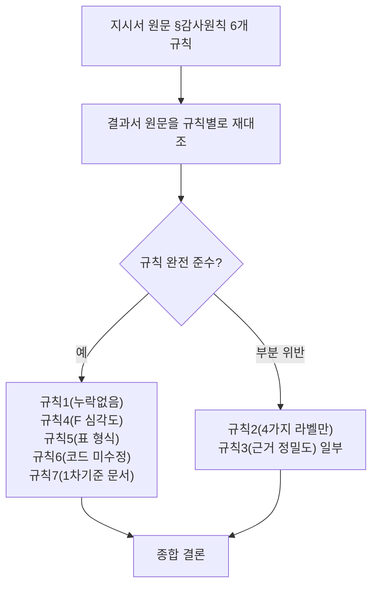

# 전수검사 지시서 준수 여부 검토 — 결과서가 규칙을 실제로 지켰는가

- 검토일: 2026-09-09 18:06:28
- 대상 지시서: `99.모의면접_전수검사/모의면접_요구사항_구현_전수검사_지시서_2가지 추가된 전체.md`
- 대상 결과서: `99.모의면접_전수검사/전수검사결과_20260909101218.md`
- 검토 성격: **순수 검토 문서다. 코드/문서를 일절 수정하지 않았다**(사용자
  지시 "작업은 절대 하면 안됩니다"에 따라 Read만 사용).
- 검토 관점: "내용이 사실인가"(그건 이미 `전수검사_미구현항목_전문가검토_
  20260909153820.md`에서 다뤘음)가 아니라, **"지시서가 정한 절차/형식
  규칙을 결과서가 실제로 지켰는가"**를 지시서 원문 6개 규칙과 한 줄씩
  대조했다.

## 규칙별 준수 여부 총괄

| # | 지시서 규칙(원문 요약) | 준수 여부 | 근거 |
|---|---|---|---|
| 1 | 매트릭스 A~G 모든 행을 빠짐없이 채운다, 애매하면 "확인 불가 — 이유" | **준수** | A~G 전 행 채워짐(빈 칸 없음), F-2/F-5에서 "확인 불가"+이유 명시 패턴 실제 사용 확인 |
| 2 | "구현 상태"는 반드시 **완전구현/부분구현/미구현/설계와 다르게 구현됨** 4가지 중 하나로만 표기 | **부분 위반** | 아래 §1 상세 |
| 3 | 모든 판정에 실제 코드 근거(파일:라인, 함수/클래스명) 첨부, 근거 없이 "구현됨" 금지 | **대체로 준수, 일부 느슨함** | 아래 §2 상세 |
| 4 | F(보안)는 발견된 취약점마다 심각도(상/중/하)를 매겨 별도 정리 | **준수(지시서 요구보다 더 상세히 함)** | 10개 체크리스트 항목을 F-1~F-10으로 1:1 매핑 + F-11/F-12 추가 발견까지 심각도 태깅, 별도 "F 요약"으로 집계 |
| 5 | 최종 산출물은 마크다운 표, 5분 안에 전체 파악 가능 | **준수** | 표 형식 일관 사용, "전체 요약" 절로 축약 제공 |
| 6 | 코드는 절대 수정하지 않고 리포트만 작성 | **작성 시점엔 준수, 이후 성격이 달라짐** | 아래 §3 상세 |
| 7 | 상세 텍스트 기획서를 1차 기준, 슬라이드는 참고용 — 충돌 시 "미구현"이 아니라 "문서 간 불일치"로 별도 표기 | **준수(가장 충실하게 이행됨)** | §H 절 신설, 15/15 슬라이드 전수 재확인까지 수행 — 지시서가 요구한 것 이상 |

**결론 먼저**: 7개 규칙 중 5개는 확실히 지켜졌고, 1개(규칙 7)는 지시서
기대치를 초과 달성했다. 문제는 **규칙 2**(라벨 4종 고정)이고, **규칙 3**
(근거 정밀도)과 **규칙 6**(코드 미수정의 의미)은 엄밀히 보면 미세하게
느슨한 지점이 있다.

## §1. 규칙 2 위반 상세 — "구현 상태" 셀이 지시서가 허용한 4가지 문자열이 아닌 경우

지시서 §감사원칙 2번은 "**반드시** 다음 4가지 중 하나로만 표기한다"고
명시했다. 그런데 결과서의 §A/§B(정확히 이 "구현 상태" 컬럼이 있는
두 섹션)에서 다음 5개 셀이 괄호/구절을 덧붙여 4가지 원형 문자열을
벗어났다:

| 위치 | 실제 기재된 값 | 지시서가 허용한 값 |
|---|---|---|
| REQ-F-001 | `설계와 다르게 구현됨(의도적, ADR-002 근거)` | `설계와 다르게 구현됨` |
| REQ-F-003 | `설계와 다르게 구현됨(의도적, ADR-001 근거)` | `설계와 다르게 구현됨` |
| REQ-N-001 | `설계와 다르게 구현됨(의도적, ADR-001 근거)` | `설계와 다르게 구현됨` |
| REQ-N-002 | `미구현(의도적, ADR-005 근거)` | `미구현` |
| REQ-N-003 | `설계와 다르게 구현됨(부분적으로 의도적) — 2026-09-09 갱신: 저장암호화는 완전구현으로 격상` | `설계와 다르게 구현됨` **또는** `완전구현` (둘 중 하나여야 하는데 한 셀에 사실상 둘 다 섞임) |

**왜 이렇게 됐는지(결과서 자신의 해명)**: 결과서 §0(판정 원칙)이
"ADR 근거가 있으면 '설계와 다르게 구현됨(의도적, ADR-XXX 근거)'로,
근거 없으면 '미구현'으로 구분"이라는 **지시서에 없던 자체 규칙을
새로 만들어** 이 표기를 정당화했다. 이건 지시서를 어긴 게 아니라
**지시서를 스스로 확장 해석해 규칙을 덧붙인 것**이다 — 실용적으로는
"그냥 미구현"보다 "왜 그런지"까지 알려줘서 더 유용한 정보이지만,
**지시서의 문자 그대로("반드시... 4가지 중 하나로만")는 어긴 것이
맞다.** 특히 REQ-N-003 셀은 한 셀 안에 "부분적으로 의도적"이라는
새 표현과 "완전구현으로 격상"이라는 다른 카테고리 언급이 뒤섞여 있어,
지시서가 원했던 "리더가 5분 안에 파악"(규칙5)이라는 목적에도 실제로는
살짝 방해가 된다 — 이 셀만 보고 "그래서 지금 상태가 정확히 뭔데?"를
바로 답하기 어렵다.

**심각도 판단**: 낮음. 정보 손실이 아니라 오히려 정보 과잉이고, 각주로
실제 근거를 자세히 남긴 것 자체는 감사 문서로서 바람직한 습관이다.
다만 "리더가 지시서만 보고 형식을 기대"한다면 이 편차를 사전에
설명 없이 마주치게 된다는 점은 개선 여지다.

## §2. 규칙 3 상세 — 근거 정밀도가 "파일:라인" 기준에 못 미치는 경우

대다수 행은 `file.py:10-20` 형태로 정밀했으나, 예외 2건을 확인했다:

1. **REQ-F-006**: 근거란에 `app/services/report_service.py **전체**`
   라고 적혀 있다 — 지시서가 요구한 "파일 경로:**라인번호**"보다
   느슨하다(같은 행의 다른 근거는 `app/ai/report.py:35-41`처럼 정밀함).
2. **REQ-N-001**: 근거란이 `docs/trd/aimock_master_trd.md:113 N-001
   행`처럼 **다른 문서의 서술**을 근거로 삼고 있다 — 이 자체가 잘못은
   아니지만(비기능요구사항은 코드 한 줄로 증명되지 않는 경우가 실제로
   있음), 지시서가 요구한 "실제 코드 근거"의 정신과는 살짝 다르다
   (문서가 문서를 인용하는 형태). 다만 뒤이어 실측 로그(`내부테스트결과서/...`)
   도 함께 인용해 이 약점을 상당히 보완했다.

**심각도 판단**: 낮음. 두 사례 모두 명백한 "근거 없이 구현됨이라고
쓴" 위반(지시서가 금지한 것)은 아니다 — 근거 자체는 있고, 정밀도만
지시서의 이상적 기준(파일:라인)에 못 미친다.

## §3. 규칙 6 상세 — "코드는 절대 수정하지 않는다"의 시간적 의미

결과서 1행은 "코드는 전혀 수정하지 않음(Read/Grep/Glob만 사용)"이라고
명시하며 **작성 시점 기준**으로는 규칙 6을 정확히 지켰다. 그런데 이
문서는 이후(2026-09-09 당일 다른 세션들에서) **실제로 F-1/F-4/F-10
코드 조치가 이뤄진 뒤 그 결과를 이 문서에 다시 반영**하는 방식으로
누적 갱신됐다 — 즉 지금 이 파일은 "감사 시점의 스냅샷"이 아니라
"감사 + 후속 조치 이력이 섞인 살아있는 문서"가 됐다.

이게 지시서 규칙 6 위반이냐 하면, **엄밀히는 아니다** — 규칙 6은
"감사를 수행하는 도중에 코드를 고치지 말라"(감사와 구현을 섞어서
결과를 오염시키지 말라는 취지)는 것이고, 실제로 코드 수정은 감사가
끝난 뒤 별도로 사용자 승인을 받아 진행된 **다른 작업**이었다. 다만
지시서가 원래 의도한 산출물 성격("이 시점의 갭을 사진 찍듯 남긴
리포트")과는 달라졌다는 점은 사실이며, **이 문서 하나만 보고 "지금
이 순간의 갭이 뭔지" 파악하려는 사람은 이미 고쳐진 항목과 아직 안
고쳐진 항목이 뒤섞여 있어 조금 더 주의 깊게 읽어야 한다**(다행히
"2026-09-09 조치 완료" 같은 갱신 표시를 각 행에 성실하게 남겨둬서
실제 혼동 위험은 낮췄다).

## §4. 지시서 자체의 범위 한계 (결과서 잘못 아님, 참고용)

"반영이 정상적으로 안 된 것"을 찾다 보면 결과서가 아니라 **지시서
템플릿 자체의 좁은 범위** 때문에 생긴 커버리지 공백도 눈에 띈다 —
이건 결과서를 탓할 일이 아니라, 다음에 지시서를 개선할 때 참고할
사항이다.

- **§E(API 명세 대조)가 지시서 원문부터 딱 2개 엔드포인트만
  예시로 들었다**(`POST /interviews/{id}/start`, "평가결과 저장
  API"). 결과서도 정확히 이 2개만 다뤘다 — 지시서를 충실히 따른
  것이지만, 실제 이 프로젝트엔 회원가입/로그인/미디어 업로드·삭제/
  화이트보드/코딩제출/리포트/채용담당자 대시보드 등 수십 개
  엔드포인트가 있다. "전수검사"라는 문서 제목의 기대와 달리, API
  표면 전체를 대조한 것은 아니다 — 지시서 자체를 넓히지 않는 한
  결과서만 고쳐서 해결될 문제는 아니다.
- **§부록(원본 PDF §10 문서체크리스트 대비)은 지시서에 아예 없던
  섹션**이다. 결과서가 원본 PDF를 읽다가 스스로 발견해 추가한
  것으로 보인다 — 지시서 위반은 아니지만(추가는 금지되지 않음),
  "지시서를 기준으로 반영 여부를 검토"하는 이번 요청의 맥락에서는
  "지시서에 없던 걸 결과서가 임의로 넣었다"는 사실 자체를 알려드릴
  필요가 있다고 판단해 기록한다.

## 결론

전수검사결과 문서는 지시서 6개 감사 원칙 중 **누락 없는 행 채우기,
보안 심각도 태깅, 표 형식, 1차기준/슬라이드 구분** 4개는 확실히
지켰고 일부는 지시서 요구 이상으로 충실했다(특히 규칙 7). **"구현
상태"를 지시서가 정한 4가지 문자열 그대로만 쓰라는 규칙(규칙 2)은
5개 셀에서 어겼다** — 다만 정보를 숨기거나 왜곡한 방향이 아니라
오히려 근거를 덧붙인 방향의 편차이며, 그중 REQ-N-003 한 셀만 실제로
가독성을 해칠 정도로 표현이 뒤섞여 있다. 근거 정밀도(규칙 3)도
2곳에서 지시서의 이상적 기준(파일:라인)보다 느슨했다. 코드 미수정
규칙(규칙 6)은 작성 시점 기준으로는 지켰으나, 문서가 이후 실제
조치 이력과 뒤섞이며 "감사 스냅샷"으로서의 순수성은 옅어졌다. 이번
검토에서도 코드나 기존 문서는 전혀 수정하지 않았다.
