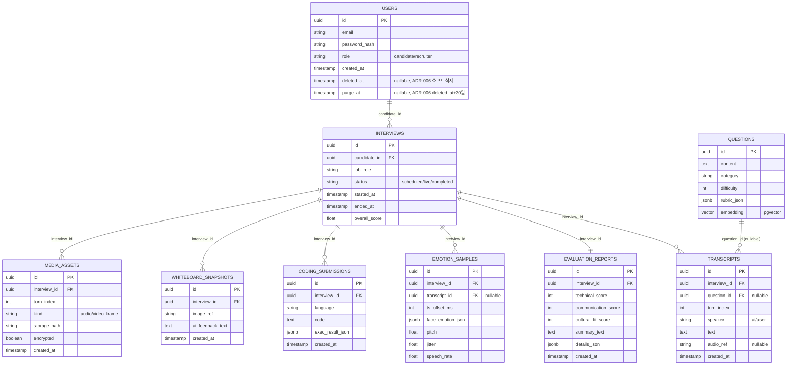

# ADR-003: 데이터 저장 스택 (DB / Vector / Cache / 비동기 작업)

- 날짜: 2026-09-07
- 상태: 승인됨(**비동기 작업(Celery/Redis) 결정만 2026-09-18 갱신** — 아래
  §갱신 참조. DB/Vector 관련 결정은 이 ADR이 계속 유효)
- 결정권자: 사용자 (예산/기간 제약 기반, AI 초안 → 방향 승인)

## 배경 (Context)

원본 기획서는 Oracle(Main DB) + Pinecone(Vector DB) + Redis(Cache/Broker) +
Celery(Task Queue) + GCP Object Storage의 5종 데이터 인프라를 전제합니다.
Oracle·Pinecone·GCP는 유료(또는 사실상 개인 프로젝트에서 무료로 운용하기
어려운) 서비스이고, 4개 이상의 인프라 컴포넌트를 1인이 4주 안에 구축·
운영하는 것은 배포/장애 대응 부담이 큽니다.

## 검토한 대안 (Options)

| 대안 | 장점 | 단점 |
|---|---|---|
| A. PostgreSQL(+pgvector 확장) 단일 DB로 관계형+벡터 통합, Redis/Celery 제거, GCS 대신 로컬 파일시스템(또는 무료 S3 호환 스토리지) | 컴포넌트 1개로 관리 단순, 완전 무료(Docker로 로컬 실행), pgvector로 RAG 유지 가능 | 대규모 벡터 검색 성능은 Pinecone 대비 낮음(MVP 규모의 질문은행에는 충분) |
| B. PostgreSQL + Redis + Celery 유지(Oracle→Postgres, Pinecone→pgvector만 대체) | 원본 아키텍처의 비동기 작업 분리 패턴 유지, 향후 확장 시 유리 | 1인이 관리할 컨테이너가 3개(Postgres/Redis/Celery worker)로 늘어 개발환경 셋업·디버깅 부담 증가, 4주 내 리스크 |
| C. SQLite 단일 파일 DB | 설치/배포 최소화(파일 하나) | pgvector 미지원 → 벡터 검색을 직접 구현해야 함, 동시 쓰기 제약 |

## 결정 (Decision)

**A안을 채택한다.** PostgreSQL 하나(로컬 Docker 컨테이너)에 `pgvector`
확장을 설치해 관계형 데이터(사용자/면접/평가)와 질문 임베딩(RAG용 벡터)을
함께 관리한다. Redis·Celery는 MVP 범위에서 제거하고, 리포트 생성 등 무거운
후처리는 FastAPI의 `BackgroundTasks`(또는 필요 시 `asyncio` 태스크)로
처리한다. 녹화 영상/이미지 등 바이너리 자산은 GCP 대신 **로컬 디스크
볼륨**(배포 시 무료 티어 오브젝트 스토리지로 교체 가능하도록 저장소
인터페이스는 추상화)에 저장한다.

## 결과/트레이드오프 (Consequences)

- 포기하는 것: Celery 기반의 작업 재시도/분산 처리, Redis 기반 세션 캐시.
  MVP 규모(1인 데모, 동시 사용자 소수)에서는 손실이 미미하다고 판단.
- 나중에 발목 잡을 수 있는 지점: 향후 실제 다중 사용자 서비스로 확장할
  경우 비동기 작업 큐(Celery 등)를 다시 도입해야 하며, 이때 `BackgroundTasks`
  로 작성된 로직을 태스크 함수로 분리하는 리팩터링이 필요함 — 이를 쉽게
  하려면 처음부터 "후처리 로직"을 API 핸들러와 분리된 서비스 함수로 작성
  할 것(코딩 컨벤션에 반영).
- ERD는 아래로 확정한다(마스터 TRD §5에도 동일하게 반영). **2026-09-07
  갱신**: ADR-004(원본 미디어 보관)·ADR-006(계정 탈퇴 정책) 확정에 따라
  `MEDIA_ASSETS` 엔티티와 `USERS.deleted_at`/`USERS.purge_at`을 추가함.

- 삭제 정책(개인정보 관련, 원칙 8 — 사람 승인 필요 항목): 이 ADR에서는
  스키마만 확정하고, 물리삭제 vs 소프트삭제 정책은 확정하지 않음 →
  `harness_10_data_lifecycle` 대응 문서에서 별도 결정 필요(§7 미결 항목).

## 갱신: 비동기 작업 — BackgroundTasks → Celery+Redis 재도입 (2026-09-18)

**배경**: 위 §결정에서 "Redis·Celery는 MVP 범위에서 제거하고... FastAPI의
`BackgroundTasks`로 처리한다"를 확정했고, 2026-09-08에 실제로 리포트
생성을 BackgroundTasks 기반 비동기 처리로 전환·검증까지 완료한 상태였다
(`내부테스트결과서/U4보완_리포트생성비동기화_20260908180942.md`).
BackgroundTasks 자체에 결함이 있었던 것은 아니다.

**변경 사유**: 사용자가 프로젝트 전수검사(아키텍처 대조) 과정에서 "원본과
맞추고 싶다"고 명시적으로 재도입을 요청함(20260918 대화). 즉 성능/안정성
문제 해결이 아니라 **원본 계획서(§4.2.3)와의 아키텍처 정합**이 목적.

**결정**: 리포트 생성(`report_service.run_report_generation`)의 실행
수단을 FastAPI `BackgroundTasks`에서 **Celery(브로커: Redis)**로 교체한다.
`docker-compose.yml`에 `redis`(브로커) + `worker`(app과 동일 이미지,
`celery -A app.celery_app worker`로 커맨드만 교체) 서비스를 추가한다.
LLM 턴 생성(`app/ai/llm.py`)이나 STT 등 **요청-응답 안에서 바로 끝나야
하는 동기 작업은 대상이 아니다** — ADR-003 원안의 "실시간성이 덜 중요한
작업"이라는 구분 기준을 그대로 유지.

**실제로 부딪힌 기술적 난관과 해결(원안엔 없던 세부사항, 판단 근거 기록)**:
1. **Provider 객체는 Celery로 못 넘긴다** — LLM/감정/음성분석 provider는
   API 클라이언트를 든 라이브 객체라 Redis를 거쳐 직렬화할 수 없음.
   태스크는 `interview_id`(문자열)만 받고, 워커 프로세스 안에서
   `app.ai.providers.get_report_generator()` 등을 직접 호출해 provider를
   다시 구한다(`app/tasks.py`).
2. **asyncpg 커넥션 풀 ↔ 이벤트 루프 수명 불일치** — 프로세스 전역
   `engine`(app/db.py)은 임포트 시 1회만 생성되는데, 워커가 매 태스크마다
   새 이벤트 루프(`asyncio.run()`)를 만들면 두 번째 태스크부터 "닫힌
   루프에 묶인 커넥션" 오류가 난다(asyncpg+반복 `asyncio.run()`의 잘 알려진
   함정 — AWS Lambda+asyncpg 사례와 동일 원인). 태스크 종료 시마다
   `await engine.dispose()`로 풀을 비우고, 다음 태스크에서 지연
   재연결되게 함.
3. **테스트 환경에서 이벤트 루프 충돌** — pytest는 이미 실행 중인
   이벤트 루프(pytest-asyncio) 안에서 라우트 핸들러를 돈다. 여기서
   `CELERY_TASK_ALWAYS_EAGER=True`(테스트 전용, `app/config.py`)로
   `.delay()`가 동기 실행되면, 태스크 내부의 `asyncio.run()`이
   `RuntimeError: asyncio.run() cannot be called from a running event
   loop`로 실제로 즉시 재현됐다. 실행 중인 루프가 감지되면 별도 스레드를
   하나 띄워 그 안에서 새 `asyncio.run()`을 돌리고 결과를 기다리는
   방식(`app/tasks.py::_run_async`)으로 해결 — 실제 Celery 워커
   프로세스(루프 없음)와 테스트(루프 있음) 둘 다 지원.
4. `app.dependency_overrides`(FastAPI 전용)만으로는 태스크에 Fake
   provider가 안 먹힘 — 태스크가 `Depends()`가 아니라 함수를 직접
   호출하기 때문. 테스트 픽스처가 `app.ai.providers`의 모듈 전역 싱글턴을
   `monkeypatch`로 직접 교체하도록 보강(`tests/backend/conftest.py`).

**실제 검증(2026-09-18)**: `docker compose up -d postgres redis app worker`
로 4개 컨테이너를 모두 띄우고, 실제 HTTP로 면접 10턴 진행(Groq LLM/STT
실호출) → 완료 → `POST .../report`(202 즉시 응답) → **`worker` 컨테이너
로그에서 `Task aimock.run_report_generation[...] received`(Redis에서 실제
소비) → 실제 Groq 리포트 LLM 호출 → librosa 음성분석 → `succeeded`**까지
전부 직접 확인. pytest 전체 스위트(eager 모드) 104 passed, 회귀 없음.
상세: `내부테스트결과서/`(같은 날짜 파일 참조).

**결과/트레이드오프**: 1인이 관리할 컨테이너가 다시 3개(Postgres/Redis/
Celery worker)로 늘어남(§결정에서 우려했던 바로 그 부담) — 다만 MVP
규모(리포트 생성 빈도 낮음)에서는 관리 부담보다 "원본 아키텍처와의
정합"이라는 이번 요청의 목적이 우선한다고 사용자가 판단.

## 관련 문서

- 관련 TRD: `docs/trd/aimock_master_trd.md` §5(데이터 구조)
- 관련 ADR: ADR-002(임베딩을 만드는 LLM/임베딩 모델)
