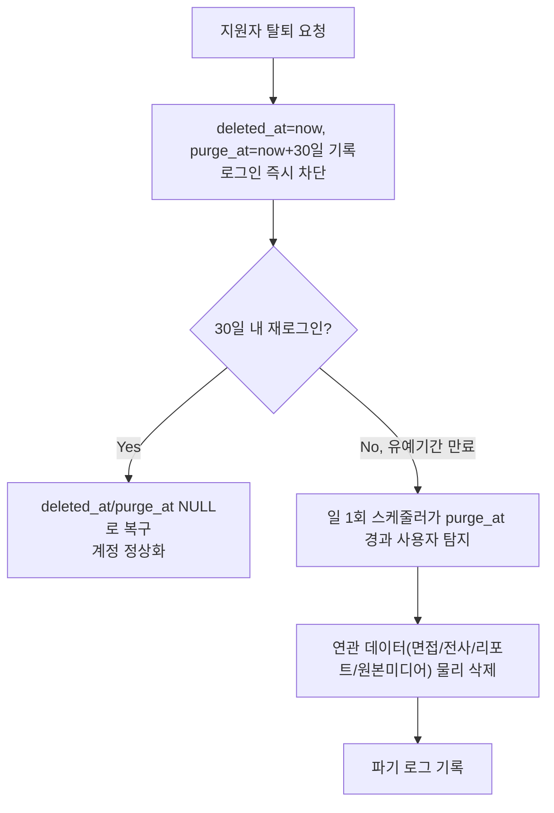

# ADR-006: 계정 탈퇴 시 데이터 삭제 정책 (소프트 삭제 + 유예기간 자동 파기)

- 날짜: 2026-09-07
- 상태: 승인됨
- 결정권자: 사용자 (AI가 제시한 A/B 후보 중 직접 선택 — 원칙 8 준수)

## 배경 (Context)

`harness_08_adr.md` 체크리스트의 "삭제 정책(물리삭제/소프트삭제)을 정할 때"
에 해당하는 결정입니다. 지원자가 회원 탈퇴를 요청했을 때 이메일·전사
텍스트·평가 리포트·(ADR-004에 따른) 원본 미디어를 어떻게 처리할지 확정이
필요했습니다.

## 검토한 대안 (Options)

| 대안 | 장점 | 단점 |
|---|---|---|
| A. 즉시 물리적 완전 삭제 | 구현 최소, 1인/4주 규모에 가장 단순 | 실수로 탈퇴 시 복구 불가 |
| B. 소프트 삭제 + N일 유예기간 후 자동 파기 | 실수 복구 가능, 실제 서비스 관행에 더 가까움 | 유예기간 만료를 감지해 자동 파기하는 스케줄러 구현이 추가로 필요 |

## 결정 (Decision)

**B안(소프트 삭제 + 유예기간 자동 파기)을 채택한다.**

- **유예기간: 30일**(기본값 — AI가 업계 통상 관행에 따라 제안, 사용자가
  다른 값을 원하면 언제든 변경 가능. 법적 구속력이 있는 실제 서비스가
  아닌 MVP/데모 목적이므로 법무 검토 없이 이 값을 기본값으로 확정함).
- **USERS 테이블에 컬럼 추가**(ADR-003 ERD 갱신):
  - `deleted_at` (nullable timestamp) — 탈퇴 요청 시각. NULL이면 활성 계정.
  - `purge_at` (nullable timestamp) — `deleted_at + 30일`로 자동 계산해
    저장. 이 시각이 지나면 파기 대상.
- **탈퇴 요청 시 즉시 일어나는 일**: `deleted_at`/`purge_at` 설정, 로그인
  차단(인증 미들웨어에서 `deleted_at IS NOT NULL`이면 401), 채용담당자
  대시보드에서도 즉시 숨김 처리. **이 시점에는 아직 물리 삭제하지 않음**
  (30일 내 재로그인 시 복구 가능 — 복구 시 두 필드를 NULL로 되돌림).
- **유예기간 만료 시**: 매일 1회 도는 경량 스케줄러(ADR-003에서 Celery를
  제거했으므로, `APScheduler`를 FastAPI 프로세스 내 백그라운드 작업으로
  사용 — 별도 워커 인프라 불필요)가 `purge_at <= now()`인 사용자를 찾아
  해당 사용자의 `interviews`/`transcripts`/`evaluation_reports`/
  `media_assets`(ADR-004)를 포함해 **물리적으로 완전 삭제**하고, 파기
  로그를 남긴다(`harness_10_data_lifecycle.md` §5 형식 참조).

## 결과/트레이드오프 (Consequences)

- 얻는 것: 실수로 탈퇴한 지원자가 30일 내 복구 가능, 실제 서비스에 준하는
  삭제 정책 경험을 리포트에 담을 수 있음(포트폴리오 가치 상승).
- 트레이드오프: 스케줄러(APScheduler) 구현·테스트가 작업 범위에 추가됨 —
  `docs/release/release_plan.md`의 U1(인증/계정) 단위 범위에 포함시켜야
  함(§1 범위 갱신 필요).
- 나중에 발목 잡을 수 있는 지점: 30일이라는 값은 법무 검토 없이 AI가
  제안한 기본값이므로, 이 프로젝트가 실제 서비스로 발전한다면 반드시
  사람(책임자/법무)이 재검토해야 함 — `harness_10_data_lifecycle.md` §1의
  경고와 동일한 성격.

## 관련 문서

- 관련 ADR: ADR-003(데이터 스택 — USERS 테이블 컬럼 추가), ADR-004(원본
  미디어 연쇄 삭제)
- 관련 TRD: `docs/trd/aimock_master_trd.md` §5(ERD), §7(미결 항목 해소)
