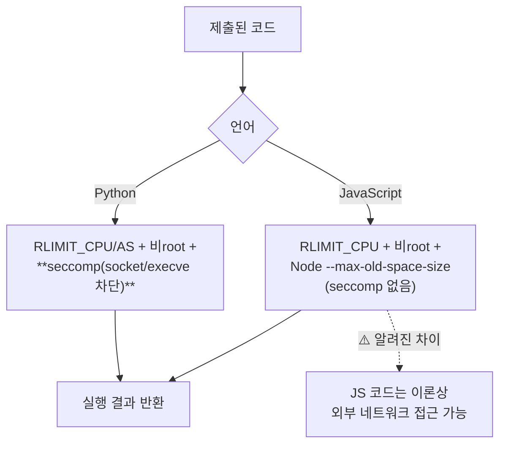
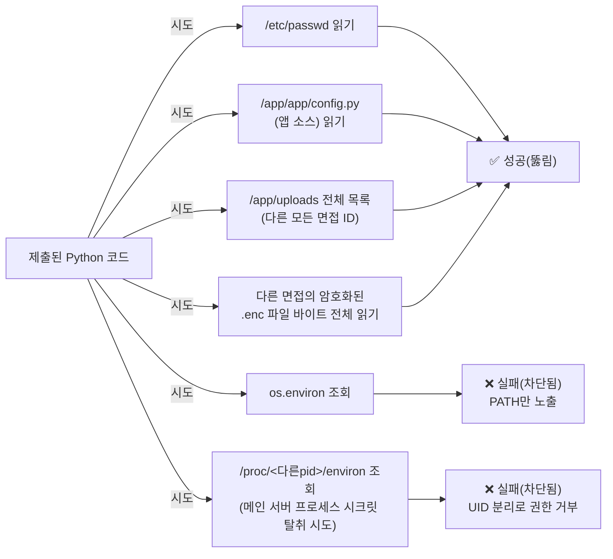

# ADR-007: 라이브 코딩 실행 방식 (샌드박스 격리 수준)

- 날짜: 2026-09-07
- 상태: 승인됨(자동진행 — 사용자가 "컨펌 없이 자동으로 진행" 지시,
  근거는 `자동진행/` 로그 참조)
- 결정권자: AI (harness_08 체크리스트 "여러 단위에 영향을 주는 공통
  규약"·보안 아키텍처 결정에 해당하므로 원래는 사람 승인이 원칙이나,
  사용자가 이번 세션 한정으로 자동 진행을 명시적으로 승인함)

## 배경 (Context)

원본 기획서 REQ-F-004는 지원자가 제출한 코드를 "샌드박스 환경에서 실행"
하라고 요구한다. 지원자가 작성한 **임의의 코드를 서버에서 실행**하는
기능은 원격 코드 실행(RCE) 성격을 가지므로 격리 수준을 반드시 결정하고
근거를 남겨야 한다(CLAUDE.md "보안 취약점을 만들지 말 것" 원칙과 직결).

## 검토한 대안 (Options)

| 대안 | 장점 | 단점 |
|---|---|---|
| A. 로컬 `subprocess`로 실행(타임아웃+환경변수 제거) | 외부 의존성 없음, 오프라인 데모에서도 항상 동작, 구현 1일 이내 | **진짜 샌드박스가 아님** — 같은 컨테이너 안에서 실행되므로 앱 파일시스템/네트워크에 접근 가능한 코드가 실행됨. 신뢰할 수 없는 다중 사용자에게 노출하면 위험 |
| B. Piston API(무료 공개 코드실행 API, emkc.org) 호출 | 실제 격리된 원격 샌드박스, 무료, 구현 간단(HTTP 호출) | 인터넷 연결과 외부 서비스 가동에 의존 — 발표/데모 중 오프라인이거나 무료 API 쿼터 초과 시 기능 전체가 멈춤 |
| C. Docker-in-Docker로 제출마다 격리된 컨테이너 생성 | 실질적으로 안전한 격리 | 앱 컨테이너에 Docker 소켓을 노출해야 함(그 자체로 심각한 보안 리스크), 구현 복잡도가 1인/4주 범위를 초과 |

## 결정 (Decision)

**A안(로컬 `subprocess`)을 MVP 기본 실행기로 채택**하되, **어댑터
패턴**(`CodeExecutor` 인터페이스)으로 구현해 나중에 B안(Piston)으로
쉽게 교체 가능하게 만든다. 채택 이유: 이 프로젝트는 **개발자 본인만
사용하는 포트폴리오/데모**이지 낯선 다중 사용자에게 공개된 서비스가
아니므로, "본인이 자기 코드를 실행"하는 위협 모델에서는 A안의 리스크가
수용 가능하다고 판단.

**A안의 구체적 방어 조치**(전부 실제로 구현):
1. 코드를 임시 파일로 저장해 별도 프로세스(`subprocess.run`)로 실행 —
   앱 프로세스 메모리(DB 세션, 시크릿 변수 등)에 직접 접근 불가.
2. 자식 프로세스의 환경변수를 최소한(`PATH`만)으로 제한 — `DATABASE_URL`,
   `JWT_SECRET`, `MEDIA_ENCRYPTION_KEY`, `GEMINI_API_KEY` 등이 자식
   프로세스에 전달되지 않음.
3. 실행 시간 제한(5초) — 무한루프/과도한 연산 시 강제 종료.
4. 실행 디렉토리를 임시 디렉토리로 격리, 실행 후 삭제.

## 결과/트레이드오프 (Consequences) — 반드시 읽을 것

- **이 방식은 "격리"가 아니라 "완화"다.** 제출된 코드는 여전히 앱과
  같은 컨테이너의 파일시스템을 읽고 쓸 수 있고(예: `os.listdir("/")`,
  `open("/app/...")`), 네트워크 호출도 막지 않는다(egress 차단 없음).
  **이 프로젝트를 낯선 사용자에게 공개 배포하는 순간 이 결정은 재검토가
  필수다** — 그 시점엔 B안(Piston) 또는 C안으로 교체해야 한다.
- 이 한계를 `docs/trd/aimock_u2b_trd.md`와 릴리스 계획에도 명시하고,
  "공개 배포 전 필수 재검토 항목"으로 표시한다.
- Windows 호스트에서는 `resource` 모듈(CPU/메모리 제한)이 없어 타임아웃
  외의 자원 제한은 로컬 개발 환경에서는 적용되지 않음 — 실제 배포
  환경(Linux 컨테이너)에서는 필요 시 `resource.setrlimit` 추가 검토
  여지 있음(§7 미결 항목).

## 재검토 (2026-09-08 — 사용자 요청 "20년차 기준 재검토"에 따른 후속)

**결론: A안 유지, 단 즉시 가능한 완화 조치를 2차례에 걸쳐 추가(리소스
제한 → 네트워크/외부프로그램 실행 차단 + 비root 실행). B/C안으로의
전환은 여전히 사람 승인이 필요한 별도 결정으로 남겨둔다(하네스 원칙 8 —
보안 아키텍처 전환은 자동으로 확정하지 않음).**

### 1단계 후속 강화 (2026-09-08, 같은 날 추가 진행)
사용자가 "20년차라면 이 상황에서 실제로 뭘 하는지" 가이드를 요청해
아래 순서로 안내하고, 그중 "당장 무료로 반나절 안에 되는 것"을 실제
구현·검증했다:

- **네트워크 차단**: 처음엔 `os.unshare(CLONE_NEWNET)`(리눅스 네트워크
  네임스페이스 분리)을 시도했으나, **실제 컨테이너에서 직접 호출해보니
  `PermissionError`로 실패**(Docker 기본 권한엔 `CAP_SYS_ADMIN`이 없음 —
  추측하지 않고 실측으로 확인). 컨테이너에 그 권한을 추가하는 건 "격리
  하나 얻으려고 전체 공격 표면을 넓히는" 역효과라 채택 안 함. 대신
  **seccomp**(`pyseccomp`, 추가 권한 불필요 — `prctl(NO_NEW_PRIVS)`
  기반 자기제한이라 됨)로 `socket`/`connect`/`bind`/`listen`/`accept`
  syscall 자체를 차단 — 더 안전한 방법으로 같은 목표 달성.
- **외부 프로그램 실행 차단**: 같은 seccomp 필터로 `execve`/`execveat`도
  차단 — `os.system()`/`subprocess`로 셸 명령 실행 시도가 전부 실패함을
  실제 확인.
- **비root 실행**: 자식 프로세스를 `nobody(65534)`로 권한 하락.
- 전부 `src/backend/app/sandbox/executor.py`에 구현, 실제 exploit
  스크립트로 검증 완료 —
  `내부테스트결과서/ADR007_1단계보안강화_실제exploit검증_20260908075008.md`.
- **이 과정에서 어제 추가한 `RLIMIT_CPU`가 wall-clock 타임아웃과 경쟁
  상태를 일으켜 AC-2(무한루프 타임아웃 감지)를 깨고 있던 실제 회귀
  버그를 발견해 즉시 수정**(RLIMIT_CPU를 타임아웃보다 여유 있게 조정).
- **여전히 안 되는 것(1단계로도 못 막음, 실제 발견)**: 이 저장소를
  `docker-compose.yml`의 `./src/backend:/app` 개발용 바인드 마운트로
  띄우면 `/app` 디렉터리 자체가 전체쓰기 가능(777) 상태가 된다 —
  비root로 낮춰도 "디렉터리 자체가 아무나 쓰기 가능"이면 의미가 없다.
  이건 이번 세션에서 고치지 않고 사용자에게 별도로 처리 여부를 물어볼
  것(핵심 후보: 이 바인드 마운트 제거 또는 `:ro`로 전환 — `Dockerfile`에
  `--reload`가 없어 지금도 실질적 핫리로드 용도로 안 쓰이고 있음).

- **실제로 추가한 것**: §7에서 미결로 남겨뒀던 `resource.setrlimit`을
  구현(`src/backend/app/sandbox/executor.py`의 `_limit_resources()`) —
  자식 프로세스에 CPU 5초 상한(`RLIMIT_CPU`), 가상메모리 256MB 상한
  (`RLIMIT_AS`)을 추가로 건다. POSIX 전용이라 Windows 로컬 개발/pytest
  환경에는 적용 안 되고(그 환경엔 `resource` 모듈 자체가 없음), 실제
  Linux 컨테이너 배포 환경에서만 작동 — 실제 Docker 컨테이너에 400MB
  할당 코드를 제출해 `MemoryError`로 즉시 차단되는 것을 curl로 직접
  확인함(정상 코드는 영향 없음도 함께 확인).
- **여전히 남아있는 한계(이번에도 안 고침, 의도적)**: 파일시스템 격리,
  네트워크 egress 차단, 진짜 프로세스/커널 격리는 여전히 없다. 이건
  A안의 근본 한계라 리소스 제한 추가만으로는 안 없어진다.
- **왜 B안(Piston)/C안(Docker-in-Docker)으로 지금 전환하지 않았는가**:
  둘 다 "안전 강화"가 아니라 "새로운 인프라 의존성을 들이는 아키텍처
  전환"이다. 특히 C안은 앱 컨테이너에 Docker 소켓을 마운트해야 하는데,
  이건 **잘못 구성하면 오히려 지금보다 훨씬 심각한 컨테이너 탈출 취약점을
  만들 수 있는** 결정이라 사람의 명시적 승인 없이 자동으로 바꾸는 것은
  하네스 원칙 8("되돌리기 어려운 결정 금지") 위반으로 판단. 대신 후보만
  다시 정리해 남겨둔다.
- **다음에 사람이 결정할 것(원문 §"결과/트레이드오프"의 "공개 배포 전
  필수 재검토" 조건이 실제로 다가왔을 때)**:
  1. 그대로 A안 유지(본인만 쓰는 데모/포트폴리오 범위를 벗어나지 않는다는
     전제 재확인) — 추가 작업 없음.
  2. B안(Piston API)으로 교체 — 외부 서비스 가동 의존성 감수, 구현은
     `CodeExecutor` 인터페이스 덕분에 어댑터 하나 추가로 비교적 단순.
  3. C안(Docker-in-Docker) — 구현 복잡도·보안 설계 검토에 상당한 시간
     필요, 1인/4주 범위를 명백히 초과하므로 이번 프로젝트 기간 내에는
     비권장.

- **사용자 확인(2026-09-08)**: 이 프로젝트를 "본인/포트폴리오용"으로만
  한정 짓지 않고, **낯선 사람도 쓸 수 있게 향후 공개 배포할 가능성이
  있다**고 답변함. 즉 위 "공개 배포 전 필수 재검토" 조건이 가상의
  시나리오가 아니라 **실제로 발생할 수 있는 전제**임을 명시적으로 확인—
  실제 공개 배포를 결정하는 시점에는 반드시 B안/C안 재논의를 먼저 거친
  뒤 배포해야 한다(A안 그대로 공개 배포하지 않는다).

## 2단계 — JavaScript 지원 추가 (2026-09-09)

**배경**: `99.모의면접_전수검사/전수검사결과_20260909101218.md` REQ-F-004
발견 — 원안(PDF)은 Python+JavaScript 2개 언어를 요구했는데 Python만
지원하고 있었음. 사용자에게 확인한 결과, **Node용 seccomp 바인딩이
Python(`pyseccomp`)만큼 간단하지 않아 완전히 동일한 보안 수준을 갖추기
어렵다는 점을 안내하고, "리소스 제한(CPU/메모리/시간)+비root까지만
JS에도 적용하고, 네트워크 차단(seccomp)은 Python만 유지"로 명시적
승인**을 받음.

**JS 경로의 구체적 차이**:
1. **네트워크 차단 없음**: Python은 `socket`/`connect`/`bind`/`listen`/
   `accept` syscall이 seccomp로 막히지만, JS는 안 막힌다 — 이론상 제출된
   JS 코드가 외부로 HTTP 요청을 보내거나 내부망을 스캔할 수 있다. 회귀
   테스트로 이 사실 자체를 고정해뒀다
   (`tests/backend/test_sandbox_hardening.py::test_js_network_access_is_not_blocked_known_gap`
   — 이 테스트가 실패하면 오히려 이 문서를 갱신해야 한다는 뜻).
2. **외부 프로그램 실행 차단 없음**: 같은 이유로 `execve` 계열도 JS에는
   안 걸림(Node의 `child_process` 모듈로 셸 명령 실행이 가능할 수 있음).
3. **메모리 제한 방식이 다름**: `RLIMIT_AS`(OS 레벨 가상메모리 제한)를
   Node/V8 프로세스에 걸면, V8이 시작 시점에 실제 사용량과 무관하게 넓은
   가상 메모리 영역을 미리 예약하는 특성 때문에 정상 코드도 프로세스
   시작 단계에서 실패하는 경우가 흔하다(잘 알려진 Node/RLIMIT_AS
   비호환 문제) — 그래서 JS는 `node --max-old-space-size=256` 플래그로
   V8 힙 자체를 제한한다(`app/sandbox/executor.py` 참조). CPU 시간 제한
   (`RLIMIT_CPU`)과 비root 권한 하락은 언어와 무관하게 동일하게 적용.

**왜 이 비대칭을 받아들였는가(사람 승인 근거)**: Node용 seccomp 적용을
제대로 하려면 네이티브 애드온 조사·빌드·검증이 추가로 필요해 1인/4주
범위를 벗어나고, 이 프로젝트가 여전히 "본인/포트폴리오 또는 제한적
공개" 단계라는 위협 모델(위 §"사용자 확인(2026-09-08)" 참조)에서는
수용 가능한 리스크로 판단함. **공개 배포 전 필수 재검토 항목에 "JS
네트워크 차단"도 추가**한다 — Python은 이미 되어 있으므로 대상은 JS
경로만.

## 3단계 — 파일시스템 접근 범위 실측 (2026-09-09)

**배경**: `99.모의면접_전수검사/전수검사_미구현항목_전문가검토_20260909153820.md`
F-11 절이 "파일시스템 격리 없음이 실제로 얼마나 위험한지 한 번도
실측된 적이 없다"고 지적 — 위 §"결과/트레이드오프"에 원론적으로만
적혀 있던 위험을 실제 Docker 컨테이너 + 실제 라이브 코딩 API 호출로
직접 재현해 정확한 범위를 확정했다.

**실제로 뚫려있음을 확인한 것**:
1. `open("/etc/passwd")` — 시스템 파일 읽기 성공.
2. `open("/app/app/config.py")` — 앱 소스코드 읽기 성공(단, 이 파일
   자체엔 시크릿 리터럴이 없어 이번 케이스에선 직접적인 키 유출은
   아니었음 — 다른 소스 파일을 노리면 상황이 다를 수 있음).
3. `os.listdir("/app/uploads")` — **이 컨테이너에 저장된 모든 면접의
   UUID 디렉터리 목록**이 그대로 노출됨.
4. 그 목록에 있는 임의의 다른 면접 디렉터리에서 `.enc` 파일을 열어
   **바이트 전체를 읽어낼 수 있음**(실제로 10개 이상 파일, 최대
   1MB 이상까지 확인). 이 파일들은 AES-256-GCM으로 암호화돼 있어
   **평문 내용 자체는 보호되지만**, 암호화됐다는 사실이 접근통제
   위반을 정당화하지 않는다 — 어떤 면접이 존재하는지, 파일 개수·크기로
   답변 길이를 추정하는 등의 부차적 정보 유출(side-channel) 가능성은
   남는다.

**실제로 막혀있음을 확인한 것**:
1. 자식 프로세스 안에서 `os.environ`을 조회해도 `PATH`(그리고 libc가
   자동으로 붙이는 `LC_CTYPE`류) 외에는 아무것도 안 나옴 — 기존
   allowlist가 여전히 유효.
2. **이번에 새로 시도한 것**: `/proc/<다른 프로세스 pid>/environ`을
   열어 메인 서버 프로세스(uvicorn)의 실제 환경변수(`JWT_SECRET`,
   `GEMINI_API_KEY`, `GROQ_API_KEY`, `MEDIA_ENCRYPTION_KEY`,
   `DATABASE_URL`)를 훔쳐보려는 시도 — **표준 Linux 권한 모델(다른
   UID의 프로세스는 `/proc/<pid>/environ`을 읽을 수 없음)에 의해
   차단됨**을 확인. 샌드박스가 비root(UID 65534)로 낮춰져 있고 메인
   프로세스와 UID가 다르기 때문에 우연이 아니라 구조적으로 막혀 있다.

**chroot 완화 가능성 조사(2026-09-09, 로컬만 확인)**: 로컬 Docker
컨테이너의 `/proc/self/status`를 확인한 결과 `CapEff`에 `CAP_SYS_CHROOT`
(bit 18)가 포함돼 있어, 이론적으로는 서브프로세스 실행 전 최소 Python
런타임을 별도 디렉터리에 구성해 `chroot`로 격리하는 완화가 **로컬
에서는** 기술적으로 가능해 보인다. 다만: (1) 이건 로컬 docker-compose
환경 확인일 뿐, **Render 같은 공유 PaaS가 런타임에 같은 capability를
주는지는 별개 문제이고 배포해봐야 확인 가능**하다. (2) 최소 런타임
구성(공유 라이브러리, SSL 인증서, 로케일 파일 등 누락 시 정상 코드
실행이 오히려 깨질 위험)이 상당한 엔지니어링을 필요로 한다.

**결정(2026-09-09, 사용자 확인)**: 지금 chroot 완화를 시도하지 않고,
**이 실측 결과를 "알려진 한계"의 근거로 문서화만 하고 보류**한다. 이유:
효과 확인 전에 먼저 구현 리스크(정상 코드 실행이 깨질 가능성)를 감수할
정도로 시급하지 않음 — 여전히 "본인/제한적 공개" 단계라는 위협모델
(§"사용자 확인(2026-09-08)" 참조)이 유효하기 때문. **공개 배포 전 필수
재검토 목록에 이번 실측 결과(파일읽기/디렉토리목록/타인암호화파일열람
전부 가능)를 구체적으로 추가** — 막연한 "파일시스템 격리 없음"이 아니라
"정확히 이 4가지가 뚫려있다"는 재현 가능한 사실로 못박아 둔다. 상세
검증 절차: `내부테스트결과서/F11샌드박스파일접근범위실측_20260909.md`.

## 관련 문서

- 관련 TRD: `docs/trd/aimock_u2b_trd.md`
- 관련 자동진행 로그: `자동진행/U2b샌드박스및작업범위자동결정_20260907213841.md`,
  `자동진행/20260908_프로덕션강화8건_자동진행결정.md`
