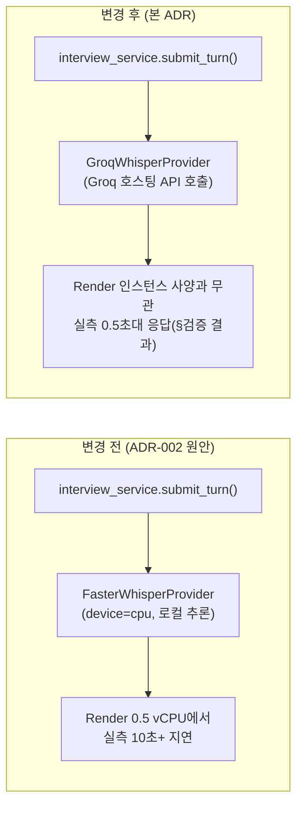

# ADR-008: STT를 로컬 faster-whisper에서 Groq 호스팅 Whisper API로 전환

- 날짜: 2026-09-08
- 상태: 승인됨
- 결정권자: 사용자(운영 환경에서 실측한 지연 문제를 직접 보고, 전환 명시적 승인)
- 관련 ADR: ADR-002(AI 파이프라인 스택 — 이 ADR이 ADR-002의 STT 결정 부분을
  대체한다. LLM/TTS/감정분석 결정은 ADR-002가 계속 유효)

## 배경 (Context)

ADR-002는 STT를 **로컬 faster-whisper**(오프라인, 완전 무료)로 결정했다.
로컬 개발 PC에서는 문제없이 동작했으나, Render(웹서비스, `$7/월` 플랜 —
0.5 vCPU, 512MB RAM)에 배포한 뒤 사용자가 실제 운영 환경에서 면접을
진행하며 **턴 제출 응답이 10초 이상 걸리는 문제**를 직접 보고했다
(마스터 TRD N-001 목표: "턴 종료 후 다음 질문까지 응답 지연 8초 이내" —
이 목표를 위반).

한 턴의 처리 흐름(`interview_service.submit_turn`)은 (1) 오디오 암호화 저장,
(2) STT(음성→텍스트), (3) pgvector 후보 질문 조회, (4) LLM 호출을 순차로
거치는데, 이 중 (2)가 유력한 병목으로 지목됐다 — `faster-whisper`는
`device="cpu"`로 로컬 CPU 연산을 수행하므로, Render의 0.5 vCPU처럼 CPU가
제한된 환경에서는 로컬 개발 PC 대비 훨씬 느려질 수 있다. (4) LLM은 이미
Groq(네트워크 API)로 위임되어 있어 인스턴스 사양과 무관하게 빠르다.

## 검토한 대안 (Options)

| 대안 | 장점 | 단점 |
|---|---|---|
| A. Render Compute 플랜만 올린다($25 이상, 1~2 vCPU) | 코드 변경 없음 | 비용 증가, CPU를 올려도 로컬 추론 자체의 근본적인 지연 특성(모델 크기 대비 vCPU 성능)은 여전히 남음, 확장(동시 사용자 증가) 시 다시 병목 |
| B. STT를 Groq 호스팅 Whisper API로 위임 (본 ADR 채택) | 인스턴스 사양과 무관하게 빠름(네트워크 API 호출로 위임), 이미 LLM에 쓰는 GROQ_API_KEY 재사용(추가 키 발급 불필요), 어댑터 패턴 덕분에 코드 변경이 `providers.py` 한 줄 + 신규 클래스 하나로 최소화 | 오디오 원본이 외부(Groq) 서버로 전송됨(개인정보 관점 — 이미 LLM에 텍스트를, DeepFace/librosa는 로컬 처리이므로 이번이 "원본 음성"이 외부로 나가는 첫 사례), Groq 무료 티어 사용량(오디오 처리량) 추가 소모, Groq 장애/네트워크 문제에 대한 의존성 추가 |
| C. faster-whisper 모델을 더 작게(tiny보다 작은 옵션 없음) 또는 양자화 강화 | 로컬 유지 | tiny가 이미 최소 크기(ADR-002 §7 미결 항목), int8 양자화도 이미 적용 중 — 추가 개선 여지가 거의 없음 |

## 결정 (Decision)

**B안 채택 — STT를 Groq 호스팅 Whisper API(`whisper-large-v3-turbo`,
`language="ko"`)로 전환한다.**

- 구현: `app/ai/stt.py`에 `GroqWhisperProvider` 신규 추가(`STTProvider`
  인터페이스 구현, `AsyncGroq().audio.transcriptions.create(...)` 호출).
  `FasterWhisperProvider`는 **삭제하지 않고 그대로 남긴다** — 되돌리기
  쉬운 어댑터 패턴 유지(하네스 원칙 8 대응: 이 결정 자체는 사람이
  승인했지만, 구현은 언제든 원복 가능하게).
- `app/ai/providers.py`의 `_stt_provider` 조립 지점 한 줄만 바꿔 교체
  (Gemini→Groq LLM 전환 때와 동일한 패턴).
- 모델은 `whisper-large-v3-turbo`(속도 우선, Groq 카탈로그의 두 옵션
  `whisper-large-v3`/`whisper-large-v3-turbo` 중 지연시간이 중요한 이
  용도에 적합) 채택.

## 결과/트레이드오프 (Consequences)

- **개인정보**: 원본 음성 바이트가 이제 Groq 서버로 전송된다. 기존에도
  LLM(Groq)에 전사된 **텍스트**를 보내고 있었으므로 신뢰 경계 자체는 이미
  Groq를 포함하고 있었지만, **원본 음성**이 외부로 나가는 것은 이번이
  처음이다. 원본 오디오 파일 자체(암호화된 채로 `/app/uploads`에 저장되는
  것)는 이 변경과 무관하게 계속 로컬(Render 디스크)에만 보관되며,
  ADR-004 삭제 정책도 그대로 적용된다 — Groq에는 전사를 위해 일시
  전송될 뿐 Groq 쪽에 영구 저장되지 않는다(Groq API 이용약관 기준,
  LLM 호출과 동일한 신뢰 수준으로 판단).
- **비용/쿼터**: Groq 무료 티어의 오디오 처리 한도를 LLM 호출과 별도로
  추가 소비한다. 실사용량이 늘면 유료 전환 검토 필요(ADR-002 §7 미결
  항목과 동일한 성격의 리스크 — 사람 결정 사항으로 유지).
  `groq.APIStatusError`(429 등)는 `describe_groq_error`로 동일하게
  처리해 사용자에게 "잠시 후 다시 시도" 안내.
  429는 명시적으로 스모크 테스트하지는 않음(무료 키를 소진시키는
  행위라 검증 범위에서 제외 — 기존 LLM 429 처리와 같은 코드 경로를
  재사용하므로 별도 위험 낮음).
- **네트워크 의존성 추가**: 완전 오프라인 로컬 STT가 아니게 되어, Groq
  장애 시 STT도 함께 영향받는다(이미 LLM이 Groq 의존이라 신규 단일
  장애점은 아니고 기존 의존을 STT까지 확장하는 것).
- **되돌리기**: `app/ai/providers.py`의 `_stt_provider` 한 줄을
  `FasterWhisperProvider(settings.stt_model_size)`로 되돌리면 즉시 원복
  가능(코드/의존성 모두 유지).

## 관련 문서

- 관련 ADR: ADR-002(AI 파이프라인 스택 — STT 부분 대체), ADR-004(미디어
  보관 정책 — 원본 오디오 저장 자체는 이 ADR과 무관하게 유지)
- 관련 TRD: `docs/trd/aimock_u3a_trd.md` §2(어댑터 명세),
  `docs/trd/aimock_master_trd.md`(N-001 지연 목표, 아키텍처 다이어그램)
- 검증 결과: `내부테스트결과서/U2a보완_STT전환및질문개수제한_20260908171659.md`
