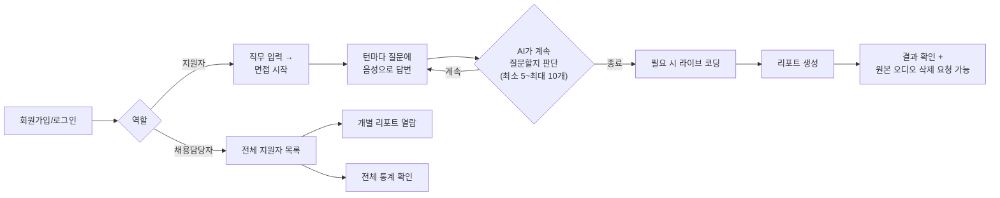

# aimock 사용자 매뉴얼

- 대상: 지원자(candidate), 채용담당자(recruiter)
- 버전: 2026-09-09 (MVP 기준 — `docs/trd/aimock_master_trd.md`/`docs/trd/aimock_frontend_trd.md` 반영)
- 이 문서는 **화면에 실제로 존재하는 기능만** 설명합니다. 계획서(PDF)에는
  있지만 아직 구현 안 된 기능(화이트보드 등)은 다루지 않습니다 —
  구현 현황은 `99.모의면접_전수검사/전수검사결과_20260909101218.md` 참조.

## 1. 전체 흐름 한눈에 보기

## 2. 회원가입 / 로그인

1. 첫 화면에서 "회원가입" 클릭
2. 이메일, 비밀번호, 역할(지원자/채용담당자)을 입력하고 가입
3. 로그인 화면에서 같은 이메일/비밀번호로 로그인
4. 로그인 상태는 브라우저에 보관되며, 일정 시간이 지나거나 다른 기기에서
   재로그인하면 자동으로 로그아웃될 수 있습니다.

**계정 탈퇴**: 지원자 홈 화면 하단의 "회원 탈퇴" 버튼으로 요청할 수
있습니다. 탈퇴 즉시 로그인이 차단되고, **30일 유예기간** 후 계정과
연관된 모든 데이터(면접 기록, 오디오/영상, 리포트)가 자동으로 영구
삭제됩니다(유예기간 중에는 복구 문의 가능 — 실제 문의 채널은 운영자에게
별도 확인).

## 3. 면접 진행 (지원자)

1. 홈 화면에서 **"지원 직무"** 입력란에 원하는 직무를 자유롭게
   입력(예: "백엔드 개발자", "데이터 분석가" 등 — 미리 정해진 목록이
   아니라 자유 텍스트입니다. 입력한 직무에 맞춰 AI가 실시간으로 질문을
   만듭니다)하고 **"면접 시작"** 클릭
2. 첫 질문이 화면에 표시됩니다.
3. **"녹음 시작"** 버튼을 눌러 마이크로 답변하거나, 준비된 오디오
   파일을 업로드해 답변을 제출할 수 있습니다.
4. 답변을 제출하면 AI가 답변 내용을 분석해 다음 질문을 이어가거나,
   충분하다고 판단하면 면접을 마무리합니다. 질문은 **최소 5개, 최대
   10개**까지 진행됩니다(자동 상한 — 서버가 강제로 관리합니다).
5. 답변 중 카메라가 켜져 있다면 표정 분석을 위한 프레임이, 마이크로
   답변한 내용은 음성 운율(피치/에너지) 분석을 위해 함께 저장됩니다.

**답변이 너무 길면**: 전사된 텍스트가 800자를 넘으면 AI가 별도 평가
없이 "답변이 길어지고 있어 다음 질문으로 넘어가겠습니다"라는 안내와
함께 자동으로 다음 질문으로 넘어갑니다.

## 4. 라이브 코딩

면접 진행 중 코딩 화면으로 이동하면 브라우저 안에서 바로 코드를 작성하고
실행해볼 수 있습니다.

- 지원 언어: **Python만 지원**합니다(2026-09-09 기준).
- 실행 결과(표준출력/표준에러/종료코드)가 화면에 표시됩니다.
- 실행 시간 제한이 있습니다(약 5초) — 무한루프 등은 자동으로 중단됩니다.
- 제출한 코드는 이후 리포트 생성 시 AI 평가에 함께 반영됩니다.

## 5. 리포트 확인

1. 면접이 끝나면 리포트 화면으로 이동해 **"리포트 생성하기"**를 클릭
2. 리포트는 백그라운드에서 생성되며, 화면에 "생성 중입니다..."가
   표시됩니다. 완료되면 자동으로 결과가 나타납니다(새로고침 불필요,
   보통 수십 초 내).
3. 리포트에는 다음이 포함됩니다:
   - 기술/커뮤니케이션/조직 적합성 점수(1~5점)
   - 종합 요약 및 합격 추천 여부
   - STAR 기법(상황·과제·행동·결과) 기반 답변 구조 분석
   - 답변에서 자주 등장한 핵심 키워드
   - 표정 타임라인(카메라를 사용했을 경우)
   - 음성 운율(피치/에너지) 정보
4. 만약 생성에 실패하면 오류 메시지와 함께 **"다시 시도"** 버튼이
   나타납니다.

## 6. 원본 답변 오디오/영상 관리

리포트 화면 하단 "원본 답변 오디오 관리"에서, 면접 중 저장된 원본
오디오/영상 프레임 목록을 확인하고 **개별적으로 즉시 영구 삭제**를
요청할 수 있습니다. 삭제 요청 전까지는 암호화된 상태로 서버에
보관됩니다(자세한 보관/삭제 정책은 `docs/public/aimock_privacy_policy.md`
참조).

## 7. 채용담당자 대시보드

채용담당자 역할로 로그인하면:

1. 전체 지원자의 면접 목록(직무, 상태, 합격 추천 여부)을 확인할 수
   있습니다.
2. 개별 지원자를 클릭하면 그 지원자의 상세 리포트를 열람할 수 있습니다
   (리포트가 아직 생성 중이거나 생성에 실패했다면 그 상태가 표시됩니다).
3. 전체 통계(총 면접 수, 완료된 면접 수, 평균 점수)를 확인할 수 있습니다.

지원자 계정으로는 채용담당자 화면에 접근할 수 없으며, 그 반대도
마찬가지입니다(역할 기반 접근 제어).

## 8. 문의/오류 신고

이 서비스는 1인 개발 MVP(시범 서비스)입니다. 별도의 고객센터 채널은
없으며, 오류 발견 시 프로젝트 관리자에게 직접 문의해 주세요.
