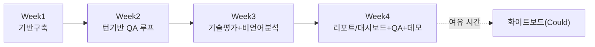

# 릴리스/우선순위 계획 — 웹 AI 모의면접 플랫폼 (MVP)

> `harness/harness_07_release_planning.md` 템플릿 적용. 1인/4주 규모이므로
> "이해관계자 협의"는 사용자 본인과의 확인(AskUserQuestion 로그)으로
> 대체합니다.

## 문서 정보
- 프로젝트: 웹 AI 모의면접 플랫폼 (MVP)
- 작성일 / 버전: 2026-09-07 / v0.1

## §1. MoSCoW 분류 [`docs/trd/aimock_master_trd.md` §2 기준]

| 단위 코드 | 기능명 | 분류 | 분류 근거 |
|---|---|---|---|
| U1 | 인증/계정(지원자/채용담당자) + 탈퇴(소프트삭제+30일 유예 파기 스케줄러) | Must | 다른 모든 기능의 전제조건, 탈퇴 정책(ADR-006)이 U1 범위로 편입(2026-09-07) |
| U1-b | 원본 오디오/영상 암호화 저장 + 지원자 삭제 요청 API | Must | ADR-004 확정(2026-09-07)에 따른 신규 필수 범위. U2-a/U3-a와 데이터 경계 공유하므로 별도 단위로 분리 |
| U2-a | 턴 기반 질문-답변 진행 | Must | 핵심 가치 제안(F-001, F-002) |
| U2-b | 라이브 코딩(Python 샌드박스) | Must | 기술면접 실효성 확보(F-004), 원본 기획 핵심 차별점 |
| U2-c | 시스템 설계 화이트보드(Vision 평가) | Could | 있으면 좋지만 코딩 IDE보다 가치가 낮고 구현 리스크(캔버스+Vision 프롬프트 튜닝) 높음 |
| U3-a | STT + LLM 채점 파이프라인 | Must | F-001/F-007의 기반 |
| U3-b | 표정/음성운율 분석(DeepFace/librosa) | Should | 리포트 품질을 높이지만, 없어도 텍스트 기반 평가는 성립 |
| U4 | 피드백 리포트(STAR/키워드/점수) | Must | F-006/F-007, 사용자에게 보여줄 최종 결과물 |
| U5 | 채용담당자 대시보드 | Should | 지원자용 흐름이 먼저 완성돼야 의미가 생김 |
| - | 실시간 스트리밍 대화(원안 REQ-N-001) | Won't | ADR-001로 명시적 제외 |
| - | Kubernetes/수평확장/500명 부하테스트 | Won't | ADR-005로 명시적 제외 |
| - | 리포트 화면 내 원본 영상 재생 UI(플레이어) | Could | ADR-004로 원본 파일 자체는 보관하게 됐으나, 재생 UI 자체는 별도 프론트엔드 작업이라 MVP 필수는 아님 — 삭제 요청 기능(U1-b)만 Must |

## §2. MVP 범위 확정 [사용자 최종 확인 필요]

- **1차 출시(MVP) = Must 전체 + Should 중 U3-b(표정/음성운율)**: 리포트의
  "비언어적 지표" 항목이 원본 기획의 핵심 차별점이므로 Should임에도 4주
  일정에 포함. U5(대시보드)는 Should이나 리포트 열람 UI가 없으면 결과를
  아예 확인할 수 없으므로 사실상 Must에 가깝게 취급.
- **제외(Could/Won't)**: 화이트보드(U2-c)는 4주차 여유 시간에만 시도,
  실패해도 MVP 완성으로 인정.

## §3. 위험도 × 가치 매트릭스

```mermaid
quadrantChart
    title 위험도 x 가치 매트릭스 - 실행 순서 결정
    x-axis 낮은 가치 --> 높은 가치
    y-axis 낮은 위험도 --> 높은 위험도
    quadrant-1 먼저 한다 (가치高 위험高)
    quadrant-2 두번째 (가치低 위험高 - 구조를 먼저 굳힘)
    quadrant-3 나중에 (가치低 위험低)
    quadrant-4 세번째 (가치高 위험低)
    "U1 인증+탈퇴": [0.3, 0.25]
    "U1-b 미디어저장+삭제": [0.4, 0.45]
    "U2-a 턴기반 QA": [0.9, 0.75]
    "U2-b 라이브코딩": [0.75, 0.5]
    "U2-c 화이트보드": [0.35, 0.7]
    "U3-a STT+LLM채점": [0.9, 0.8]
    "U3-b 표정/음성분석": [0.55, 0.55]
    "U4 리포트": [0.85, 0.35]
    "U5 대시보드": [0.5, 0.2]
```

**해석**: U2-a(턴 기반 대화)와 U3-a(STT+LLM 채점)가 가치·위험 모두 가장
높은 1사분면 — 가장 먼저 구조를 확정해야 함. U2-c(화이트보드)는 가치는
낮은데 위험(Vision 프롬프트 튜닝, 캔버스 구현)은 높은 2사분면이라 Could로
분류한 것과 일치.

## §4. 릴리스 마일스톤 (4주)

| 주차 | 목표 | 포함 단위 | 상태 |
|---|---|---|---|
| Week 1 | 기반 구축: 프로젝트 스켈레톤, DB 스키마, 인증, 탈퇴 소프트삭제+30일 파기 스케줄러(APScheduler), 원본 미디어 암호화 저장+삭제 API, LLM/STT 어댑터 PoC | U1(완료), U1-b(완료), U3-a PoC(완료, faster-whisper 실제 검증) | **완료**(2026-09-07) |
| Week 2 | 핵심 루프 완성: 턴 기반 질문-답변, RAG 질문은행, 채점 JSON 스키마 | U2-a(완료), U3-a(완료) | **완료**(2026-09-07, AC 11/11) — Gemini 실제 호출은 `GEMINI_API_KEY` 확보 후 재검증 필요 |
| Week 3 | 기술 평가 + 비언어 분석: 라이브 코딩, DeepFace/librosa 통합 | U2-b(완료, AC 7/7), U3-b(완료, AC 5/5) | **U2-b 완료**(2026-09-07), **U3-b 엔진 완료**(2026-09-08, 사용자 제공 실제 샘플로 검증) — 실시간 웹캠 캡처 UI는 별도 결정 사항 |
| Week 4 | 리포트/대시보드 + QA + (여유 시) 화이트보드 + 데모 준비 | U4(완료, AC 8/8), U5(완료, AC 6/6), U2-c(완료, AC 6/6), QA | **U4/U5 완료**(2026-09-07), **U2-c(화이트보드) 완료**(2026-09-09, `docs/trd/aimock_u2c_trd.md`, 실제 Gemini Vision API로 검증) — **Must-have 전체 완료 + Could-have 화이트보드까지 완료**. 남은 QA는 부하테스트/편향성테스트, 프론트엔드는 대부분 착수됨 |



## §5. 갱신 시점
- 마스터 TRD(`docs/trd/aimock_master_trd.md`)가 바뀔 때
- 매주 마일스톤 완료 시점마다 다음 주 계획 재확인 (A0 인수인계 문서에 기록)
