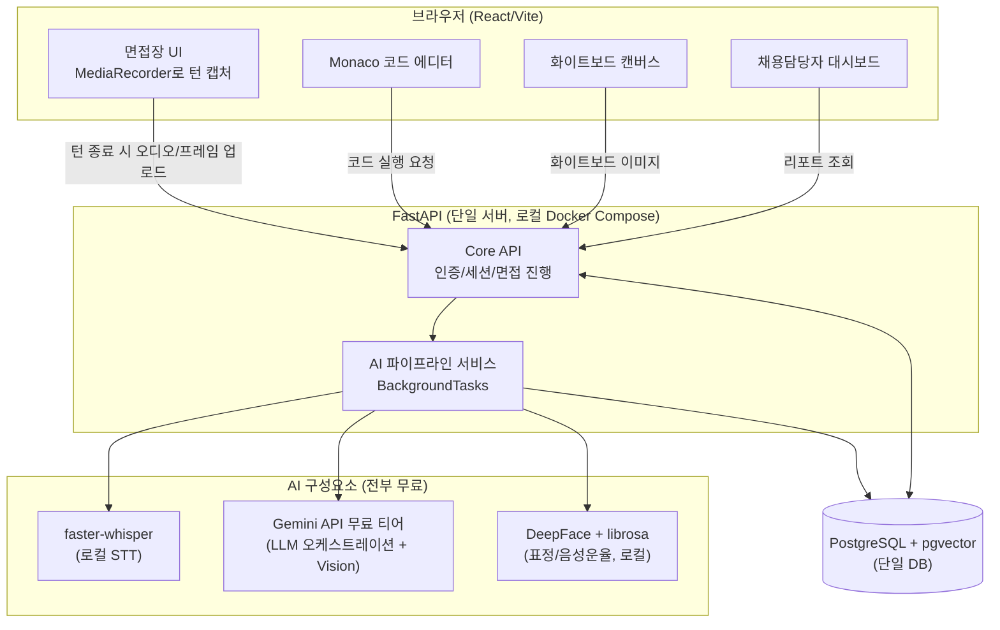
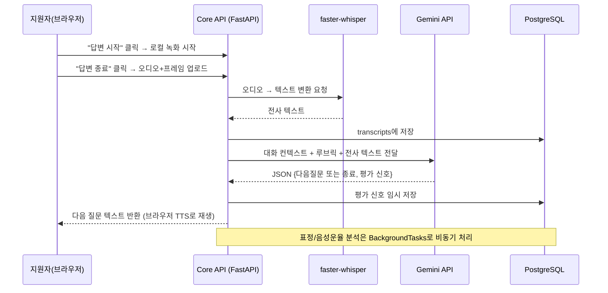

# 마스터 TRD — 웹 AI 모의면접 플랫폼 (MVP)

> `harness/harness_00_overview.md` §3 Phase A-4 산출물. 개별 화면/기능
> 단위 TRD는 이 문서를 확정한 뒤 `harness_01_trd_template.md`를 복사해
> `docs/trd/aimock_{단위코드}_trd.md`로 작성합니다(파일명 규칙:
> `docs/tech_conventions.md` 참조). 이 문서는 그 상위의 "전체 계약"입니다.

## 문서 정보
- 프로젝트: 웹 AI 모의면접 플랫폼 (MVP)
- 원본 기획서: `00 파이널 프로젝트 계획서/*.pdf` (엔터프라이즈 스펙, 참고용)
- 작성일 / 버전: 2026-09-07 / v0.2 (2026-09-08 — §2/§3 사람 라인 리뷰·승인 완료)
- 상태: 확정(§2/§3 실사용자 승인 완료, 나머지 섹션은 종전과 동일)
- 관련 ADR: `docs/adr/adr-001` ~ `adr-005`

## §0. 범위 및 제약 [사람 확인 완료]

- 개발 규모: 1인, 4주 이내, Claude Code 구독료 외 전부 무료 스택
  (2026-09-07 AskUserQuestion로 확인)
- 원본 기획서는 엔터프라이즈 프로덕션 스펙(Kubernetes/Oracle/Pinecone/
  Hume AI/GCP/팀 7명·7주)이며, 이 마스터 TRD는 그중 **핵심 가치 제안
  (적응형 AI 면접관 · 기술 역량 평가 · 종합 피드백 리포트)만 무료·1인
  스택으로 재구현**하도록 범위를 재조정한 것입니다. 무엇을 왜 줄였는지는
  `docs/adr/README.md`의 "왜 원본 기획서와 이렇게 많이 달라졌는가" 참조.

## §1. 시스템 개요 및 사용자 흐름 [AI 초안 → 사람 확인]

**주요 화면(단위) 목록** (각 단위는 이후 개별 TRD로 분리):
| 단위 코드 | 화면/기능 | 한 줄 역할 |
|---|---|---|
| U1 | 인증/계정 | 지원자·채용담당자 로그인, 역할 구분 |
| U2 | 면접 세션 진행 | 턴 기반 질문-답변, 코딩 IDE, 화이트보드 |
| U3 | AI 평가 파이프라인 | STT→LLM 채점→감정분석 백그라운드 처리 |
| U4 | 피드백 리포트 | 지원자용 결과 화면 (STAR 분석, 점수, 관찰) |
| U5 | 채용담당자 대시보드 | 지원자 목록·리포트 열람·통계 |

**한 턴(질문-답변)의 처리 흐름**:

## §2. 기능 요구사항 [사람 승인 완료 — 2026-09-08, 실제 구현 기준으로 정정]

> **2026-09-08 갱신**: 아래 "실제 구현 상태" 열은
> `docs/trd/aimock_master_trd_review_20260908.md`의 라인별 코드 대조
> 결과를 사용자가 승인해 반영한 것입니다. 원안(REQ-F)/기존 재조정 열은
> 기획 이력 보존을 위해 그대로 둡니다.

| ID | 요구사항(원안 재조정본) | 원본(REQ-F) 대비 변경 | MoSCoW | 실제 구현 상태(2026-09-08) |
|---|---|---|---|---|
| F-001 | 적응형 꼬리질문: 이전 답변을 LLM 컨텍스트에 누적, RAG로 질문은행(pgvector)에서 다음 질문 후보 검색 | 원안 유지(REQ-F-001), RAG 저장소만 Pinecone→pgvector | Must | **적응형 질문 생성 자체는 동작**(LLM이 대화 전체 이력을 보고 다음 질문을 직접 생성, 실제 Gemini로 검증 완료 2026-09-08). 다만 "RAG로 후보 검색" 부분은 구현되지 않음 — `question_service.retrieve_candidates()`는 필터 없이 질문은행에서 무작위 3개를 뽑아 LLM에 참고자료로만 제공(`src/backend/app/services/question_service.py`). pgvector 컬럼은 스키마에 있지만 유사도 검색에 쓰이지 않음 |
| F-002 | 멀티모달 입력: 텍스트(코드)+오디오(답변)+이미지(화이트보드/표정 프레임) | 원안(REQ-F-002)에서 "실시간 동시 처리"를 "턴 단위 순차 업로드"로 축소 | Must → **Should로 하향 조정**(2026-09-08) | 텍스트(코드)·오디오는 구현·검증 완료. 이미지 입력(화이트보드/표정 프레임)은 U2-c/U3-b 미착수로 없음(release_plan.md와 일치) — Must 요구사항에 미구현 항목이 섞여있던 것을 실제 상태에 맞게 하향 |
| F-003 | 답변 처리 시간이 오래 걸리면(텍스트 기준) 안내 문구로 다음 질문 유도 | 원안(REQ-F-003) "실시간 정중 개입"을 "턴 종료 시 안내"로 축소, **2026-09-08 추가 정정**: "시간 초과"가 아니라 "답변 텍스트 길이 초과"가 실제 트리거 조건 | Should | 구현·검증 완료. `interview_service.py`가 STT 결과 텍스트 길이(`turn_max_answer_chars`)로 판단 — 턴 기반 구조상 실시간 타이머 계측이 어려워 채택한 대체 지표 |
| F-004 | 라이브 코딩: Monaco 에디터 + 샌드박스 실행(Python) + AI가 정답여부/시간복잡도/스타일 평가 | 원안(REQ-F-004) 유지, 언어는 Python 1종으로 축소(Could: JS 추가). **2026-09-08 추가 정정**: "AI 평가"는 U4로 이관, 구조화된 필드가 아니라 LLM 컨텍스트에 포함되는 방식 | Must (Python만) | 코드 실행(U2-b)은 완료·검증됨. 코드 평가는 `ReportResult`에 정답여부/시간복잡도/스타일을 별도 필드로 분리하지 않고, 리포트 생성 시 코드 제출 이력을 LLM에 통째로 넘겨 종합 요약에 녹여냄(`app/ai/report.py`) |
| F-005 | 시스템 설계 화이트보드: 캔버스로 그린 이미지를 Gemini Vision으로 평가 | 원안(REQ-F-005) 유지, GPT-4V→Gemini Vision | Could | 미착수(사용자 확인 2026-09-08, 이번 MVP에서 스킵) |
| F-006 | 상세 피드백 리포트: STAR 구조 분석, 핵심 키워드, 표정 타임라인, 음성 운율 | 원안(REQ-F-006) 유지, "시선처리"는 프레임 표정분석 범위로 축소(눈동자 추적 아님). **2026-09-08: "발화속도" 항목 삭제**(구현된 적 없어 요구사항에서 제외, 필요 시 별도 단위로 재검토). **2026-09-08 추가**: "음성 운율(피치/에너지)"을 항목에 추가 — 사용자가 U3-b 착수를 직접 결정하며 `docs/trd/aimock_u3b_trd.md`에서 신설한 요구사항으로, 원안(REQ-F-006)에는 없었으나 표정 분석과 같은 목적(비언어적 신호 관찰)으로 함께 구현되어 리포트에 포함됨 | Must | U3-b 구현 완료로 STAR 분석·키워드·표정 타임라인·음성 운율 4개 항목 모두 리포트 화면에 표시됨(`ReportDetails.tsx`). STAR 분석·키워드는 실제 Groq로 검증 완료. **표정 타임라인·음성 운율은 데이터 파이프라인(캡처→저장→DeepFace/librosa 분석→리포트 반영)은 동작 확인됨(2026-09-08)**, 다만 실사용 중 웹캠 프레임이 전부 검은 화면으로 캡처되는 버그가 있어 표정값이 항상 "unknown"이었음 — 원인(숨겨진 `<canvas>` 사용) 수정 완료(`InterviewPage.tsx`)했으나 실제 카메라로 재검증은 사용자 확인 대기 중. 음성 운율은 실제 오디오로 정상값(피치/에너지) 산출 확인됨 |
| F-007 | 채용 적합도 스코어링: 루브릭 기반 1~5점 + 합격/불합격 추천 | 원안(REQ-F-007) 유지 | Must | 구현·검증 완료(실제 Gemini로도 확인 — 빈 답변에 임의로 높은 점수를 주지 않고 정확히 낮게 평가하는 것까지 확인) |

## §3. 비기능 요구사항 [사람 승인 완료 — 2026-09-08, 실제 구현 기준으로 정정]

| ID | 요구사항 | 원본(REQ-N) 대비 변경 | 관련 ADR | 실제 구현 상태(2026-09-08) |
|---|---|---|---|---|
| N-001 | 턴 종료 후 다음 질문까지 응답 지연 목표 8초 이내(로컬 CPU 기준, 무료 티어 LLM 응답시간 포함) | 원안 "800ms~1.5s 스트리밍"을 턴 기반 배치 처리로 대체 | ADR-001, ADR-002 | **미실측** — GEMINI_API_KEY를 2026-09-08에 처음 확보해 실제 응답은 나왔지만(정성적으로 수 초 내 응답), 8초 목표치를 정량적으로 측정한 적은 없음. 목표(target)로 유지, "보장"은 아님 |
| N-002 | 동시 접속: 데모/시연 수준(동시 1~5세션)만 보장, 수평 확장 미지원 | 원안 "수백 세션 Kubernetes 확장"을 제외(Won't) | ADR-005 | 부하 테스트 자체를 ADR-005로 범위 밖(Won't) 처리 — "이렇게 되도록 설계함"이지 "실측 검증함"은 아님 |
| N-003 | 생체 데이터 보호: 비밀번호 해시, DB 접속정보 환경변수, 원본 오디오/비디오는 **암호화 저장 후 지원자 요청 시(또는 계정 파기 연쇄 시) 물리 삭제** | 원안 "즉시 삭제"에서 "지원자가 직접 삭제 요청 전까지 암호화 보관"으로 변경(2026-09-07 사용자 선택) | ADR-004 | 구현·검증 완료. (2026-09-08 발견·수정: 면접 턴 제출 흐름이 한동안 이 저장을 실제로 호출하지 않던 버그가 있었으나 연결·재검증 완료) |
| N-004 | 공정성: 채점 프롬프트에 "인구통계적 특징 언급 금지" 명시, 판단 근거를 리포트에 노출(설명가능성) | 원안 유지(다양한 데이터셋 편향 검증은 4주 내 범위 밖 — Won't). **2026-09-08 정정**: "key_observations"라는 필드명은 실제로는 리포트가 아니라 **면접 턴별 LLM 평가**(`app/ai/llm.py`의 `evaluation.key_observations`)에서만 쓰이고, 최종 리포트에는 집계되지 않음 — 리포트의 판단 근거는 `star_analysis`/`summary_text`(자유 텍스트)가 담당 | - | 인구통계 언급 금지 프롬프트는 실제 시스템 프롬프트에 있음(확인됨). 판단 근거 노출 자체는 `star_analysis`/`summary_text`로 되고 있으나 "key_observations"라는 이름의 리포트 필드는 없음(용어만 정정, 기능은 다른 이름으로 존재) |
| N-005 | 계정 탈퇴: 탈퇴 즉시 로그인 차단(소프트 삭제) + 30일 유예기간 후 스케줄러가 연관 데이터 전부 물리 삭제 | 신규 — 원본 기획서엔 없던 요구사항, 사용자가 직접 선택 | ADR-006 | 구현·검증 완료. **2026-09-08 추가**: 로그인 브루트포스 방어(15분 내 5회 실패 시 429 잠금)를 새로 추가(TRD엔 없던 보안 강화, `app/core/rate_limit.py`) |

## §4. 데이터 구조 [ADR-003에서 확정]

ERD는 `docs/adr/adr-003-data-stack.md`의 mermaid `erDiagram`을 단일 진실
공급원으로 참조합니다. 이 문서에서 중복 기재하지 않습니다.

## §5. 인수 조건 (마스터 수준) [사람 작성 — 코드 착수 전 확정 필요]

> 단위별 세부 AC는 각 단위 TRD(`docs/trd/aimock_u1_trd.md` 등, 명명규칙은
> `docs/tech_conventions.md` "하네스 문서 파일명 규칙" 참조)에서 별도 확정.
> 여기서는 "MVP가 완성됐다고 부를 수 있는" 최소 기준만 정의합니다.

- [ ] AC-M1: 지원자가 로그인 후 면접을 시작해, 최소 3턴(질문-답변) 이상
  대화가 오가고, 답변 내용에 따라 꼬리질문이 최소 1회 이상 생성된다.
- [ ] AC-M2: Python 코드 문제 1개 이상을 풀 수 있는 라이브 코딩 화면이
  동작하고, 실행 결과가 화면에 표시된다.
- [ ] AC-M3: 면접 종료 후 STAR 분석·핵심 키워드·역량별 점수(1~5)·합격/
  불합격 추천을 포함한 리포트가 생성된다.
- [ ] AC-M4: 채용담당자 계정으로 로그인하면 완료된 면접 목록과 각 리포트를
  조회할 수 있다.
- [ ] AC-M5: Gemini 무료 티어 쿼터 초과 등 LLM 호출 실패 시, 시스템이
  에러 화면 없이 재시도 또는 안내 메시지로 처리한다(N-001 관련 예외 처리).
- [ ] AC-M6: 지원자가 리포트 화면에서 원본 오디오/영상 삭제를 요청하면,
  해당 파일과 `media_assets` 레코드가 즉시 삭제되고 재조회 시 404를
  반환한다(N-003, ADR-004).
- [ ] AC-M7: 지원자가 탈퇴를 요청하면 즉시 로그인이 차단되고, 30일 이내
  재로그인 시 계정이 복구되며, 30일 경과 후에는 스케줄러가 연관 데이터를
  전부 삭제한다(N-005, ADR-006). — 30일 스케줄러 동작은 자동화 테스트에서
  시간을 앞당겨 시뮬레이션하는 방식으로 검증(실제 30일 대기 불가).

## §6. 릴리스 계획 연동

`docs/release/release_plan.md`에서 위 §2 기능요구사항을 MoSCoW로 매핑하고
4주 마일스톤에 배치합니다.

## §7. 미결 항목 [사람 작성 — 작업지시서로 넘어가기 전 확정 필요]

| 항목 | 결정 결과 | 상태 |
|---|---|---|
| 원본 오디오/비디오 영구 저장 여부 | 지원자가 직접 삭제 요청 전까지 암호화 로컬 보관 (ADR-004, 2026-09-07 사용자 확정) | **해소** |
| 계정 삭제/탈퇴 시 데이터 처리 | 소프트 삭제 + 30일 유예기간 후 스케줄러 자동 물리삭제 (ADR-006, 2026-09-07 사용자 확정) | **해소** |
| Gemini 무료 티어 쿼터 소진 시 대응 | Groq API로 자동 전환(어댑터 패턴) | 예 — 구현 전 확정 필요 |
| 코딩 테스트 지원 언어 범위 | Python만(MVP), JS는 Could | 아니오(기본값 승인 시 그대로 진행) |
| 배포 방식(로컬 vs 무료 PaaS) | 로컬 Docker Compose 기본, PaaS는 Could | 아니오(ADR-005 기본값 적용) |
| 유예기간 30일 값의 최종 법무적 타당성 | AI 제안 기본값(업계 관행), 실서비스 전환 시 재검토 필요 | 아니오(MVP 범위에서는 그대로 진행) |
