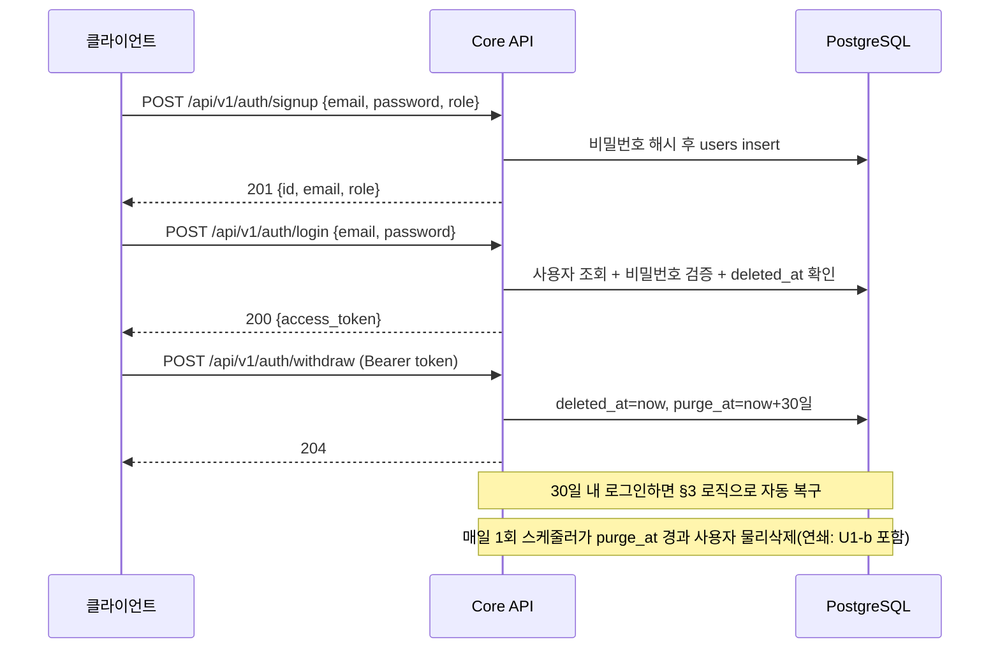

# 단위 TRD — U1: 인증/계정 + 탈퇴

> `harness/harness_01_trd_template.md` 형식. 상위 문서:
> `docs/trd/aimock_master_trd.md` §1(U1), §3(N-005), §7.

## 문서 정보
- 프로젝트: aimock
- 단위(화면/기능) 이름: U1 — 인증/계정(지원자·채용담당자) + 탈퇴(소프트삭제+30일 유예)
- 작성일 / 버전: 2026-09-07 / v0.1
- 상태: 확정 (코드 착수)

## §0. 범위 및 흐름 개요
- 역할: 회원가입/로그인/내 정보 조회/탈퇴/탈퇴 복구를 제공하는 백엔드
  API. 이 단위가 발급하는 JWT를 이후 모든 단위(U2~U5)가 인증에 사용한다.
- 흐름:

- 의존하는 다른 단위: 없음(가장 먼저 구현되는 단위)
- 의존받는 단위: U1-b, U2~U5 전부(인증 필요)

## §0-1. 비기능 요구사항 체크
- 동시성: 이메일 unique 제약으로 동시 가입 충돌은 DB 레벨에서 방지(409 반환)
- 권한: 비로그인 사용자는 `/auth/signup`, `/auth/login`만 접근 가능. 그 외
  전 엔드포인트는 Bearer JWT 필요.
- 감사: `users.created_at`만 기록(MVP 범위에서 별도 audit log 테이블은 없음
  — Won't, 필요 시 향후 추가).
- 개인정보: `password_hash`는 bcrypt, 평문 비밀번호는 로그에 남기지 않음.
- 삭제 정책: ADR-006 — 소프트 삭제(`deleted_at`) 즉시 적용, `purge_at`
  경과 시 스케줄러가 물리 삭제.

## §1. 데이터 구조
`USERS` 테이블(ADR-003 §ERD 2026-09-07 갱신본이 단일 진실 공급원):
`id(uuid,pk)`, `email(unique)`, `password_hash`, `role(candidate/recruiter)`,
`created_at`, `deleted_at(nullable)`, `purge_at(nullable)`.

## §2. 함수/API 명세

| 엔드포인트 | 입력 | 출력 | 설명 |
|---|---|---|---|
| `POST /api/v1/auth/signup` | `{email, password, role}` | `201 {id, email, role}` / `409` 중복 | 회원가입 |
| `POST /api/v1/auth/login` | `{email, password}` | `200 {access_token, token_type}` / `401` | 로그인, JWT 발급 |
| `GET /api/v1/auth/me` | Bearer | `200 {id, email, role}` / `401` | 내 정보 |
| `POST /api/v1/auth/withdraw` | Bearer | `204` / `401` | 탈퇴(소프트삭제) |
| (내부) `purge_expired_users()` | 스케줄러 트리거 | - | `purge_at` 경과 사용자 물리삭제 |

## §3. 워크플로우 및 비즈니스 로직
- 로그인 시 `deleted_at IS NOT NULL`이면: `purge_at`이 아직 안 지났으면
  **자동 복구**(`deleted_at`/`purge_at` NULL로 되돌리고 로그인 성공) —
  "탈퇴 후 30일 내 재로그인하면 복구"라는 ADR-006 정책을 로그인 흐름에
  구현. `purge_at`이 이미 지났으면 스케줄러가 아직 못 지운 상태일 수
  있으므로 401(계정 없음과 동일하게 취급)로 응답.
- 탈퇴(`/withdraw`) 시 `deleted_at=now()`, `purge_at=now()+30일` 설정,
  이후 이 사용자의 JWT는 `get_current_user` 의존성에서 `deleted_at`을
  재조회해 즉시 무효화(401)한다.
- 스케줄러(`purge_expired_users`)는 매일 1회, `purge_at <= now()`인
  사용자를 찾아 연관 데이터(interviews와 그 하위 전부, U1-b의
  media_assets 포함)와 함께 물리 삭제 후 파기 로그(`logs/purge_YYYYMMDD.log`)
  를 남긴다.

## §4. 상태/에러 코드

| 코드 | 의미 | 발생 조건 |
|---|---|---|
| 401 | 인증 실패 | 비밀번호 불일치, 토큰 없음/만료, 탈퇴 후 purge_at 경과 |
| 409 | 이메일 중복 | signup 시 이미 존재하는 email |
| 422 | 입력값 오류 | Pydantic 검증 실패(이메일 형식, 비밀번호 최소 길이 등) |

## §5. 인수 조건 (Acceptance Criteria)
- [ ] AC-1: 유효한 이메일/비밀번호/역할로 signup하면 201과 함께 사용자가
  생성되고, DB의 `password_hash` 컬럼에 평문 비밀번호가 그대로 저장되지
  않는다(해시값 검증).
- [ ] AC-2: 이미 가입된 이메일로 다시 signup하면 409를 반환한다.
- [ ] AC-3: 올바른 이메일/비밀번호로 login하면 200과 access_token을
  반환하고, 틀린 비밀번호면 401을 반환한다.
- [ ] AC-4: access_token 없이 `/auth/me` 호출 시 401을 반환한다.
- [ ] AC-5: 로그인 상태에서 `/auth/withdraw` 호출 시 204를 반환하고, 즉시
  이후 요청(`/auth/me`)이 같은 토큰으로도 401이 된다.
- [ ] AC-6: 탈퇴 후 `purge_at` 이전에 다시 login하면 계정이 복구되어
  200과 정상 토큰을 받고, `deleted_at`/`purge_at`이 다시 NULL이 된다.
- [ ] AC-7: `purge_at`이 지난 사용자에 대해 `purge_expired_users()`를
  실행하면 해당 사용자 레코드가 DB에서 사라진다(테스트는 `purge_at`을
  과거 시각으로 직접 세팅해 시뮬레이션).

## §6. 테스트 시나리오

| 시나리오 | 입력/조건 | 기대 결과 | 대응 AC |
|---|---|---|---|
| 정상 가입 | 신규 이메일 | 201, 해시 저장 확인 | AC-1 |
| 중복 가입 | 기존 이메일 재사용 | 409 | AC-2 |
| 정상 로그인 | 올바른 비밀번호 | 200 + 토큰 | AC-3 |
| 틀린 비밀번호 | 잘못된 비밀번호 | 401 | AC-3 |
| 토큰 없이 접근 | Authorization 헤더 없음 | 401 | AC-4 |
| 탈퇴 후 접근 | withdraw 후 같은 토큰 재사용 | 401 | AC-5 |
| 유예기간 내 복구 | withdraw 후 즉시 재로그인 | 200, 필드 NULL 복구 | AC-6 |
| 만료 후 파기 | purge_at을 과거로 설정 후 스케줄러 실행 | 레코드 삭제 | AC-7 |

## §7. 미결 항목
| 항목 | 권장 기본값 | 확정 필요 여부 |
|---|---|---|
| 비밀번호 최소 길이/복잡도 규칙 | 최소 8자 이상만 강제(MVP) | 아니오(기본값 적용) |
| JWT 만료 시간 | 24시간 | 아니오(기본값 적용) |
