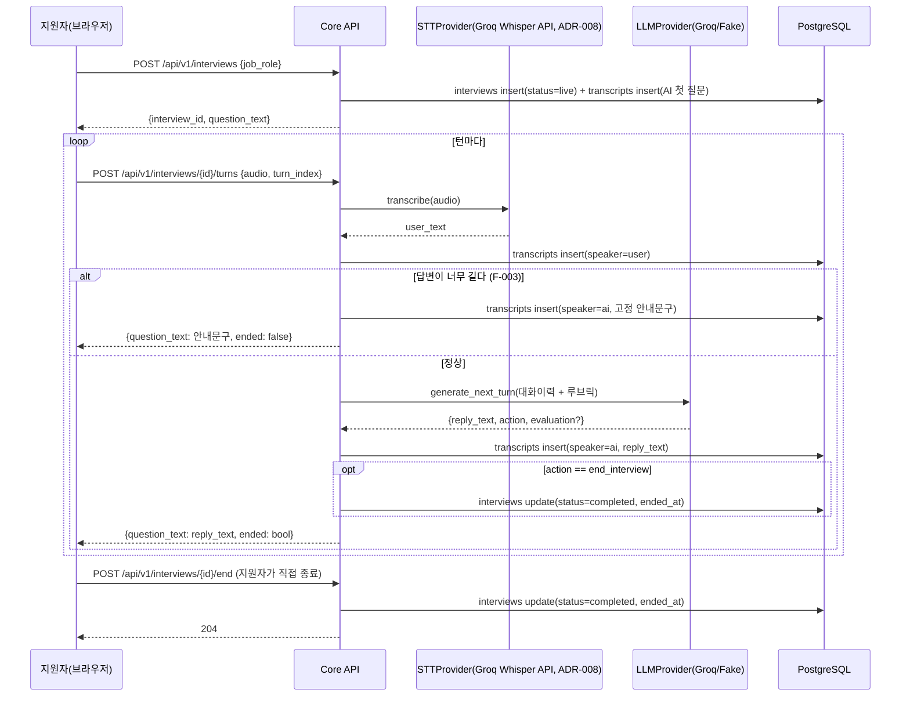
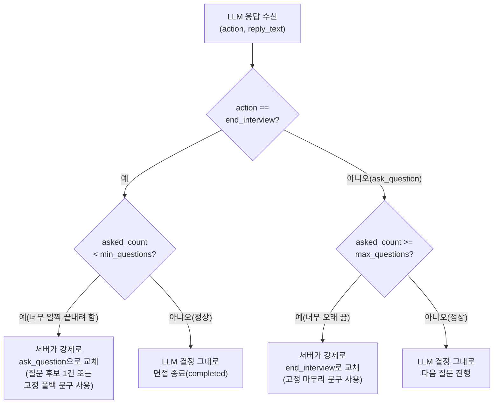

# 단위 TRD — U2-a: 턴 기반 질문-답변 진행

> `harness/harness_01_trd_template.md` 형식. 상위 문서:
> `docs/trd/aimock_master_trd.md` §1(U2), §2(F-001/F-002/F-003). 이 단위는
> `docs/trd/aimock_u3a_trd.md`(STT+LLM 내부 파이프라인)와 함께 구현된다
> (릴리스 계획 Week2에서 U2-a·U3-a가 서로 없이는 동작할 수 없어 묶임).

## 문서 정보
- 프로젝트: aimock
- 단위(화면/기능) 이름: U2-a — 면접 세션의 턴 기반 질문-답변 진행(API)
- 작성일 / 버전: 2026-09-07 / v0.1
- 상태: 확정 (코드 착수)

## §0. 범위 및 흐름 개요
- 역할: 지원자가 면접을 시작·진행·종료하는 API. 각 턴마다 U1-b가 만든
  미디어 업로드 로직을 재사용하지 않고(U1-b는 "저장"만 담당), 이 단위는
  오디오를 받아 즉시 STT→LLM까지 동기 처리해 다음 질문을 반환한다 —
  원본 오디오를 영구 보관하고 싶다면 클라이언트가 U1-b의
  `POST /interviews/{id}/media`도 별도로 호출한다(관심사 분리).
- 흐름:

- 의존하는 다른 단위: U1(인증), U3-a(STT/LLM 어댑터)
- 의존받는 단위: U4(리포트 — transcripts를 읽어 생성)

## §0-1. 비기능 요구사항 체크
- 동시성: 한 interview에 동시에 두 턴이 제출되는 경우는 MVP 범위에서
  고려하지 않음(단일 지원자가 순차적으로만 진행한다고 가정 — Won't).
- 권한: 본인 소유(candidate_id == 현재 사용자)의 interview만 조작 가능,
  아니면 403.
- 감사: 모든 턴은 `transcripts`에 순서(turn_index)와 함께 영구 기록(리포트
  U4의 원재료).
- 개인정보: 오디오는 이 단위에서 저장하지 않고 STT 후 즉시 폐기(파일로
  쓰지 않음, 메모리에서만 처리) — U1-b와 별개로 이 흐름에서는 원본을
  만들지 않는 것이 기본 동작. 영구 보관을 원하면 클라이언트가 U1-b
  엔드포인트를 별도 호출.
- 삭제 정책: 해당 없음(이 단위는 텍스트만 다룸, 삭제는 U1/U1-b 정책을
  따름 — interview가 삭제되면 transcripts는 FK CASCADE로 함께 삭제).

## §1. 데이터 구조
`INTERVIEWS`, `TRANSCRIPTS`(ADR-003 §ERD가 단일 진실 공급원). 이 단위는
기존 스키마를 그대로 사용, 컬럼 추가 없음.

## §2. 함수/API 명세

| 엔드포인트 | 입력 | 출력 | 설명 |
|---|---|---|---|
| `POST /api/v1/interviews` | Bearer, `{job_role}` | `201 {interview_id, question_text}` | 면접 시작, 첫 질문 반환 |
| `POST /api/v1/interviews/{id}/turns` | Bearer, multipart(`audio`, `turn_index`) | `200 {question_text, ended}` / `403` / `404` / `409` | 한 턴 처리 |
| `POST /api/v1/interviews/{id}/end` | Bearer | `204` / `403` / `404` | 지원자가 직접 종료 |

## §3. 워크플로우 및 비즈니스 로직
- 첫 질문: `question_service.pick_opening_question(job_role)`이 질문은행
  (U3-a §3)에서 난이도 낮은 질문 하나를 골라 사용, 없으면 하드코딩된
  범용 오프닝("자기소개를 부탁드립니다") 사용.
- 답변 길이 제한(F-003 대체): 전사 텍스트가 **800자 초과**면 LLM을 호출하지
  않고 고정 문구("답변이 길어지고 있어 다음 질문으로 넘어가겠습니다")를
  AI 턴으로 저장 후 반환 — 이는 원안의 실시간 개입을 턴 종료 시점의
  규칙 기반 개입으로 대체한 것(ADR-001 연장).
- LLM이 `action="end_interview"`를 반환하면 즉시 interview를 completed로
  전환. 지원자가 `/end`를 직접 호출해도 동일하게 처리.
- `status != "live"`인 interview에 턴을 제출하면 409.
- **질문 개수 최소/최대 강제(2026-09-08 추가, ADR-008 연계)**: 운영 환경
  (Render) 실사용 중 "면접이 턴 25까지 진행돼도 안 끝난다"는 문제를
  사용자가 실제로 보고해 발견 — 원인은 LLM에게 "몇 개 질문 후 끝내라"는
  지시가 전혀 없었고, 서버에도 상한이 없었던 것(설계 공백, 버그).
  대응: 사용자 확정값 기준 **최소 5개 / 최대 10개**(오프닝 질문 포함)를
  `interview_min_questions`/`interview_max_questions` 설정값으로 도입.
  1차로 LLM 프롬프트(`SYSTEM_PROMPT` + 매 턴 사용자 메시지의 "[면접 진행
  상황]")에 현재 질문 번호와 목표 범위를 안내해 LLM이 스스로 따르게
  하고, LLM이 지시를 어겨도 서버가 최종적으로 강제한다
  (`interview_service._enforce_question_count_bounds`):

  `asked_count`는 이번 응답 이전까지 이미 나온 질문 수(오프닝 포함,
  `speaker=ai`인 transcript 개수)로 계산한다.

## §4. 상태/에러 코드

| 코드 | 의미 | 발생 조건 |
|---|---|---|
| 403 | 소유권 없음 | 다른 사용자의 interview |
| 503 | AI 서비스 준비 안 됨 | `GEMINI_API_KEY` 미설정 상태로 LLM 호출 필요한 턴 제출(2026-09-07 실제 컨테이너 테스트로 발견해 `RuntimeError`→`ServiceUnavailableError`로 수정, 원래 500이었음) |
| 404 | 대상 없음 | 존재하지 않는 interview_id |
| 409 | 상태 충돌 | 이미 completed인 interview에 턴 제출 시도 |

## §5. 인수 조건 (Acceptance Criteria)
- [ ] AC-1: `POST /interviews`로 면접을 시작하면 201과 함께 `question_text`
  (첫 질문)가 반환되고, DB에 `status=live`인 interview와 turn_index=0인
  AI transcript가 생성된다.
- [ ] AC-2: 턴을 제출하면 사용자 발화가 `speaker=user` transcript로,
  AI의 다음 질문이 `speaker=ai` transcript로 각각 저장된다.
- [ ] AC-3: 800자를 초과하는 전사 텍스트로 턴을 제출하면 LLM을 호출하지
  않고 고정 안내문구가 반환된다(Fake LLM 호출 카운트로 검증).
- [ ] AC-4: LLM이 `action="end_interview"`를 반환하면 interview의 status가
  `completed`로 바뀌고 `ended_at`이 채워진다(단, **AC-9의 최소 질문 개수
  조건을 만족한 경우에 한함** — 2026-09-08 추가, 아래 참조).
- [ ] AC-5: `/end`를 호출하면 즉시 `completed`로 바뀐다.
- [ ] AC-6: 다른 사용자의 interview에 턴을 제출하면 403을 반환한다.
- [ ] AC-7: `completed` 상태의 interview에 턴을 제출하면 409를 반환한다.
- [ ] AC-8: `GEMINI_API_KEY`가 없는 상태에서 (800자 이하) 턴을 제출하면
  500이 아니라 503(`SERVICE_UNAVAILABLE`)을 반환한다(실제 Docker
  컨테이너 테스트로 발견 → 수정, 2026-09-07).
- [ ] AC-9(2026-09-08 추가): 이미 나온 질문 수(오프닝 포함)가
  `interview_min_questions`(기본 5) 미만인 상태에서 LLM이
  `action="end_interview"`를 반환해도, 서버가 이를 `ask_question`으로
  교체해 면접을 계속 진행시킨다(interview는 `live`로 유지).
- [ ] AC-10(2026-09-08 추가): 이미 나온 질문 수가
  `interview_max_questions`(기본 10) 이상인 상태에서 LLM이
  `action="ask_question"`을 반환해도, 서버가 이를 `end_interview`로
  교체해 면접을 강제 종료한다(고정 마무리 문구 사용).

## §6. 테스트 시나리오

| 시나리오 | 입력/조건 | 기대 결과 | 대응 AC |
|---|---|---|---|
| 면접 시작 | job_role="backend" | 201, 첫 질문 포함 | AC-1 |
| 정상 턴 | 짧은 오디오 | user+ai transcript 각 1건 추가 | AC-2 |
| 긴 답변 | 800자 초과 텍스트를 반환하는 Fake STT | LLM 미호출, 고정문구 반환 | AC-3 |
| 종료 신호 | action=end_interview 반환하는 Fake LLM | status completed | AC-4 |
| 수동 종료 | `/end` 호출 | status completed | AC-5 |
| 타인 소유 | 다른 사용자의 interview_id | 403 | AC-6 |
| 종료 후 턴 | completed 상태에 턴 제출 | 409 | AC-7 |
| 최소 개수 미달 종료 시도 | Fake LLM이 첫 턴부터 action=end_interview 반환(asked_count=1 < min=5) | ended=false, status live 유지, 반환 질문은 LLM 문구가 아닌 서버 대체 질문 | AC-9 |
| 최대 개수 도달 | `interview_max_questions=1`로 축소 + Fake LLM이 action=ask_question 반환(asked_count=1 >= max=1) | ended=true, status completed, 반환 문구는 LLM 문구가 아닌 고정 마무리 문구 | AC-10 |
| 경계값 단위 테스트 | `_enforce_question_count_bounds()` 직접 호출(asked_count == min, == max-1, == max) | min과 정확히 같으면 종료 허용, max-1이면 질문 허용, max 이상이면 강제 종료 | AC-9/AC-10 |

## §7. 미결 항목
| 항목 | 권장 기본값 | 확정 필요 여부 |
|---|---|---|
| 답변 길이 제한값(800자) | 800자 | 아니오(기본값 적용, 실사용 데이터로 추후 조정) |
| 오디오 자체를 이 흐름에서도 영구 저장할지 | **[2026-09-08 정정 — 원본 우선 원칙] 실제로는 저장함.** ADR-004 재검토(마스터 TRD §3 N-003 라인 리뷰, 2026-09-08)에서 `submit_turn`이 STT에만 오디오를 쓰고 U1-b 저장을 호출 안 하던 누락을 발견해 `media_service.upload_media` 호출을 연결함(§3 워크플로우 코드 참조). 이 줄의 "저장 안 함"은 최초 작성 당시(2026-09-07) 설계였고 현재 코드와 다름 | 아니오(이미 실행 완료, 문서만 실제 상태로 정정) |
| 면접 질문 개수 최소/최대값(ADR-008 연계) | **확정됨(2026-09-08, 사용자 지시): 최소 5개 / 최대 10개**(오프닝 포함). `interview_min_questions`/`interview_max_questions` 설정값 | 아니오(확정 완료, 필요 시 설정값만 조정) |
