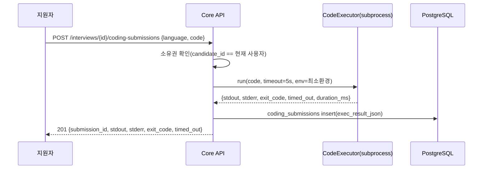

# 단위 TRD — U2-b: 라이브 코딩 (Python 샌드박스 실행)

> `harness/harness_01_trd_template.md` 형식. 상위 문서:
> `docs/trd/aimock_master_trd.md` §1(U2), §2(F-004). 관련 ADR:
> `docs/adr/adr-007-code-execution-sandbox.md`(⚠️ 보안 한계 반드시 읽을 것).

## 문서 정보
- 프로젝트: aimock
- 단위(화면/기능) 이름: U2-b — 라이브 코딩 테스트(Python 코드 실행)
- 작성일 / 버전: 2026-09-07 / v0.1
- 상태: 확정 (코드 착수, 사용자 자동진행 승인)

## §0. 범위 및 흐름 개요
- 역할: 지원자가 작성한 Python 코드를 실행하고 결과(stdout/stderr/
  실행시간/타임아웃 여부)를 반환·저장한다. **AI에 의한 코드 품질/정답
  여부 평가는 이 단위의 범위가 아니다** — `GEMINI_API_KEY` 확보 전이라
  U4(피드백 리포트) 단계에서 저장된 코드+실행결과를 한꺼번에 평가하는
  것으로 미룬다(자동진행 판단, 근거는 `자동진행/` 로그).
- 흐름:

- 의존하는 다른 단위: U1(인증)
- 의존받는 단위: U4(리포트 — 코드/실행결과를 평가 자료로 사용)

## §0-1. 비기능 요구사항 체크
- 동시성: 제출마다 독립된 서브프로세스이므로 동시 여러 제출도 서로
  간섭하지 않음(단, 서버 리소스 소모는 무제한 동시 제출 시 고려 필요 —
  MVP 범위에서 동시성 제한은 두지 않음, Won't).
- 권한: 본인 소유 interview에만 코드 제출 가능, 아니면 403.
- 감사: 제출된 코드와 실행결과 전부 `coding_submissions`에 영구 기록.
- 개인정보: 해당 없음(코드 자체는 개인정보 아님).
- 삭제 정책: interview 삭제 시 FK CASCADE로 함께 삭제(추가 정책 불필요).
- **보안(★필수)**: ADR-007 참조. 자식 프로세스에 앱 시크릿(DB
  URL/JWT/암호화키/LLM 키)이 전달되지 않아야 한다 — 이건 AC로 직접
  검증한다(AC-3).

## §1. 데이터 구조
`CODING_SUBMISSIONS`(ADR-003 §ERD, 이미 존재 — 컬럼 추가 없음).
`exec_result_json` 스키마: `{"stdout": str, "stderr": str, "exit_code":
int|null, "timed_out": bool, "duration_ms": int}`.

## §2. 함수/API 명세

| 엔드포인트 | 입력 | 출력 | 설명 |
|---|---|---|---|
| `POST /api/v1/interviews/{id}/coding-submissions` | Bearer, `{language, code}` | `201 {submission_id, stdout, stderr, exit_code, timed_out}` / `403` / `404` / `422`(language≠python) | 코드 실행+저장 |
| (내부) `CodeExecutor.run(code, timeout)` | 코드 문자열 | `ExecResult` | 어댑터 인터페이스(ADR-007) |

## §3. 워크플로우 및 비즈니스 로직
- `language`는 MVP에서 `"python"`만 허용(마스터 TRD F-004, JS는 Could —
  Won't 처리, 다른 값이면 422).
- 실행: 코드를 임시 `.py` 파일에 저장 → `subprocess.run([sys.executable,
  path], timeout=5, env={"PATH": ...}, capture_output=True)` → 결과를
  `ExecResult`로 구성 → `TimeoutExpired` 발생 시 `timed_out=True`,
  `exit_code=None`으로 처리.
- 실행 후 임시 파일 즉시 삭제.

## §4. 상태/에러 코드
| 코드 | 의미 | 발생 조건 |
|---|---|---|
| 403 | 소유권 없음 | 다른 사용자의 interview |
| 404 | 대상 없음 | 존재하지 않는 interview_id |
| 422 | 지원하지 않는 언어 | `language != "python"` |

## §5. 인수 조건 (Acceptance Criteria)
- [ ] AC-1: 정상 Python 코드(예: `print("hi")`)를 제출하면 201과 함께
  `stdout`에 `"hi"`가 포함되고 `exit_code=0`이 반환된다.
- [ ] AC-2: 무한루프 코드(`while True: pass`)를 제출하면 5초 내에
  `timed_out=true`로 응답이 오고 서버가 멈추지 않는다.
- [ ] AC-3: 코드가 `os.environ`을 출력하도록 제출해도 `DATABASE_URL`/
  `JWT_SECRET`/`MEDIA_ENCRYPTION_KEY`/`GEMINI_API_KEY` 값이 결과에
  포함되지 않는다(자식 프로세스 환경변수 격리 검증 — 보안 AC).
- [ ] AC-4: 실행 결과가 `coding_submissions` 테이블에 저장된다.
- [ ] AC-5: 다른 사용자의 interview에 코드를 제출하면 403을 반환한다.
- [ ] AC-6: `language="javascript"`로 제출하면 422를 반환한다.
- [ ] AC-7: 문법 오류가 있는 코드를 제출하면 `stderr`에 에러 메시지가
  담기고 `exit_code != 0`으로 응답한다(500이 아님).

## §6. 테스트 시나리오

| 시나리오 | 입력/조건 | 기대 결과 | 대응 AC |
|---|---|---|---|
| 정상 실행 | `print("hi")` | stdout에 "hi", exit_code=0 | AC-1 |
| 무한루프 | `while True: pass` | timed_out=true, 5초 내 응답 | AC-2 |
| 시크릿 유출 시도 | `import os; print(os.environ)` | 결과에 앱 시크릿 값 없음 | AC-3 |
| 저장 확인 | 정상 실행 후 DB 조회 | coding_submissions 레코드 존재 | AC-4 |
| 타인 소유 | 다른 사용자 interview_id | 403 | AC-5 |
| 미지원 언어 | `language="javascript"` | 422 | AC-6 |
| 문법 오류 | `def f(:` | stderr에 SyntaxError, exit_code!=0 | AC-7 |

## §7. 미결 항목
| 항목 | 권장 기본값 | 확정 필요 여부 |
|---|---|---|
| **공개 배포 전 샌드박스 재검토** | ADR-007의 subprocess 방식은 낯선 다중 사용자에게 공개하는 순간 재검토 필수(Piston API 등으로 교체) | **예 — 공개 배포 시점에 반드시 재확인**(지금은 본인 전용 데모라 보류) |
| AI의 정답여부/시간복잡도/스타일 평가(F-004 원안) | U4(리포트)에서 코드+실행결과를 종합 평가할 때 함께 처리 | 아니오(이번 단위 범위 밖으로 이미 확정, 자동진행) |
| Linux `resource` 모듈 기반 CPU/메모리 제한 | 로컬 Windows 개발 환경에서는 미적용, 실제 Linux 컨테이너 배포 시 추가 검토 | 아니오(MVP 범위 밖) |
