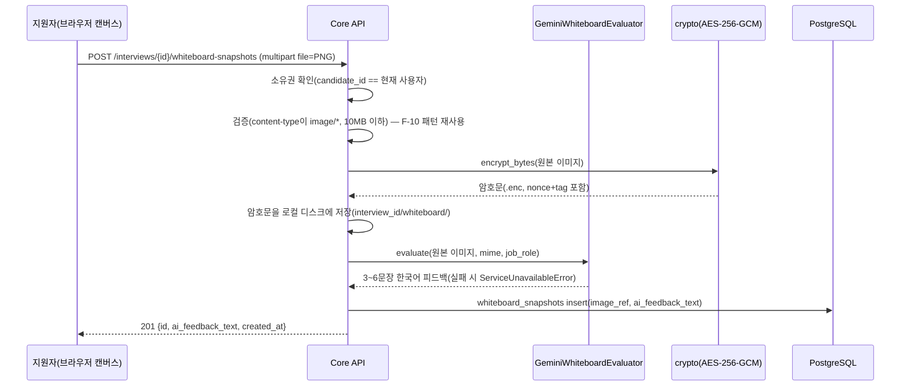

# 단위 TRD — U2-c: 시스템 설계 화이트보드 (Gemini Vision 평가)

> `harness/harness_01_trd_template.md` 형식. 상위 문서:
> `docs/trd/aimock_master_trd.md` §1(U2), §2(F-005). 관련 결정:
> `docs/release/release_plan.md`(Could-have, 4주차 여유 시간 항목),
> 2026-09-09 AskUserQuestion 응답("Gemini 재활성화" — 텍스트 대화 LLM은
> Groq로 전환됐지만 화이트보드는 독립 기능이라 사용자가 명시적으로
> Gemini Vision을 다시 선택).
>
> **문서화 시점에 대한 참고**: 이 TRD는 코드가 이미 구현·수동검증된
> 뒤인 2026-09-09에 작성됐다(하네스 원칙 3 "선행 확인" 기준으로는
> 순서가 어긋남 — 이전 세션이 이용량 소진으로 중단되며 TRD 작성
> 전에 CLAUDE.md 작업이력에도 반영되지 못한 상태로 남아있던 것을
> 발견해 소급 작성). 내용은 실제 코드(`src/backend/app/services/
> whiteboard_service.py` 등)를 그대로 반영한다(원칙 6 원본 우선).

## 문서 정보
- 프로젝트: aimock
- 단위(화면/기능) 이름: U2-c — 시스템 설계 화이트보드(캔버스 이미지 → Gemini Vision 평가)
- 작성일 / 버전: 2026-09-09 / v1.0(소급 작성, 구현 완료 상태 기준)
- 상태: 확정(Could-have, 구현·수동검증 완료 — 자동화 pytest도 통과)

## §0. 범위 및 흐름 개요
- 역할: 지원자가 화이트보드에 그린 시스템 설계 다이어그램(PNG 이미지)을
  업로드하면, Gemini Vision이 구성요소·데이터 흐름의 타당성/놓친 고려
  사항/개선 제안을 자연어로 평가해 즉시 반환한다. 프론트 캔버스 UI는
  `WhiteboardPage.tsx`가 담당(그리기 자체는 브라우저 `<canvas>`, 서버는
  PNG 스냅샷만 받음).
- 흐름:

- 의존하는 다른 단위: U1(인증), ADR-004(미디어 암호화 원칙 확장 적용)
- 의존받는 단위: 없음(U4 리포트에는 아직 통합 안 됨 — §7 미결 참조)

## §0-1. 비기능 요구사항 체크
- 동시성: 업로드마다 독립 요청, 별도 동시성 제어 불필요(MVP 범위).
- 권한: 본인 소유 interview에만 업로드/조회 가능, 아니면 403.
- 감사: 업로드된 이미지(암호화)와 AI 피드백 전부 `whiteboard_snapshots`에
  영구 기록.
- 개인정보: 화이트보드 이미지는 지원자가 그린 시스템 설계도라 얼굴 등
  생체정보 위험은 낮지만, ADR-004 원칙(지원자가 만든 시각 콘텐츠는
  암호화 보관)을 동일하게 적용한다.
- 삭제 정책: interview 삭제 시 FK CASCADE로 함께 삭제. 원본 오디오/영상과
  달리 화이트보드 이미지 단독 삭제 API는 이번 범위에 없음(§7 미결).
- **보안**: F-10 패턴 그대로 재사용 — content-type/크기 검증, 전역
  Content-Length 미들웨어(30MB)가 2차 방어로 작동.

## §1. 데이터 구조
`WHITEBOARD_SNAPSHOTS`(ADR-003 ERD에 이미 존재 — 컬럼 추가 없음, 최초
마이그레이션 `68f6341f989a`부터 테이블 자체는 있었으나 이번에 처음 실제
사용됨). 컬럼: `id`, `interview_id`(FK), `image_ref`(암호화 파일 경로),
`ai_feedback_text`, `created_at`.

## §2. 함수/API 명세

| 엔드포인트 | 입력 | 출력 | 설명 |
|---|---|---|---|
| `POST /api/v1/interviews/{id}/whiteboard-snapshots` | Bearer, multipart `file`(이미지) | `201 {id, ai_feedback_text, created_at}` / `403` / `404` / `415`(이미지 아님) / `413`(10MB 초과) / `503`(GEMINI_API_KEY 미설정 또는 Gemini 호출 실패) | 이미지 업로드+암호화 저장+Vision 평가 |
| `GET /api/v1/interviews/{id}/whiteboard-snapshots` | Bearer | `200 [{id, ai_feedback_text, created_at}, ...]`(시간순) / `403` | 스냅샷 목록 조회 |
| (내부) `WhiteboardEvaluator.evaluate(image_bytes, mime_type, job_role)` | 이미지+MIME+직무 | 피드백 문자열 | 어댑터 인터페이스(현재 구현체: `GeminiWhiteboardEvaluator`, `google-genai` Vision) |

## §3. 워크플로우 및 비즈니스 로직
- 검증 순서(F-10과 동일 원칙): 소유권 확인 → content-type/크기 검증 →
  암호화 저장 → AI 평가 → DB 기록. 검증 실패 시 AI 호출 자체를 하지
  않아 불필요한 Vision API 낭비를 막는다.
- 암호화: `app/core/crypto.py`의 AES-256-GCM(`encrypt_bytes`)을 그대로
  재사용 — 원본 오디오/영상과 동일한 방식, 매 저장마다 랜덤 96비트
  nonce.
- Gemini Vision 모델은 `gemini-flash-lite-latest`(텍스트 대화용
  `app/ai/llm.py`의 모델 별칭 표기와 동일 원칙). 시스템 프롬프트에
  "인구통계적 특징은 절대 평가에 반영하지 말 것"(공정성 원칙, N-004와
  동일 원칙 적용) 명시.
- Gemini 호출 실패(쿼터 소진 등)는 `ServiceUnavailableError`(503)로
  변환 — U2-a/U3-a의 기존 패턴과 동일(AC-8/N-001 참조).
- 텍스트 대화 LLM은 2026-09-08부터 Groq로 전환됐지만(ADR-002/ADR-008),
  화이트보드는 별도 기능이라 사용자가 명시적으로 Gemini Vision을
  유지하기로 결정 — 어댑터 패턴은 유지되므로 필요 시 `GroqVisionEvaluator`
  를 추가하기만 하면 전환 가능.

## §4. 상태/에러 코드
| 코드 | 의미 | 발생 조건 |
|---|---|---|
| 403 | 소유권 없음 | 다른 사용자의 interview |
| 404 | 대상 없음 | 존재하지 않는 interview_id |
| 415 | 지원하지 않는 파일 형식 | content-type이 `image/`로 시작하지 않음 |
| 413 | 파일 크기 초과 | 10MB 초과(`MAX_WHITEBOARD_FILE_BYTES`) |
| 503 | AI 평가 불가 | `GEMINI_API_KEY` 미설정 또는 Gemini API 호출 실패 |

## §5. 인수 조건 (Acceptance Criteria)
- [x] AC-1: 정상 이미지(PNG)를 업로드하면 201과 함께 비어있지 않은
  `ai_feedback_text`가 반환된다.
- [x] AC-2: 저장된 이미지 파일이 평문 PNG 바이트 그대로가 아니라
  암호화되어 저장된다(복호화 시 원본과 일치).
- [x] AC-3: 같은 면접에 2회 업로드하면 목록 조회 시 2건이 시간순으로
  반환된다.
- [x] AC-4: 다른 사용자의 interview에 업로드를 시도하면 403을 반환한다.
- [x] AC-5: 이미지가 아닌 파일(예: `text/plain`)을 업로드하면 415를
  반환한다.
- [x] AC-6: 10MB를 초과하는 파일을 업로드하면 413을 반환한다.

## §6. 테스트 시나리오

| 시나리오 | 입력/조건 | 기대 결과 | 대응 AC | 검증 방식 |
|---|---|---|---|---|
| 정상 업로드 | 1x1 PNG | 201, `ai_feedback_text` 존재 | AC-1 | pytest(Fake evaluator) + 실제 Docker+실제 Gemini API curl |
| 암호화 저장 확인 | 정상 업로드 후 저장 파일 직접 읽기 | 저장 바이트 ≠ 원본 PNG, `decrypt_bytes`로 복호화 시 원본과 일치 | AC-2 | pytest + 실제 컨테이너에서 `docker cp` 후 바이트 비교·복호화 재현 |
| 목록 순서 | 동일 면접에 2회 업로드 | GET 결과 2건, `created_at` 오름차순 | AC-3 | pytest + 실제 curl 2회 업로드 후 GET |
| 타인 소유 | 다른 사용자 interview_id로 업로드 | 403 | AC-4 | pytest + 실제 curl(2번째 계정) |
| 비이미지 업로드 | `notes.txt`(text/plain) | 415 | AC-5 | pytest + 실제 curl |
| 10MB 초과 | 11MB PNG | 413 | AC-6 | pytest + 실제 curl(11,534,344 bytes) |

## §7. 미결 항목
| 항목 | 권장 기본값 | 확정 필요 여부 |
|---|---|---|
| U4(피드백 리포트)에 화이트보드 평가 통합 여부 | 현재는 별도 화면/API로만 존재, 최종 리포트에는 포함 안 됨 | 아니오(Could-have 범위 밖, 필요 시 별도 요청으로 진행) |
| 화이트보드 이미지 단독 삭제 API | 원본 오디오/영상처럼 개별 삭제 API를 만들지, interview 삭제에만 연동할지 | **예 — 공개 배포 전 결정 필요**(개인정보 생애주기 정책 harness_10 대상, 하네스 원칙 8) |
| Gemini 무료 티어 쿼터 소진 시 대응 | 현재는 503 반환 후 재시도 안내만(텍스트 LLM처럼 Groq 폴백 없음) | 아니오(사용량이 낮은 Could-have 기능이라 별도 폴백 불필요 — 필요해지면 재검토) |
