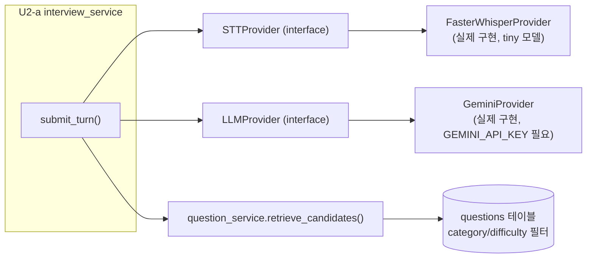

# 단위 TRD — U3-a: STT + LLM 오케스트레이션 파이프라인

> `harness/harness_01_trd_template.md` 형식. 상위 문서:
> `docs/trd/aimock_master_trd.md` §1(U3), §2(F-001). 관련 ADR:
> `docs/adr/adr-002-ai-pipeline-stack.md`. U2-a가 이 단위의 서비스를
> 직접 호출한다.

## 문서 정보
- 프로젝트: aimock
- 단위(화면/기능) 이름: U3-a — STT(faster-whisper)/LLM(Gemini) 어댑터 + RAG 질문 검색
- 작성일 / 버전: 2026-09-07 / v0.1
- 상태: 확정 (코드 착수)

## §0. 범위 및 흐름 개요
- 역할: (1) 오디오 바이트를 텍스트로 바꾸는 STT 어댑터, (2) 대화 이력을
  받아 다음 질문/평가신호를 구조화된 JSON으로 반환하는 LLM 어댑터,
  (3) 질문은행에서 후보 질문을 검색하는 RAG 조회 함수. 셋 다 U2-a의
  서비스 로직이 조립해서 쓴다.
- 어댑터 패턴 구조:

- 의존하는 다른 단위: 없음(순수 인프라 계층)
- 의존받는 단위: U2-a

## §0-1. 비기능 요구사항 체크
- 동시성: STT/LLM 호출은 매 턴 순차 처리(비동기 I/O로 서버 블로킹은
  없지만, 한 interview 안에서 턴 순서는 클라이언트가 순차 호출한다고
  가정).
- 권한: 해당 없음(내부 서비스 계층, API 권한은 U2-a에서 처리).
- 감사: LLM 원문 응답(파싱 전 raw JSON)은 저장하지 않음(MVP 범위 밖,
  필요 시 향후 `evaluation_reports.details_json`에 누적 검토).
- 개인정보: GEMINI_API_KEY는 `.env`로만 관리, 로그에 절대 출력하지 않음.
- 삭제 정책: 해당 없음.

## §1. 데이터 구조
`QUESTIONS`(ADR-003 §ERD) — 이 단위가 채우고 읽는 테이블. 초기 시드
데이터는 `src/backend/app/seed/questions_seed.py`로 관리(샘플 질문
10문항, 실제 채용 데이터 아님 — 원칙 7 개인정보 보호와는 무관하지만
저작권 이슈 없는 자체 작성 문항만 사용).

## §2. 함수/API 명세 (내부 서비스 — HTTP 엔드포인트 없음)

| 함수 | 입력 | 출력 | 설명 |
|---|---|---|---|
| `STTProvider.transcribe(audio_bytes)` | 오디오 바이트 | `str`(전사 텍스트) | 어댑터 인터페이스 |
| `FasterWhisperProvider.transcribe(...)` | 〃 | 〃 | faster-whisper `tiny` 모델 실제 구현 |
| `LLMProvider.generate_next_turn(context)` | `ConversationContext`(이력+루브릭+후보질문) | `LLMTurnResult{reply_text, action, evaluation}` | 어댑터 인터페이스 |
| `GeminiProvider.generate_next_turn(...)` | 〃 | 〃 | Gemini 실제 구현(`GEMINI_API_KEY` 필요) |
| `question_service.retrieve_candidates(category, difficulty, limit)` | 카테고리/난이도 | `list[Question]` | RAG 후보 검색(MVP: 필터, 임베딩 검색은 미결) |

## §3. 워크플로우 및 비즈니스 로직
- `LLMTurnResult`는 반드시 Pydantic으로 검증(원본 기획서 §5.1.2 구조화
  출력 원칙) — `action`은 `"ask_question"` 또는 `"end_interview"` 둘 중
  하나만 허용, 그 외 값이면 파싱 에러로 처리하고 안전하게
  `"ask_question"` + 안내문구로 폴백(방어적 처리, LLM이 스키마를 어겨도
  면접이 멈추지 않게 함).
- `retrieve_candidates`는 MVP에서 **임베딩 벡터 검색을 쓰지 않고**
  category/difficulty로 단순 필터링 후 무작위 1건을 반환한다 — 실제
  임베딩은 Gemini Embedding API 호출이 필요한데 API 키 확보 전이라
  구현은 해두고 기본 비활성(§7 미결 항목).
- `FasterWhisperProvider`는 앱 시작 시 모델을 한 번만 로드해 재사용
  (매 요청마다 로드하면 느림 — 실측 약 5초/1회 로드, 이후 재사용).

## §4. 상태/에러 코드
| 코드 | 의미 | 발생 조건 |
|---|---|---|
| (내부 예외) `LLMSchemaError` | LLM 응답이 스키마 불일치 | Gemini가 예상 못한 형식 반환 시 → 폴백 처리로 흡수, HTTP 에러로는 노출 안 함 |

## §5. 인수 조건 (Acceptance Criteria)
- [ ] AC-1: `LLMProvider`를 Fake 구현으로 교체해도 `interview_service`가
  동일하게 동작한다(의존성 주입/어댑터 패턴 검증 — 코드 구조 자체가 AC).
- [ ] AC-2: `FasterWhisperProvider.transcribe()`가 실제 오디오 바이트를
  받아 예외 없이 문자열을 반환한다(실제 `tiny` 모델로 수동 스모크 테스트
  — 의미 있는 음성 전사 정확도는 자동화 테스트 대상이 아님, 실제 음성
  샘플 확보 후 별도 수동 UAT로 검증. TRD §6에 "자동화 불가" 명시).
- [ ] AC-3: `retrieve_candidates(category="backend", difficulty=2)`를
  호출하면 시드 데이터 중 조건에 맞는 질문이 반환된다.
- [ ] AC-4: LLM이 스키마에 맞지 않는 JSON을 반환해도 서버가 500을 내지
  않고 안전한 폴백 질문으로 계속 진행한다.

## §6. 테스트 시나리오

| 시나리오 | 입력/조건 | 기대 결과 | 대응 AC |
|---|---|---|---|
| Fake LLM 주입 | `app.dependency_overrides`로 교체 | 정상 응답, 실제 Gemini 미호출 | AC-1 |
| 실제 STT 로드 | (수동) tiny 모델 + 무음/톤 오디오 | 예외 없이 문자열 반환 | AC-2 — **자동화 불가, 수동 확인** |
| RAG 필터 조회 | 시드 질문 중 category=backend | 해당 질문 반환 | AC-3 |
| 스키마 위반 응답 | Fake LLM이 `action="???"` 반환 | 폴백 문구로 처리, 예외 전파 안 됨 | AC-4 |

## §7. 미결 항목
| 항목 | 권장 기본값 | 확정 필요 여부 |
|---|---|---|
| GEMINI_API_KEY 미확보 상태의 실제 LLM 호출 | GeminiProvider는 구현하되 키 없으면 앱 기동 시 에러 없이 "키 필요" 예외를 호출 시점에만 발생시킴(지연 초기화) | 아니오(사용자가 키 발급 후 `.env`에 넣으면 즉시 동작) |
| 질문은행 임베딩 기반 벡터 검색 | 카테고리/난이도 필터로 대체(MVP) | 아니오(API 키 확보 후 재검토) |
| faster-whisper 모델 크기(tiny→small/base) | tiny(속도 우선) | 아니오(정확도 문제 발견 시 조정) |
