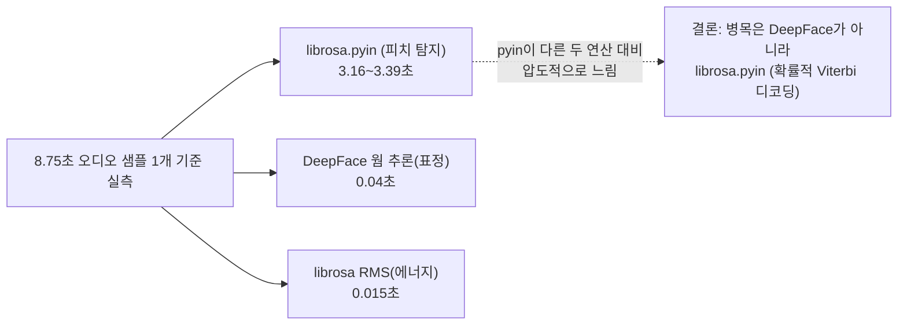

# 단위 TRD — U3-b: 표정/음성운율 분석

> `harness/harness_01_trd_template.md` 형식. 상위 문서:
> `docs/trd/aimock_master_trd.md` §1(U3), `docs/release/release_plan.md`
> (U3-b, Should — "리포트의 비언어적 지표"). 착수 전 확보 필요했던 실제
> 얼굴 영상/음성 샘플을 2026-09-08 사용자가 제공해 착수.

## 문서 정보
- 프로젝트: aimock
- 단위(화면/기능) 이름: U3-b — 표정 분석(DeepFace) + 음성운율 분석(librosa)
- 작성일 / 버전: 2026-09-08 / v0.1
- 상태: 확정 (사용자 제공 실제 샘플로 착수)

## §0. 범위 및 흐름 개요
- 역할: 면접 중 캡처된 얼굴 프레임(이미지)과 답변 오디오에서 **비언어적
  지표**를 추출해 U4 리포트의 `emotion_timeline`(현재 항상 빈 배열)을
  채운다. 채점 자체(점수/합격추천)는 U4가 이미 담당 — 이 단위는 U4가
  쓸 원재료(감정/운율 지표)만 만든다.
- 의존 라이브러리(ADR-002/마스터 TRD 아키텍처에 이미 명시된 선택):
  DeepFace(표정), librosa(음성 피치/에너지 등 운율 특징).
- **이번 착수분의 명시적 범위 축소(자동진행 판단, 근거는 자동진행 로그)**:
  프론트엔드에서 면접 중 실시간으로 웹캠 프레임을 캡처해 업로드하는
  UI/파이프라인은 **이번에 만들지 않는다**. 사용자가 준 건 "됐다"는 걸
  확인할 독립 샘플 파일 1개(얼굴 영상)+1개(음성)뿐이고, 실제 면접 흐름에
  실시간 캡처를 붙이는 건 별도 규모의 프론트엔드 작업이라 범위를 분리함.
  → 이번 단위는 **분석 어댑터(EmotionAnalyzer/ProsodyAnalyzer)를 만들고
  실제 샘플로 동작을 검증**하는 데까지, 그리고 **기존 업로드 API로 올라온
  `kind="video_frame"` 미디어가 있으면 리포트 생성 시 분석해 반영**하는
  배선까지로 한정한다(라이브 캡처 UI는 후속 과제로 명시).
- 의존하는 다른 단위: U1-b(미디어 저장, video_frame kind 이미 스키마에
  존재), U4(리포트 생성 — emotion_timeline 필드 이미 존재).

## §0-1. 비기능 요구사항 체크
- 개인정보: 얼굴/음성은 생체 데이터 — U1-b의 암호화 저장·삭제 정책을
  그대로 따른다(별도 저장소 안 만듦, 새 저장 경로 추가 없음).
- 성능: DeepFace 모델 로딩은 무겁다(첫 호출 시 수 초) — 지연 로딩 +
  프로세스 재사용으로 완화, 요청마다 재로딩하지 않는다.
- 실패 격리: 표정/음성 분석이 실패해도(모델 다운로드 실패, 얼굴 미검출
  등) 리포트 생성 전체가 죽지 않고 `emotion_timeline`을 빈 배열로 폴백
  한다(U3-a의 LLM 스키마 불일치 폴백과 동일한 패턴).

## §1. 데이터 구조
새 테이블 없음. 기존 `MediaAsset`(kind="video_frame")을 그대로 사용하고,
분석 결과는 `EvaluationReport.details_json.emotion_timeline`(기존 필드,
지금까지 항상 `[]`)에 아래 스키마의 배열로 채운다:
```json
{"turn_index": 0, "dominant_emotion": "neutral", "confidence": 0.82}
```
음성 운율은 `details_json.voice_prosody`(신규 필드)에
`{"turn_index": 0, "pitch_mean_hz": 180.4, "energy_mean": 0.03, "speaking_rate_hint": "normal"}`
형태로 추가한다.

## §2. 함수/API 명세
- 새 공개 API 엔드포인트 없음(기존 리포트 생성/조회 API가 결과를 그대로
  포함해 반환).
- 내부 어댑터:
  - `app/ai/emotion.py`: `EmotionAnalyzer`(ABC) / `DeepFaceEmotionAnalyzer`
    (실제 구현) / `FakeEmotionAnalyzer`(테스트용).
  - `app/ai/prosody.py`: `ProsodyAnalyzer`(ABC) / `LibrosaProsodyAnalyzer`
    (실제 구현) / `FakeProsodyAnalyzer`(테스트용).

## §3. 워크플로우 및 비즈니스 로직
- 리포트 생성(`report_service.generate_report`) 시, 해당 인터뷰의
  `MediaAsset`을 조회해 `kind="video_frame"`은 EmotionAnalyzer로,
  `kind="audio"`는 ProsodyAnalyzer로 각각 분석 → 결과를 `ReportContext`에
  추가해 `details_json`에 반영.
- 미디어가 하나도 없으면(현재 실제 운영 상태 — 라이브 캡처 미구현이므로
  당분간 항상 이 경우) 조용히 빈 배열/필드 생략으로 처리, 에러 아님.

## §3-1. 성능 최적화 — `librosa.pyin` 병목 (2026-09-08 추가)

**계기**: u4 리포트 비동기화(§0-2, `aimock_u4_trd.md`) 배포 후에도 사용자가
운영 환경에서 리포트 생성이 "1분 이상" 걸린다고 재보고. 비동기화 전에는
이게 "화면이 멈추는" 문제였지만, 비동기화 후에도 **실제 연산 자체**가
오래 걸리는 것으로 재확인됨 — 추측하지 않고 로컬에서 각 단계를 직접
벤치마크했다:



**조치**: `pyin` 자체를 다른 알고리즘으로 바꾸지 않고(정확도 유지),
계산량만 줄였다 — (1) 분석 전 오디오를 8kHz로 다운샘플(사람 음성
피치는 나이퀴스트 4kHz로 충분히 표현됨), (2) 피치 탐색 상한을
C7(~2093Hz, 오페라 소프라노 수준)에서 C6(~1047Hz, 실제 사람 음성 범위를
넉넉히 덮음)로 축소. 실측 결과 **3.16~3.39초 → 0.69초(약 4.7배)**,
평균 피치 결과값 오차는 205.28Hz→209.82Hz(약 2%, 무시 가능) — 정확도
손실 없이 속도만 개선.

**부수 발견 — 로깅이 처음부터 전부 무음이었음**: 위 벤치마크와 별개로,
운영 환경에서 정확히 어느 단계가 느린지 로그로 확인하려고
`report_service`에 단계별 소요시간 로그(`logger.info(...)`)를 추가했는데,
Docker 컨테이너에서 직접 확인해보니 **전혀 출력되지 않았다.** 원인은
이 프로젝트 전체에 로깅 레벨/핸들러가 한 번도 명시적으로 설정된 적이
없어서(`app/main.py`) 파이썬 기본 유효 레벨(WARNING)에 걸러졌던 것 —
`logger.warning(...)` 호출들만 우연히 보였던 이유는 레벨 미달 로그가
버려질 때 쓰이는 파이썬 내장 최후 폴백(`logging.lastResort`, WARNING
이상만 처리)에 얹혀서였다. `app/main.py`에 `"aimock"` 네임스페이스
로거에 레벨(INFO)+핸들러를 직접 붙여 해결 — 앞으로는 운영 로그에서
`표정 분석 완료(...)`/`음성 운율 분석 완료(...)`/`리포트 LLM 요약
완료(...)`/`리포트 생성 전체 완료(...)` 단계별 소요시간이 실제로
보인다(내부테스트결과서에서 로컬 Docker로 실측 확인 완료). 이 패턴은
일반화해 `harness/harness_06_meta_improvement.md` §3에도 등록.

## §4. 상태/에러 코드
- 분석기 초기화 실패(모델 다운로드 실패 등)는 요청을 실패시키지 않고
  로그만 남기고 빈 결과로 폴백(§0-1).

## §5. 인수 조건 (Acceptance Criteria)
- [ ] AC-1: 실제 얼굴이 나오는 샘플 영상 프레임을 `DeepFaceEmotionAnalyzer`
  에 넣으면 예외 없이 `dominant_emotion`(문자열)과 `confidence`(0~1)를
  반환한다.
- [ ] AC-2: 실제 음성 샘플을 `LibrosaProsodyAnalyzer`에 넣으면 예외 없이
  `pitch_mean_hz`(양수), `energy_mean`을 반환한다.
- [ ] AC-3: 얼굴이 검출되지 않는 이미지(예: 빈 화면)를 넣어도 예외 없이
  안전한 폴백값(`dominant_emotion="unknown"`)을 반환한다.
- [ ] AC-4: `video_frame`/`audio` 미디어가 전혀 없는 인터뷰의 리포트를
  생성해도 기존 U4 AC(1~8)가 전부 그대로 pass한다(회귀 없음).
- [ ] AC-5: `video_frame` 미디어가 있는 인터뷰의 리포트를 생성하면
  `details_json.emotion_timeline`이 빈 배열이 아니다.
- [ ] AC-6(2026-09-08 추가, §3-1): `LibrosaProsodyAnalyzer.analyze()`가
  5초 분량 유성음 합성 오디오를 3초 이내에 처리하고, 피치 탐지 결과가
  실제 주입한 주파수 근처(오차 범위 내)로 나온다 — 향후 실수로 다운샘플/
  탐색범위 최적화가 되돌아가는 회귀를 자동으로 잡기 위함.

## §6. 테스트 시나리오
- AC-1/AC-2는 **실제 사용자 제공 샘플**(음성 m4a, 얼굴 mp4)로 수동
  검증(1회성 스크립트) — 개인 생체정보라 pytest 픽스처로 저장소에
  커밋하지 않음(`.gitignore` 대상 로컬 경로만 사용).
- AC-3/AC-4/AC-5는 합성 데이터(단색 이미지, 무음 오디오)로 자동화 pytest.
- AC-6은 합성 톤(사인파)으로 자동화 pytest —
  `test_prosody_analysis_completes_quickly_and_finds_reasonable_pitch`.

## §7. 미결 항목
| 항목 | 권장 기본값 | 확정 필요 여부 |
|---|---|---|
| 실시간 웹캠 프레임 캡처 UI(프론트엔드) | 이번 단위 범위 밖, 후속 과제 | 예 — 사람이 착수 여부 결정 |
| DeepFace 감정 카테고리를 리포트 요약(LLM)에 자동 반영할지 | 이번엔 안 함(원재료만 노출) | 아니오(기본값 적용) |
