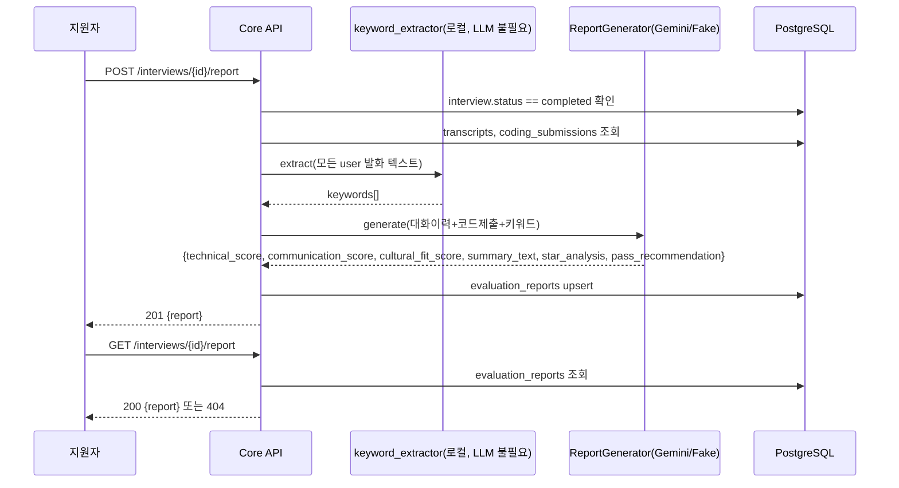
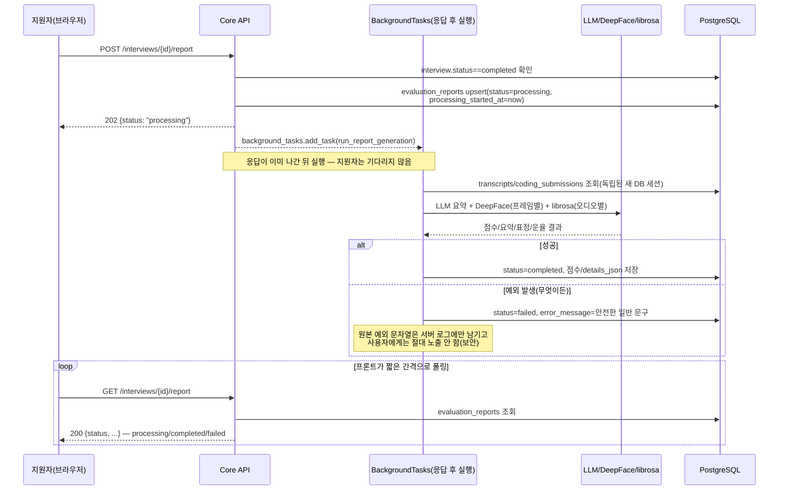
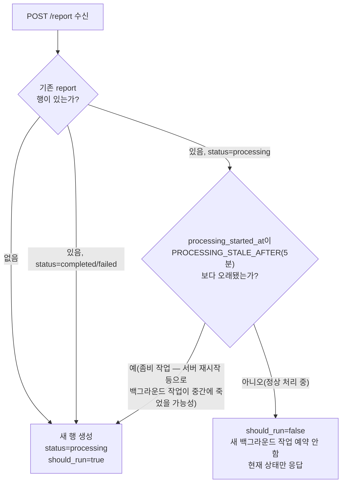

# 단위 TRD — U4: 피드백 리포트 생성/조회

> `harness/harness_01_trd_template.md` 형식. 상위 문서:
> `docs/trd/aimock_master_trd.md` §1(U4), §2(F-006/F-007). AI 자동 선정
> 근거는 `자동진행/U2b샌드박스및작업범위자동결정_20260907213841.md` §다음단위.

## 문서 정보
- 프로젝트: aimock
- 단위(화면/기능) 이름: U4 — 면접 종료 후 피드백 리포트 생성/조회
- 작성일 / 버전: 2026-09-07 / v0.1
- 상태: 확정 (코드 착수, 사용자 자동진행 승인)

## §0. 범위 및 흐름 개요
- 역할: `completed` 상태 interview의 transcripts(+coding_submissions)를
  종합해 STAR 분석/핵심 키워드/역량 점수/합격추천을 담은
  `evaluation_reports` 레코드를 생성하고, 지원자가 조회한다.
- **표정/음성 타임라인(F-006 원안) 은 이번 단위 범위 밖** — U3-b가
  `emotion_samples`를 채워야 의미가 생기는데 U3-b는 실제 얼굴 이미지
  샘플이 없어 아직 미착수다. 리포트는 `emotion_samples`가 비어있으면
  해당 섹션을 빈 배열로 두고 정상 동작한다(자동진행 판단).
- 핵심 키워드는 LLM 없이 **로컬 단어 빈도 분석**으로 추출(간단하지만
  LLM 가용성과 무관하게 항상 동작 — 자동진행 판단).
- STAR 분석/역량 점수/합격추천은 U2-a/U3-a와 동일한 어댑터 패턴
  (`ReportGenerator`)으로 구현 — 실제 Gemini 또는 테스트용 Fake.
- 흐름:

- 의존하는 다른 단위: U2-a(transcripts), U2-b(coding_submissions)
- 의존받는 단위: U5(대시보드 — 채용담당자가 이 리포트를 열람)

## §0-2. 리포트 생성 비동기화 (2026-09-08 추가)

**계기**: 운영 환경(Render)에서 사용자가 "피드백 리포트 생성이 1분 이상
걸린다"를 실제로 보고. 원인은 위 §0 흐름도가 `POST /report` 한 번의
HTTP 요청 안에서 LLM 호출 + 턴마다 저장된 `video_frame` 전부를 DeepFace로,
`audio` 전부를 librosa로 순차 분석하고 있던 것 — 애초에 마스터 TRD의
아키텍처 다이어그램에는 "표정/음성운율 분석은 BackgroundTasks로 비동기
처리"라고 이미 명시돼 있었는데, 실제 U4 구현 시 이 부분이 누락되고 전부
동기로 짜여 있었다(원본 우선 원칙 재확인 중 발견 — 새 요구사항이 아니라
원래 설계를 실제로 구현하는 것).

**변경된 흐름**: `POST /report`는 무거운 작업을 시작만 시키고 즉시
`202 Accepted`로 응답한다. 실제 분석은 FastAPI `BackgroundTasks`가 응답
전송 후 처리하고, 클라이언트는 `GET /report`를 폴링해 완료를 확인한다.

**중복 실행 방지 + 좀비 작업 복구**:

- **동시 요청 경합**: 두 요청이 동시에 "행 없음"을 보고 둘 다 insert를
  시도하면 `interview_id` UNIQUE 제약 위반(`IntegrityError`)이 나는데,
  이 경우 롤백 후 방금 다른 요청이 만든 행을 다시 읽어 같은 로직(중복
  실행 방지)을 그대로 적용한다(`report_service.start_report_generation`).
- **세션 분리 필수**: 백그라운드 작업은 요청 처리 세션(`get_db` 의존성)이
  아니라 **독립적인 새 `AsyncSessionLocal()` 세션**을 직접 연다 — 요청
  세션은 응답이 나갈 때 이미 닫히므로 재사용하면 버그(FastAPI
  BackgroundTasks의 잘 알려진 함정).
- **실패 메시지 보안**: 프로젝트 자체 예외(`AppError`, 예: LLM API 키
  미설정)는 이미 사용자에게 노출해도 안전한 메시지를 담고 있어 그대로
  사용하지만, 그 외 예상 못 한 예외는 절대 `str(exc)`를 그대로 노출하지
  않고 고정된 일반 문구(`GENERIC_FAILURE_MESSAGE`)로 대체한다 — 원본
  예외는 서버 로그(`logger.exception`)에만 남긴다.

## §0-1. 비기능 요구사항 체크
- 동시성: 재생성 시 기존 레코드를 덮어씀(upsert) — 동시에 두 번 생성
  요청이 오면 마지막 커밋이 이김(MVP 범위에서 락 없음, Won't).
- 권한: 본인 소유 interview만 생성/조회 가능, 아니면 403.
- 감사: 리포트는 `evaluation_reports.created_at`으로 생성 시각만 기록.
- 개인정보: 해당 없음(면접 답변 자체는 이미 저장돼 있음, 신규 개인정보
  없음).
- 삭제 정책: interview 삭제 시 FK CASCADE로 함께 삭제.

## §1. 데이터 구조
`EVALUATION_REPORTS`(ADR-003 §ERD 기반). `details_json`에
`{"star_analysis": str, "keywords": [str], "pass_recommendation": bool,
"emotion_timeline": [], "voice_prosody": []}` 저장.

**(2026-09-08 추가, 마이그레이션 `a1c3e7f2b904`)** 비동기 생성 상태 추적용
컬럼 3개: `status`(NOT NULL, "processing"/"completed"/"failed"),
`error_message`(nullable, 실패 시 사용자 노출용 안전한 문구),
`processing_started_at`(nullable, 좀비 작업 판정용). 기존에 이미 생성된
행은 마이그레이션이 `status='completed'`로 백필.

## §2. 함수/API 명세

| 엔드포인트 | 입력 | 출력 | 설명 |
|---|---|---|---|
| `POST /api/v1/interviews/{id}/report` | Bearer | `202 {report, status="processing"}` / `403` / `404` / `409`(live 상태) | **(2026-09-08 변경)** 리포트 생성을 시작만 시키고 즉시 반환(§0-2). 이미 처리 중이면 새로 시작하지 않고 현재 상태만 반환. **더 이상 이 요청에서 503이 나지 않음** — LLM 미가용 등 생성 실패는 백그라운드에서 감지돼 `status=failed`로 남고, 다음 GET에서 확인됨 |
| `GET /api/v1/interviews/{id}/report` | Bearer | `200 {report}`(`status`: processing/completed/failed) / `403` / `404`(미생성) | 리포트 조회 — 폴링으로 진행 상황 확인 |
| (내부) `keyword_extractor.extract(texts)` | 텍스트 목록 | `list[str]` | 로컬 빈도 기반, LLM 불필요 |
| (내부) `ReportGenerator.generate(context)` | 대화이력+코드 | `ReportResult` | 어댑터(Gemini/Fake) |

## §3. 워크플로우 및 비즈니스 로직
- `status != "completed"`인 interview에 리포트 생성 요청 시 409.
- 키워드 추출: 지원자(`speaker="user"`) 발화만 모아 한국어 조사/불용어를
  간단히 제거한 뒤 빈도 상위 N개(기본 5개) 추출 — 형태소 분석기 없이
  공백 기준 토큰화(MVP 수준, 정확도 낮음을 §7에 명시).
- `ReportGenerator.generate()`가 `LLMTurnResult`와 마찬가지로 스키마
  검증 실패 시 안전한 폴백(중립 점수 3점 + "평가 생성 실패, 수동 검토
  필요" 요약)으로 처리 — U3-a AC-4와 동일한 방어적 파싱 원칙 재사용.
- **(2026-09-08 변경)** Gemini/Groq 자체가 미가용(API 키 없음)이거나
  백그라운드 작업 중 어떤 예외가 나도, 더 이상 HTTP 요청이 503을 받지
  않는다(§0-2) — 이미 작업이 백그라운드로 넘어간 뒤라 그 요청은 202로
  끝났기 때문. 대신 `evaluation_reports.status`가 `failed`로 남고,
  `error_message`에 안전한 문구가 채워지며, 다음 `GET`에서 확인된다.

## §4. 상태/에러 코드
| 코드 | 의미 | 발생 조건 |
|---|---|---|
| 403 | 소유권 없음 | 다른 사용자의 interview |
| 404 | 대상 없음(생성) / 리포트 없음(조회) | interview_id 없음 또는 조회 시 리포트 미생성 |
| 409 | 상태 미충족 | `status != "completed"`인 interview에 생성 요청 |

`POST`가 이제 항상 `202`만 반환하므로(§0-2), AI 서비스 미가용은 더 이상
HTTP 에러 코드가 아니라 **리포트 자체의 `status="failed"` +
`error_message`**로 표현된다 — 아래 §5 AC-10 참조.

## §5. 인수 조건 (Acceptance Criteria)
- [ ] AC-1: `live` 상태 interview에 리포트 생성 요청 시 409를 반환한다.
- [ ] AC-2: `completed` 상태 interview에 생성 요청하면 백그라운드 작업이
  완료된 뒤 GET으로 점수/요약이 채워진 리포트(`status=completed`)를
  확인할 수 있고, `evaluation_reports`에 저장된다(Fake Generator로 검증).
- [ ] AC-3: 같은 interview에 리포트를 다시 생성하면 기존 레코드가
  덮어써진다(레코드가 2개로 늘지 않음).
- [ ] AC-4: 리포트를 생성하지 않은 interview를 GET하면 404를 반환한다.
- [ ] AC-5: 생성된 리포트를 GET하면 저장된 내용이 그대로 반환된다.
- [ ] AC-6: 다른 사용자의 interview 리포트를 생성/조회하려 하면 403을
  반환한다.
- [ ] AC-7: `GEMINI_API_KEY`가 없으면 `GeminiReportGenerator._get_client()`
  호출 시 `ServiceUnavailableError`가 발생한다(어댑터 단위 검증 — U2-a
  AC-8과 동일 패턴. HTTP 계층에서는 AC-10으로 대체 검증).
- [ ] AC-8: 지원자 발화에 특정 단어가 반복되면 `keywords`에 그 단어가
  포함된다(LLM 없이 로컬 빈도 분석만으로 동작 — Gemini 가용 여부와
  무관하게 항상 성립해야 함).
- [ ] AC-9(2026-09-08 추가): `POST /report`의 응답은 항상 즉시(무거운
  분석을 기다리지 않고) `202` + `status="processing"` + 점수 `null`을
  반환한다.
- [ ] AC-10(2026-09-08 추가): 백그라운드 작업 중 예외가 발생하면
  `status="failed"`로 저장되고, `error_message`에는 원본 예외 문자열이
  아니라 고정된 안전한 일반 문구만 담긴다(내부 정보 유출 방지).
- [ ] AC-11(2026-09-08 추가): 이미 `processing` 중인 리포트에 다시 생성
  요청이 오면(예: 중복 클릭) 새 백그라운드 작업을 예약하지 않는다
  (`start_report_generation`의 `should_run=False`).
- [ ] AC-12(2026-09-08 추가): `processing` 상태가
  `PROCESSING_STALE_AFTER`(5분)보다 오래 지속되면(서버 재시작 등으로
  백그라운드 작업이 죽은 것으로 간주) 재시도를 허용한다
  (`should_run=True`).

## §6. 테스트 시나리오

| 시나리오 | 입력/조건 | 기대 결과 | 대응 AC |
|---|---|---|---|
| live 상태 생성 시도 | status=live | 409 | AC-1 |
| 정상 생성 | status=completed, Fake Generator, POST 후 GET | POST는 202+processing, 이어진 GET은 200+completed+점수 저장 | AC-2 |
| 재생성 | 같은 interview에 2번 생성(각각 POST+GET) | 레코드 1개만 유지, 내용 갱신 | AC-3 |
| 미생성 조회 | 생성 전 GET | 404 | AC-4 |
| 정상 조회 | 생성 후 GET | 200, 내용 일치 | AC-5 |
| 타인 소유 | 다른 사용자 interview_id | 403 | AC-6 |
| POST 즉시 응답 | POST 직후(백그라운드 대기 없이) 응답 바디 확인 | 202, status=processing, technical_score=null | AC-9 |
| 백그라운드 실패 | Fake Generator가 예외 발생 | GET에서 status=failed, error_message는 고정 일반 문구(원본 예외 텍스트 미노출) | AC-10 |
| 중복 시작 방지 | `start_report_generation`을 processing 상태에 재호출(서비스 함수 직접 테스트) | should_run=False | AC-11 |
| 좀비 작업 복구 | processing_started_at을 5분+1분 전으로 조작 후 재호출 | should_run=True, 시각 갱신됨 | AC-12 |
| 키 미설정(어댑터 단위) | GEMINI_API_KEY 없음 상태로 `GeminiReportGenerator._get_client()` 직접 호출 | `ServiceUnavailableError` | AC-7 |
| 키워드 추출 | "MSA MSA MSA 트랜잭션" 반복 발화 | keywords에 "MSA" 포함 | AC-8 |

## §7. 미결 항목
| 항목 | 권장 기본값 | 확정 필요 여부 |
|---|---|---|
| 표정/음성 타임라인 | U3-b 미착수이므로 빈 배열 | 아니오(U3-b 착수 시 자연히 채워짐) |
| 키워드 추출 정확도(형태소 분석기 미사용) | 공백 토큰화 + 불용어 제거(간이) | 아니오(MVP 기본값, 필요 시 `konlpy` 등으로 고도화 검토) |
| ~~재생성 동시성(락 없음)~~ | **[2026-09-08 해소]** §0-2로 대체 — `should_run` 플래그(AC-11) + UNIQUE 제약 + `IntegrityError` 복구로 동시 요청도 안전하게 처리 | 해소됨 |
| 동시 요청 경합(`IntegrityError` 복구 분기)의 실제 경합 재현 테스트 | 코드 리뷰로 정당성 확인 — 진짜 DB 레벨 경쟁을 결정론적으로 재현하는 테스트는 실익 대비 복잡도가 높아 생략(§6에 자동화 테스트 없음, `내부테스트결과서`에 근거 기록) | 아니오(운영 중 실제 발생 시 로그로 관찰 가능) |
