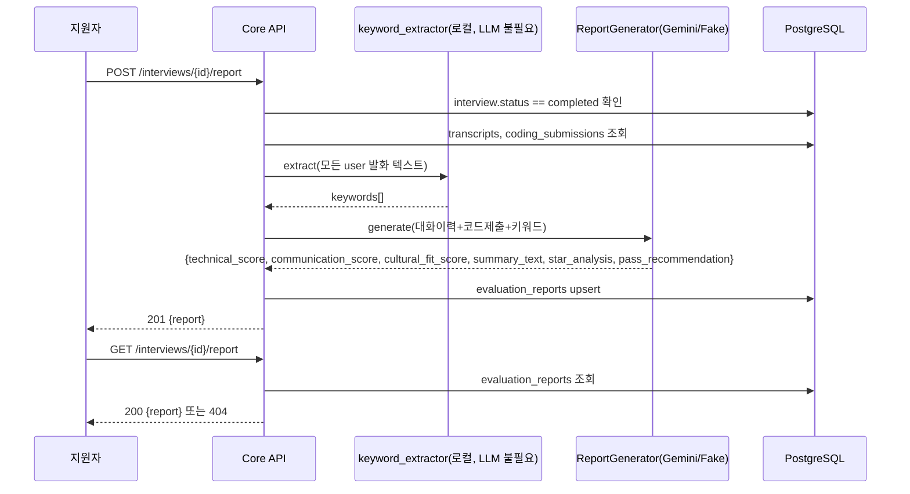

# 단위 TRD — U4: 피드백 리포트 생성/조회

> `harness/harness_01_trd_template.md` 형식. 상위 문서:
> `docs/trd/aimock_master_trd.md` §1(U4), §2(F-006/F-007). AI 자동 선정
> 근거는 `자동진행/U2b샌드박스및작업범위자동결정_20260907213841.md` §다음단위.

## 문서 정보
- 프로젝트: aimock
- 단위(화면/기능) 이름: U4 — 면접 종료 후 피드백 리포트 생성/조회
- 작성일 / 버전: 2026-09-07 / v0.1
- 상태: 확정 (코드 착수, 사용자 자동진행 승인)

## §0. 범위 및 흐름 개요
- 역할: `completed` 상태 interview의 transcripts(+coding_submissions)를
  종합해 STAR 분석/핵심 키워드/역량 점수/합격추천을 담은
  `evaluation_reports` 레코드를 생성하고, 지원자가 조회한다.
- **표정/음성 타임라인(F-006 원안) 은 이번 단위 범위 밖** — U3-b가
  `emotion_samples`를 채워야 의미가 생기는데 U3-b는 실제 얼굴 이미지
  샘플이 없어 아직 미착수다. 리포트는 `emotion_samples`가 비어있으면
  해당 섹션을 빈 배열로 두고 정상 동작한다(자동진행 판단).
- 핵심 키워드는 LLM 없이 **로컬 단어 빈도 분석**으로 추출(간단하지만
  LLM 가용성과 무관하게 항상 동작 — 자동진행 판단).
- STAR 분석/역량 점수/합격추천은 U2-a/U3-a와 동일한 어댑터 패턴
  (`ReportGenerator`)으로 구현 — 실제 Gemini 또는 테스트용 Fake.
- 흐름:

- 의존하는 다른 단위: U2-a(transcripts), U2-b(coding_submissions)
- 의존받는 단위: U5(대시보드 — 채용담당자가 이 리포트를 열람)

## §0-1. 비기능 요구사항 체크
- 동시성: 재생성 시 기존 레코드를 덮어씀(upsert) — 동시에 두 번 생성
  요청이 오면 마지막 커밋이 이김(MVP 범위에서 락 없음, Won't).
- 권한: 본인 소유 interview만 생성/조회 가능, 아니면 403.
- 감사: 리포트는 `evaluation_reports.created_at`으로 생성 시각만 기록.
- 개인정보: 해당 없음(면접 답변 자체는 이미 저장돼 있음, 신규 개인정보
  없음).
- 삭제 정책: interview 삭제 시 FK CASCADE로 함께 삭제.

## §1. 데이터 구조
`EVALUATION_REPORTS`(ADR-003 §ERD, 컬럼 추가 없음). `details_json`에
`{"star_analysis": str, "keywords": [str], "pass_recommendation": bool,
"emotion_timeline": []}` 저장.

## §2. 함수/API 명세

| 엔드포인트 | 입력 | 출력 | 설명 |
|---|---|---|---|
| `POST /api/v1/interviews/{id}/report` | Bearer | `201 {report}` / `403` / `404` / `409`(live 상태) / `503`(LLM 미가용) | 리포트 생성(재생성 시 덮어씀) |
| `GET /api/v1/interviews/{id}/report` | Bearer | `200 {report}` / `403` / `404`(미생성) | 리포트 조회 |
| (내부) `keyword_extractor.extract(texts)` | 텍스트 목록 | `list[str]` | 로컬 빈도 기반, LLM 불필요 |
| (내부) `ReportGenerator.generate(context)` | 대화이력+코드 | `ReportResult` | 어댑터(Gemini/Fake) |

## §3. 워크플로우 및 비즈니스 로직
- `status != "completed"`인 interview에 리포트 생성 요청 시 409.
- 키워드 추출: 지원자(`speaker="user"`) 발화만 모아 한국어 조사/불용어를
  간단히 제거한 뒤 빈도 상위 N개(기본 5개) 추출 — 형태소 분석기 없이
  공백 기준 토큰화(MVP 수준, 정확도 낮음을 §7에 명시).
- `ReportGenerator.generate()`가 `LLMTurnResult`와 마찬가지로 스키마
  검증 실패 시 안전한 폴백(중립 점수 3점 + "평가 생성 실패, 수동 검토
  필요" 요약)으로 처리 — U3-a AC-4와 동일한 방어적 파싱 원칙 재사용.
- Gemini 자체가 미가용(`GEMINI_API_KEY` 없음)이면 U2-a AC-8과 동일하게
  503(`ServiceUnavailableError`) 반환 — 에러 코드/처리 방식의 일관성
  유지(전역 기술 컨벤션 관점).

## §4. 상태/에러 코드
| 코드 | 의미 | 발생 조건 |
|---|---|---|
| 403 | 소유권 없음 | 다른 사용자의 interview |
| 404 | 대상 없음(생성) / 리포트 없음(조회) | interview_id 없음 또는 조회 시 리포트 미생성 |
| 409 | 상태 미충족 | `status != "completed"`인 interview에 생성 요청 |
| 503 | AI 서비스 준비 안 됨 | `GEMINI_API_KEY` 미설정 상태로 생성 요청 |

## §5. 인수 조건 (Acceptance Criteria)
- [ ] AC-1: `live` 상태 interview에 리포트 생성 요청 시 409를 반환한다.
- [ ] AC-2: `completed` 상태 interview에 생성 요청하면 201과 함께
  점수/요약이 채워진 리포트가 반환되고 `evaluation_reports`에 저장된다
  (Fake Generator로 검증).
- [ ] AC-3: 같은 interview에 리포트를 다시 생성하면 기존 레코드가
  덮어써진다(레코드가 2개로 늘지 않음).
- [ ] AC-4: 리포트를 생성하지 않은 interview를 GET하면 404를 반환한다.
- [ ] AC-5: 생성된 리포트를 GET하면 저장된 내용이 그대로 반환된다.
- [ ] AC-6: 다른 사용자의 interview 리포트를 생성/조회하려 하면 403을
  반환한다.
- [ ] AC-7: `GEMINI_API_KEY`가 없으면 리포트 생성 요청은 503을 반환한다
  (U2-a AC-8과 동일 패턴).
- [ ] AC-8: 지원자 발화에 특정 단어가 반복되면 `keywords`에 그 단어가
  포함된다(LLM 없이 로컬 빈도 분석만으로 동작 — Gemini 가용 여부와
  무관하게 항상 성립해야 함).

## §6. 테스트 시나리오

| 시나리오 | 입력/조건 | 기대 결과 | 대응 AC |
|---|---|---|---|
| live 상태 생성 시도 | status=live | 409 | AC-1 |
| 정상 생성 | status=completed, Fake Generator | 201, 리포트 저장 | AC-2 |
| 재생성 | 같은 interview에 2번 생성 | 레코드 1개만 유지, 내용 갱신 | AC-3 |
| 미생성 조회 | 생성 전 GET | 404 | AC-4 |
| 정상 조회 | 생성 후 GET | 200, 내용 일치 | AC-5 |
| 타인 소유 | 다른 사용자 interview_id | 403 | AC-6 |
| 키 미설정 | GEMINI_API_KEY 없음 상태로 실제 GeminiReportGenerator 호출 | 503 | AC-7 |
| 키워드 추출 | "MSA MSA MSA 트랜잭션" 반복 발화 | keywords에 "MSA" 포함 | AC-8 |

## §7. 미결 항목
| 항목 | 권장 기본값 | 확정 필요 여부 |
|---|---|---|
| 표정/음성 타임라인 | U3-b 미착수이므로 빈 배열 | 아니오(U3-b 착수 시 자연히 채워짐) |
| 키워드 추출 정확도(형태소 분석기 미사용) | 공백 토큰화 + 불용어 제거(간이) | 아니오(MVP 기본값, 필요 시 `konlpy` 등으로 고도화 검토) |
| 재생성 동시성(락 없음) | 마지막 요청이 이김 | 아니오(MVP 범위에서 무시) |
