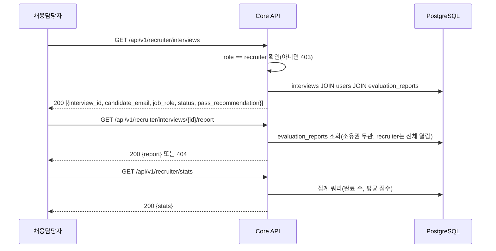

# 단위 TRD — U5: 채용담당자 대시보드 (지원자 목록/리포트 열람/통계)

> `harness/harness_01_trd_template.md` 형식. 상위 문서:
> `docs/trd/aimock_master_trd.md` §1(U5). U4가 만든 리포트를 recruiter
> 역할이 열람하는 API.

## 문서 정보
- 프로젝트: aimock
- 단위(화면/기능) 이름: U5 — 채용담당자 대시보드 API
- 작성일 / 버전: 2026-09-07 / v0.1
- 상태: 확정 (코드 착수, 사용자 자동진행 승인)

## §0. 범위 및 흐름 개요
- 역할: `role="recruiter"` 사용자에게 전체 지원자의 면접 목록, 개별
  리포트, 종합 통계를 제공한다. 프론트엔드 화면은 범위 밖(백엔드
  API까지만, 지금까지 전 단위와 동일한 원칙).
- 흐름:

- 의존하는 다른 단위: U1(인증/role), U4(evaluation_reports)
- 의존받는 단위: 없음(마지막 Must 단위)

## §0-1. 비기능 요구사항 체크
- 동시성: 조회만 하는 API라 해당 없음.
- 권한: **`role != "recruiter"`이면 전 엔드포인트 403** — candidate가
  다른 지원자의 리포트를 보는 것을 원천 차단(U1-b/U2-a 등의 "본인
  소유만" 원칙과 대칭되는 "recruiter는 전체 열람" 원칙).
- 감사: 해당 없음(조회 전용, MVP 범위에서 열람 로그는 남기지 않음 —
  Won't).
- 개인정보: 지원자 이메일을 recruiter에게 노출(採용 담당자가 지원자
  식별은 당연히 필요 — 원칙 7 위반 아님, 실제 개인정보가 아니라 이미
  본인이 가입 시 제공한 정보를 정당한 목적으로 사용).
- 삭제 정책: 해당 없음(조회만).

## §1. 데이터 구조
기존 `users`/`interviews`/`evaluation_reports` 테이블만 조회(컬럼 추가
없음).

## §2. 함수/API 명세

| 엔드포인트 | 입력 | 출력 | 설명 |
|---|---|---|---|
| `GET /api/v1/recruiter/interviews` | Bearer(recruiter) | `200 [{interview_id, candidate_email, job_role, status, pass_recommendation}]` / `403` | 전체 면접 목록 |
| `GET /api/v1/recruiter/interviews/{id}/report` | Bearer(recruiter) | `200 {report}` / `403` / `404` | 리포트 열람(소유권 무관) |
| `GET /api/v1/recruiter/stats` | Bearer(recruiter) | `200 {total_interviews, completed_interviews, avg_technical_score, avg_communication_score, avg_cultural_fit_score}` | 통계 |

## §3. 워크플로우 및 비즈니스 로직
- `require_recruiter` 의존성이 `get_current_user` 뒤에 붙어 role을
  검사 — candidate가 호출하면 403(`FORBIDDEN`).
- 목록/리포트 조회는 **candidate_id 소유권 검사를 하지 않는다** —
  recruiter의 정당한 권한이므로 다른 단위(U1-b/U2-a/U2-b/U4)의 "본인
  소유만" 원칙과 의도적으로 다르다(§0-1에 명시).
- 통계는 `evaluation_reports`가 존재하는 completed interview만 집계
  대상(리포트 없는 completed interview는 평균에서 제외).

## §4. 상태/에러 코드
| 코드 | 의미 | 발생 조건 |
|---|---|---|
| 403 | recruiter 아님 | `role != "recruiter"`인 사용자가 호출 |
| 404 | 리포트 없음 | 해당 interview에 리포트가 생성되지 않음 |

## §5. 인수 조건 (Acceptance Criteria)
- [ ] AC-1: recruiter 역할로 로그인해 목록을 조회하면 200과 함께 전체
  지원자의 interview가 반환된다(다른 candidate의 것도 포함).
- [ ] AC-2: candidate 역할로 대시보드 엔드포인트(목록/리포트/통계)를
  호출하면 전부 403을 반환한다.
- [ ] AC-3: recruiter가 자신 소유가 아닌 interview의 리포트를 조회해도
  200으로 정상 조회된다(candidate 전용 API와의 차이점 검증).
- [ ] AC-4: 리포트가 없는 interview를 recruiter가 조회하면 404를
  반환한다.
- [ ] AC-5: 완료된 interview 2건(리포트 있음)에 대해 통계를 조회하면
  `completed_interviews`와 평균 점수가 올바르게 계산된다.
- [ ] AC-6: 인증 토큰 없이 대시보드 엔드포인트를 호출하면 401을
  반환한다.

## §6. 테스트 시나리오

| 시나리오 | 입력/조건 | 기대 결과 | 대응 AC |
|---|---|---|---|
| recruiter 목록 조회 | recruiter 토큰 | 200, 전체 목록 | AC-1 |
| candidate 접근 시도 | candidate 토큰 | 403 | AC-2 |
| 타인 리포트 열람 | recruiter가 다른 candidate의 리포트 조회 | 200 | AC-3 |
| 리포트 없음 | 리포트 미생성 interview | 404 | AC-4 |
| 통계 계산 | 완료 2건(점수 4,4,3 / 5,3,4) | 평균이 산술적으로 일치 | AC-5 |
| 토큰 없음 | Authorization 헤더 없음 | 401 | AC-6 |

## §7. 미결 항목
| 항목 | 권장 기본값 | 확정 필요 여부 |
|---|---|---|
| 목록 페이지네이션 | 없음(MVP, 전체 반환) | 아니오(데이터량 적어 문제 없음) |
| 질문지 커스터마이징(원본 기획 언급) | 이번 MVP 범위 밖 | 아니오(Won't, 마스터 TRD에 없는 기능) |
