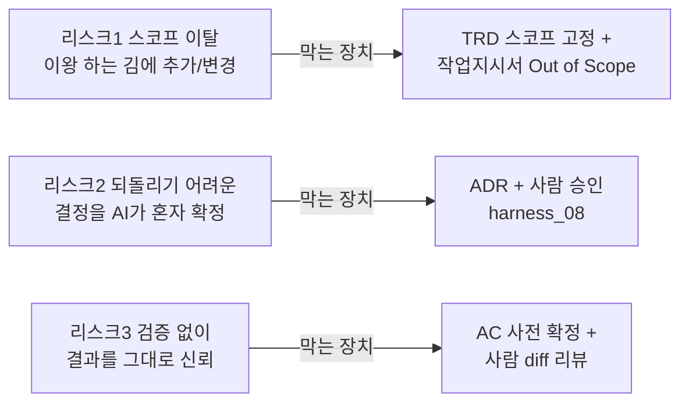
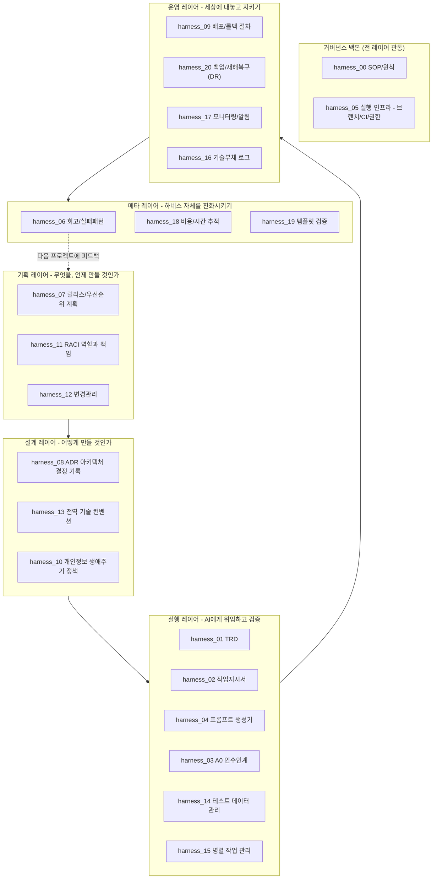
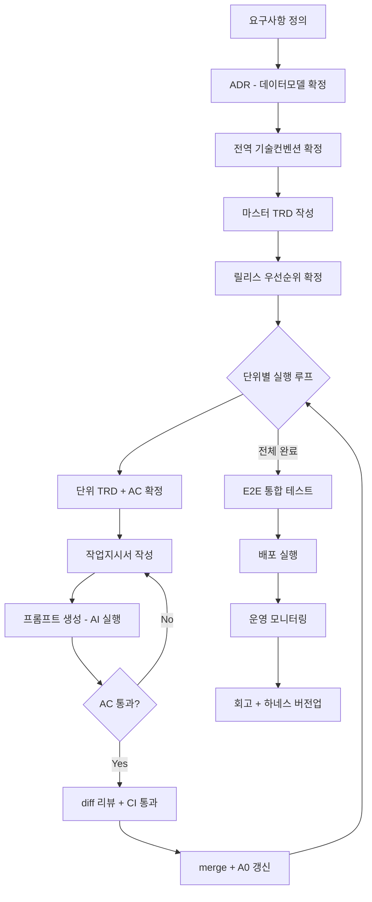

# 하네스 가이드

> HARNESS FRAMEWORK · GOVERNANCE GUIDE
> harness v1.4 · 문서 21종 · 특정 프로젝트/도메인에 종속되지 않는 범용 프레임워크

> 이 문서는 하네스를 처음 보는 사람이 "이게 대체 뭐고, 왜 이렇게 문서가 많고,
> 어디서부터 읽어야 하는지"를 5분 안에 이해하게 하는 입구입니다. 절차의 디테일은
> 각 `harness_NN_*.md`에 있고, 여기는 **목적 · 정의 · 목차 · 절차**만 정리합니다.
> 같은 내용을 시각적으로 본 artifact 버전: `하네스 가이드` (claude.ai/code artifact).
>
> ⚠️ 이 문서를 포함한 `harness/` 폴더 전체는 **특정 업무 프로그램(예: 재고관리,
> 예약시스템, 인사관리 등)과 무관한 범용 틀**입니다. 실제 프로젝트에 적용할 때는
> `docs/trd/`, `docs/workorder/` 등 프로젝트별 문서에서 도메인 내용을 채우고,
> `harness/` 아래 문서 자체는 항상 도메인 중립을 유지하세요.
>
> **이 저장소를 실제 프로젝트에 연결하는 방법**: 이 저장소는 GitHub Template
> repository로 사용합니다 — "Use this template"로 프로젝트마다 새 저장소를
> 만들고, 그 안에서만 실제 코드/문서를 쌓습니다. 이 저장소 자체는 절대
> 도메인 내용으로 채우지 않습니다. 같은 안내가 루트 `README.md`와
> `CLAUDE.md` "저장소 연결 방식" 섹션에도 동일하게 있습니다.

---

## 한 줄 정의

> **AI에게 개발을 맡길 때, "무엇을 사람이 결정하고 무엇을 AI가 실행할지"의
> 경계선을 문서와 절차로 미리 고정해 둔 틀.**

"레시피 없이 요리사에게 '맛있게 해줘'라고 하면 결과가 매번 다릅니다. 하네스는
그 레시피입니다." 재료(스펙)와 조리 순서(절차)와 간 보는 기준(AC)을 먼저
정해두고, 실제 조리(코드 작성)만 AI에게 맡깁니다.

---

## §1. 왜 필요한가 — AI 위임의 3대 리스크

AI 위임에는 세 가지 반복되는 리스크가 있습니다. 하네스의 모든 문서는 결국
이 세 가지 중 하나를 막기 위해 존재합니다.

| | 리스크 | 실제로 벌어지는 일 | 막는 장치 |
|---|---|---|---|
| 위험 01 | **스코프 이탈** | "이왕 하는 김에" 스펙에 없는 기능을 추가하거나 다른 파일까지 손댐 | TRD 스코프 고정 + 작업지시서 §2 "안 하는 것" |
| 위험 02 | **되돌리기 어려운 독단** 🔒 사람 승인 필요 | 데이터 모델·삭제 정책·권한 구조를 AI가 혼자 확정해버림 | ADR + 사람 승인 게이트 (`harness_08`) |
| 위험 03 | **검증 없는 신뢰** | 능력 있어 보이는 결과물을 코드 리뷰 없이 그대로 병합함 | AC 사전 확정 + 사람 diff 리뷰 |

---

## §2. 문서 지도 — 5개 레이어

기획에서 운영까지, 프로젝트 생애주기를 6개 그룹(백본 + 5개 레이어)으로 나눠
문서를 배치했습니다.

| 그룹 | 역할 | 소속 문서 |
|---|---|---|
| ⚖️ 거버넌스 백본 | 전 레이어 관통 | `00_definition`(전체 지도) · `00_overview`(SOP·원칙) · `05_execution_infra`(브랜치·CI·권한) |
| 🎯 기획 | 무엇을, 언제 만들 것인가 | `07_release_planning` · `11_raci` · `12_change_management` |
| 🏗️ 설계 | 어떻게 만들 것인가 | `08_adr` · `13_tech_conventions` · `10_data_lifecycle` |
| ⚙️ 실행 | AI에게 위임하고 검증 | `01_trd` · `02_work_order` · `04_prompt_generator` · `03_handoff(A0)` · `14_test_data` · `15_parallel_work` |
| 🚀 운영 | 세상에 내놓고 지키기 | `09_deployment_runbook` · `20_backup_dr` · `17_monitoring` · `16_tech_debt_log` |
| 🔄 메타 | 하네스 자체를 진화시키기 | `06_meta_improvement` · `18_cost_tracking` · `19_template_validation` |

---

## §3. 전체 목차 (21종)

파일명 규칙: `harness_{번호}_{문서유형}.md`. 우선순위 배지는 2026-09-04 갭
분석에서 매긴 것으로, 프로젝트 규모가 커질수록 위에서 아래로 채워 넣으면 됩니다.

| 코드 | 이름 | 레이어 | 우선순위 | 한 줄 역할 |
|---|---|---|---|---|
| `00_definition` | 하네스 정의 | 백본 | 기본 | 5분 안에 전체 구조를 그림으로 |
| `00_overview` | SOP·원칙 | 백본 | 기본 | 타협 불가 8원칙 + 실행 순서 |
| `01_trd_template` | TRD 템플릿 | 실행 | 기본 | 무엇을 만드는가, AC 포함 |
| `02_work_order_template` | 작업지시서 | 실행 | 기본 | 이번 세션 경계·미결항목 |
| `03_handoff_template` | A0 인수인계 | 실행 | 기본 | 뭘 했고 뭐가 남았는가 |
| `04_prompt_generator` | 프롬프트 생성기 | 실행 | 기본 | TRD+작업지시서 → 최종 프롬프트 |
| `05_execution_infra` | 실행 인프라 | 백본 | 기본 | 브랜치·CI·권한·에스컬레이션 |
| `06_meta_improvement` | 회고·실패패턴 | 메타 | 기본 | 하네스 자체의 버전업 |
| `07_release_planning` | 릴리스·우선순위 계획 | 기획 | 🔴 Critical | MoSCoW+위험도로 실행순서 확정 |
| `08_adr` | ADR | 설계 | 🔴 Critical | 되돌리기 어려운 결정의 기록 |
| `09_deployment_runbook` | 배포·롤백 절차 | 운영 | 🔴 Critical | merge 이후 실제 반영·복구 |
| `10_data_lifecycle` | 개인정보 생애주기 | 설계 | 🔴 Critical | 보존기간·파기·열람권 처리 |
| `11_raci` | RACI | 기획 | 🟡 Important | 누가 결정하고 승인하는가 |
| `12_change_management` | 변경관리 | 기획 | 🟡 Important | 확정 스펙이 바뀔 때 절차 |
| `13_tech_conventions` | 전역 기술 컨벤션 | 설계 | 🟡 Important | API·네이밍·인증 전역 표준 |
| `14_test_data_management` | 테스트 데이터 관리 | 실행 | 🟡 Important | 마스킹 시드 카탈로그화 |
| `15_parallel_work` | 병렬 작업 관리 | 실행 | 🟡 Important | 단위 의존관계·인터페이스 계약 |
| `16_tech_debt_log` | 기술부채 로그 | 운영 | 🟢 Nice | 알면서 미룬 것 추적 |
| `17_monitoring` | 모니터링·알림 | 운영 | 🟢 Nice | 운영 중 장애 감지 |
| `18_cost_tracking` | 비용·시간 추적 | 메타 | 🟢 Nice | 세션별 소요·재시도 집계 |
| `19_template_validation` | 템플릿 검증 체크 | 메타 | 🟢 Nice | 필수 필드 빈칸 방지 |
| `20_backup_dr` | 백업·재해복구 정책 | 운영 | 🔴 Critical | RPO/RTO·복구절차·DR훈련 |

---

## §4. 실행 절차 (SOP)

프로젝트는 3단계(A→B→C)로 흐르고, 그중 B는 단위 수만큼 반복됩니다.

**Phase A · 1회만 — 프로젝트 착수**
1. 요구사항 + 비기능요구사항(동시성·권한·감사·개인정보) 정의
2. 데이터 모델(ERD) 확정 → ADR 기록
3. 전역 기술 컨벤션 확정 → `13_tech_conventions`
4. 마스터 TRD 작성
5. 릴리스 우선순위 확정 → `07_release_planning`

**Phase B · 단위 수만큼 반복 — 단위별 실행 루프**
1. 단위 TRD + AC 확정 → 작업지시서 작성 → 프롬프트 생성·AI 실행
2. AC 통과 확인 → 사람 diff 리뷰 + CI 통과 → merge
3. A0 인수인계 문서 갱신

**Phase C · 마감 — 통합 및 운영 전환**
1. 단위 간 연결 지점 E2E 테스트
2. 배포 실행 → `09_deployment_runbook` + 모니터링 구성 → `17_monitoring`
3. 프로젝트 회고 + 하네스 버전업 → `06_meta_improvement`

---

## §5. 지금 상태

**하네스 프레임워크는 뼈대 수준에서 안정화됐다 — "완성"은 아니다**
5개 레이어 + 거버넌스 백본을 문서 21종이 커버합니다. 하지만 v1.2~v1.4에서
계속 새 절/문서가 추가됐듯, 이 하네스는 한 번 완성하고 끝나는 게 아니라
프로젝트를 거칠 때마다 갱신되는 living document로 취급하세요. **문서
커버리지가 넓다는 것과 실전에서 안전하다는 것은 다른 문제입니다** — 남은
선택지(`19_template_validation`의 lint 자동화 등)를 "급하지 않다"고 방치하지
말고, 실전에서 부딪히는 대로 계속 채워 넣으세요.

v1.3(2026-09-07)에서 배포 이후 운영 단계의 공백 4건(DB 마이그레이션 절차,
백업/재해복구 정책, 공급망 보안 스캔, 개인정보 유출사고 대응)을, v1.4(같은 날)
에서 기획 거버넌스·문서 검증·자동화 공백 5건(PO-TL 이견 조정, 실행단위 크기
산정, 포스트모템 템플릿, 템플릿 검증 커버리지 확대, 코드품질/AC모호성/모델버전
자동화)을 20년차 기획/설계/개발 관점 갭 분석으로 발견해 보완했습니다 —
상세 이력은 `harness_06_meta_improvement.md` §1 참조.

다음 단계는 "만들기"가 아니라 **"써보면서 검증하기"** 입니다 — `07`·`08`·
`10`·`11`·`13`처럼 아직 실전에서 안 써본 문서는 프로젝트를 진행하며 채우고,
빈 부분은 `06_meta_improvement` 회고 루프가 자연스럽게 잡아냅니다.

**처음 온 사람을 위한 최소 경로**
급하고 작은 프로젝트라면 `00_overview` → `01` → `02` → `05` 네 개만 읽고
시작해도 됩니다. 나머지는 프로젝트 규모가 커지거나 팀이 늘어날 때 §2 지도
순서대로 끌어다 쓰면 됩니다.

각 문서가 **왜** 필요한지에 대한 상세한 설명(20년차 기획/설계/개발 관점)은
프로젝트 루트의 `CLAUDE.md` "확장 문서" 섹션을 참조하세요.

**실전 검증 시 주의**: 위 §5의 "구조적으로 완성"은 문서 커버리지 기준
판단입니다. 실제 프로젝트에 적용해보면 대개 "문서는 있는데 실행이 강제되지
않는" 공백(예: 브랜치 보호 규칙 미설정으로 인한 부분병합)이 드러납니다 —
그런 실전 발견은 이 저장소가 아니라 각 프로젝트의 `harness_06` 회고와
그 프로젝트 자신의 CLAUDE.md에 일반화하여 누적하세요.

---
`HARNESS-GUIDE · v1.4 · 2026-09-07`
