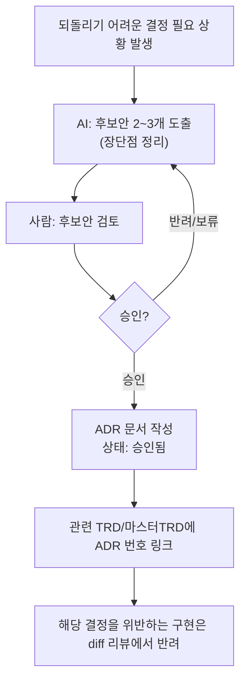

# 아키텍처 결정 기록 (ADR — Architecture Decision Record)

> 목적: `harness_00 §4-1`의 "되돌리기 어려운 결정은 AI가 혼자 확정하지 못한다"를
> 실제로 지키려면, 그 결정이 **왜** 그렇게 내려졌는지 기록이 남아야 합니다.
> 기록이 없으면 3개월 뒤 "이거 왜 이렇게 했지?"에 아무도 답을 못하고,
> 같은 논쟁을 반복하거나 실수로 결정을 뒤집게 됩니다.

---

## 언제 ADR을 작성해야 하는가 [체크리스트]
아래 중 하나라도 해당하면 반드시 작성:
- [ ] 데이터 모델(스키마) 구조를 확정/변경할 때
- [ ] 인증/인가 방식을 선택할 때 (세션 vs 토큰, 역할 구조 등)
- [ ] 삭제 정책(물리삭제/소프트삭제)을 정할 때
- [ ] 핵심 기술 스택(언어/프레임워크/DB)을 선택할 때
- [ ] 여러 단위에 영향을 주는 공통 규약을 정할 때
- [ ] 한 번 정하면 되돌리는 데 1주일 이상 걸릴 것으로 예상되는 모든 결정

## ADR 개별 항목 템플릿

```
### ADR-{번호}: {결정 제목}
- 날짜:
- 상태: 제안됨 / 승인됨 / 폐기됨 / 대체됨(ADR-xx로)
- 결정권자:

**배경 (Context)**
왜 이 결정이 필요했는가, 어떤 제약이 있었는가.

**검토한 대안 (Options)**
| 대안 | 장점 | 단점 |
|---|---|---|
| A안 | | |
| B안 | | |

**결정 (Decision)**
최종 선택한 안과 핵심 이유 한 문단.

**결과/트레이드오프 (Consequences)**
이 결정으로 포기한 것, 나중에 발목 잡을 수 있는 지점.

**관련 문서**
관련 TRD:
```

## ADR 처리 절차



## ADR 인덱스

| 번호 | 제목 | 상태 | 날짜 |
|---|---|---|---|
| ADR-001 | | | |
