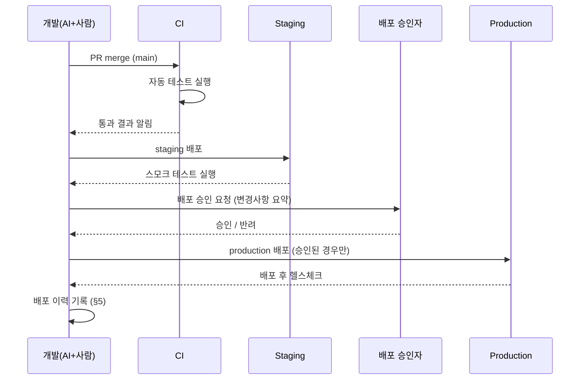
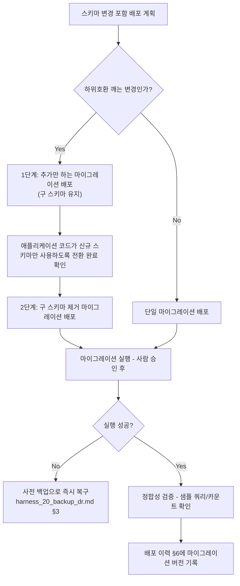
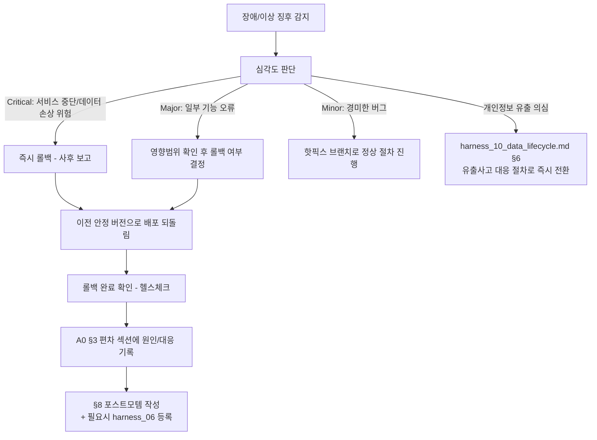

# 배포/롤백 절차 (Deployment & Rollback Runbook)

> 목적: `harness_05`는 "머지까지"만 다룹니다. 머지된 코드가 실제로 사용자에게
> 닿기까지, 그리고 문제가 생겼을 때 되돌리는 절차가 없으면 "코드는 완성됐는데
> 아무도 못 쓰는" 상태로 방치되거나, 장애가 났을 때 즉흥적으로 대응하다가
> 사태를 키우게 됩니다.

---

## §1. 환경 구성 [사람 작성 — 스택 확정 후]

| 환경 | 용도 | 데이터 | 접근 권한 |
|---|---|---|---|
| local/dev | 개발/AI 에이전트 작업 | 마스킹 시드 데이터만 | 개발자 |
| staging | 배포 전 최종 확인 | 마스킹 또는 익명화 데이터 | 개발자+검수자 |
| production | 실사용 | 실제 데이터 | 최소 인원, 별도 인증 |

## §2. 배포 전 체크리스트
- [ ] 대상 브랜치의 AC 전부 pass
- [ ] CI 통과
- [ ] 사람 diff 리뷰 승인 완료
- [ ] A0 인수인계 문서 갱신 완료
- [ ] 롤백 계획(§4)을 배포 담당자가 숙지했는가

## §3. 배포 절차

- **위험 명령(스키마 변경, 대량 데이터 작업)은 AI 에이전트가 직접 production에
  실행하지 않는다** (`harness_05 §3` 원칙 재확인) — 사람이 별도 세션에서 직접 실행.

## §4. DB 마이그레이션 절차
> 코드 롤백과 스키마 롤백은 별개입니다. 코드를 이전 버전으로 되돌려도 이미
> 적용된 스키마 변경(컬럼 삭제, 타입 변경 등)은 저절로 되돌아가지 않습니다.
> 이 구분이 없으면 "롤백했는데 왜 계속 깨지지?"라는 사고가 반복됩니다.

**원칙**
- 마이그레이션은 전방향 전용(forward-only)을 기본으로 한다 — "롤백 마이그레이션"을
  따로 준비해두지 않으면 사고 시점에 즉흥으로 만들다가 데이터를 더 망가뜨린다.
- 하위호환을 깨는 변경(컬럼 삭제/타입 변경/NOT NULL 추가 등)은 반드시 2단계로
  나눈다: ① 신규 스키마를 추가만 하는 배포 → ② 이전 코드가 완전히 사라진 뒤
  구 스키마를 제거하는 배포. 한 번에 하지 않는다.
- 마이그레이션 스크립트는 애플리케이션 코드와 같은 브랜치/PR에서 버전관리하고,
  실행 이력이 남는 마이그레이션 도구/프레임워크를 사용한다.

**배포 전 체크리스트 (스키마 변경이 포함된 배포에 한해 §2에 추가로 확인)**
- [ ] staging에서 프로덕션과 유사한 규모의 데이터로 마이그레이션 리허설 완료
- [ ] 마이그레이션 실행 시간이 배포 다운타임/타임아웃 허용치 이내인지 확인
- [ ] 마이그레이션 직전 백업 완료 (`harness_20_backup_dr.md` §1)
- [ ] 하위호환 깨는 변경이면 2단계 분리 계획이 명시됐는가

- 위험 명령(스키마 변경 실행 자체)은 `harness_05 §3` 원칙에 따라 AI 에이전트가
  직접 production에 실행하지 않는다 — 사람이 별도 세션에서 직접 실행.

## §5. 롤백 절차

- 원인이 데이터 손실/손상(백업 복구가 필요한 경우)이면 `harness_20_backup_dr.md`
  §3 복구 절차를 병행한다.
- 원인이 개인정보 유출 의심이면, 법정 신고기한 때문에 위 롤백 절차와 별개로
  `harness_10_data_lifecycle.md` §6 유출사고 대응 절차의 사람 보고 라인을
  즉시(롤백 완료를 기다리지 않고) 가동한다.

## §6. 배포 이력

| 일시 | 버전/브랜치 | 배포자 | 승인자 | 결과 | 비고 |
|---|---|---|---|---|---|

## §7. 롤백 결정권자
- [ ] 사람 작성: 누가 "즉시 롤백" 여부를 최종 결정하는가 (`harness_11 RACI` 참조)

## §8. 포스트모템 템플릿 (장애 직후 작성)
> `harness_06`의 프로젝트 회고는 마일스톤 단위 회고이고, 이건 "장애 하나"에
> 대해 사건 직후(늦어도 수일 내) 작성하는 blameless(비난하지 않는) 기록입니다.
> 목적은 책임 소재를 가리는 게 아니라 재발 방지입니다. Critical/Major 등급
> 장애(§5 심각도 기준)는 반드시 작성, Minor는 선택.

### 포스트모템: {장애 제목}
- 발생일시 / 감지일시 / 해결일시:
- 심각도: Critical / Major / Minor (§5 기준)
- 영향 범위: (영향받은 사용자 수·기능·데이터)
- 작성자 / 참여자:

**타임라인**
| 시각 | 사건 |
|---|---|

**근본 원인** (5 Whys 또는 그에 준하는 분석 — 표면 원인이 아니라 근본 원인까지)

**무엇이 잘 작동했는가** (감지/대응 과정에서)

**무엇이 안 됐는가**

**재발 방지 액션 아이템**
| 액션 | 담당 | 기한 | 상태 |
|---|---|---|---|

**후속 등록**
- 반복 가능한 일반화된 패턴이면 `harness_06_meta_improvement.md` §3에 등록
- 완료 못한 액션 아이템은 `harness_16_tech_debt_log.md`에 TD로 등록해 추적
- 개인정보 유출이 원인이면 `harness_10_data_lifecycle.md` §6 절차와 병행 작성
- 데이터 손실/복구가 있었으면 `harness_20_backup_dr.md` §5 이력에도 기록
