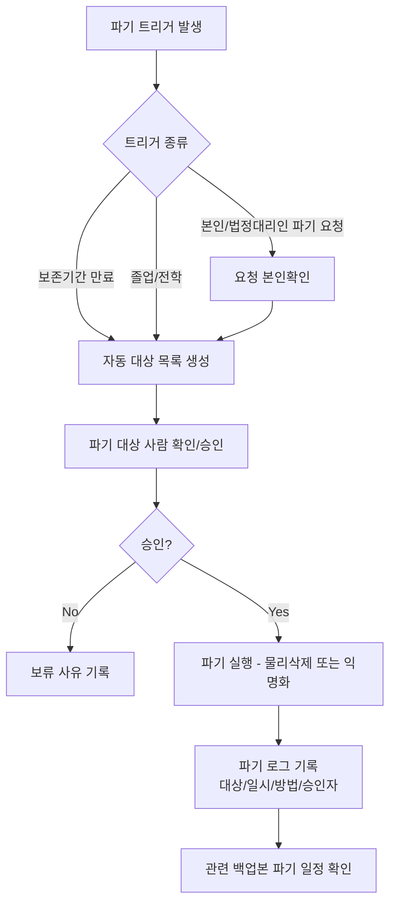
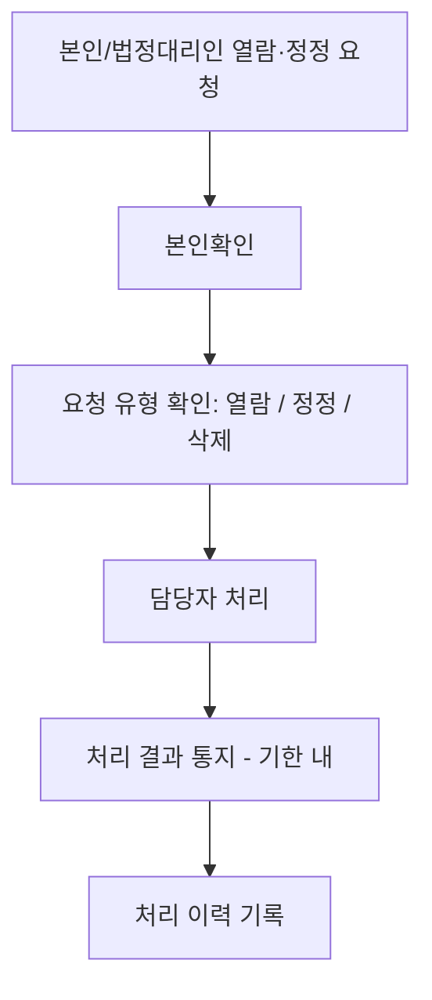
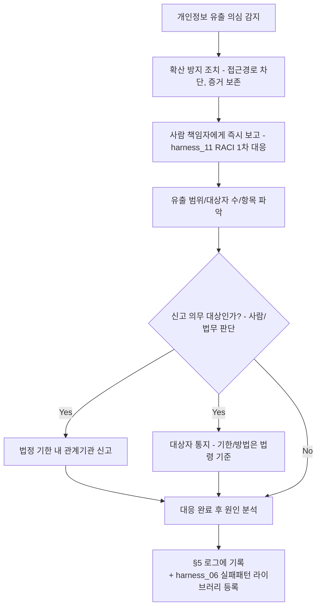

# 개인정보 생애주기 정책 (Data Retention & Disposal)

> 목적: `harness_05 §3`의 "마스킹/샘플 데이터"는 **개발 단계**의 이야기입니다.
> 이 문서는 **운영 단계**에서 실제 사용자/이해관계자 개인정보가 얼마나 보관되고,
> 언제·어떻게 파기되며, 당사자 요청 시 어떻게 열람/정정하는지를 다룹니다.
>
> ⚠️ 이 문서의 법적 기준(보존기간 등)은 AI나 개발자가 임의로 확정하지 않고,
> 반드시 사람(책임자/필요시 법무 검토)이 확정합니다 — `harness_00 §4-1`
> "되돌리기 어려운 결정" 원칙의 적용 대상입니다.

---

## §1. 적용 법령/근거 [사람 작성 — 법무 검토 권장]
- 관련 법령: (예: 개인정보보호법 등 — 실제 법률 검토 필요, AI가 단정하지 않음)
- 미성년자 개인정보 특례 해당 여부:

## §2. 데이터 항목별 보존기간 [사람 작성]

| 데이터 항목 | 민감도 | 보존기간 | 파기 트리거 | 근거 |
|---|---|---|---|---|
| 사용자 기본정보 | 높음 | | 탈퇴/계약종료 후 N년 | |
| 이용/활동 기록 | 중간 | | | |
| 관계자 연락처 | 높음 | | | |

## §3. 파기 절차

## §4. 열람/정정 요청 처리 절차

## §5. 파기/처리 로그

| 일시 | 대상(익명화 표기) | 처리유형 | 처리자 | 승인자 |
|---|---|---|---|---|

## §6. 개인정보 유출사고 대응 절차
> §3(정상 파기)·§4(열람/정정 요청)와 달리, **의도치 않게 외부에 노출되거나
> 유출된 경우**는 별도 트랙입니다. 대부분의 개인정보보호 법제는 유출 인지 후
> 신고까지 법정 기한을 두므로, 대응 속도가 결과를 가릅니다. 서비스 장애
> 자체의 롤백은 `harness_09_deployment_runbook.md` §5를 따르되, 신고/통지
> 라인은 이 절차를 우선 적용하세요.
>
> ⚠️ "유출로 분류할지", "신고 대상인지", "법정 기한이 며칠인지"는 AI나
> 개발자가 임의로 판단하지 않습니다 — 반드시 사람(책임자/법무)이 확정합니다
> (`harness_00 §4-1` 원칙 적용 대상).

- 유출 의심 시 최초 발견자가 즉시 할 일: (예: 접근 경로 차단 등 확산 방지 — 원인 조사를 위해 로그는 삭제하지 않고 보존)
- 내부 1차 보고 대상: [ ] (`harness_11 RACI` 연동)
- 신고 의무 판단 기준 [사람/법무 작성]:

- 원인이 배포된 버그라면 `harness_09_deployment_runbook.md` §5 롤백 절차를
  병행할 수 있다 — 단, 신고 기한 준수를 위한 사람 보고 라인(위 흐름의 B~C)은
  롤백 완료를 기다리지 않고 즉시 가동한다.

## §7. 개발 단계 원칙과의 연결
- 개발/AI 에이전트 환경에는 이 문서의 실제 데이터가 절대 들어가지 않는다
  (`harness_05 §3` 참조).
- 시드 데이터 마스킹 규칙은 `harness_14 테스트 데이터 관리`를 따른다.
