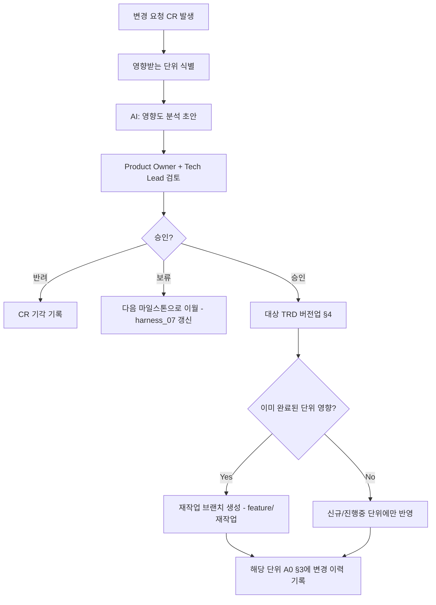

# 변경관리 프로세스 (Change Management)

> 목적: `harness_00 §4-7` "스펙 문서는 단일 진실 공급원 유지"는 원칙일 뿐,
> **실제로 TRD가 확정된 후 요구사항이 바뀌면 무엇을 하는지** 절차가 없으면
> 결국 구두 지시나 채팅으로 스펙이 바뀌고 문서는 낡은 채로 남습니다.
> 이미 완료된 단위에 영향이 갈 수 있으므로 영향도 분석이 반드시 선행돼야 합니다.

---

## §1. 변경 요청(CR) 템플릿

```
### CR-{번호}: {변경 제목}
- 요청일 / 요청자:
- 변경 대상 TRD:
- 변경 사유:
- 요청 내용 (Before → After):
```

## §2. 영향도 분석 [사람 작성 — AI 초안 가능]

| 영향받는 단위 | 현재 상태 | 영향 내용 | 재작업 필요 여부 |
|---|---|---|---|
| | 완료/진행중/미착수 | | |

## §3. 처리 절차



## §4. TRD 버전 이력 [해당 TRD 파일 내 또는 여기 통합 기록]

| TRD 파일 | 버전 | 변경일 | 관련 CR | 변경 요약 |
|---|---|---|---|---|

## §5. 완료된 단위 재작업 규칙
- 재작업도 `harness_02` 작업지시서를 새로 만든다 (기존 작업지시서를 수정하지
  않음 — 이력 보존).
- 재작업 브랜치명: `feature/{단위코드}-rework-{번호}`
