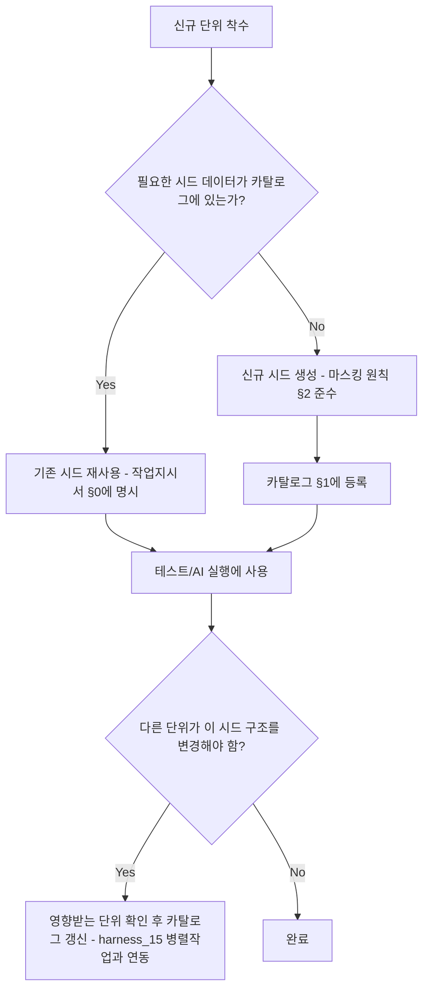

# 테스트 데이터/시드 관리 (Test Data & Seed Management)

> 목적: `harness_05 §3`는 "마스킹 시드 데이터를 준비하라"고만 하고, 그 시드를
> **누가 만들고 어디 있고 다른 단위가 어떻게 재사용하는지**는 정하지 않았습니다.
> 이게 없으면 단위마다 계정을 새로 만들어서 로그인 정보가 꼬이거나, 같은 사용자
> 데이터인데 단위별로 다른 값을 써서 통합 테스트에서 불일치가 납니다.

---

## §1. 시드 데이터 카탈로그

| 시드 세트명 | 생성한 단위 | 내용 | 재사용 가능 단위 | 위치 |
|---|---|---|---|---|
| seed_users_basic | A0 | 마스킹 사용자 10명 | 전체 | |
| seed_login_accounts | A1 | 로그인 계정 5개(역할별) | A2 이후 전체 | |

## §2. 시드 데이터 생성 원칙 [사람 작성]
- 실제 이름/연락처/주소는 절대 사용하지 않는다 — 명백히 가짜임을 알 수 있는
  패턴 사용 (예: "사용자001", "010-0000-0001")
- 엣지 케이스 포함 (긴 이름, 특수문자, 빈 값 등 AC §6 테스트 시나리오와 매핑되게)
- 시드 데이터는 코드/리포지토리에 커밋 가능 (실제 개인정보가 아니므로) —
  `docs/seed/` 또는 프로젝트 확정 위치

## §3. 절차

