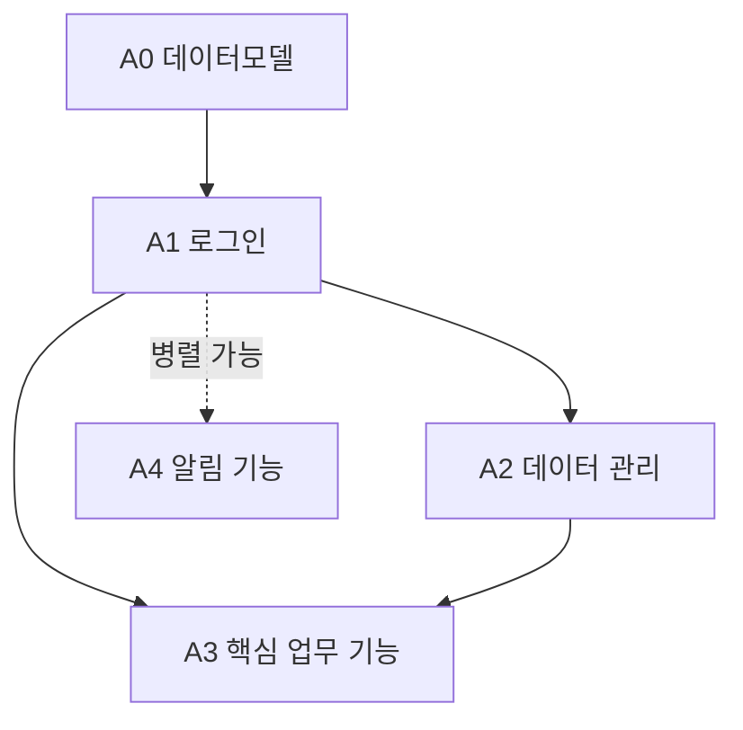
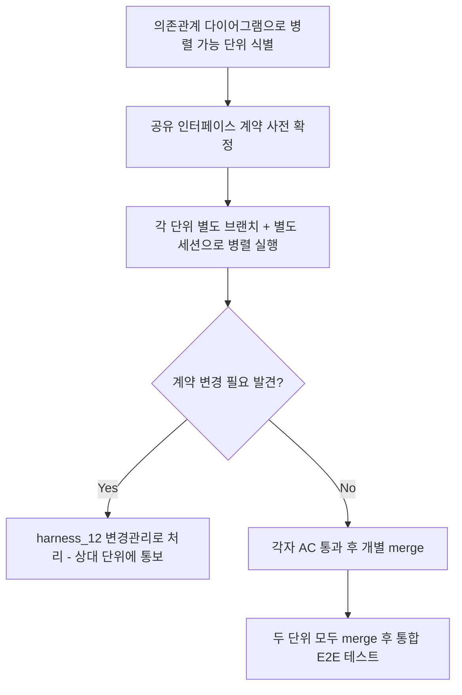
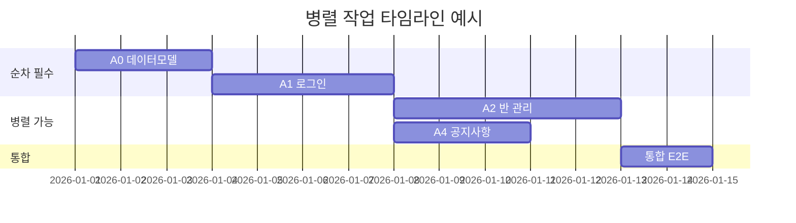

# 병렬 작업/인터페이스 계약 관리 (Parallel Work & Interface Contracts)

> 목적: 하네스 SOP(`harness_00`)는 단위를 순차적으로 하나씩 진행하는 것을 기본
> 전제로 합니다. 하지만 프로젝트가 커지면 서로 의존관계 없는 단위를 동시에
> 여러 세션에서 진행하고 싶어집니다. 이때 인터페이스가 문서로 고정돼 있지
> 않으면, 한쪽 단위가 API를 바꿔버려서 다른 쪽이 알지도 못한 채 깨집니다.

---

## §1. 병렬 작업 가능 여부 판단
- 두 단위가 서로의 산출물(테이블, API)에 의존하지 않으면 병렬 가능
- 하나라도 상대의 미완성 산출물을 필요로 하면 순차 진행

## §2. 단위 의존관계 예시

> 실선 화살표 = 의존(순차 필수), 점선 = 독립(병렬 가능)

## §3. 인터페이스 계약 고정 규칙
- 병렬 진행하는 두 단위가 공유하는 API/테이블은 **착수 전에** 양쪽 TRD §2에
  동일하게 명시
- 계약을 변경해야 하면 `harness_12 변경관리` 절차를 거침 (다른 쪽 세션에
  통보 없이 임의 변경 금지)

## §4. 병렬 작업 절차

## §5. 병렬 작업 타임라인 예시

