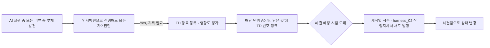

# 기술 부채 로그 (Technical Debt Log)

> 목적: A0 인수인계 문서 §3(편차)는 "몰랐는데 다르게 나온 것"을 기록합니다.
> 반면 기술부채는 "알면서 의도적으로 미룬 것"입니다. 이 둘을 섞으면 A0가
> 지저분해지고, 미룬 것들이 시간이 지나면 아무도 기억 못해서 영원히 안 고쳐집니다.

---

## §1. 기술부채 항목

| ID | 등록일 | 단위 | 내용 | 왜 미뤘는가 | 영향도(상/중/하) | 해결 예정 시점 | 상태 |
|---|---|---|---|---|---|---|---|
| TD-001 | | | | | | | 미해결/해결됨 |

## §2. 등록/해소 절차

## §3. 검토 주기
- 각 마일스톤 완료 시 미해결 TD 목록을 훑고 다음 마일스톤에 반영할지 재평가
  (`harness_07` 연동)
