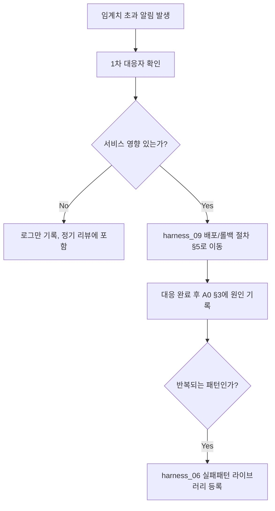

# 모니터링/알림 기준 (Monitoring & Alerting)

> 목적: `harness_05 §5`의 관찰가능성은 **개발 단계 로그**(에이전트가 뭘 했는지)만
> 다룹니다. 운영 중인 시스템이 실제로 죽었는지, 느려졌는지, 개인정보에 이상
> 접근이 있었는지는 별개의 문제이고, 이게 없으면 사용자가 신고할 때까지
> 아무도 모릅니다.

---

## §1. 모니터링 대상 [사람 작성 — 스택 확정 후 구체화]

| 항목 | 정상 기준 | 알림 임계치 | 확인 주기 |
|---|---|---|---|
| 가용성(uptime) | | | |
| 에러율 | | | |
| 응답시간 | | | |
| 개인정보 접근 로그 이상 패턴 | | | |

## §2. 알림 수신자 [RACI 연동]
- 1차 대응: (`harness_11` Deploy Approver)
- 에스컬레이션 기준:

## §3. 장애 대응 절차

