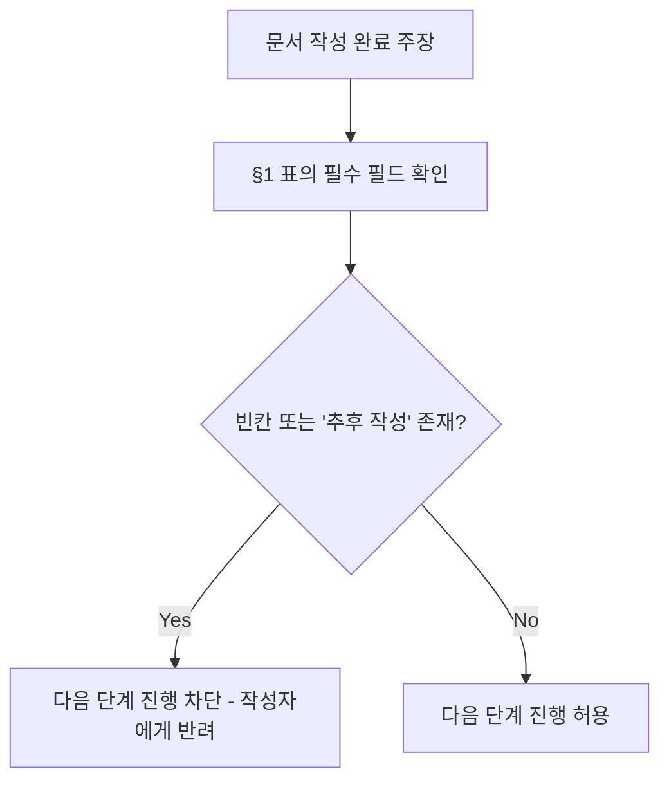

# 템플릿 검증 체크 (Template Completeness Check)

> 목적: 지금 모든 문서는 "체크리스트를 눈으로 보고 스스로 확인"하는 방식입니다.
> 사람은 바쁘면 빈칸을 건너뛰고 다음 단계로 넘어갑니다. 이 문서는 각 문서
> 유형별로 "이게 비어 있으면 다음 단계로 못 넘어간다"는 필수 필드를 명시해서,
> 나중에 간단한 스크립트로도 기계 검증할 수 있는 형태로 정리해 둡니다.

---

## §1. 문서 유형별 필수 필드 (빈칸 금지)

| 문서 유형 | 필수 필드 |
|---|---|
| TRD (`harness_01`) | §0-1 비기능요구사항 전체(N/A라도 명시), §5 AC 최소 1개 |
| 작업지시서 (`harness_02`) | §1 범위, §2 안 하는 것, §3 미결항목 적용여부 |
| A0 (`harness_03`) | §2 AC 대비 결과, §3 편차(없으면 "없음" 명시) |
| ADR (`harness_08`) | 결정, 검토한 대안 최소 2개 |
| 릴리스계획 (`harness_07`) | MoSCoW 분류, MVP 범위 |
| 개인정보 생애주기 (`harness_10`) | §2 보존기간, §6 신고의무 판단기준 |
| 기술 컨벤션 (`harness_13`) | §3 인증방식, §7 의존성 스캔 도구/주기 |
| 백업/재해복구 (`harness_20`) | §1 백업대상, §2 RPO/RTO |
| 배포/롤백 (`harness_09`) | §2 배포 전 체크리스트 전체, §7 롤백 결정권자 |
| RACI (`harness_11`) | §1 역할 정의(1인 프로젝트는 §4 모자전환 태그로 대체 가능) |
| 변경관리 (`harness_12`) | CR 발생 시 §2 영향도 분석 |
| 병렬작업 (`harness_15`) | 병렬 진행 시 §3 인터페이스 계약 (순차 진행이면 대상 아님) |

> 🟢 Nice 등급 문서(`14`/`16`/`17`/`18`/`19` 자체)는 이 표의 검증 대상에서
> 제외한다 — 빈칸이어도 다음 단계 진행을 막을 만큼 치명적이지 않기 때문이다.
> 위 표는 🔴 Critical·🟡 Important 문서 중 "이게 비면 다음 단계가 위험해지는"
> 것만 추린 것이다.

## §2. 검증 절차

## §3. 자동화 범위
- 현재는 사람이 §1 표를 기준으로 수동 점검
- 프로젝트 규모가 커지면 간단한 lint 스크립트(빈 `[ ]`/`[사람 작성]` 잔존 여부
  grep)로 전환 가능 — 별도 요청 시 구현
- **AC 모호성 검출**: TRD §5 AC 텍스트에 아래 같은 표현이 조건 없이 남아있으면
  "측정 가능한 조건으로 재작성"을 요구하고 다음 단계 진행을 차단한다.
  - 예시 금지어(구체적 수치/조건 없이 단독 사용 시): "적절히", "알아서", "충분히",
    "가능한 한", "잘 동작", "필요시"
  - 참고 grep(프로젝트 스택 확정 후 CI에 편입 가능): `grep -E "적절히|알아서|충분히|가능한 한" docs/trd/*.md`
  - 통과 기준: 위 표현이 아예 없거나, 있어도 바로 뒤에 구체적 수치/조건이
    붙어 있으면 허용 (예: "충분히 빠르게(200ms 이내)")

## §4. 프로젝트 규모별 적용 프로파일

> 21종 문서를 전부 매번 채우는 건 1인 프로젝트엔 과하다 — 예를 들어
> 리뷰어가 자기 자신뿐인데 CODEOWNERS로 리뷰어를 강제 지정하는 건
> 실효성이 없다. 문서 자체를 줄이는 대신, "이 규모면 이건 생략 가능"을
> 명시해 빈칸을 죄책감 없이 건너뛸 수 있게 한다.

| 문서 | 1인 프로젝트 | 팀(2인 이상) |
|---|---|---|
| `00_overview`, `01_trd`, `02_work_order`, `05_execution_infra` | 필수 | 필수 |
| `08_adr`, `10_data_lifecycle` | 필수 (되돌리기 어려운 결정은 인원수와 무관하게 위험) | 필수 |
| `11_raci` §1~§3 정식 매트릭스 | 생략 가능 → 대신 §4 "모자 전환 태그"만 사용 | 필수 |
| CODEOWNERS, 리뷰어 강제 지정 | 생략(리뷰어가 자기 자신뿐이면 무의미) — 두 번째 리뷰어 합류 시 즉시 활성화 | 필수 |
| `07_release_planning` MoSCoW | 간이 버전 허용(표 1개로 축약) | 정식 버전 |
| `15_parallel_work` | 생략(병렬 세션 안 돌리면 불필요) | 병렬 작업 시 필수 |
| `18_cost_tracking` §1 세션기록 | 필수(1인일수록 "내가 시간을 어디 쓰는지" 감이 아니라 숫자로 봐야 함) | 필수 |
| `13_tech_conventions` §7 의존성 스캔 | 필수(자동화라 비용 거의 없음 — CI `dependency-scan` 잡만 켜면 됨) | 필수 |
| `20_backup_dr` | 필수 (데이터 손실은 인원수와 무관하게 되돌릴 수 없음) | 필수 |
