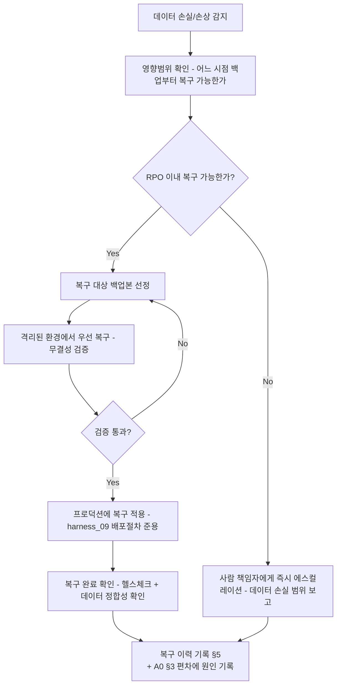

# 백업/재해복구 정책 (Backup & Disaster Recovery)

> 목적: `harness_10 §3` 파기 절차는 "관련 백업본 파기 일정 확인"이라며 백업의
> *존재*를 전제로 합니다. 하지만 백업을 얼마나 자주 만들고, 얼마나 보관하고,
> 실제로 복구가 되는지 검증하는 절차를 정하는 문서가 없었습니다. 백업은
> "만들어만 두면 되는 것"이 아니라 "복구 테스트를 통과해야 진짜 백업"입니다 —
> 이 문서가 없으면 장애 시점에야 "백업이 손상돼 있었다"는 걸 알게 됩니다.
>
> ⚠️ RPO/RTO 목표치는 AI나 개발자가 임의로 확정하지 않고, 반드시 사람
> (책임자)이 비즈니스 영향을 고려해 확정합니다 — `harness_00 §4-1`
> "되돌리기 어려운 결정" 원칙의 적용 대상입니다 (백업 주기를 잘못 정하면
> 사고가 나야 비로소 드러나고, 그때는 되돌릴 수 없습니다).

---

## §1. 백업 대상 및 정책 [사람 작성 — 스택 확정 후]

| 대상 | 백업 방식 | 주기 | 보관기간 | 저장 위치/암호화 |
|---|---|---|---|---|
| 프로덕션 DB | | | | |
| 파일/미디어 저장소 | | | | |
| 환경설정/시크릿 | | | | |

## §2. RPO/RTO 목표 [사람 작성 — 최종 승인 필요]
> RPO(Recovery Point Objective): 장애 시 몇 분/시간 분량의 데이터 손실까지 허용하는가.
> RTO(Recovery Time Objective): 장애 발생부터 서비스 정상화까지 목표 시간.

- RPO:
- RTO:
- 근거 (왜 이 수치인가 — 비즈니스 영향 기준):

## §3. 복구 절차

- 위험 명령(복구 적용)은 `harness_05 §3` 원칙에 따라 AI 에이전트가 직접 실행하지
  않는다 — 사람이 별도 세션에서 직접 실행.

## §4. 복구 테스트(DR 훈련) 주기
> 백업은 복구해본 적 없으면 백업이 아니다 — 정기적으로 실제 복구를 리허설한다.

- 훈련 주기: [ ] (예: 분기 1회)
- 훈련 절차: 격리 환경에 최신 백업본 복구 → RTO 이내 완료 여부 측정 → 실패 시 §1 정책 재검토
- 마지막 훈련일 / 결과:

## §5. 백업/복구 이력

| 일시 | 유형(정기백업/장애복구/DR훈련) | 대상 | 결과 | 소요시간 | 담당자 |
|---|---|---|---|---|---|

## §6. 다른 문서와의 연결
- 백업본 자체의 파기(보존기간 만료 시)는 `harness_10_data_lifecycle.md` §3을 따른다
  (개인정보가 포함된 백업은 원본과 같은 보존기간 규칙 적용).
- DB 마이그레이션 직전에는 반드시 사전 백업을 만든다 (`harness_09_deployment_runbook.md`
  §4 DB 마이그레이션 절차 참조).
- 프로덕션 장애 대응 자체는 `harness_09_deployment_runbook.md` §5 롤백 절차를 따르고,
  이 문서는 "데이터가 손실/손상된 경우"에 한해 적용한다.

## §7. 복구 결정권자
- [ ] 사람 작성: 누가 "지금 백업으로 복구할지" 최종 결정하는가 (`harness_11 RACI`
  "백업 복구 실행 승인" 참조)
