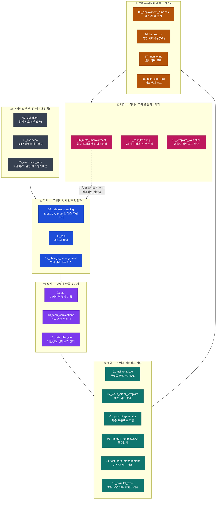
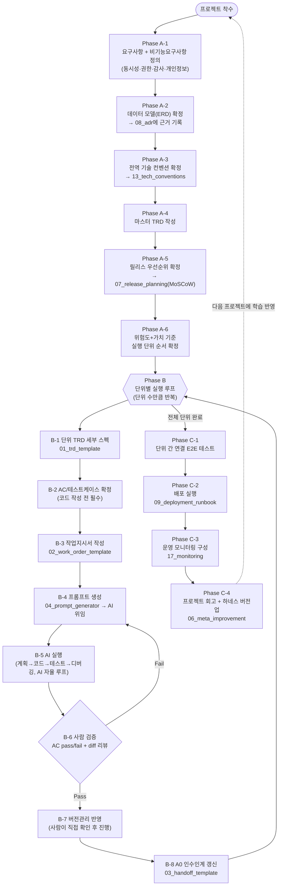
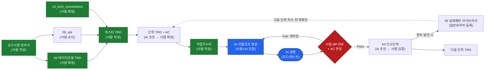
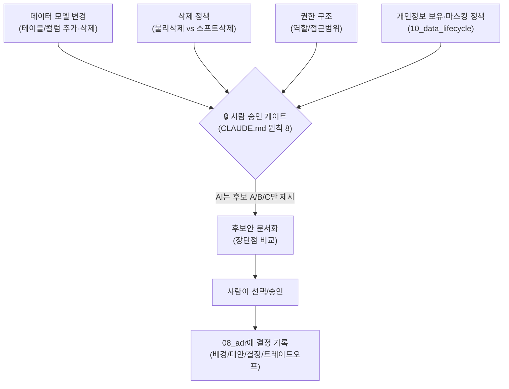

# 하네스 시스템 전체 구조도

> 이 문서는 `harness/` 21종 문서의 전체 구조를 한눈에 보기 위한 시각 자료입니다.
> 각 문서의 상세 내용은 해당 `harness_NN_*.md` 파일을, "왜 필요한가"는
> 루트 `CLAUDE.md` "확장 문서" 섹션을 참조하세요. 이 저장소는 도메인
> 중립이므로, 아래 다이어그램도 특정 업무 프로그램과 무관한 범용 구조입니다.

---

## 1. 전체 레이어 구조 (문서 21종 배치)

프로젝트 생애주기를 "거버넌스 백본 + 5개 레이어"로 나눠 문서를 배치합니다.
화살표는 레이어 간 진행 순서, 점선은 회고 루프를 뜻합니다.

---

## 2. 표준 실행 절차 (SOP) — Phase A → B → C

Phase A는 프로젝트당 1회, Phase B는 실행 단위 수만큼 반복, Phase C는 마감 시 1회입니다.

---

## 3. 문서 간 데이터 흐름 — 누가 누구에게 무엇을 넘기는가

Phase B(단위별 실행 루프) 안에서 문서가 실제로 어떻게 서로 입력/출력이 되는지를
보여줍니다. "사람 작성"과 "AI 초안"을 구분해 어디서 검증 게이트가 걸리는지 표시합니다.

---

## 4. 되돌리기 어려운 결정 — 사람 승인 게이트가 걸리는 지점

하네스 전체에서 "AI가 혼자 확정할 수 없고 후보안만 내야 하는" 지점만 따로 모았습니다.

---

## 5. 문서 목차 요약표

| 코드 | 이름 | 레이어 | 우선순위 |
|---|---|---|---|
| `00_definition` | 하네스 정의(전체 지도) | 백본 | 기본 |
| `00_overview` | SOP·원칙 | 백본 | 기본 |
| `05_execution_infra` | 실행 인프라(브랜치/CI/권한) | 백본 | 기본 |
| `01_trd_template` | TRD 템플릿 | 실행 | 기본 |
| `02_work_order_template` | 작업지시서 | 실행 | 기본 |
| `03_handoff_template` | A0 인수인계 | 실행 | 기본 |
| `04_prompt_generator` | 프롬프트 생성기 | 실행 | 기본 |
| `06_meta_improvement` | 회고·실패패턴 | 메타 | 기본 |
| `07_release_planning` | 릴리스·우선순위 계획 | 기획 | 🔴 Critical |
| `08_adr` | ADR | 설계 | 🔴 Critical |
| `09_deployment_runbook` | 배포·롤백 절차 | 운영 | 🔴 Critical |
| `10_data_lifecycle` | 개인정보 생애주기 | 설계 | 🔴 Critical |
| `11_raci` | RACI | 기획 | 🟡 Important |
| `12_change_management` | 변경관리 | 기획 | 🟡 Important |
| `13_tech_conventions` | 전역 기술 컨벤션 | 설계 | 🟡 Important |
| `14_test_data_management` | 테스트 데이터 관리 | 실행 | 🟡 Important |
| `15_parallel_work` | 병렬 작업 관리 | 실행 | 🟡 Important |
| `16_tech_debt_log` | 기술부채 로그 | 운영 | 🟢 Nice |
| `17_monitoring` | 모니터링·알림 | 운영 | 🟢 Nice |
| `18_cost_tracking` | 비용·시간 추적 | 메타 | 🟢 Nice |
| `19_template_validation` | 템플릿 검증 체크 | 메타 | 🟢 Nice |
| `20_backup_dr` | 백업·재해복구 정책 | 운영 | 🔴 Critical |

**최소 시작 경로**: 급하고 작은 프로젝트라면 `00_overview → 01 → 02 → 05` 네 개만
읽고 시작해도 됩니다. 나머지는 위 §1 지도 순서대로 필요할 때 끌어다 쓰면 됩니다.
1인 프로젝트에서 어떤 문서를 생략해도 되는지는 `19_template_validation.md` §4를
참고하세요.
