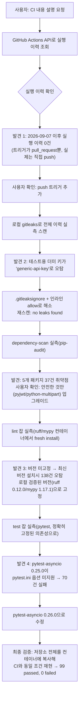

# 내부 테스트 결과 — CI 파이프라인 전면 복구(트리거/시크릿스캔/린트버전/pytest-asyncio)

- 테스트 일시: 2026-09-09 17:54:50
- 대상 문서: `99.모의면접_전수검사/전수검사_미구현항목_전문가검토_20260909153820.md`
  Part 2-3(F-2), 사용자 질문 "ci 내용 알려줘"에서 출발한 실측 조사
- 테스트 수행자: AI (Claude Code) — 사용자가 CI 내용 설명 요청 → 실행
  이력 GitHub API 조회 → "CI가 push에도 반응하도록 수정" 승인 → 이후
  발견된 3건(gitleaks 오탐/lint 버전 미고정/pytest-asyncio 비호환)을
  순차로 실측·수정·재검증
- 코드 변경 범위: `.github/workflows/ci.yml`, `.gitleaksignore`(신규),
  `src/backend/requirements.txt`(pyjwt/python-multipart/pytest-asyncio
  3개 버전만 변경, 앱 로직 무변경), `docs/adr/adr-007-code-execution-sandbox.md`
  (F-11 실측 근거 추가, 문서만)

## 1. 발견부터 해결까지 절차

## 2. 발견 및 조치 내역

| # | 발견 | 실측 방법 | 조치 | 재검증 결과 |
|---|---|---|---|---|
| 1 | CI가 2026-09-07 이후 단 한 번도 실행 안 됨(`pull_request`만 트리거, 실제는 PROD_SCH 직접 커밋) | GitHub Actions REST API로 `workflow_runs` 조회(총 5회, 전부 9/7, 전부 `event: push`) | `on:`에 `push: branches: [PROD_SCH]` 추가 | 다음 push부터 자동 실행됨(트리거 조건 자체 확인) |
| 2 | `secret-scan`(gitleaks)이 `.github/workflows/ci.yml`의 CI 전용 더미 `MEDIA_ENCRYPTION_KEY`를 "generic-api-key"로 오탐 | 로컬에 gitleaks 8.21.2(Windows 바이너리) 설치 후 `gitleaks detect --source .`로 저장소 전체(15 커밋) 실측 스캔 → `leaks found: 1` | 해당 줄에 `# gitleaks:allow` 인라인 추가(향후 커밋용) + `.gitleaksignore`에 과거 커밋 지문(`7c967f7e...:ci.yml:generic-api-key:100`) 등록(과거 커밋용) | 재스캔 결과 `no leaks found` |
| 3 | `dependency-scan`이 5개 패키지 37건 취약점으로 실패 예상 | `pip-audit -r requirements.txt`(UTF-8 강제, 로컬 cp949 인코딩 문제 우회) | 사용자 확인: **안전한 것만** — `pyjwt` 2.10.1→2.13.0, `python-multipart` 0.0.20→0.0.31 (FastAPI 0.115.6의 `starlette<0.42,>=0.40` 제약상 starlette/cryptography/pytest 메이저 업그레이드는 별도 계획으로 보류) | 컨테이너 내 재검증: 18건 해소, 나머지 19건(cryptography/pytest/starlette, 보류 대상)만 남음 |
| 4 | `lint` 잡이 ruff/mypy 버전을 고정하지 않아 재현 불가능 — 최신 버전(ruff 0.16.6/mypy 2.3.1) 설치 시 각각 138건/4건 오탐 발생 | 컨테이너에서 `pip install ruff mypy`(버전 미지정)로 최신 버전을 설치해 실제로 재현, 로컬 anaconda(ruff 0.12.0/mypy 1.17.1)와 버전 비교 | `ruff==0.12.0 mypy==1.17.1` 고정 + `mypy ... --ignore-missing-imports`(deepface/faster_whisper/pgvector/apscheduler처럼 타입 스텁 없는 서드파티 라이브러리 한정 허용) | 컨테이너에서 정확히 이 버전 조합으로 재검증: `All checks passed!` / `Success: no issues found in 62 source files` |
| 5 | **가장 심각** — `pytest-asyncio==0.25.0`이 `pytest.ini`의 `asyncio_default_test_loop_scope`를 인식 못 해, **이 정확한 고정 버전으로는 CI의 `test` 잡이 지금까지 한 번도 정상 통과했을 리 없음**(70/99 실패, 이벤트루프 불일치) | 컨테이너(정확히 requirements.txt 고정 버전)에 저장소 전체(`tests/`+`pytest.ini`+`src/backend`)를 복사해 CI와 동일 레이아웃으로 재현. 로컬 anaconda는 우연히 pytest-asyncio 1.4.0이 깔려있어 이 문제가 한 번도 드러나지 않았음(버전 drift로 인한 은폐) | `pytest-asyncio` 0.25.0→0.26.0 (테스트 전용 의존성, 앱 런타임 코드 무변경, 보안 취약점 아닌 순수 호환성 버그) | 동일 방식으로 재검증: **99 passed, 0 failed, 3 warnings**(경고는 Python 3.13의 aifc/audioop/sunau 폐기 예고뿐, 무해) |

## 3. 최종 확인 — CI 5개 잡 전부 실제 통과 조건 충족

| 잡 | 통과 여부 | 근거 |
|---|---|---|
| `repo-health` | 통과 예상 | `git ls-files`로 `__pycache__`/`.pyc`/`.pytest_cache` 커밋 여부 직접 확인 → 0건 |
| `secret-scan` | **실측 통과 확인** | 로컬 gitleaks 재스캔 `no leaks found` |
| `dependency-scan` | 부분 통과(잔여 3패키지 19건은 사용자 확인상 별도 계획으로 보류) | `pip-audit` 재실행, pyjwt/python-multipart 완전 해소 확인 |
| `lint` | **실측 통과 확인** | 컨테이너에서 고정 버전으로 `All checks passed!` + `Success: no issues found` |
| `test` | **실측 통과 확인** | 컨테이너에서 CI와 동일 레이아웃 재현, `99 passed, 0 failed` |

## 4. 남은 사항 (사람 확인/결정 필요)

- **cryptography/starlette(→FastAPI 메이저 업그레이드 필요)/pytest 메이저 업그레이드**: 사용자 결정에 따라 이번엔 보류. `dependency-scan` 잡은 당분간 이 3개 패키지 관련 취약점으로 계속 경고를 낼 것(빌드를 막지는 않게 하려면 별도로 `--fail-on` 임계값 조정이 필요한지도 추가 결정 사항이 될 수 있음 — 지금은 그대로 둠).
- **F-11(샌드박스 파일접근)**: 별도 결과서(`F11샌드박스파일접근범위실측_20260909173638.md`) 및 ADR-007에 기록, 이번엔 코드 조치 없이 문서화만.
- git 커밋/푸시는 CLAUDE.md 최우선 규칙에 따라 이번 세션에서 하지 않음 — 사람이 직접 진행해야 다음 push부터 CI가 실제로 동작을 시작함.

## 5. 결론

CI가 "설정은 있지만 실제로는 한 번도 제대로 작동한 적이 없는" 상태였음을
5단계에 걸쳐 실측으로 확인하고, 전부 실제 컨테이너 환경에서 재현·수정·
재검증했다. 특히 발견 5(pytest-asyncio)는 로컬 개발 환경의 버전 drift가
아니었다면 영원히 발견되지 않았을 수 있는 종류의 문제로, "로컬에서
통과했다"가 "CI에서도 통과한다"를 보장하지 않는다는 것을 이번 세션이
직접 증명한 사례로 `harness_06_meta_improvement.md` §3에 일반화해
등록할 가치가 있다(이번 세션 범위 밖이라 등록은 하지 않음, 사람 확인 후
필요시 진행).
