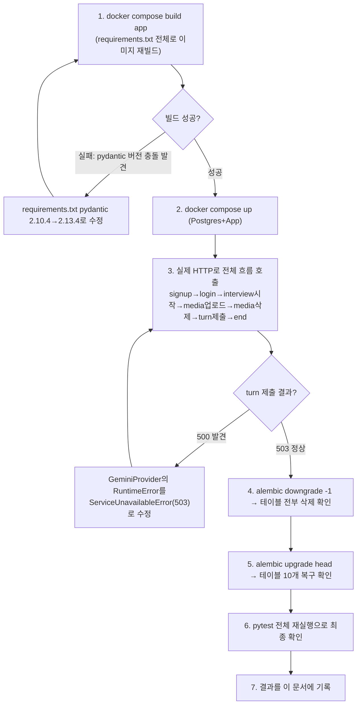
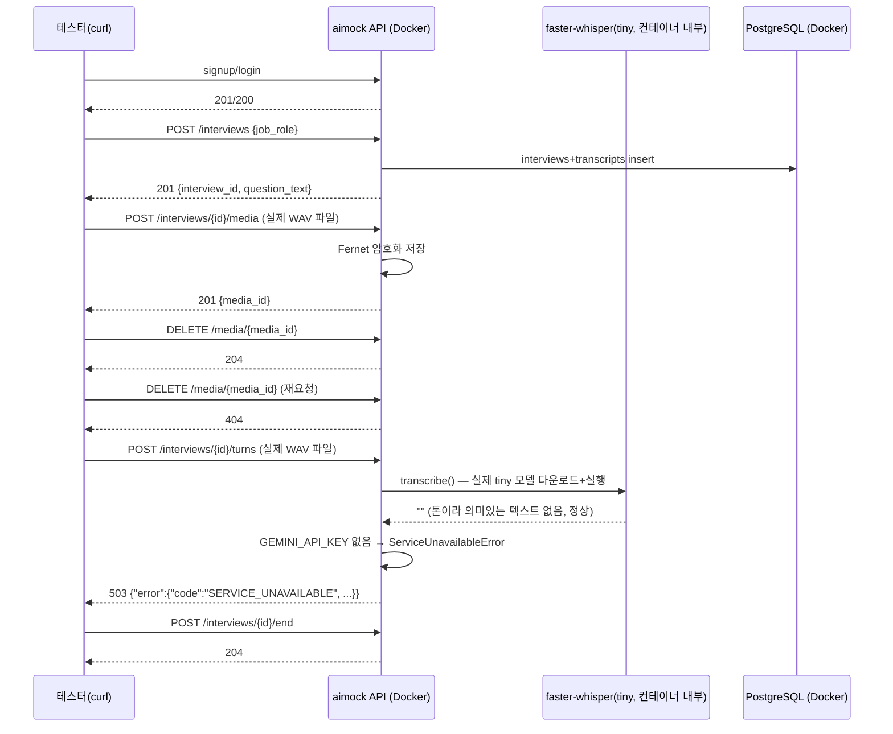

# 내부 테스트 결과 — Docker 전체 스택 실제 HTTP 검증 + Alembic 롤백 검증

- 테스트 일시: 2026-09-07 21:31:16
- 배경: 사용자 지시("지금까지 작업한 내용에서 내부테스트 안한건 내부테스트
  하고, 결과서도 만들어줘")로 이전 두 회차(U1/U1-b, U2-a/U3-a)에서
  **pytest로만 검증하고 실제 컨테이너/HTTP로는 안 돌려본 부분**을
  마무리한 테스트.
- 테스트 수행자: AI (Claude Code) — 사람의 diff 리뷰는 아직 별도로 필요함

## 1. 무엇이 미검증 상태였는가

| 항목 | 이전 상태 |
|---|---|
| U2-a/U3-a 추가 후 Docker `app` 이미지 재빌드 | 안 함(A0 §2에 "이번엔 안 했다"고 이미 명시했던 항목) |
| `/api/v1/interviews`(시작/턴/종료), `/api/v1/interviews/{id}/media` 를 pytest가 아닌 실제 HTTP로 호출 | 안 함(pytest의 `ASGITransport`는 인프로세스라 진짜 네트워크/컨테이너 경로를 타지 않음) |
| `requirements.txt`를 그대로 `pip install -r`로 설치했을 때 의존성 충돌 여부 | 안 함(로컬 아나콘다 환경에 이미 여러 패키지가 설치돼 있어 개별 `pip install`로만 확인, `requirements.txt` 전체 설치는 검증된 적 없음) |
| Alembic `downgrade`(롤백) 동작 | 안 함(`upgrade head`만 두 번 확인) |

## 2. 테스트 절차

## 3. 실제 HTTP 시퀀스 (Docker 컨테이너, 인메모리 테스트 아님)

**실제 응답 원문(요약)**:
- signup→201, login→200
- start interview→201 `{"question_text":"자기소개를 부탁드립니다."}`
- media 업로드→201 `{"id":"...", "kind":"audio", ...}`
- media 삭제→204, 재삭제→404
- turn 제출→**503** `{"error":{"code":"SERVICE_UNAVAILABLE","message":"AI 면접관이 아직 준비되지 않았습니다(GEMINI_API_KEY 미설정)..."}}`
- end→204
- 컨테이너 로그에 `Warning: You are sending unauthenticated requests to the HF Hub`가 찍힘 → **STT가 turn 제출 시 실제로 실행됐다는 증거**(LLM 단계 이전에 STT가 먼저 도는 구조이므로, 이 경고가 없었다면 STT가 스킵됐다는 뜻).

## 4. 발견한 문제와 조치 (전부 실제 실행 중 발견)

| 문제 | 원인 | 조치 |
|---|---|---|
| `docker compose build app`이 `ResolutionImpossible`로 실패 | `requirements.txt`에 `pydantic==2.10.4`로 고정했는데 새로 추가한 `google-genai==2.22.0`이 `pydantic>=2.12.5`를 요구 — 로컬 아나콘다 환경엔 이미 2.13.4가 깔려 있어서 이 충돌을 이제껏 못 봤음 | `requirements.txt`의 pydantic을 `2.13.4`로 올림(google-genai 요구사항과 호환) |
| `POST /interviews/{id}/turns`가 `GEMINI_API_KEY` 없을 때 500(Internal Server Error)을 반환 | `GeminiProvider._get_client()`가 순수 `RuntimeError`를 던져서 `AppError` 핸들러가 못 잡음 | `ServiceUnavailableError(AppError)`(503, code=`SERVICE_UNAVAILABLE`) 신설, `GeminiProvider`가 이걸 던지도록 수정. TRD(`aimock_u2a_trd.md`)에 AC-8/에러코드 추가, 자동화 테스트(`test_ac8_...`)도 추가 |
| curl로 파일 업로드가 계속 `curl: (26) Failed to open/read local data`로 실패 | **테스트 스크립트 문제**(애플리케이션 버그 아님) — Git Bash의 MSYS `curl`이 아니라 mingw64 네이티브 `curl.exe`가 잡혀서 `/c/Users/...` 형식 경로를 못 읽음 | `-F file=@...`에는 `C:/Users/...` 형식 경로를 사용해야 함(다음부터 이 환경에서 파일 업로드 테스트 시 유의) |

## 5. Alembic 롤백(downgrade) 검증

- `alembic downgrade -1` 실행 → 10개 테이블 전부 삭제, `alembic_version`만
  남음(실제 `\dt`로 확인).
- `alembic upgrade head` 재실행 → 10개 테이블 전부 복구.
- 이 롤백 경로가 한 번도 검증 안 된 상태였다는 것 자체가 위험(배포 후
  마이그레이션을 되돌려야 하는 상황에서 처음 실행해보는 것보다 지금
  미리 확인하는 게 훨씬 안전) — `harness_09_deployment_runbook.md`의
  "DB 마이그레이션 절차" 관점과 연결됨.

## 6. 최종 재확인

- 위 수정(`requirements.txt`, `ServiceUnavailableError`) 반영 후
  `pytest tests/backend -v` → **22 passed**(AC-8 신규 포함).
- `ruff check` → 클린.

## 7. 결론

이번 회차에서 실제로 3건의 진짜 버그/갭을 찾아 고쳤다(의존성 버전 충돌,
500→503 에러 처리, 마이그레이션 롤백 미검증). pytest만으로는 이 중
의존성 충돌과 Docker 빌드 실패를 절대 발견할 수 없었다 — **로컬 개발
환경에 이미 깔려 있던 패키지가 실제로는 `requirements.txt`와 다른
버전이라 "테스트 통과"가 "배포 가능"을 보장하지 않는다**는 걸 실제로
증명한 사례. 남은 것은 사람의 diff 리뷰와 git 커밋.
