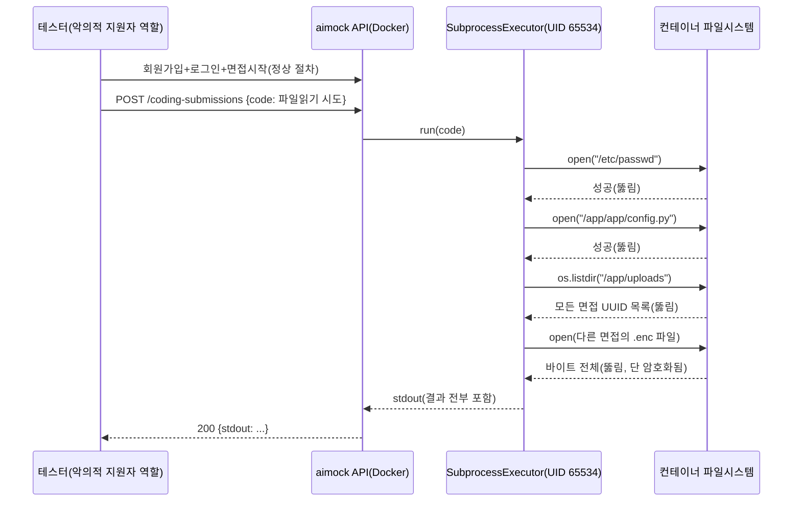

# 내부 테스트 결과 — F-11(라이브 코딩 샌드박스 파일시스템 접근 범위 실측)

- 테스트 일시: 2026-09-09 17:36:38
- 대상 문서: `99.모의면접_전수검사/전수검사_미구현항목_전문가검토_20260909153820.md`
  Part 3-2, `docs/adr/adr-007-code-execution-sandbox.md` "3단계"
- 테스트 수행자: AI (Claude Code) — 사용자가 "전문가검토 문서를 기준으로
  해결해야 할 부분 검토후 조치"를 지시. F-11(파일시스템 격리 부재)이
  "지금까지 실측된 적이 없다"는 지적을 받아, 실제로 뚫려있는지/얼마나
  뚫려있는지를 먼저 실측한 뒤, AskUserQuestion으로 처리 방향(지금은
  문서화만 하고 chroot 등 완화는 보류)을 확인받고 진행.
- 코드 수정 여부: **없음**(순수 실측 검증. ADR-007 문서화만 별도로 진행)

## 1. 배경

기존 ADR-007은 "파일시스템 격리가 없다"고 원론적으로만 적혀 있었고,
정확히 무엇을 읽을 수 있고 무엇은 막혀 있는지 재현 가능한 형태로
확인된 적이 없었다. 이번 테스트는 실제 Docker 컨테이너 + 실제 라이브
코딩 API(`POST /api/v1/interviews/{id}/coding-submissions`)로 6가지
공격 시나리오를 직접 실행해 정확한 범위를 확정했다.

## 2. 테스트 시나리오별 결과

| # | 시도한 것 | 코드(요지) | 결과 | 심각도 |
|---|---|---|---|---|
| 1 | 시스템 파일 읽기 | `open("/etc/passwd").read()` | **성공(뚫림)** — 시스템 계정 목록 노출 | 중 |
| 2 | 앱 소스코드 읽기 | `open("/app/app/config.py").read()` | **성공(뚫림)** — 이번 파일엔 시크릿 리터럴 없었으나 다른 파일을 노리면 위험 확대 가능 | 중 |
| 3 | 디렉터리 목록 | `os.listdir("/app")`, `os.listdir("/app/uploads")` | **성공(뚫림)** — `/app/uploads`에서 **이 컨테이너에 저장된 모든 면접의 UUID 10개** 확인됨 | 중 |
| 4 | 타인 암호화 파일 열람 | 위에서 얻은 UUID로 다른 면접 폴더의 `.enc` 파일 전부 오픈 | **성공(뚫림)** — 실제로 10개 이상 파일, 최소 11KB~최대 1,042,702 bytes까지 바이트 전체 읽기 성공 | **상**(암호화로 내용은 보호되나 접근통제 위반 자체가 심각) |
| 5 | 환경변수 조회 | `os.environ` 전체 출력 | **차단됨** — `PATH`(+libc가 자동으로 넣는 항목)만 노출, 앱 시크릿 없음 | - |
| 6 | 타 프로세스 시크릿 탈취 | `/proc/<1..19>/environ` 순회 열람 시도(메인 서버 프로세스의 진짜 환경변수 노리기) | **차단됨** — 본인 프로세스(`/proc/self/environ`) 외엔 전부 읽기 거부(권한 오류로 조용히 실패). UID 분리(비root vs 메인 프로세스)가 실제로 작동함 | - |

## 3. 판정

- **뚫려있는 범위**: 파일 읽기, 디렉터리 목록, **다른 면접의 암호화된
  업로드 파일 전체(#3, #4)**. 이건 "이론적 한계"가 아니라 **실제로
  재현되는 접근통제 위반**이다.
- **막혀있는 범위**: 환경변수(`os.environ`)와 `/proc/<pid>/environ`을
  통한 다른 프로세스의 시크릿 탈취(#5, #6) — 기존 allowlist와 UID
  분리가 이 두 경로에 대해서는 실제로 유효하다.
- **완화 가능성 조사**: 로컬 컨테이너의 `/proc/self/status`에서
  `CapEff` 비트마스크(`00000000a80425fb`)를 직접 해석해 `CAP_SYS_CHROOT`
  (bit 18)가 존재함을 확인 — 이론상 서브프로세스 실행 전 chroot로
  격리하는 완화가 로컬에서는 기술적으로 가능해 보인다. 단, 이건
  **로컬 docker-compose 환경 확인일 뿐이고, Render 배포 환경에서 같은
  capability가 주어지는지는 별개 문제라 배포해봐야 확인 가능**하다.

## 4. 조치 방향 (사용자 확인 완료)

AskUserQuestion으로 확인한 결과: **"지금은 알려진 한계로 문서화만 하고
보류"**를 선택. 근거: chroot 완화는 최소 Python 런타임 구성 등 상당한
엔지니어링이 필요하고, 정상 코드 실행이 깨질 회귀 위험이 있으며, 이
프로젝트가 여전히 "본인/제한적 공개" 단계라는 기존 위협모델
(ADR-007 §"사용자 확인(2026-09-08)")이 유효하기 때문. 이번 세션에서는
**코드를 변경하지 않고**, 이 실측 결과를 `docs/adr/adr-007-code-execution-sandbox.md`
"3단계"에 근거로 남기고 "공개 배포 전 필수 재검토" 목록을 막연한
서술에서 재현 가능한 구체적 사실(#1~#4)로 교체했다.

## 5. 결론

F-11은 "확인 안 됨"에서 "확인됨 — 정확히 무엇이 뚫려있고 무엇은
막혀있는지 재현 가능"으로 상태가 바뀌었다. 코드 조치는 사용자 결정에
따라 이번엔 보류하며, 다음에 이 프로젝트를 공개 범위로 확장하려 할 때
반드시 먼저 참조해야 할 구체적 체크리스트가 ADR-007에 남았다.
