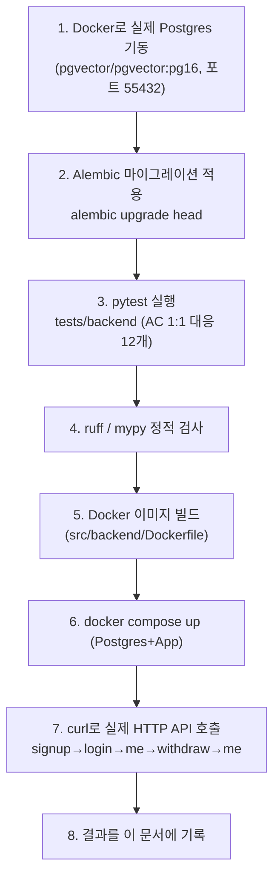
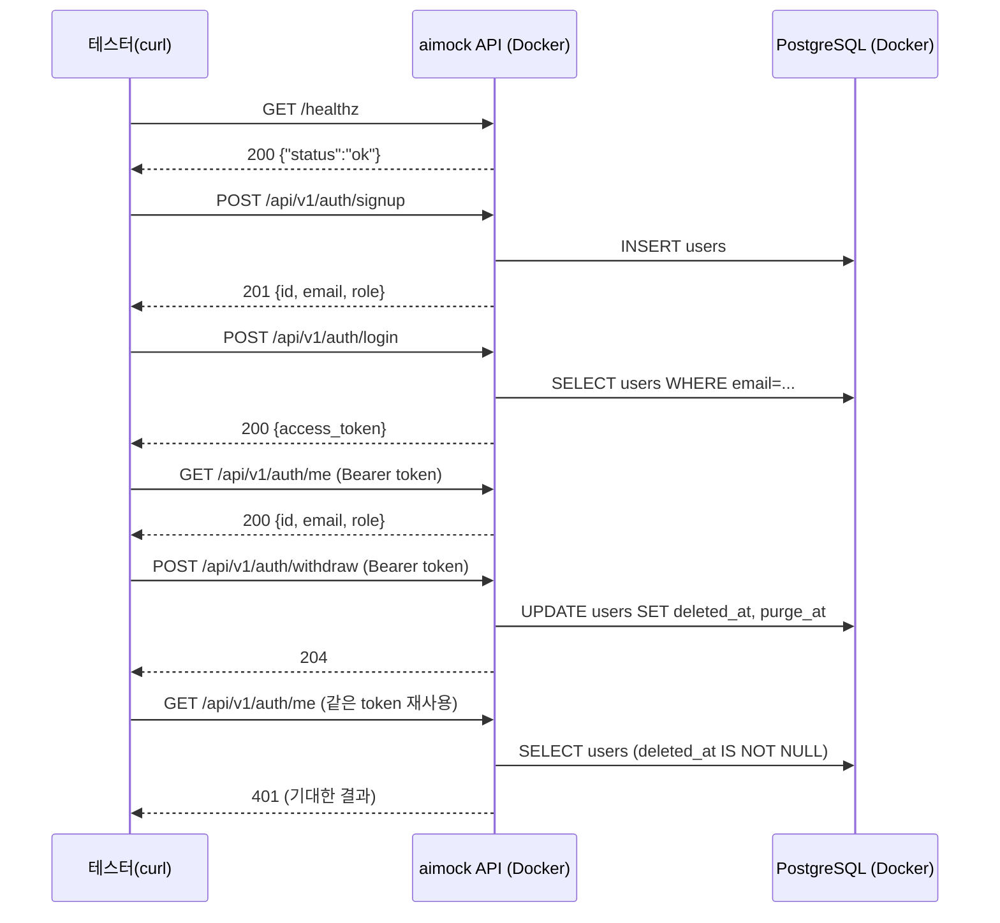

# 내부 테스트 결과 — U1(인증/탈퇴) + U1-b(미디어 저장/삭제)

- 테스트 일시: 2026-09-07 20:59:30
- 대상 TRD: `docs/trd/aimock_u1_trd.md`, `docs/trd/aimock_u1b_trd.md`
- 대상 작업지시서: `docs/workorder/aimock_u1_workorder.md`
- 테스트 수행자: AI (Claude Code) — 사람의 diff 리뷰는 아직 별도로 필요함

## 1. 무엇을 어떻게 테스트했는가

3단계로 실제 환경에서 검증했다(mock 없이 실제 Postgres 컨테이너 사용).

## 2. AC별 pass/fail

### U1 (인증/계정+탈퇴) — `docs/trd/aimock_u1_trd.md` §5

| AC | 내용 | 결과 |
|---|---|---|
| AC-1 | signup 시 비밀번호가 평문으로 저장되지 않음 | **PASS** |
| AC-2 | 이메일 중복 가입 시 409 | **PASS** |
| AC-3 | 로그인 성공/실패(401) | **PASS** |
| AC-4 | 토큰 없이 `/me` 호출 시 401 | **PASS** |
| AC-5 | 탈퇴 후 같은 토큰이 즉시 무효화 | **PASS** |
| AC-6 | 유예기간 내 재로그인 시 계정 복구 | **PASS** |
| AC-7 | `purge_at` 경과 사용자가 스케줄러로 물리 삭제 | **PASS** |

### U1-b (미디어 저장/삭제) — `docs/trd/aimock_u1b_trd.md` §5

| AC | 내용 | 결과 |
|---|---|---|
| AC-1 | 업로드 파일이 암호화되어 저장(평문과 다름, 복호화 시 원본과 일치) | **PASS** |
| AC-2 | 삭제 요청 시 파일+레코드 즉시 삭제 | **PASS** |
| AC-3 | 이미 삭제된 media_id 재삭제 시 404 | **PASS** |
| AC-4 | 타인 소유 media 삭제 시도 시 403 | **PASS** |
| AC-5 | 계정 파기 연쇄 시 사용자의 모든 media_assets 삭제 | **PASS** |

**pytest 실행 결과 원문**: `12 passed in 9.48s` (재실행 로그 기준,
`pytest tests/backend -v`). `ruff check src/backend` → `All checks
passed!`. `mypy src/backend/app --ignore-missing-imports` → `Success:
no issues found in 30 source files`.

## 3. Docker 컨테이너 기동 후 실제 HTTP 호출 (수동 스모크 테스트)

실제 응답(요약): `healthz`→`{"status":"ok"}`, `signup`→201, `login`→토큰
발급, `me`→200, `withdraw`→204, `withdraw` 후 `me`→**401**(정상).

## 4. 발견된 문제와 조치

| 문제 | 원인 | 조치 |
|---|---|---|
| signup 호출 시 500 (`password cannot be longer than 72 bytes`) | `passlib==1.7.4`가 최신 `bcrypt`(5.x)와 호환성 버그 | `passlib` 제거, `bcrypt` 라이브러리 직접 사용(`app/core/security.py`), `requirements.txt`에 `bcrypt==4.2.1` 고정 |
| Docker 이미지 기동 시 `ImportError: email-validator is not installed` | 로컬 아나콘다 환경엔 이미 있었지만 Docker 이미지엔 없음(암묵적 의존성) | `requirements.txt`를 `pydantic[email]`로 수정 후 이미지 재빌드, 재현 확인 |
| `docker compose up` 시 포트 바인딩 실패 | 로컬에 무관한 다른 프로젝트의 Postgres가 이미 5432 점유 | `docker-compose.yml` 호스트 포트를 `55432`로 변경 |
| pytest 2번째 테스트부터 `RuntimeError: ... attached to a different loop` | pytest-asyncio가 테스트마다 새 이벤트 루프를 만들어 SQLAlchemy 비동기 엔진과 충돌 | `pytest.ini`에 `asyncio_default_fixture_loop_scope`/`asyncio_default_test_loop_scope = session` 추가 |

## 5. 결론

U1/U1-b는 명세(TRD)대로 실제 환경에서 동작함을 확인했다. 남은 것은 사람의
diff 리뷰와 git 커밋(AI는 git 작업을 하지 않음, CLAUDE.md 최우선 규칙).
