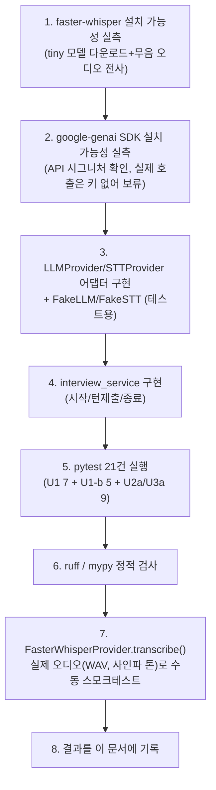
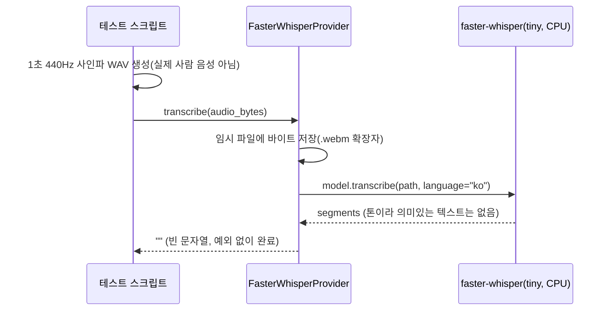

# 내부 테스트 결과 — U2-a(턴 기반 질문-답변) + U3-a(STT/LLM 파이프라인)

- 테스트 일시: 2026-09-07 21:16:37
- 대상 TRD: `docs/trd/aimock_u2a_trd.md`, `docs/trd/aimock_u3a_trd.md`
- 대상 작업지시서: `docs/workorder/aimock_u2a_workorder.md`
- 테스트 수행자: AI (Claude Code) — 사람의 diff 리뷰는 아직 별도로 필요함

## 1. 무엇을 어떻게 테스트했는가

**LLM은 실제로 호출하지 않았다** — `GEMINI_API_KEY`가 아직 없음(ADR-002
미결 항목). `GeminiProvider` 코드는 실제 SDK(`google-genai`) 시그니처를
확인해 정확하게 작성했지만, 자동화 테스트/수동 테스트 모두 `FakeLLMProvider`
로 어댑터 교체가 실제로 되는지만 검증했다. **STT는 실제로 호출했다** —
`faster-whisper`의 `tiny` 모델을 실제로 다운로드해 로드하고, 실제 오디오
바이트(사인파 WAV)를 `FasterWhisperProvider.transcribe()`에 넣어 예외 없이
동작함을 확인했다(의미있는 음성 인식 정확도 검증은 실제 사람 음성 샘플이
필요해 범위 밖 — TRD §6에 "자동화 불가"로 명시된 부분).

## 2. AC별 pass/fail

### U2-a (턴 기반 질문-답변) — `docs/trd/aimock_u2a_trd.md` §5

| AC | 내용 | 결과 |
|---|---|---|
| AC-1 | 면접 시작 시 live 상태 interview + 첫 질문 생성 | **PASS** |
| AC-2 | 턴 제출 시 user/ai transcript가 각각 저장됨 | **PASS** |
| AC-3 | 800자 초과 답변은 LLM 호출 없이 고정 문구 반환 | **PASS** (fake_llm.call_count == 0으로 직접 확인) |
| AC-4 | LLM이 end_interview 반환 시 interview가 completed로 전환 | **PASS** |
| AC-5 | `/end` 호출 시 즉시 completed로 전환 | **PASS** |
| AC-6 | 타인 소유 interview에 턴 제출 시 403 | **PASS** |
| AC-7 | completed 상태에 턴 제출 시 409 | **PASS** |

### U3-a (STT/LLM 파이프라인) — `docs/trd/aimock_u3a_trd.md` §5

| AC | 내용 | 결과 |
|---|---|---|
| AC-1 | Fake Provider로 교체해도 동일하게 동작(어댑터 패턴) | **PASS** (모든 U2-a 테스트가 FakeLLM/FakeSTT로 통과한 것 자체가 증거) |
| AC-2 | 실제 faster-whisper가 오디오를 예외 없이 전사 | **PASS (수동 확인)** — 아래 §3 |
| AC-3 | `retrieve_candidates(category="backend")`가 조건에 맞는 질문 반환 | **PASS** |
| AC-4 | LLM 스키마 위반 응답 시 안전한 폴백으로 처리 | **PASS** |

**pytest 실행 결과 원문**: `21 passed in 16.84s` (`pytest tests/backend -v`,
U1 7건 + U1-b 5건 + U2-a/U3-a 9건 전부 누적 포함). `ruff check src/backend
tests/backend` → `All checks passed!`. `mypy src/backend/app
--ignore-missing-imports` → `Success: no issues found in 40 source files`.

## 3. 실제 faster-whisper 수동 스모크테스트 (AC-2)

결과: 예외 없이 완료(`text=''`, 순수 톤이라 텍스트가 없는 것은 정상).
**의미 있는 한국어 음성 인식 정확도는 실제 사람 음성 샘플로 별도 수동
UAT가 필요**(TRD §6에 이미 "자동화 불가"로 명시됨 — 이번 테스트는 파이프라인
자체의 동작(모델 로드, 임시파일 생성/삭제, 디코딩 경로)만 검증한 것).

## 4. 판단 근거 (스펙에 없어 채운 세부사항)

- Transcript 정렬을 위해 `created_at`을 DB `server_default now()`가 아닌
  Python 쪼 `datetime.now(timezone.utc)`로 변경 — 같은 트랜잭션 내 여러
  INSERT가 server_default를 쓰면 전부 같은 타임스탬프가 되어 대화 순서가
  뒤섞이는 문제를 실제로 발견하고 수정함(구현 중 발견, A0 §3에도 기록).
- `retrieve_candidates()`는 임베딩 벡터 검색이 아닌 category/difficulty
  필터로 구현(ADR-002/TRD §7에 이미 명시된 미결 항목의 기본값 적용).

## 5. 결론

U2-a/U3-a는 명세(TRD)대로 동작함을 확인했다(Gemini 실제 호출 제외, 이는
API 키 확보 후 별도 검증 필요 — §7 미결 항목). 남은 것은 사람의 diff
리뷰와 git 커밋.
