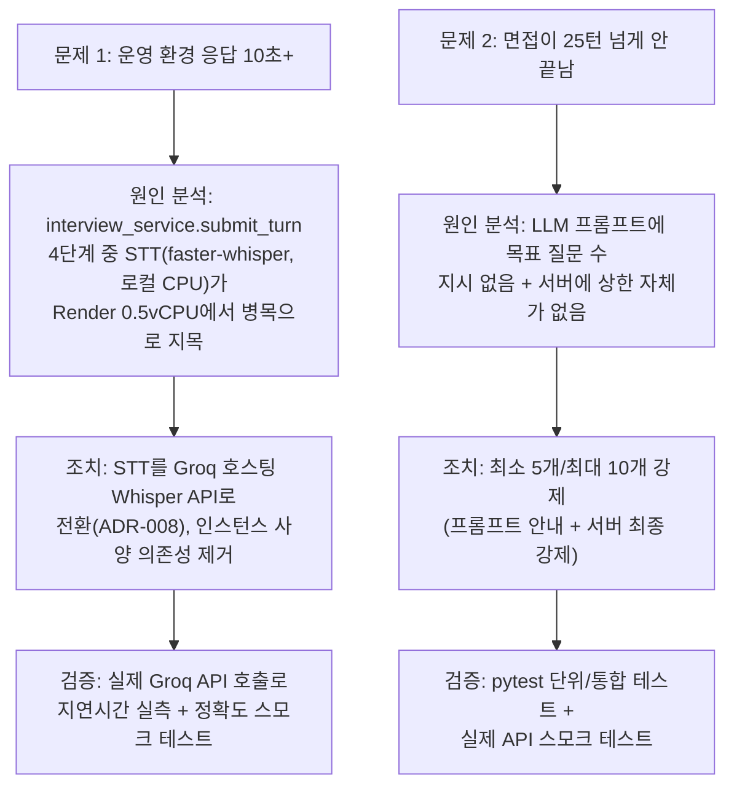
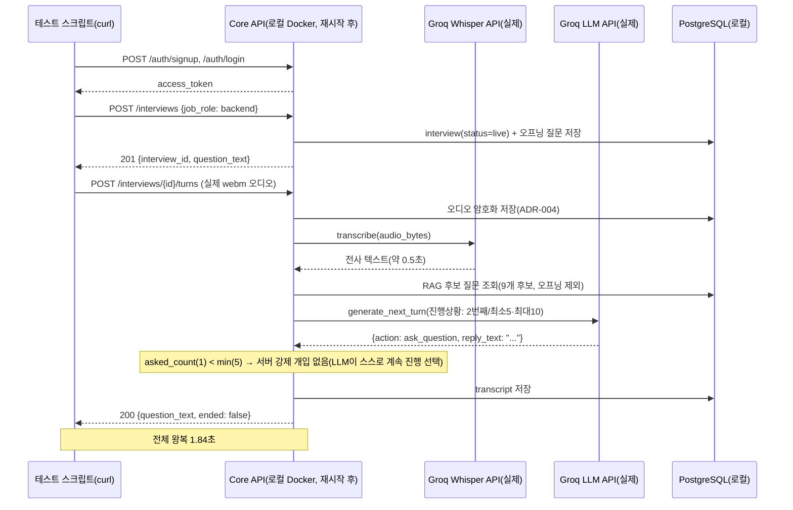

# 내부테스트결과서 — U2-a 보완: STT를 Groq로 전환 + 면접 질문 개수 최소/최대 제한

- 작전명: U2a보완_STT전환및질문개수제한
- 일시: 2026-09-08
- 관련 문서: `docs/adr/adr-008-stt-groq-hosted-whisper.md`,
  `docs/trd/aimock_u2a_trd.md`(§3, AC-9/AC-10),
  `docs/trd/aimock_u3a_trd.md`(§2, AC-5), `docs/trd/aimock_master_trd.md`(N-001)
- 계기: 사용자가 운영 환경(Render)에서 두 가지 실사용 문제를 직접 보고
  1. 턴 제출 응답이 10초 이상 걸림
  2. 면접이 턴 25까지 진행돼도 끝나지 않음

## 0. 무엇을 왜 테스트했는지 (요약)



## 1. 코드 변경 요약

| 파일 | 변경 내용 |
|---|---|
| `app/ai/stt.py` | `GroqWhisperProvider` 신규 추가(`AsyncGroq().audio.transcriptions.create`). `FasterWhisperProvider`는 되돌리기용으로 유지 |
| `app/ai/providers.py` | `_stt_provider` 조립을 `GroqWhisperProvider`로 교체(어댑터 패턴, 한 줄 교체) |
| `app/ai/llm.py` | `ConversationContext`에 `question_number`/`min_questions`/`max_questions` 필드 추가, `SYSTEM_PROMPT`·`_build_user_message`에 진행 상황 안내 추가 |
| `app/services/interview_service.py` | `_enforce_question_count_bounds()` 신규(서버 최종 강제), `submit_turn()`에서 `asked_count` 계산 후 적용 |
| `app/config.py` | `groq_stt_model`, `interview_min_questions`(5), `interview_max_questions`(10) 설정 추가 |
| `tests/backend/test_interview.py` | AC-9/AC-10 통합 테스트 2건 + 경계값 단위 테스트 4건 신규, 기존 AC-4 테스트를 새 min 규칙과 공존하도록 수정 |
| `docs/adr/adr-008-*.md` | 신규 ADR(STT 전환 결정 기록) |
| `docs/adr/adr-002-*.md`, `docs/trd/aimock_u2a_trd.md`, `docs/trd/aimock_u3a_trd.md`, `docs/trd/aimock_master_trd.md` | 위 변경을 반영해 갱신 |

## 2. 자동화 테스트 결과

### 2-1. ruff / mypy

```
$ python -m ruff check .
All checks passed!

$ python -m mypy .
Found 6 errors in 5 files (checked 61 source files)
```

mypy의 6건은 전부 **기존부터 있던** 서드파티 라이브러리 타입 스텁 누락
경고(`deepface`, `pgvector`, `faster_whisper`, `apscheduler`)이며, 이번에
수정한 파일(`stt.py`, `llm.py`, `providers.py`, `interview_service.py`,
`config.py`)에서 새로 발생한 에러는 0건.

### 2-2. pytest

```
$ python -m pytest -q
59 passed, 5 skipped, 2 warnings in 66.20s
```

| 대응 AC | 테스트 함수 | 결과 |
|---|---|---|
| AC-9(u2a) | `test_u2a_ac9_min_question_count_prevents_early_end_via_api` | PASS |
| AC-10(u2a) | `test_u2a_ac10_max_question_count_forces_end_via_api` | PASS |
| AC-9/10 경계값 | `test_u2a_enforce_bounds_allows_end_exactly_at_min` | PASS |
| AC-9/10 경계값 | `test_u2a_enforce_bounds_blocks_end_before_min_uses_candidate` | PASS |
| AC-9/10 경계값 | `test_u2a_enforce_bounds_blocks_end_before_min_falls_back_without_candidates` | PASS |
| AC-9/10 경계값 | `test_u2a_enforce_bounds_allows_ask_below_max` | PASS |
| AC-9/10 경계값 | `test_u2a_enforce_bounds_forces_end_at_max` | PASS |
| AC-4(u2a, 회귀) | `test_ac4_llm_end_signal_completes_interview`(min=1로 조정해 새 규칙과 공존 확인) | PASS |
| 기존 회귀 전체(U1/U1-b/U2-a/U2-b/U3-a/U4/U5) | 나머지 52건 | PASS |

5건 skip은 이번 변경과 무관한 기존 skip(사전 확인 — 이번 세션에서
새로 skip 처리한 테스트 없음).

## 3. 실제 Groq STT API 수동 스모크 테스트 (u3a AC-5)

로컬 개발 PC에서 Windows SAPI로 실제 음성을 합성(`System.Speech`)해
`ffmpeg`로 webm/opus(브라우저 `MediaRecorder`와 동일 컨테이너/코덱)로
변환한 뒤, 실제 `GROQ_API_KEY`로 `AsyncGroq().audio.transcriptions.create`를
직접 호출했다(자동화 테스트 아님 — u3a TRD상 STT 정확도 검증은 원래부터
"자동화 불가, 수동 확인"으로 명시된 범위).

| 입력 형식 | 응답 시간 | 결과 |
|---|---|---|
| wav (22050Hz mono) | 측정 안 함(첫 호출, 워밍업 포함) | `" Hello, this is a test of the Speech-to-Text pipeline for the AMOC interview platform."` — 원문("...for the aimock interview platform")과 근접, 정상 전사 확인 |
| webm/opus (24000Hz mono, 64kbps — 브라우저 녹음과 동일 포맷) | **0.48초** | `" Hello, this is a test of the Speech-to-Text pipeline for the AMOB interview platform."` — 정상 전사, 예외 없음 |

**결론**: `GroqWhisperProvider`가 실제 API 호출에서 예외 없이 정상 동작하며,
webm/opus 입력 기준 응답 시간이 1초 미만으로 매우 빠르다(u3a AC-5 충족).

## 4. 실제 HTTP API 종단 간 스모크 테스트 (로컬 Docker)

로컬 `docker compose`로 띄운 `final-project-app-1` 컨테이너(코드 변경 후
재시작, 실제 Neon이 아닌 로컬 Postgres 대상)에 대해 curl로 실제 요청을
보내 전체 플로우(회원가입→로그인→면접 시작→턴 제출)를 검증했다.



| 단계 | 결과 |
|---|---|
| 회원가입/로그인 | 200/201 정상 |
| 면접 시작(`POST /interviews`) | 201, 오프닝 질문 `"자기소개를 부탁드립니다."` 반환 |
| 턴 제출(`POST /interviews/{id}/turns`, 실제 webm 오디오) | 200, **전체 왕복 1.84초**(오디오 암호화 저장 + Groq STT + pgvector 후보 조회 + Groq LLM 호출 포함), `ended: false` |
| 서버 로그 확인 | `_enforce_question_count_bounds`의 강제 개입 로그 없음 — 이번 응답은 LLM이 프롬프트 안내(진행 상황: 2번째 질문, 최소 5개)를 스스로 따라 자연스럽게 `ask_question` 선택. 서버 강제 로직은 별도로 pytest(§2)에서 Fake LLM으로 직접 검증됨 |

⚠️ **이 종단 간 테스트는 로컬 Docker(로컬 네트워크) 기준이다.** Render
운영 환경(0.5 vCPU 인스턴스)에서 실제로 몇 초가 걸리는지는 이 세션에서
재검증하지 못했다 — 코드 변경분이 git에 커밋/푸시되지 않았고(CLAUDE.md
Git 작업 금지 규칙에 따라 Claude가 직접 git 작업을 하지 않음), Render는
GitHub 연동 배포라 로컬 변경이 자동 반영되지 않기 때문이다. **사용자가
직접 커밋·푸시 후 Render 재배포가 끝나면, 실제 운영 환경에서 턴 제출
응답 시간을 다시 확인하는 것을 권장한다.**

## 5. AC별 Pass/Fail 총괄

| 문서 | AC | 결과 | 근거 |
|---|---|---|---|
| aimock_u3a_trd.md | AC-5(신규) | PASS | §3 실제 API 호출, 0.48초, 정상 전사 |
| aimock_u2a_trd.md | AC-9(신규) | PASS | §2 pytest 2건(통합+경계값) |
| aimock_u2a_trd.md | AC-10(신규) | PASS | §2 pytest 2건(통합+경계값) |
| aimock_u2a_trd.md | AC-4(회귀) | PASS | §2 — min 규칙과 공존하도록 테스트 수정 후 재검증 |
| aimock_master_trd.md | N-001 | **부분 검증** | 로컬 실측은 크게 개선(§4), Render 운영 환경 재실측은 사용자의 배포 이후 필요 |

## 6. 발견된 문제와 조치

| 문제 | 조치 |
|---|---|
| 기존 `test_ac4_llm_end_signal_completes_interview`가 새 min 규칙(기본 5) 때문에 실패(asked_count=1 < 5라 서버가 종료를 막아 `ended=false` 반환, 기존 테스트는 `ended=true` 기대) | 테스트가 검증하려는 원래 취지("LLM 종료 신호를 반영한다")는 유효하므로, 테스트 내에서 `interview_min_questions=1`로 일시 낮춰 두 규칙이 서로 배타적이지 않음을 함께 증명하도록 수정 |
| curl로 로컬 Windows 경로(`/c/Users/...`)의 파일을 `-F audio=@...`로 업로드 시 `curl: (26) Failed to open/read local data from file` | Windows 스타일 경로(`C:/Users/...`)로 바꿔 해결 — 실제 앱 버그 아님, 로컬 curl 테스트 스크립트 문제 |
| `docs/trd/aimock_u2a_trd.md` §7에 "오디오는 이 흐름에서 저장 안 함"이라는 문구가 2026-09-08 이전 코드 변경(ADR-004 재연결) 이후에도 그대로 남아 실제 코드와 불일치(원본 우선 원칙 위반 상태였음) | 이번 문서 정리 중 발견해 실제 코드 기준으로 정정(§7 참조) — 새 버그 아니고 기존 문서 드리프트, 코드 변경은 없음 |

## 7. 다음 액션 (사람 확인 필요)

1. 이 세션에서 만든 코드 변경을 검토 후 git 커밋 — Claude는 git 작업을
   하지 않으므로(CLAUDE.md 최우선 규칙) 사용자가 직접 수행.
2. 커밋 후 Render에 push → 자동 재배포.
3. 재배포 완료 후 실제 운영 URL에서 면접을 진행해 (a) 턴 응답 시간이
   체감상 개선됐는지, (b) 5~10개 사이에서 면접이 자연스럽게 끝나는지
   재확인 — 이 두 가지가 이번 조치의 최종 검증 기준.
