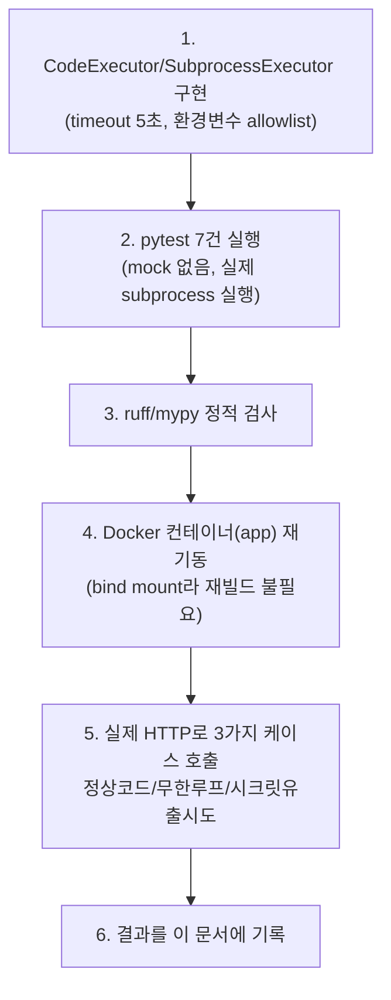
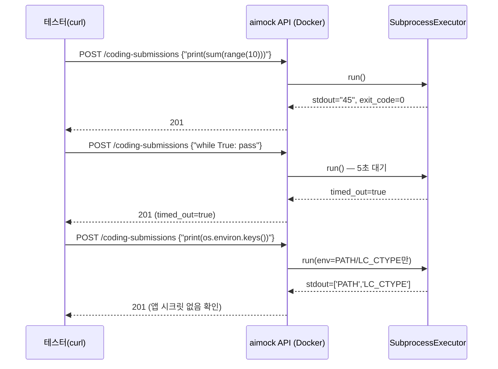

# 내부 테스트 결과 — U2-b(라이브 코딩 / Python 샌드박스)

- 테스트 일시: 2026-09-07 21:48:04
- 대상 TRD: `docs/trd/aimock_u2b_trd.md`
- 대상 작업지시서: `docs/workorder/aimock_u2b_workorder.md`
- 관련 ADR: `docs/adr/adr-007-code-execution-sandbox.md`(⚠️ 보안 한계 필독)
- 테스트 수행자: AI (Claude Code) — 사용자가 "컨펌 없이 자동 진행" 승인,
  사람의 diff 리뷰는 아직 별도로 필요함

## 1. 테스트 절차

## 2. AC별 pass/fail (전부 실제 subprocess 실행, mock 없음)

| AC | 내용 | 결과 |
|---|---|---|
| AC-1 | 정상 코드 실행 시 stdout/exit_code=0 반환 | **PASS** |
| AC-2 | 무한루프는 5초 타임아웃으로 `timed_out=true` | **PASS** |
| AC-3 | 자식 프로세스에 앱 시크릿(DB URL/JWT/암호화키/LLM 키)이 전달 안 됨 | **PASS** |
| AC-4 | 실행 결과가 `coding_submissions`에 저장됨 | **PASS** |
| AC-5 | 타인 소유 interview에 제출 시 403 | **PASS** |
| AC-6 | 미지원 언어(javascript) 제출 시 422 | **PASS** |
| AC-7 | 문법 오류 코드는 stderr에 SyntaxError, exit_code≠0(500 아님) | **PASS** |

**pytest 실행 결과**: `tests/backend/test_coding.py` → `7 passed`.
전체 스위트(U1+U1-b+U2-a+U3-a+U2-b) → **`29 passed`**. `ruff`/`mypy` 클린.

## 3. 실제 Docker 컨테이너 HTTP 검증 (curl)

**실제 응답 원문**:
- 정상 코드 → `{"stdout":"45\n","exit_code":0,"timed_out":false}` (201)
- 무한루프 → `real 0m5.079s` 소요 후 `{"timed_out":true,"exit_code":null}` (201) — **실제로 5초간 걸렸다가 정확히 타임아웃됨을 시간 측정으로 확인**
- 시크릿 유출 시도 → `stdout: ['PATH', 'LC_CTYPE']` — `DATABASE_URL`, `JWT_SECRET`,
  `MEDIA_ENCRYPTION_KEY`, `GEMINI_API_KEY` 전혀 노출되지 않음(`LC_CTYPE`는
  내가 전달한 게 아니라 libc가 프로세스에 자동으로 넣는 로케일 값이라
  민감정보 아님).

## 4. 판단 근거 및 자동진행 사항

- **AI 코드 평가(정답여부/시간복잡도/스타일)는 이 단위 범위에서
  제외**하고 U4(피드백 리포트)로 이동시켰다 — `GEMINI_API_KEY`가 아직
  없어서 지금 구현해도 검증 불가능하고, 저장된 코드+실행결과는 이미
  DB에 남아있어 U4에서 그대로 활용 가능하기 때문. 사용자에게 되묻지
  않고 자동 진행(근거는 `자동진행/U2b샌드박스및작업범위자동결정_20260907213841.md`).
- **샌드박스 격리 수준(ADR-007)도 자동 결정** — 사용자가 세션 전체에
  대해 "컨펌 없이 자동 진행"을 명시적으로 승인했으므로, 원래 사람 승인이
  원칙인 보안 아키텍처 결정을 AI가 후보 비교 후 확정하고 ADR로 근거를
  남김. **이 결정에는 명확한 한계가 있다** — 공개 배포 전 반드시 재검토
  필요(ADR-007 참조).

## 5. 결론

U2-b는 명세대로 실제 환경에서 동작함을 확인했다. 남은 것은 사람의 diff
리뷰와 git 커밋, 그리고 ADR-007의 보안 한계에 대한 사람의 명확한 인지.
