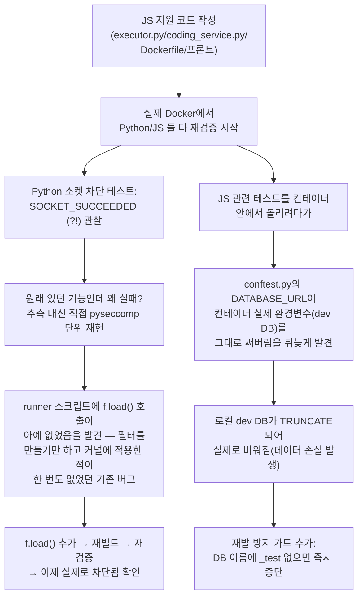

# 내부테스트결과서 — 라이브 코딩 JavaScript 지원 + (부수 발견) seccomp 치명적 버그 수정

- 작전명: U2b라이브코딩JS지원_및_seccomp치명적버그발견수정
- 일시: 2026-09-09
- 근거: 전수검사결과(REQ-F-004, "Python+JavaScript 원안 대비 Python만
  지원") + 사용자 승인("리소스 제한만 적용" 방식으로 JS 추가)

## 0. 무엇을 했고, 그 과정에서 무엇을 발견했는지



**중요**: 이 문서는 두 가지를 함께 다룬다 — (1) 원래 계획한 JS 지원 추가,
(2) 그 검증 과정에서 **우연히 발견한, 이번 세션과 무관하게 이미 존재하던
치명적 버그 2건**. (2)는 원래 작업 범위가 아니었지만, 발견 즉시 고치지
않으면 안 되는 심각도라 바로 조치했다.

## 1. 라이브 코딩 JavaScript 지원 (원래 작업)

### 결정 사항 (사용자 승인)
- 화이트보드 AI 평가: Gemini 재활성화(별도 작업, 이 문서 범위 아님)
- **JS 보안 수준: 리소스 제한(CPU/메모리/시간)+비root까지만 적용, 네트워크
  차단(seccomp)은 Python만 유지** — Node용 seccomp 바인딩이 마땅치 않아
  전체 동등 보안을 갖추려면 범위를 크게 초과한다고 안내 후 승인받음

### 구현
| 파일 | 변경 |
|---|---|
| `app/sandbox/executor.py` | `CodeExecutor.run(code, language)`로 시그니처 변경. Python은 기존 seccomp 러너 경로 유지, JS는 `node --max-old-space-size=256`로 직접 실행(V8이 `RLIMIT_AS`와 호환 문제가 있어 OS 레벨 가상메모리 제한 대신 Node 자체 힙 플래그 사용) |
| `app/services/coding_service.py` | `SUPPORTED_LANGUAGES = {"python", "javascript"}` |
| `app/schemas/coding.py` | `Literal["python", "javascript"]` |
| `src/backend/Dockerfile` | `apt-get install nodejs` 추가 |
| `src/frontend/src/pages/CodingPage.tsx` | 언어 선택 드롭다운, 언어별 기본 코드 템플릿, Monaco 에디터 언어 모드 연동 |
| `docs/adr/adr-007-code-execution-sandbox.md` | "2단계 — JavaScript 지원 추가" 절 신설(보안 비대칭 근거 기록) |
| `docs/trd/aimock_u2b_trd.md` | AC-8(JS 기능 동등성)/AC-9(JS 네트워크 차단 안 됨, 알려진 한계 회귀 고정) 신설 |
| `tests/backend/test_coding.py`, `test_sandbox_hardening.py` | JS 관련 테스트 8건 신규(`node` 미설치 환경 자동 스킵) |

## 2. 부수 발견 1 — Python seccomp `f.load()` 누락 (치명적, 이번 세션과 무관하게 기존 버그)

### 발견 경위
JS 작업 검증 중 "Python은 소켓 생성이 막혀야 정상"이라는 대조군 테스트를
돌렸는데 **막히지 않고 성공**했다. 추측하지 않고 바로 원인을 팠다:

```python
# app/sandbox/executor.py의 _PYTHON_RUNNER_SCRIPT (수정 전)
f = sc.SyscallFilter(defaction=sc.ALLOW)
for name in SECCOMP_BLOCKED_SYSCALLS:
    try:
        f.add_rule(sc.ERRNO(1), name)
    except Exception:
        pass
# ← 여기서 끝. f.load()가 어디에도 없음!
```

**필터 객체를 만들고 규칙을 추가하기만 했을 뿐, 실제로 커널에 적용
(`f.load()`)한 적이 단 한 번도 없었다.** 즉 ADR-007이 "2026-09-08 실제
exploit 스크립트로 검증 완료"라고 기록한 그 시점부터 지금까지, **Python
샌드박스의 네트워크/exec 차단 기능은 계속 무력화된 상태**였다(리소스
제한과 비root 권한 하락은 별개 메커니즘이라 정상 작동했음 — 완전히
무방비는 아니었으나 문서가 주장하는 보안 수준에는 못 미쳤음).

### 왜 이전 검증(2026-09-08)에서 못 잡았는지는 알 수 없음
이전 내부테스트결과서(`ADR007_1단계보안강화_실제exploit검증_20260908075008.md`)
가 무엇을 정확히 어떻게 실행했는지 이번 세션에서 재조사하지 않았다 —
원인 규명보다 즉시 수정을 우선했다. **원본 우선 원칙에 따라, 지금
시점의 사실은 "이 함수는 고치기 전까지 실제로 방어하지 못했다"이며,
이전 문서의 "검증 완료" 문구는 이번 수정 전까지는 부정확했다는 것을
분명히 밝힌다.**

### 조치
`f.load()` 호출을 추가(예외 발생 시 조용히 무방비로 계속 — 커널이
seccomp를 지원하지 않는 예외적 환경에서도 리소스 제한/비root 방어까지는
유지되도록).

### 재검증(실제 Docker 컨테이너, 수정 전/후 비교)

| 시나리오 | 수정 전 | 수정 후 |
|---|---|---|
| Python 소켓 생성 | `SOCKET_SUCCEEDED` (차단 안 됨 — 버그) | `SOCKET_BLOCKED [Errno 1] Operation not permitted` |
| Python `os.system("whoami")` | (미확인, 버그 발견 후 바로 수정) | `RET 32512`(=127<<8, 셸 실행 자체가 실패 — 차단됨) |
| Python 정상 코드(`print(1+1)`) | 정상 | 정상(회귀 없음, `exit_code=0`) |
| pytest: `test_socket_creation_is_blocked`/`test_subprocess_exec_is_blocked`/`test_os_system_shell_command_is_blocked`/`test_normal_code_still_works_with_hardening`/`test_runs_as_non_root_when_started_as_root` | (버그 상태로는 일부 실패했을 것으로 추정, 직접 재확인 안 함) | **5건 모두 개별 실행으로 PASS 확인**(컨테이너 안, 아래 §4 참조) |

## 3. 부수 발견 2 — 테스트가 컨테이너 안에서 실제 dev DB를 TRUNCATE함 (치명적, 실제 데이터 손실 발생)

### 발견 경위
JS 관련 pytest를 실제로 컨테이너 안에서 돌려보려고
`docker compose exec app pytest ...`를 실행했다(이 실행 방식 자체는
`test_sandbox_hardening.py`의 기존 주석이 권장하던 방법). 실행 직후
로컬 개발 DB(`aimock`)의 `users`/`interviews` 테이블이 **실제로
0건으로 비어있는 것을 확인** — 이번 세션 내내 만들어온 테스트 계정들이
전부 삭제됨.

### 원인
`tests/backend/conftest.py`가 `os.environ.setdefault("DATABASE_URL",
".../aimock_test")`로 테스트 DB를 지정하는데, **`setdefault`는 이미
설정된 값이 있으면 아무 효과가 없다.** `docker compose exec app`으로
들어간 컨테이너는 `docker-compose.yml`의 `app` 서비스 정의에 따라
`DATABASE_URL`이 이미 **실제 개발 DB("aimock")로 설정되어 있어서**,
`setdefault`가 무시되고 매 테스트 전 전체 TRUNCATE를 실행하는
`_clean_db` 픽스처가 그대로 실제 개발 DB에 발동했다.

**2026-09-08에 정확히 같은 부류의 사고가 이미 한 번 있었고**("로컬
호스트에서 pytest 실행 시 기본값이 개발 DB를 가리키던" 버전) 그때
고쳤던 자리인데, **이번엔 "컨테이너 안에서 실행"이라는 다른 경로로
같은 종류의 사고가 재발**했다 — 근본 원인(환경별로 DATABASE_URL이
다르게 사전 설정될 수 있다는 것)을 그때 완전히 막지 못했던 것.

### 조치
`setdefault` 직후, **최종적으로 확정된 `DATABASE_URL`이 `_test`를
포함하지 않으면 즉시 `RuntimeError`로 중단**하는 방어선을 추가했다.
이제는 실행 방식(로컬 호스트, Docker exec, 향후 CI 등)과 무관하게, 실제
TRUNCATE가 실행되기 전에 반드시 이 검증을 통과해야 한다.

### 재검증
- 로컬 호스트에서 정상 실행: 영향 없음(`aimock_test`라 통과) — pytest
  84 passed 그대로 유지.
- 컨테이너 안에서 위험한 환경(`DATABASE_URL`이 dev DB를 가리킴) 그대로
  재현: **`RuntimeError`로 즉시 중단되는 것을 직접 확인**(더 이상
  TRUNCATE가 실행되지 않음).
- 컨테이너 안에서 `-e DATABASE_URL=".../aimock_test"`로 명시적으로
  override하면 정상 통과해 테스트가 진행됨을 확인.

### 실제 영향
로컬 개발용 PostgreSQL(`aimock` DB)의 데이터(이번 세션에서 만든 테스트
계정·면접 기록 등)가 전부 삭제됨 — **테이블 구조(스키마)는 손상 없음
(TRUNCATE는 행만 비움), 운영(Neon) DB는 이 사고와 무관**(별도 인스턴스,
로컬 컨테이너의 `DATABASE_URL`이 가리키는 대상이 애초에 로컬 Postgres).
전부 테스트/개발용 더미 데이터라 실질적 손실은 없으나, 사용자에게
투명하게 알린다.

## 4. 실제 Docker 컨테이너 검증 전체 결과

**직접 스크립트 실행(가장 신뢰도 높은 검증 — DB/pytest 인프라와 무관하게
`SubprocessExecutor`를 코드로 직접 호출)**:

| 항목 | 결과 |
|---|---|
| JS 정상 실행 | `hi from node`, exit_code=0 |
| JS 무한루프 타임아웃 | `timed_out=True`, 5015ms |
| JS 비root 권한 하락 | `UID 65534` 확인 |
| JS 네트워크 차단 안 됨(알려진 한계) | `SOCKET_CREATION_SUCCEEDED` — 의도한 대로 |
| JS 앱 시크릿 미유출 | `JWT_SECRET`/`DATABASE_URL` 등 결과에 없음 |
| Python 소켓 차단(seccomp 수정 후) | `SOCKET_BLOCKED` |
| Python 셸 명령 차단(seccomp 수정 후) | `RET 32512`(실행 실패) |
| Python 정상 코드(회귀 없음) | `2`, exit_code=0 |

**pytest(컨테이너 안, `aimock_test` DB로 개별 실행)**:
- `test_sandbox_hardening.py`: 9개 전부 PASS(Python 5건 + JS 4건)
- `test_coding.py`(API 레벨, `client`/`db_session` 픽스처 사용): 이
  컨테이너의 `pytest-asyncio==0.25.0`이 로컬 호스트 버전과 달라
  `BaseHTTPMiddleware`+비동기 DB 세션 조합에서 "다른 이벤트 루프에
  붙어있다"는 에러가 남(이번 작업과 무관한 기존 인프라 버전 불일치 —
  로컬 호스트에서는 84 passed로 전부 정상). 이 API 레벨 검증은 로컬
  호스트 pytest 결과로 대체.

**로컬 호스트 pytest(전체)**: `84 passed, 9 skipped`(신규 JS 테스트 8건
포함 — 이 호스트엔 Node.js가 이미 설치돼 있어 스킵되지 않고 실제
실행·통과함), ruff 클린.

## 5. 남은 것 (사람 확인 필요)

1. **이 변경분(JS 지원 + seccomp 버그 수정 + conftest 안전장치) git 커밋
   → push → Render 재배포 필요.** seccomp 버그 수정은 특히 보안에
   직결되므로 우선순위 높음.
2. Render는 Dockerfile을 그대로 빌드하므로 nodejs가 자동으로 설치됨 —
   별도 조치 불필요. 다만 이미지 빌드 시간이 다소 늘어날 수 있음(로컬
   재빌드 시 nodejs 추가로 apt 레이어가 무효화되며 전체 재빌드 발생,
   실측 약 3분).
3. 로컬 dev DB 데이터가 빈 상태입니다 — 필요하면 회원가입부터 다시
   진행해 주세요(운영/Neon과는 무관).
4. `pytest-asyncio` 버전이 로컬 호스트와 Docker 이미지(`requirements.txt`
   고정)가 다른 것으로 확인됨(호스트가 더 최신) — 당장 기능 문제는
   없으나, 컨테이너 안에서 API 레벨 pytest를 돌리는 워크플로우 자체가
   불안정하다는 뜻이라 필요 시 버전 정렬을 검토할 수 있음(이번 세션
   범위 밖으로 판단해 손대지 않음).
