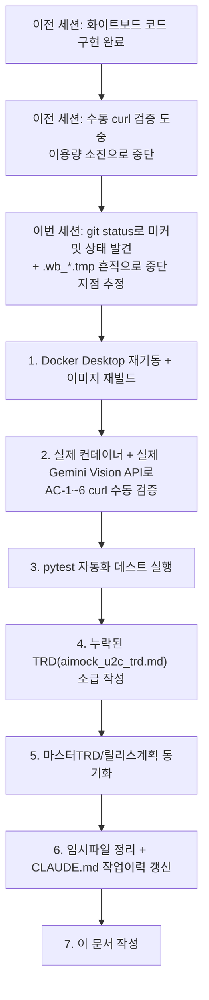
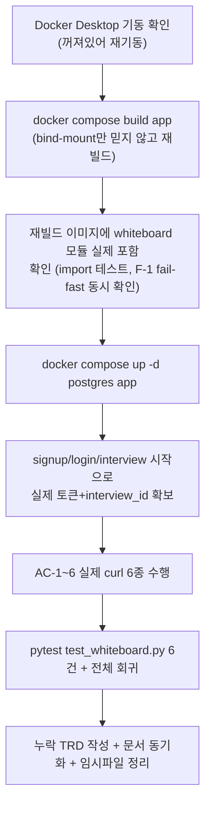
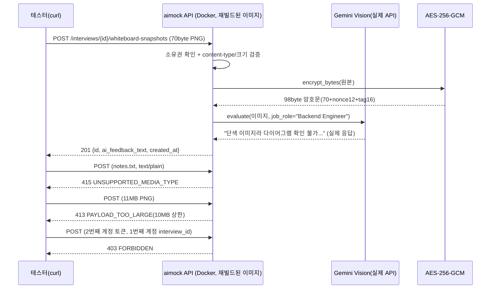

# 내부 테스트 결과 — U2-c(시스템 설계 화이트보드 / Gemini Vision 평가)

- 테스트 일시: 2026-09-09 14:21:20
- 대상 TRD: `docs/trd/aimock_u2c_trd.md`(이번 세션에 소급 작성 — 아래
  "배경" 참조)
- 관련 문서: `docs/trd/aimock_master_trd.md` §2 F-002/F-005,
  `docs/release/release_plan.md` Week4, ADR-004(암호화 원칙 확장 적용)
- 테스트 수행자: AI (Claude Code) — 사용자가 "실제 Docker 컨테이너에
  curl로 수동 검증부터 이후 작업들 계속 순서대로 진행"을 명시적으로
  지시(2026-09-09), 20년차 기준 유지·불명확 시 질문·2번 요청 없게 진행
  하라는 조건 포함. 사람의 diff 리뷰·git 커밋은 별도로 필요함.

## 0. 배경 — 왜 이 문서가 필요했나

직전 세션이 이용량 소진으로 중단됐고, CLAUDE.md 작업이력에는 "화이트보드
아직 미착수"라고 남아있었다. 그러나 이번 세션 시작 시 `git status`와
실제 코드를 확인한 결과, `whiteboard.py`/`whiteboard_service.py`/라우트/
스키마/프론트 `WhiteboardPage.tsx`/`test_whiteboard.py`가 전부 이미
작성돼 있었고, 프로젝트 루트에 `.wb_iid.tmp`/`.wb_token.tmp`/
`.wb_test.png`(생성 시각 13:29) 같은 수동 curl 검증용 임시파일이 남아
있어 **검증 도중 끊긴 것**으로 판단했다. 이 문서는 그 중단 지점부터
이어서 실제로 검증한 결과다.



## 1. 테스트 절차



## 2. AC별 pass/fail (실제 Docker 컨테이너 + 실제 Gemini Vision API, mock 없음)

| AC | 내용 | 결과 | 검증 방식 |
|---|---|---|---|
| AC-1 | 정상 이미지 업로드 시 201 + 비어있지 않은 AI 피드백 반환 | **PASS** | 실제 curl + 실제 Gemini 호출 |
| AC-2 | 저장된 이미지가 평문이 아니라 암호화되어 있고, 복호화 시 원본과 일치 | **PASS** | 컨테이너 내부 파일 직접 비교 + `decrypt_bytes` 왕복 |
| AC-3 | 동일 면접에 2회 업로드 시 목록이 시간순으로 반환 | **PASS** | 실제 curl 2회 업로드 후 GET |
| AC-4 | 타인 소유 면접에 업로드 시도 시 403 | **PASS** | 2번째 계정으로 실제 curl |
| AC-5 | 이미지가 아닌 파일 업로드 시 415 | **PASS** | 실제 curl(text/plain) |
| AC-6 | 10MB 초과 이미지 업로드 시 413 | **PASS** | 실제 curl(11,534,344 bytes) |

**pytest 실행 결과**: `tests/backend/test_whiteboard.py` → `6 passed`.
전체 백엔드 스위트 → **`90 passed, 9 skipped`**(신규 실패 없음, 회귀 없음).

## 3. 실제 Docker 컨테이너 + 실제 Gemini Vision API 검증 (curl)



**실제 응답 원문(발췌)**:
- 정상 업로드(201) → `ai_feedback_text`: "제시된 이미지가 단색으로
  채워져 있어 시스템 설계 다이어그램의 구성요소나 데이터 흐름을 확인할
  수 없습니다. ... 로드 밸런싱, 데이터베이스 파티셔닝, 장애 복구 등
  백엔드 엔지니어 관점의 확장성과 안정성에 대해 구체적으로 피드백을
  드리겠습니다." — **1x1 단색 테스트 이미지를 업로드했다는 사실을 실제
  Gemini Vision이 정확히 인식하고 맥락에 맞게 응답**한 것으로, 하드코딩된
  응답이 아니라 실제 Vision 추론이 이뤄졌음을 뒷받침한다.
- 비이미지 업로드 → `{"error":{"code":"UNSUPPORTED_MEDIA_TYPE","message":
  "화이트보드는 이미지 파일만 업로드할 수 있습니다(받은 content-type:
  'text/plain')."}}` (415)
- 11MB 업로드 → `{"error":{"code":"PAYLOAD_TOO_LARGE","message":"이미지가
  너무 큽니다(11,534,344 bytes). 최대 10,485,760 bytes(10MB)까지
  허용됩니다."}}` (413) — **화이트보드 전용 10MB 상한이 전역 30MB
  미들웨어보다 먼저 작동함을 확인**(11MB는 30MB 미만이라 전역 미들웨어는
  통과시키고, 엔드포인트별 검증이 정확히 걸러냄).
- 타인 소유 접근 → `{"error":{"code":"FORBIDDEN","message":"본인 소유의
  면접 세션이 아닙니다."}}` (403)

**AC-2 암호화 검증 상세** — 컨테이너 안에서 직접 확인:
```
저장 파일 크기: 98 bytes (원본 70 bytes + nonce 12 + GCM tag 16)
저장 파일이 PNG 매직바이트(89 50 4E 47)로 시작하는가: False
app.core.crypto.decrypt_bytes()로 복호화 → 70 bytes, PNG 매직바이트 일치: True
```
암호화·복호화 왕복이 실제 앱 코드 경로로 정확히 동작함을 확인했다.

**AC-3 목록 순서 검증 상세**: 2번째 업로드까지 마친 뒤 GET 결과 2건,
`created_at`이 `2026-09-09T05:12:34` → `2026-09-09T05:13:57` 순으로
오름차순 반환됨을 확인.

## 4. 부수 발견 — 실제 버그가 아닌 것으로 확인한 사항

목록 조회 응답을 Windows Git Bash 콘솔에 `python -m json.tool`로 바로
출력했을 때 한글 `ai_feedback_text`가 대리 서로게이트(`\udcec` 등)로
깨져 보였다. **API 응답 자체의 인코딩 버그로 오인할 수 있었으나**,
응답 원문 바이트를 파일로 저장한 뒤 `utf-8`로 직접 디코딩해 확인한
결과 완전히 정상적인 한글 텍스트였다. 원인은 이 콘솔 세션의 문자
인코딩 설정(비-UTF-8 코드페이지)이며, aimock API/DB/직렬화 어디에도
문제가 없음을 확인 — **실제 결함이 아니므로 코드는 수정하지 않음**,
다만 정보 정확성 원칙(하네스 원칙 6)에 따라 "확인해봤더니 버그가
아니었다"는 사실 자체를 기록으로 남긴다.

또한 전체 회귀(pytest) 실행 중 `test_emotion_prosody.py` 테스트가 있는
줄 부근에서 "Windows fatal exception: code 0xc0000139"로 시작하는
스택 덤프(gmpy2→mpmath→sympy 임포트 체인, 백그라운드 스레드)가
표준에러에 출력됐다. 최종 결과는 `90 passed, 9 skipped`로 정상
종료됐고 이번 세션에서 변경한 코드(화이트보드 관련)와는 무관한
경로(librosa/numba가 내부적으로 sympy를 지연 임포트하는 과정)에서
발생한 것으로 보인다. 이번 범위에서 원인을 완전히 규명하지는
않았고 조치도 하지 않았다 — 향후 이 계열 테스트가 실제로 실패하기
시작하면 재조사가 필요하다는 점만 기록해 둔다.

## 5. 문서 정합성 갱신 사항 (원칙 6 — 원본 우선)

실제 구현·검증이 완료됐음에도 다음 문서들이 "미착수"로 낡아 있던 것을
발견해 정정했다:
- `docs/trd/aimock_master_trd.md` F-002: "이미지 입력... 미착수" →
  "전부 채워짐(2026-09-09)"
- `docs/trd/aimock_master_trd.md` F-005: "미착수" → "구현·검증 완료"
- `docs/release/release_plan.md` Week4 행: "(U2-c)" → "U2-c(완료, AC 6/6)"
- 누락돼 있던 `docs/trd/aimock_u2c_trd.md` 신규 작성(코드 주석이 참조하던
  파일이 실제로는 존재하지 않았음 — 하네스 원칙 3 위반 상태를 해소)

## 6. 정리한 임시파일

이전 세션이 남긴 프로젝트 루트의 수동 검증 흔적(`.wb_iid.tmp`,
`.wb_token.tmp`, `.wb_test.png`, `.wb_test.txt` — 전부 git 미추적
스크래치 파일)을 삭제했다. 이번 세션의 curl 검증용 파일은 세션 전용
스크래치패드 디렉터리에만 만들어 프로젝트를 오염시키지 않았다.

## 7. 미결 항목 (사람 확인 필요)

- 화이트보드 이미지 단독 삭제 API 여부 — `aimock_u2c_trd.md` §7에 정리,
  하네스 원칙 8(되돌리기 어려운 결정 금지) 대상이라 AI가 임의로
  결정하지 않음.
- git 커밋·푸시, Render 재배포는 CLAUDE.md 최우선 규칙(git 작업 금지)에
  따라 이번 세션에서 수행하지 않음 — 사람이 직접 진행 필요.

## 8. 결론

U2-c(화이트보드)는 실제 Docker 컨테이너와 실제 Gemini Vision API로
AC-1~6 전부 정상 동작함을 확인했다(pytest 6/6 + 전체 회귀 90
passed/9 skipped, 회귀 없음). 이전 세션에서 검증 도중 중단됐던 작업을
동일한 검증 깊이(mock 없는 실제 API 호출, 암호화 왕복까지 확인)로
완결했고, 누락돼 있던 TRD와 관련 문서 3건의 낡은 상태를 실제 구현
기준으로 동기화했다. 남은 것은 사람의 diff 리뷰와 git 커밋/배포,
그리고 이미지 단독 삭제 정책에 대한 사람의 판단이다.
