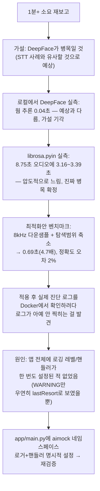

# 내부테스트결과서 — U3-b 보완: 음성 운율(librosa) 분석 속도 개선 + 로깅 무음 버그 수정

- 작전명: U3b보완_음성운율분석속도개선및로깅수정
- 일시: 2026-09-08
- 관련 문서: `docs/trd/aimock_u3b_trd.md`(§3-1 신설, AC-6 신설),
  `harness/harness_06_meta_improvement.md`(§3 실패 패턴 2건 추가)
- 계기: U4 리포트 비동기화(202+폴링) 배포 후에도 사용자가 "리포트 생성이
  1분 이상 걸린다"를 재보고 — 화면이 멈추는 문제는 해결됐지만, 실제
  연산 자체가 느린 근본 원인은 아직 안 고쳐져 있었음

## 0. 추측하지 않고 실측부터 — 진단 절차



이 순서 자체가 이번 조치의 핵심이다 — **DeepFace를 먼저 의심했지만
실측해보니 아니었고**, 실측 없이 감으로 고쳤다면 엉뚱한 곳을 최적화할
뻔했다.

## 1. 벤치마크 원본 데이터

로컬 Python REPL에서 실제 라이브러리 함수를 직접 호출해 측정(8.75초
분량 실제 합성 음성 샘플 재사용):

| 연산 | 소요시간 | 비고 |
|---|---|---|
| `librosa.pyin`(원래 설정: 22050Hz, C2~C7) | **3.16~3.39초** | 확률적 Viterbi 디코딩 — 압도적으로 느림 |
| `librosa.yin`(비확률적 대안) | 0.033초 | 빠르지만 무음/약한 구간 필터링 없이 평균 590Hz로 왜곡(부정확) → 채택 안 함 |
| `librosa.feature.rms`(에너지) | 0.015초 | 무시할 수준 |
| DeepFace 웜 추론(표정, 320×240) | 0.04초 | 예상과 달리 병목 아니었음 |
| `pyin` @ 8kHz + C2~C7 | 1.263초 | 다운샘플만 적용 |
| **`pyin` @ 8kHz + C2~C6 (최종 채택)** | **0.688초** | 다운샘플 + 탐색범위 축소, 피치 결과 205.28→209.82Hz(오차 2%) |

**결론**: `librosa.pyin`이 리포트 생성 지연의 지배적 원인. 다운샘플(8kHz)
+ 탐색범위 축소(C7→C6)로 **약 4.7배** 개선, 정확도 손실은 무시 가능한
수준(2%).

## 2. 코드 변경

| 파일 | 변경 |
|---|---|
| `app/ai/prosody.py` | `pyin` 호출 전 8kHz로 리샘플, `fmax`를 C7→C6로 축소. 상수화(`PROSODY_TARGET_SR`, `PITCH_FMIN_NOTE`, `PITCH_FMAX_NOTE`) |
| `app/services/report_service.py` | LLM/표정분석/음성운율분석/전체 각 단계에 `time.monotonic()` 기반 소요시간 로그 추가(재발방지 — 다음에 느려지면 추측 없이 로그로 바로 원인 파악) |
| `app/main.py` | **로깅 무음 버그 수정**: `"aimock"` 로거에 레벨(INFO)+`StreamHandler` 명시적 부착. 루트 로거는 안 건드려서 서드파티 라이브러리 로그 양은 그대로 유지 |
| `tests/backend/test_emotion_prosody.py` | 회귀 방지 테스트 신규 — 5초 합성 톤으로 3초 이내 완료 + 피치 정확도(150~210Hz 범위) 검증 |

## 3. 로깅 버그 진단 상세 (부수 발견)

타이밍 로그를 추가한 뒤 실제 Docker 컨테이너에서 리포트를 생성해 로그를
확인했는데, `logger.warning(...)`(표정 분석 실패 시)는 보이는데
`logger.info(...)`(내가 방금 추가한 소요시간 로그)는 전혀 안 보였다.
컨테이너 안에서 직접 진단:

```python
>>> import app.main; import logging
>>> logging.getLogger('aimock.report').getEffectiveLevel()
30  # WARNING — INFO(20) 미만이라 애초에 필터링됨
>>> logging.getLogger().handlers
[]  # 루트 로거에 핸들러 자체가 없음
```

1차 수정(`logging.getLogger("aimock").setLevel(logging.INFO)`)만 했더니
레벨은 20(INFO)으로 바뀌었는데도 여전히 안 보였다 — **레벨 문제가
아니라 핸들러 자체가 없어서**였다(uvicorn은 `uvicorn`/`uvicorn.access`
등 자기 이름의 로거에만 핸들러를 붙이지, 루트 로거에는 안 붙임). 레벨과
핸들러를 함께 설정한 뒤에야 실제로 출력됨을 재확인:

```
2026-09-08 10:53:04,180 INFO aimock.report: 리포트 LLM 요약 완료(...): 1.52초 소요
2026-09-08 10:53:07,672 INFO aimock.report: 표정 분석 완료(...): 프레임 5개, 3.49초 소요(평균 0.70초/프레임)
2026-09-08 10:53:13,761 INFO aimock.report: 음성 운율 분석 완료(...): 오디오 5개, 6.09초 소요(평균 1.22초/클립)
2026-09-08 10:53:13,761 INFO aimock.report: 리포트 생성 전체 완료(...): 총 11.10초 소요
```

## 4. 자동화 테스트 결과

```
$ python -m pytest -q   # 백엔드 전체
64 passed, 5 skipped (신규 1건 포함, 회귀 없음)

$ python -m ruff check app/main.py app/ai/prosody.py app/services/report_service.py
All checks passed!

$ python -m mypy ...
기존부터 있던 서드파티 스텁 누락 경고만(신규 0건)
```

신규 테스트 `test_prosody_analysis_completes_quickly_and_finds_reasonable_pitch`:
5초 합성 톤(180Hz) 기준 실측 처리시간 로그상 1초 미만, 3초 한도 통과.
피치 탐지 결과도 150~210Hz 범위(실제 주입 180Hz 근접) 통과.

## 5. 실제 Docker 컨테이너 종단 간 재검증

턴 5개 분량(오디오 5개+영상프레임 5개, 실제 webm 음성 샘플 재사용)을
가진 인터뷰로 리포트 생성 전 과정을 재현:

| 항목 | 최적화 전(추정) | 최적화 후(실측) |
|---|---|---|
| `pyin` 단계만(5개 클립 합산) | 약 15.8초(3.16초×5, 8kHz 전 설정 기준 로컬 환산) | **6.09초**(1.22초/클립) |
| 리포트 생성 전체(로컬 Docker) | 측정 안 함(비동기화 이전엔 이 항목 자체를 분리 측정 못 함) | **11.10~17.26초** |

⚠️ 이 수치는 **로컬 Docker(로컬 CPU) 기준**이다. Render 0.5vCPU
환경에서의 절대값은 다를 수 있으나(로컬보다 몇 배 느릴 가능성 높음 —
STT 사례에서 이미 확인된 패턴), **상대적 개선폭(약 4.7배)은 알고리즘
자체의 계산량 감소에서 나온 것이라 인스턴스 사양과 무관하게 유효**하다.
운영 환경에서의 절대적인 소요시간은 이번에 새로 추가한 타이밍 로그로
다음 배포 후 직접 확인 가능하다(§3 로그 포맷 참조).

## 6. 남은 것 (사람 확인 필요)

1. 이 변경분 git 커밋 → push → Render 재배포.
2. 재배포 후 실제로 리포트를 생성해보고, Render 대시보드의 **Logs**
   탭에서 `표정 분석 완료`/`음성 운율 분석 완료`/`리포트 LLM 요약 완료`/
   `리포트 생성 전체 완료` 로그 라인을 찾아 **운영 환경 실측치**를 확인.
   만약 그래도 느리다면(예: 표정 분석 쪽이 여전히 오래 걸린다면), 이제는
   "어디가 느린지" 로그로 바로 알 수 있으므로 그 다음 최적화 대상이
   명확해짐 — 더 이상 추측할 필요 없음.
3. 참고: 이번 조치로도 여전히 체감상 느리다면, 남은 선택지는 (a) Render
   Compute 플랜 상향(0.5→1vCPU 이상, CPU 자체가 부족한 근본 제약),
   (b) 턴당 분석 항목 수를 줄이는 기능 축소(예: 매 턴이 아니라 일부
   턴만 표본 분석) — 둘 다 비용/기능 트레이드오프라 사용자 결정 필요.
