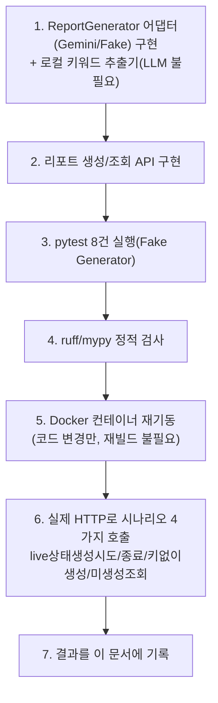
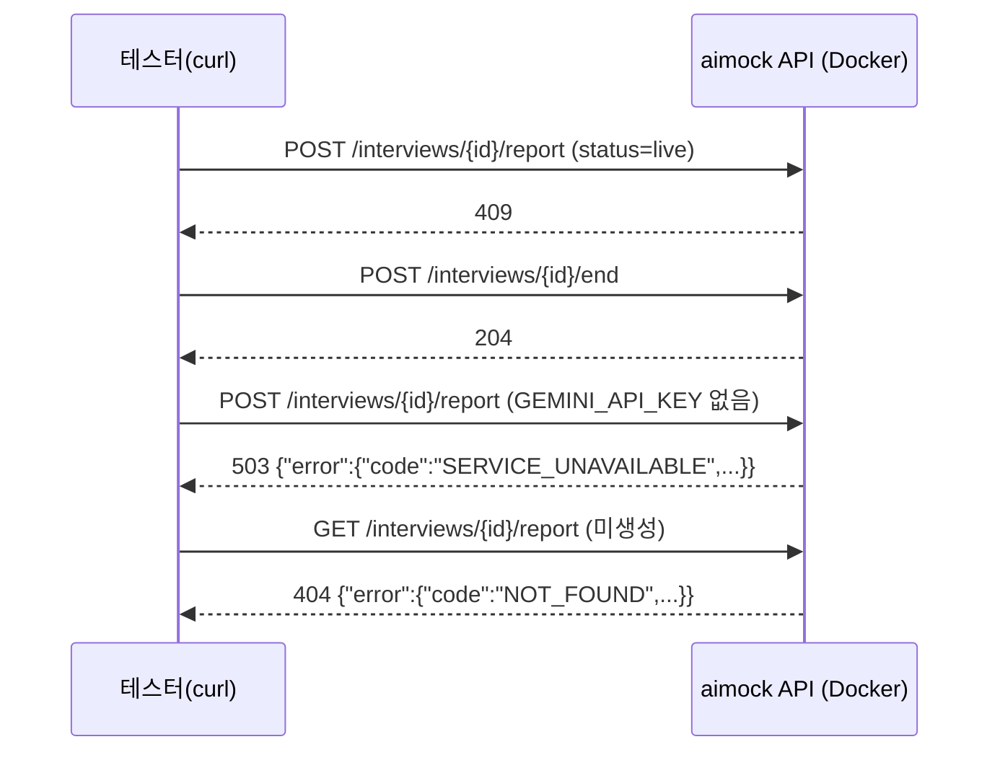

# 내부 테스트 결과 — U4(피드백 리포트 생성/조회)

- 테스트 일시: 2026-09-07 21:57:37
- 대상 TRD: `docs/trd/aimock_u4_trd.md`
- 대상 작업지시서: `docs/workorder/aimock_u4_workorder.md`
- 테스트 수행자: AI (Claude Code) — 사용자가 이번 세션 자동진행을 승인,
  사람의 diff 리뷰는 아직 별도로 필요함

## 1. 테스트 절차

## 2. AC별 pass/fail (전부 실제 Postgres 대상, Fake Generator로 어댑터 검증)

| AC | 내용 | 결과 |
|---|---|---|
| AC-1 | live 상태 interview에 리포트 생성 시도 시 409 | **PASS** |
| AC-2 | completed 상태에서 생성 시 201 + 저장 | **PASS** |
| AC-3 | 재생성 시 레코드가 늘지 않고 덮어써짐 | **PASS** |
| AC-4 | 미생성 리포트 조회 시 404 | **PASS** |
| AC-5 | 생성된 리포트 조회 시 저장 내용 그대로 반환 | **PASS** |
| AC-6 | 타인 소유 interview 리포트 생성/조회 시 403 | **PASS** |
| AC-7 | `GEMINI_API_KEY` 없으면 503(U2-a AC-8과 동일 패턴) | **PASS** |
| AC-8 | 반복 단어("MSA")가 로컬 빈도 분석으로 키워드에 포함 | **PASS** |

**pytest 실행**: `test_report.py` → `8 passed`. 전체 스위트(U1+U1-b+U2-a+
U3-a+U2-b+U4) → **`37 passed`**. `ruff`/`mypy`(50개 파일) 클린.

## 3. 실제 Docker 컨테이너 HTTP 검증 (curl)

실제 응답 원문 그대로 4개 시나리오 모두 예상대로 동작 확인(위 §2 AC-1,
AC-7 계열, AC-4와 각각 대응).

## 4. 판단 근거

- 표정/음성 타임라인은 `emotion_samples`가 비어있으므로 `details_json.
  emotion_timeline`을 빈 배열로 반환 — U3-b 착수 전까지는 항상 이렇게
  동작하는 게 정상(TRD §7에 명시).
- 키워드 추출은 형태소 분석기 없이 공백/한글 토큰화 + 최소 불용어
  제거로 구현 — 정확도는 낮지만 LLM 가용성과 완전히 무관하게 항상
  동작한다는 게 핵심 이점(AC-8이 이걸 증명).

## 5. 결론

U4는 명세대로 동작함을 확인했다(Gemini 실제 채점 품질은 키 확보 후
별도 확인 필요). 남은 것은 사람의 diff 리뷰와 git 커밋.
