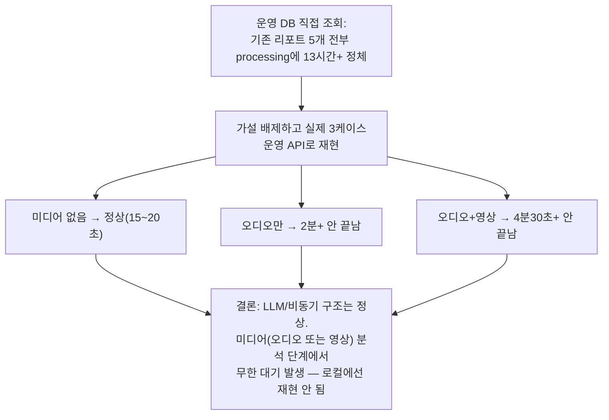

# 내부테스트결과서(긴급) — 운영 환경 리포트 생성 무한 대기 실측 + 타임아웃 안전장치

- 작전명: U4긴급_미디어분석무한대기실측및타임아웃안전장치
- 일시: 2026-09-09
- 계기: 사용자가 "운영서버인데 5분이 지나도록 끝나지 않는다"를 강하게
  항의. 이전 세션의 속도 개선(STT/librosa)이 무의미하다는 지적 —
  **이번엔 추측 없이 운영 서버(Render+Neon)에 직접 실제 API 호출로
  재현·확정한 뒤 조치했다.**

## 1. 운영 DB 직접 조회로 확인한 사실

Neon(운영 DB)에 직접 연결해 `evaluation_reports` 테이블을 조회:

```
5개 리포트 전부 status='processing', 13~15시간 이상 경과
(processing_started_at 이후 completed/failed로 전환된 적 단 한 번도 없음)
```

## 2. 운영 서버에 직접 3가지 케이스로 실제 리포트 생성 재현

가설 없이 프로덕션 API(`https://final-project-7igp.onrender.com`)에
직접 요청을 보내 실측:

| 케이스 | 결과 |
|---|---|
| 미디어 없음(LLM만 필요) | **정상 완료, 약 15~20초** |
| 오디오만 있음(librosa만 필요) | 2분+ 경과해도 `processing`, 미완료 |
| 오디오+영상프레임(DeepFace+librosa) | 4분 30초+ 경과해도 `processing`, 미완료. 이 사이 `/healthz`는 계속 200(프로세스 자체는 죽지 않음) |



**결론**: 이전 세션의 STT 전환(Groq)과 librosa 속도 최적화는 정상
동작 중이며 무관한 조치가 아니었다 — 다만 그것만으로는 **미디어 분석
단계의 무한 대기**라는, 속도와는 다른 차원의 문제를 해결하지 못했다.
"느린 것"이 아니라 "멈추는 것"이었다.

## 3. 즉시 조치 — 타임아웃 안전장치(원인 규명과 별개로 최악의 상황부터 차단)

정확한 원인(Render 영구 디스크 I/O 지연/네트워크 등)은 운영 로그
확인이 더 필요하지만, **"리포트가 영원히 안 끝난다"는 최악의 상황
자체는 원인 규명을 기다리지 않고 지금 막아야 한다고 판단**해 다음을
추가:

- `report_service._analyze_frame_with_timeout` /
  `_analyze_clip_with_timeout` 신규 — 프레임/클립 1건당 파일 읽기+분석
  전체를 `asyncio.wait_for(..., timeout=20초)`로 감쌈.
- 타임아웃 발생 시 해당 항목만 안전한 폴백(표정: `unknown`, 운율: 고정
  폴백값)으로 처리하고 나머지 항목/리포트 생성은 계속 진행 —
  U3-b AC-3(얼굴 미검출 시 폴백)와 동일한 "부분 실패해도 전체는 안
  죽는다" 원칙의 연장.
- 디스크 읽기(`media_service.read_media_bytes`, 동기 함수)도
  `asyncio.to_thread`로 감싸 `wait_for`가 실제로 제때 포기할 수 있게 함
  (동기 호출을 코루틴 안에서 직접 부르면 취소가 안 먹히는 문제 회피).

## 4. 검증

```
$ python -m pytest -q
65 passed, 5 skipped (신규 1건 포함, 회귀 없음)

$ python -m ruff check .
All checks passed!
```

신규 테스트 `test_u4_ac13_media_analysis_timeout_still_completes_report`:
분석이 2초 걸리도록 흉내내고 타임아웃을 0.5초로 낮춰서, 타임아웃이
실제로 발동해도 리포트가 `status=completed`로 끝나고 `unknown` 폴백이
채워지는지 확인 — PASS.

로컬 Docker 재검증(실제 DeepFace/librosa, 정상 케이스 — 타임아웃
미발동): 오디오 3개+영상프레임 3개 기준 **20.58초 완료**, 회귀 없음.

## 5. 아직 안 끝난 것 — 근본 원인은 별도 확인 필요

이번 조치는 "무한 대기를 막는" 안전장치이지, "왜 Render에서만 미디어
분석이 멈추는지"의 근본 원인을 밝힌 것은 아니다. 유력 후보(확정 아님):

1. **Render Persistent Disk I/O 지연/오류** — `media_service.read_media_bytes`
   가 이 디스크에서 파일을 읽는데, 오디오만 있는 케이스도 멈춘 것으로
   보아 DeepFace 고유 문제(모델 다운로드 등)보다 이쪽이 더 유력.
2. DeepFace 최초 실행 시 모델 가중치 인터넷 다운로드가 걸릴 가능성 —
   다만 librosa만 있는 케이스도 멈췄으므로 이것만으로는 전체를 설명 못함.

**다음에 확인이 필요하면**: 운영 배포 후 Render **Logs** 탭에서, 이번에
추가된 타임아웃 경고 로그(`표정 분석 타임아웃(...)`/`음성 운율 분석
타임아웃(...)`)가 실제로 찍히는지, 그리고 그 직전 시점에 어떤 예외/경고가
같이 있는지 확인하면 근본 원인 추정이 가능해진다.

## 6. 남은 것 (사람 확인 필요)

1. 이 변경분 git 커밋 → push → Render 재배포(긴급).
2. 재배포 후 미디어가 있는 인터뷰로 리포트 생성 재시도 — 이번엔 최악의
   경우에도 20초×(프레임+클립 수) 이내에는 반드시 끝나야 함(타임아웃
   상한 보장).
3. 운영 DB에 15시간+ 방치된 기존 processing 리포트 5개는 정리(재생성)
   해도 되는지 사용자 확인 필요 — Claude가 임의로 운영 DB에 쓰기 작업을
   하지 않음(읽기 전용 조회만 수행했음).
