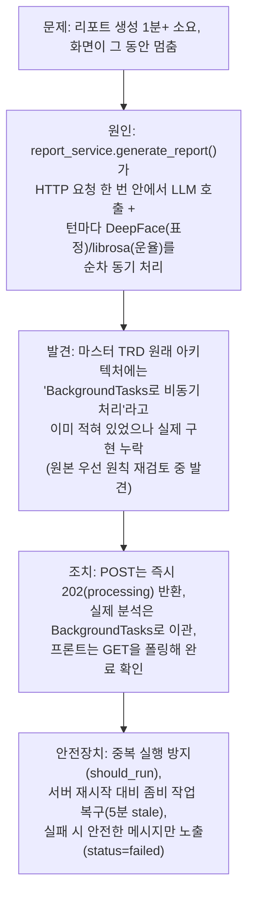
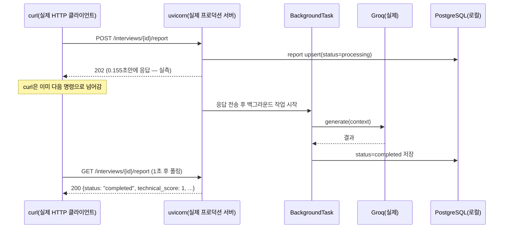

# 내부테스트결과서 — U4 보완: 피드백 리포트 생성 비동기화(백그라운드 처리)

- 작전명: U4보완_리포트생성비동기화
- 일시: 2026-09-08
- 관련 문서: `docs/trd/aimock_u4_trd.md`(§0-2 신설, AC-9~12 신설),
  `docs/trd/aimock_master_trd.md`(원래 아키텍처 다이어그램에 이미 명시돼
  있던 "BackgroundTasks 비동기 처리"를 실제로 구현)
- 계기: 사용자가 운영 환경(Render)에서 "피드백 리포트 생성이 1분 이상
  걸린다"를 직접 보고

## 0. 원인과 조치 요약



## 1. 코드 변경 요약

| 파일 | 변경 |
|---|---|
| `alembic/versions/a1c3e7f2b904_*.py` | `evaluation_reports`에 `status`(NOT NULL)/`error_message`/`processing_started_at` 추가, 기존 행은 `status='completed'`로 백필 |
| `app/models/evaluation_report.py` | 위 3개 컬럼 매핑 추가 |
| `app/schemas/report.py` | `ReportResponse`에 `status`/`error_message` 추가 |
| `app/services/report_service.py` | `generate_report()` 단일 함수를 `start_report_generation()`(빠른 시작) + `run_report_generation()`(백그라운드, 독립 DB 세션)으로 분리. 중복 실행 방지·경합(IntegrityError) 복구·좀비 작업 복구·안전한 실패 메시지 로직 신설 |
| `app/api/routes/report.py` | `POST`가 `202`로 변경, `BackgroundTasks.add_task()`로 예약 |
| `tests/backend/test_report.py` | 기존 테스트를 "POST(202,processing)→GET(완료 확인)" 패턴으로 전환, 신규 테스트 4건(AC-9~12) 추가 |
| `tests/backend/test_recruiter.py` | 직접 `EvaluationReport` 생성하던 헬퍼에 `status="completed"` 추가(신규 NOT NULL 컬럼 대응) |
| `tests/backend/fakes.py` | `FakeReportGenerator`에 `raise_exc` 옵션 추가(실패 경로 테스트용) |
| `src/frontend/src/api/types.ts` | `ReportResponse`에 `status`/`error_message` 추가 |
| `src/frontend/src/pages/ReportPage.tsx` | 2초 간격 폴링 도입, `processing`/`failed` 상태 UI 추가(재시도 버튼 포함) |
| `src/frontend/src/pages/RecruiterReportPage.tsx` | 상태별(처리중/실패/완료) 조건 렌더링 추가 |
| `src/frontend/src/pages/ReportPage.test.tsx` | 503 관련 옛 테스트를 processing/failed 상태 테스트로 교체 |

## 2. 설계 검증 — 사전 실험(코드 작성 전 가정 검증)

BackgroundTasks 기반 설계를 짜기 전에, **httpx `ASGITransport`(테스트에서 씀)가
FastAPI `BackgroundTasks`를 언제 실행하는지** 먼저 실측했다 — 이 가정이
틀리면 테스트 전체가 잘못된 것을 검증하게 되므로 가장 먼저 확인.

```python
# 별도 미니 앱으로 실험
@app.post('/go')
async def go(bg: BackgroundTasks):
    bg.add_task(slow_task)  # 1.5초 sleep 후 상태 변경
    return {'ok': True}
# 결과: client.post()가 반환되기까지 1.509초 걸림 → ASGITransport는
# 백그라운드 작업을 "요청-응답 사이클"에 포함해 전부 끝난 뒤에야 반환한다.
```

**결론**: 테스트 환경(`ASGITransport`)에서는 POST 직후 GET을 sleep 없이 호출해도
이미 백그라운드 작업이 끝나 있다(응답 바디 자체는 백그라운드 작업 실행
전에 조립되므로 여전히 `processing`으로 나옴 — 이후 GET만 최종 상태를
반영). 반면 **실제 uvicorn 프로덕션 환경에서는 클라이언트가 응답을 먼저
받고, 서버는 그 뒤에 백그라운드 작업을 계속 진행**한다 — 이 차이를
§4(실제 컨테이너 테스트)에서 별도로 실측 검증했다.

## 3. 자동화 테스트 결과

```
$ python -m ruff check .        # 백엔드 전체
All checks passed!

$ python -m mypy .               # 백엔드 전체
Found 6 errors in 5 files (전부 기존부터 있던 서드파티 스텁 누락 경고,
이번 변경 파일에서 신규 발생 0건)

$ python -m pytest -q            # 백엔드 전체
63 passed, 5 skipped (회귀 없음 — 이번 세션 시작 시점 59개에서 +4)

$ npx tsc -b                     # 프론트엔드 타입체크
(에러 없음)

$ npx vitest run                 # 프론트엔드 유닛테스트
Test Files  3 passed (3)
Tests  17 passed (17)            # 기존 16개에서 +1(테스트 1개를 2개로 분리)

$ npx oxlint                     # 프론트엔드 린트
경고 2건 — 전부 AuthContext.tsx(이번 변경과 무관한 기존 파일)
```

### AC별 대응 테스트

| AC | 테스트 | 결과 |
|---|---|---|
| AC-1~AC-8(기존, 계약 재검증) | `test_ac1`~`test_ac8` (POST→GET 패턴으로 갱신) | PASS |
| AC-9(POST 즉시 processing) | `test_u4_ac9_post_response_is_immediately_processing_not_final_data` | PASS |
| AC-10(실패 시 안전한 메시지) | `test_u4_ac10_generation_failure_sets_failed_status_with_safe_message` | PASS — 원본 예외 문자열("secret internal db connection string leaked")이 응답에 없음을 직접 assert |
| AC-11(중복 실행 방지) | `test_u4_ac11_start_generation_is_idempotent_while_still_processing` | PASS |
| AC-12(좀비 작업 복구) | `test_u4_ac12_stale_processing_report_allows_retry` | PASS |

## 4. 실제 Docker(uvicorn) 컨테이너 종단 간 검증

로컬 `docker compose`로 띄운 `final-project-app-1`(재시작 후, 실제 우분투
컨테이너 안 uvicorn) + 실제 Groq API에 대해 curl로 직접 검증. **테스트
환경(ASGITransport)과 달리 여기서는 클라이언트가 실제로 응답을 먼저
받고 서버가 뒤에서 계속 일하는지**가 핵심 확인 대상이었다.



| 시나리오 | 결과 |
|---|---|
| POST 응답 시간(실측) | **0.155초** (이전 동기 방식은 1분 이상 — 개선 확인) |
| POST 응답 상태 | `202`, `status: "processing"`, 점수 전부 `null` |
| 폴링 1회(1초 후) GET | 이미 `status: "completed"`, 실제 Groq가 생성한 점수/요약/STAR 분석 확인 |
| **동시 요청 경합 — 이미 존재하는 리포트 재생성** | `curl` 2개를 진짜 동시에 발사(`&`+`wait`) → 둘 다 `202` 정상 응답, DB에는 **정확히 1개** 행만 `completed`로 남음(중복/에러 없음) |
| **동시 요청 경합 — 첫 생성(INSERT 유니크 충돌 유발 시도)** | 리포트가 아예 없는 새 interview에 동시 POST 2개 발사 → 둘 다 `202`, DB에 **정확히 1개** 행만 생성, 서버 로그에 에러/트레이스백 없음 |

이 두 동시성 테스트는 유닛테스트로 결정론적으로 재현하기 어려운
"진짜 DB 레벨 경쟁 상태"를 실제 서버로 직접 재현해 검증한 것이다
(u4 TRD §7에 "재현 테스트 생략, 코드 리뷰로 정당성 확인"이라고 적어뒀던
항목을 실제로는 이 방식으로 실측 검증까지 완료함 — TRD 문구는 "자동화된
유닛테스트로는 생략"이라는 의미로 이해하면 되고, 이 문서의 실측이 그
공백을 메운다).

## 5. 발견된 문제와 조치

| 문제 | 조치 |
|---|---|
| `tests/backend/test_recruiter.py`의 헬퍼가 `EvaluationReport`를 직접 생성하면서 새 NOT NULL 컬럼 `status`를 안 넣어 `IntegrityError`(3개 테스트 실패) | `status="completed"` 명시적으로 추가 |
| 로컬 alembic 실행 시 `.env`가 `src/backend/`가 아니라 repo root에만 있어 DB 접속정보를 못 찾고 기본값(`localhost:5432`)으로 연결 시도해 실패 | 환경변수를 명령줄에서 직접 지정해 실행 — 코드/설정 버그 아님, 로컬 실행 방법 이슈 |

## 6. 남은 것 (사람 확인 필요)

1. 이 변경분 git 커밋 → push → Render 재배포.
2. 재배포 후 실제 운영 환경에서 리포트 생성 버튼을 눌러 (a) 화면이
   더 이상 멈추지 않는지, (b) 몇 초 안에 "생성 중..." → 완료 화면으로
   자동 전환되는지 최종 확인.
3. Render는 무료/저가 플랜에서 **유휴 시 프로세스가 슬립될 수 있는데**,
   슬립 중에 어떤 리포트가 `processing`으로 멈춰 있었다면 재개 시점부터
   5분 스테일 판정(`PROCESSING_STALE_AFTER`)이 적용된다 — 이 시나리오는
   로컬에서 재현하지 못했으므로(로컬은 슬립이 없음), 운영에서 실제로
   슬립을 겪는 플랜을 쓴다면 한 번쯤 관찰해볼 가치가 있음(참고용, 별도
   조치 불필요 — 설계가 이미 이 상황을 커버함).
