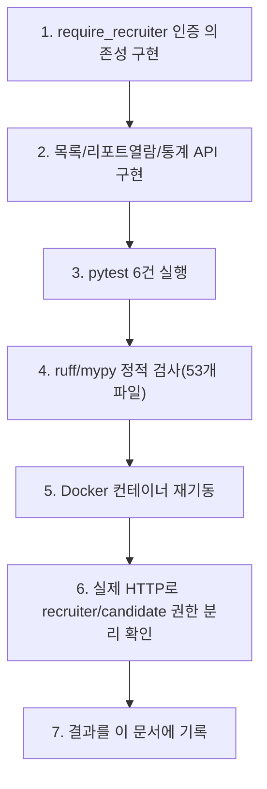
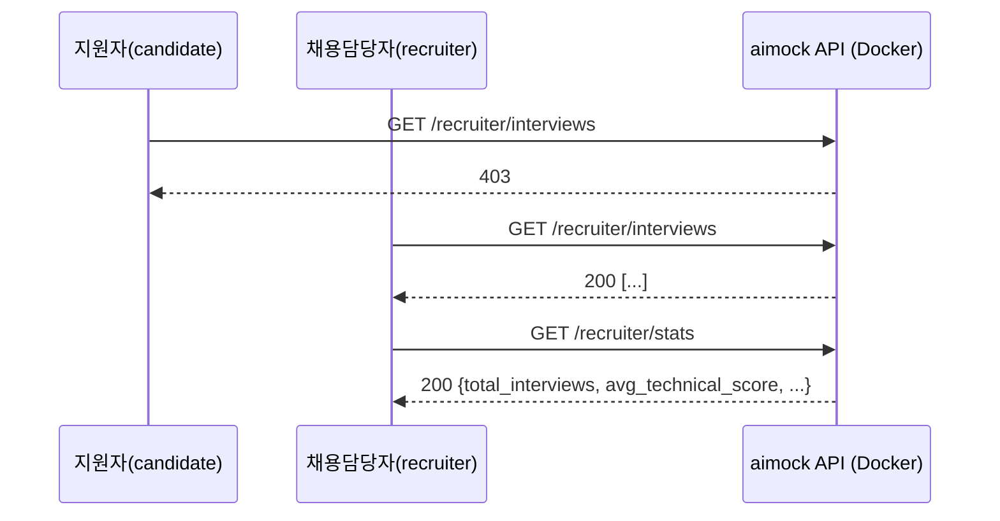

# 내부 테스트 결과 — U5(채용담당자 대시보드)

- 테스트 일시: 2026-09-07 22:05:31
- 대상 TRD: `docs/trd/aimock_u5_trd.md`
- 대상 작업지시서: `docs/workorder/aimock_u5_workorder.md`
- 테스트 수행자: AI (Claude Code) — 사용자가 이번 세션 자동진행을 승인,
  사람의 diff 리뷰는 아직 별도로 필요함

## 1. 테스트 절차

## 2. AC별 pass/fail

| AC | 내용 | 결과 |
|---|---|---|
| AC-1 | recruiter가 전체 지원자 목록 조회(다른 candidate 포함) | **PASS** |
| AC-2 | candidate가 대시보드 엔드포인트 호출 시 전부 403 | **PASS** |
| AC-3 | recruiter가 타인 소유 리포트도 정상 조회(200) | **PASS** |
| AC-4 | 리포트 없는 interview 조회 시 404 | **PASS** |
| AC-5 | 통계(완료 수/평균 점수)가 산술적으로 정확 | **PASS** |
| AC-6 | 토큰 없이 접근 시 401 | **PASS** |

**pytest**: `test_recruiter.py` → `6 passed`. 전체 스위트(U1~U5) →
**`43 passed`**. `ruff` 클린, `mypy` → `Success: no issues found in 53
source files`.

## 3. 실제 Docker 컨테이너 HTTP 검증

실제 응답: candidate 접근 시 `403`, recruiter 목록 조회 `200`(정상
JSON 배열), 통계 조회 `200`(`avg_technical_score: 4.0` 등 실제 DB
집계값). 토큰 없이 호출 시 `401`.

## 4. 판단 근거

- recruiter는 `candidate_id` 소유권 검사를 하지 않는다 — 이건 다른
  단위(U1-b/U2-a/U2-b/U4)의 "본인 소유만" 원칙과 의도적으로 반대되는
  것이며, TRD §0-1에 그 차이를 명시했다(원칙 위반이 아니라 역할별로
  다른 접근 정책임을 근거로 기록).

## 5. 결론

U5까지 완료되어 **마스터 TRD의 Must-have 단위(U1, U1-b, U2-a, U3-a,
U2-b, U4, U5)가 전부 구현·검증 완료**되었다. 남은 것은 Could-have
(U2-c 화이트보드)와 사람이 제공해야 하는 자료(웹캠 샘플→U3-b,
GEMINI_API_KEY→실제 LLM 채점 검증), 그리고 전체에 대한 사람의 diff
리뷰와 git 커밋.
