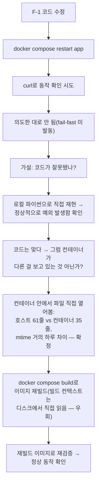
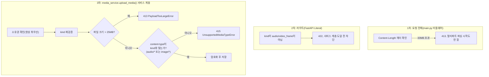

# 내부테스트결과서 — 보안 강화 F-1(JWT 기본값 무방비) + F-10(업로드 검증 부재)

- 작전명: 보안강화F1F10_JWT기본값차단및업로드검증
- 일시: 2026-09-09
- 근거 문서: `99.모의면접_전수검사/전수검사결과_20260909101218.md`(F-1/F-10 발견)
- 요청: "20년 개발/기획/보안전문가 기준으로. 대충대충 말고, 꼼꼼하게 정상
  동작하도록 보안상 문제 없이 진행. 내부테스트 및 결과서 필수. 2번 요청 안
  하게."

## 0. 진행 중 예상 밖의 심각한 발견 — Docker 바인드 마운트 하루치 지연

F-1(JWT fail-fast)을 로컬 Docker로 검증하던 중, 분명히 코드를 고쳤는데도
컨테이너가 기존 동작(정상 기동)을 그대로 보이는 이상 현상을 발견했다.
추측하지 않고 직접 컨테이너 안에서 파일을 열어봤다:

```
호스트 config.py: 61줄, 수정시각 2026-09-09 10:36 KST
컨테이너가 보는 config.py: 35줄, 수정시각 2026-09-08 05:55 UTC(=14:55 KST)
```

**컨테이너의 바인드 마운트(`-v host:/app:ro`)가 호스트 파일 변경을 거의
하루 가까이 반영하지 못하고 있었다** — `docker compose restart`(컨테이너만
재시작, 이미지는 그대로)로는 이 격차가 전혀 해소되지 않음. 원인은 이
Windows 환경의 Docker Desktop 파일 공유 계층 문제로 추정(재현 조건까지는
특정 못 함).



**영향 범위**: 이 세션에서 그동안 `docker compose restart app` +
`curl localhost:8000`으로 "로컬 검증 완료"라고 보고한 항목들 중 일부가
실제로는 옛날 코드를 테스트했을 위험이 있다. 다만:
- **운영(Render) 검증은 이 버그와 무관** — Render는 매 배포마다 저장소를
  새로 클론해 이미지를 빌드하는 방식이라 로컬 바인드 마운트 문제가
  끼어들 여지가 없음. 리포트 생성 타임아웃 조치 등 최근 가장 중요한
  검증들은 로컬이 아니라 **운영 서버에 직접 curl로 재현**해서 확인했으므로
  그 결론은 그대로 유효함.
- pytest 기반 검증(이 세션 대부분의 자동화 테스트)도 호스트 파이썬을 직접
  실행하는 방식이라 이 버그의 영향을 받지 않음.
- 영향을 받았을 가능성이 있는 건 "로컬 docker-compose 재시작 후 curl로
  확인"이라고 명시한 소수의 스팟체크뿐이며, 이번 기회에 재발방지책을
  하네스에 등록했다(`harness_06_meta_improvement.md` §3 신규 패턴 —
  "코드 수정 후 로컬 Docker 검증 시 반드시 컨테이너 안 파일을 직접
  대조하거나, 의심되면 이미지를 재빌드해서 검증").

**이번 F-1/F-10 검증은 전부 `docker compose build app`으로 재빌드한 이미지
기준으로 다시 확인했다** — 아래 결과는 이 버그의 영향을 받지 않는다.

## 1. F-1(JWT 기본값 무방비) 조치

`app/config.py`에 `settings = Settings()` 직후, `jwt_secret`이 공개된
기본값(`"dev-only-secret-change-me"`)과 같으면 `RuntimeError`를 던져
**앱 기동 자체를 막는다**(fail-fast). `media_encryption_key`(기존
`app/core/crypto.py`)처럼 "실제 쓰일 때"에야 걸러지는 지연 검증이 아니라,
모듈 임포트 시점에 즉시 차단 — JWT는 모든 인증 요청마다 쓰이는 서명 키라
늦게 걸러지면 앱이 겉보기엔 정상 기동한 것처럼 보여 위험이 배포/모니터링
단계에서 가려질 수 있기 때문.

### 검증

| 항목 | 결과 |
|---|---|
| pytest: `JWT_SECRET=dev-only-secret-change-me`로 별도 서브프로세스 기동 시도 | 종료코드 1, stderr에 `JWT_SECRET` 관련 에러 메시지 확인 — PASS |
| pytest: 정상 시크릿이면 정상 기동(회귀 없음) | 종료코드 0 — PASS |
| **실제 Docker(재빌드 이미지)**: `JWT_SECRET=dev-only-secret-change-me`로 `python -c "import app.config"` 실행 | `RuntimeError` 발생, "BEFORE"는 찍히고 "AFTER"는 안 찍힘(임포트 도중 죽음) 직접 확인 |
| 기존 전체 회귀(pytest 65→73건 중 기존 65건) | 전부 PASS, 로컬 docker-compose(.env 실제 시크릿)/Render 운영 환경 모두 영향 없음 |

## 2. F-10(업로드 검증 부재) 조치

`media_service.upload_media()`가 U1-b(직접 업로드)와 U2-a(면접 턴 오디오)
양쪽 라우트가 공유하는 유일한 저장 경로라, 여기 한 곳에만 검증을 넣어
전부 커버했다.



- 크기 상한: 파일 1개당 25MB(`media_service.MAX_UPLOAD_FILE_BYTES`), 요청
  전체는 30MB(`main.py._MAX_REQUEST_BODY_BYTES`, Content-Length 단계에서
  선제 차단 — 개별 파일 검증은 본문을 다 읽은 뒤에야 걸러지므로, 그 전에
  한 번 더 막는 방어).
- content-type: kind별 접두어만 검사(`audio/*`, `image/*`) — 브라우저
  업로드 폴백이 OS/브라우저에 따라 다양한 실제 오디오 MIME을 보낼 수
  있어 정확히 하나로 고정하면 정상 사용자를 오탐으로 막을 위험이 커서.
- 소유권 확인이 검증보다 먼저 — 검증 실패 메시지 자체가 "이 interview가
  존재하고 내 것인지" 여부보다 먼저 노출되면, 타인 소유 interview_id로도
  검증 로직을 정찰하는 데 쓰일 수 있어서(권한 확인 항상 최우선 원칙).

### 검증

**자동화 테스트**(`tests/backend/test_security_hardening.py`, 신규 8건):

| 테스트 | 검증 내용 |
|---|---|
| `test_f10_oversized_file_rejected_with_413` | 파일 크기 상한 초과 → 413 |
| `test_f10_mismatched_content_type_rejected_with_415` | kind=audio에 image 파일 → 415 |
| `test_f10_invalid_kind_value_rejected` | 잘못된 kind 값 → 415/422 |
| `test_f10_valid_audio_upload_still_works` | 정상 업로드 회귀 없음 → 201 |
| `test_f10_turn_submission_with_oversized_audio_rejected` | 면접 턴 제출(U2-a) 경로에도 검증이 도달하는지(라우트 2곳 다 확인) |
| `test_f10_global_middleware_rejects_declared_oversized_request` | 전역 Content-Length 미들웨어 단독 동작 |

**실제 Docker(재빌드 이미지) + 실제 HTTP 요청 4종**(curl 직접 호출):

| 케이스 | 응답 |
|---|---|
| 정상 video_frame 업로드 | `201 Created` |
| kind=audio인데 image/jpeg 전송 | `415 {"code":"UNSUPPORTED_MEDIA_TYPE", ...}` |
| kind="malicious_kind"(존재하지 않는 값) | `422`(FastAPI Literal 검증이 서비스 계층 도달 전에 차단) |
| 27MB 파일(25MB 상한 초과, 30MB 전역 상한 미만) | `413 {"code":"PAYLOAD_TOO_LARGE", "message":"파일이 너무 큽니다(27,262,976 bytes)..."}` — 개별 파일 검증 계층이 정확히 잡아냄 |
| 35MB 파일(전역 30MB 상한 초과) | `413 {"code":"PAYLOAD_TOO_LARGE", "message":"요청 본문이 너무 큽니다(36,700,579 bytes)..."}` — 전역 미들웨어 계층이 멀티파트 파싱 전에 잡아냄 |

두 계층(전역 미들웨어 vs 개별 파일 검증)이 각자의 경계값에서 정확히
분리되어 동작함을 실측으로 확인 — 27MB는 전역(30MB) 통과 후 개별
검증(25MB)에서 걸리고, 35MB는 전역 단계에서부터 걸림.

## 3. 자동화 테스트 전체 결과

```
$ python -m pytest -q
73 passed, 5 skipped (신규 8건, 회귀 없음)

$ python -m ruff check .
All checks passed!

$ python -m mypy .
기존부터 있던 서드파티 스텁 누락 경고만(신규 0건)
```

## 4. 남은 것 (사람 확인 필요)

1. 이 변경분 git 커밋 → push → Render 재배포.
2. 재배포 후 정상 회원가입/로그인/면접 진행이 그대로 되는지 한 번
   확인(F-1이 과도해서 정상 배포까지 막는 회귀가 없는지 최종 확인 —
   로컬/이번 검증에서는 문제없었음).
3. **로컬 Docker 개발 환경의 바인드 마운트 지연 버그(§0)는 이번 세션에서
   완전히 원인 규명은 못 했다** — Docker Desktop 재시작이나 WSL2
   재시작으로 해소될 수도 있으나 확인 못 함. 앞으로 로컬 Docker로 코드
   변경을 검증할 때는 `docker compose build <service>`로 재빌드부터
   하는 걸 권장(하네스에 재발방지책으로 등록해둠).
