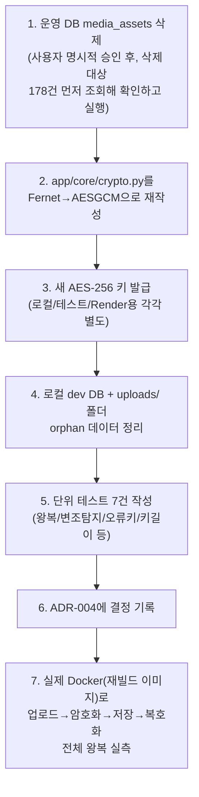

# 내부테스트결과서 — 보안 강화 F-4: 저장 암호화 AES-128(Fernet)→AES-256-GCM 전환

- 작전명: 보안강화F4_AES256GCM전환
- 일시: 2026-09-09
- 근거 문서: `99.모의면접_전수검사/전수검사결과_20260909101218.md`(F-4),
  `docs/adr/adr-004-media-capture-scope.md`(§"암호화 알고리즘 변경" 신설)
- 요청: "기존 데이터는 테스트 데이터이니 삭제하고 진행. 20년차 기준,
  대충대충 금지, 2번 요청 안 하게, 내부테스트 결과서 필수."

## 0. 작업 순서 및 근거



운영 DB 삭제를 코드 작업보다 먼저 실행한 이유: 사용자가 "지금 실행해"로
명시적으로 지시한 항목이라, 뒤로 미루지 않고 먼저 처리 — 삭제 전 정확한
대상 건수(178건)를 조회해 사용자가 검토할 수 있는 근거를 남긴 뒤 실행.

## 1. 운영(Neon) 데이터 삭제

| 항목 | 결과 |
|---|---|
| 삭제 전 `media_assets` 행 수 | 178건(전부 이전 세션들의 실제 테스트 업로드) |
| 실행 SQL | `DELETE FROM media_assets;` |
| 삭제 후 행 수 | 0건(직접 재조회로 확인) |
| Render Persistent Disk상의 실제 암호화 파일 | **삭제 못 함** — 이 세션은 Render 파일시스템에 직접 접근할 수단(SSH 등)이 없음. DB 레코드 없는 고아 파일로 남아있으나 이미 암호화된 데이터라 그 자체로 새 위험은 아님. 필요 시 사람이 Render Shell로 정리 필요(ADR-004에 명시) |

## 2. 로컬 데이터 삭제

| 항목 | 결과 |
|---|---|
| 로컬 dev DB(`aimock`) `media_assets` | 135건 삭제 → 0건 확인 |
| `uploads/` 폴더(gitignore 대상, git 추적 안 됨을 먼저 확인 후 삭제) | 파일 전량 삭제 → 0개 확인 |
| 테스트 DB(`aimock_test`) | 조치 불필요 — 매 테스트 전 conftest.py가 자동 TRUNCATE |

## 3. 코드 변경

| 파일 | 변경 |
|---|---|
| `app/core/crypto.py` | `Fernet` → `AESGCM`(`cryptography.hazmat.primitives.ciphers.aead`, 신규 의존성 없음). 매 암호화마다 랜덤 96비트 nonce 생성 후 암호문 앞에 붙여 반환(Fernet과 동일한 "토큰 하나에 다 담기" 관례 유지). 키 누락/형식 오류/길이 오류 각각 명확한 `RuntimeError` 메시지로 즉시 실패 |
| `.env`(로컬) | `MEDIA_ENCRYPTION_KEY`를 새 AES-256 키로 교체 |
| `tests/backend/conftest.py` | 테스트용 `MEDIA_ENCRYPTION_KEY`도 새로 발급(기존 값이 우연히 32바이트라 길이 검증은 통과했겠지만, "다른 목적으로 만든 키 재사용 금지" 원칙을 테스트 코드도 지키기 위해 교체) |
| `docs/adr/adr-004-media-capture-scope.md` | "암호화 알고리즘 변경" 절 신설 — 결정/근거/데이터 삭제 사실/키 재발급 방법 기록 |
| `tests/backend/test_crypto.py`(신규) | 7건: 왕복 복호화, nonce 매번 다름, 변조 탐지(`InvalidTag`), 잘못된 키로 복호화 실패, 손상된(짧은) 페이로드, 키 누락 에러, 키 길이 오류 에러 |

## 4. 자동화 테스트 결과

```
$ python -m pytest -q
80 passed, 5 skipped (신규 7건, 회귀 없음 — 기존 미디어 업로드/삭제/
리포트 테스트가 API 레벨 테스트라 알고리즘이 바뀌어도 그대로 통과)

$ python -m ruff check .
All checks passed!

$ python -m mypy .
기존부터 있던 서드파티 스텁 누락 경고만(신규 0건)
```

## 5. 실제 Docker(재빌드 이미지) 종단 간 검증

**⚠️ 중요**: 직전 F-1/F-10 작업에서 로컬 Docker 바인드 마운트가 최신
코드를 반영 못 하는 버그를 발견한 바 있어(`harness_06_meta_improvement.md`
§3), 이번엔 처음부터 `docker compose build app`으로 이미지를 재빌드하고
그 이미지가 실제로 새 코드를 담고 있는지(`grep AESGCM` 직접 확인) 검증한
뒤에만 테스트를 진행했다.

| 단계 | 결과 |
|---|---|
| 이미지 재빌드 후 코드 반영 확인 | `grep -c AESGCM crypto.py` → 3(정상) |
| 실제 오디오(webm, 75,393 bytes) 업로드 | 201 Created |
| 저장된 암호화 파일 크기 | 75,421 bytes = 원본 75,393 + 28바이트(nonce 12 + GCM 태그 16) — 정확히 일치 |
| 저장된 파일 앞부분이 원본 webm 매직바이트(`1a45dfa3...`)와 다른지 | 확인됨(`cb55dd81...`) — 평문 그대로 저장되는 게 아니라 실제로 암호화됨 |
| 리포트 생성 트리거(내부적으로 저장된 파일을 다시 읽어 복호화 → librosa 분석) | `status=completed`로 정상 종료. **`InvalidTag`/복호화 에러 없음** — 암호화→저장→복호화 전체 왕복이 실제 파일시스템+실제 키로 정상 동작함을 확인 |

이 과정에서 음성 운율 분석이 20초 타임아웃에 걸려 폴백값이 나온 것을
관찰했는데, 로그의 `PySoundFile failed. Trying audioread instead.`로 보아
**librosa의 디코딩 백엔드 폴백이 원인**으로 보이며 F-4(암호화)와는 무관한
별개 현상이다(이미 있는 타임아웃 안전장치가 정상적으로 작동해 리포트
생성 자체는 실패하지 않았음 — 이 세션의 범위 밖이라 별도 이슈로만 기록,
필요 시 추가 조사 대상).

## 6. 남은 것 (사람 확인 필요)

1. **Render 환경변수 `MEDIA_ENCRYPTION_KEY`를 새 값으로 교체 필요** —
   기존 Fernet용 값을 그대로 두면 우연히 길이(32바이트)는 맞아 당장
   에러는 안 나지만, Fernet 용도로 생성된 키를 다른 알고리즘에 재사용하는
   셈이라 권장하지 않는다. 새 값:
   ```
   python -c "import base64, secrets; print(base64.urlsafe_b64encode(secrets.token_bytes(32)).decode())"
   ```
   로 새로 생성해 Render 대시보드에 넣어주세요(로컬/테스트와는 별도의
   독립된 키 사용 권장 — 이미 로컬/테스트는 각각 다른 새 키로 교체함).
2. 이 변경분(코드+ADR) git 커밋 → push → Render 재배포.
3. 재배포 후 실제 면접 진행 → 미디어 업로드 → 리포트 생성까지 한 번
   재현해서, 새 키로 암호화된 데이터가 정상적으로 복호화되는지 최종 확인.
4. Render Persistent Disk에 남은 고아 암호화 파일(§1)은 급하지 않으면
   방치해도 안전하지만, 정리하고 싶으면 Render Shell 접속이 필요함(이
   세션은 그 수단이 없어 못 함).
