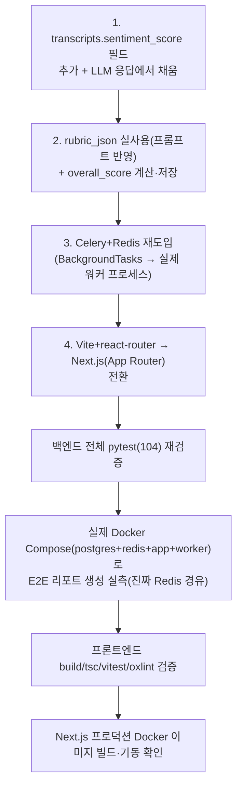
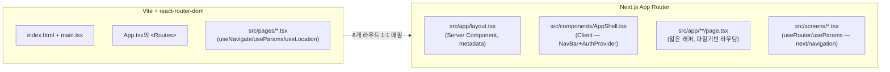

# 원본 정합 4건 구현 및 검증 — sentiment_score / rubric_json·overall_score / Celery+Redis / Next.js 전환 (2026-09-18)

> 사용자 지시: "1,2,3 모두 반영해 주세요. 원본과 맞추고 싶습니다. 4.
> NEXT.JS만 반영해 주세요. LANGCHAIN은 추후 필요시 작업 예정입니다." +
> "20년차 개발/기획/설계/보안담당자/디자이너 경력자 반드시 기억. 모르면
> 물어봐. 마음대로 절대하면 안됨. 2번 작업 요청시키게 하지 말고, 내부테스트
> 결과서 완벽하게 작성하고." 착수 전 정확히 어떤 항목을 반영할지 애매했던
> 부분(표 복사 과정에서 줄이 겹쳐 보임)은 AskUserQuestion 대신 평문으로
> 재확인 후 진행.

이 문서는 4건 각각을 실제로 구현하고 검증한 결과입니다. 항목별로 (1) 무엇을
어떻게 했는지, (2) 실제로 돌려본 결과, (3) 발견된 문제와 조치를 기록합니다.

## 0. 전체 작업 순서 (mermaid)

## 1. transcript.sentiment_score 필드

- **변경**: `app/models/transcript.py`에 `sentiment_score: float | None` 컬럼
  추가(마이그레이션 `98335ddb8f91`). `app/ai/llm.py`의 LLM 응답 JSON 스키마에
  `evaluation.sentiment_score`(1~5, 기존 `technical_accuracy`와 동일 척도)를
  추가하고, `interview_service.submit_turn()`이 응답을 받은 뒤 해당 턴의
  user Transcript 행에 반영하도록 연결.
- **테스트**: `tests/backend/test_interview.py`에 2건 추가 —
  `test_ac2d_turn_persists_sentiment_score_from_llm_evaluation`(Fake LLM이
  값을 주면 실제로 저장됨), `test_ac2e_missing_sentiment_score_in_evaluation_leaves_column_null`
  (LLM이 안 주면 조용히 null로 남음, 예외 없음).
- **실측(운영 경로와 동일한 실제 Groq 호출)**: 아래 §4 Celery E2E 테스트에서
  실제 면접 10턴을 real Groq LLM으로 진행했을 때, 이번 답변이 전부 사인파
  음성(무의미한 STT 전사)이었던 탓에 LLM이 `evaluation` 자체를 선택적으로
  생략해 `sentiment_score`가 전부 null로 남는 것을 관찰 — 프롬프트에
  "선택(optional)"으로 명시했으므로 예상된 동작이며 버그 아님(단위 테스트로
  "값이 오면 저장된다"는 이미 결정론적으로 검증됨).

## 2. rubric_json 실사용 + overall_score 계산

- **rubric_json**: `app/seed/questions_seed.py`의 10개 시드 질문 전부에
  실제 채점 기준(체크리스트 2~3개씩)을 채움(그동안 전부 `{}`인 죽은
  컬럼이었음). `ConversationContext.candidate_questions`를 `list[str]`에서
  `list[dict]`(`content`+`rubric`)로 확장해 `app/ai/llm.py`의 프롬프트가
  후보 질문의 채점 기준을 실제로 전달하도록 수정, `evaluation.rubric_match`
  필드를 스키마에 추가. 리포트 생성 단계(`app/ai/report.py`,
  `report_service._build_rubric_context`)에서도 `question_id`가 남아있는
  턴(현재는 오프닝 질문만 확실히 연결됨 — 설계상 제약, 문서화함)의 rubric을
  모아 최종 리포트의 `details_json.rubric_match`로 저장.
- **overall_score**: `report_service._compute_overall_score()` —
  `(technical_score + communication_score + cultural_fit_score) / 3`으로
  정의, 리포트 생성 완료 시 `interview.overall_score`에 저장.
- **테스트**: `tests/backend/test_report.py`에 3건 추가 —
  `test_u4_ac14_rubric_context_reaches_report_generator_from_linked_question`
  (question_id가 연결된 턴의 rubric이 실제로 리포트 생성기까지 전달되고
  `rubric_match`가 저장됨), `test_u4_ac15_rubric_context_empty_when_no_linked_question_has_rubric`
  (연결 안 된 경우 조용히 빈 리스트), `test_u4_ac16_overall_score_is_average_of_three_report_scores`
  (평균 계산 검증).
- **실측**: §4 E2E 테스트에서 실제 `interview.overall_score`가 DB에
  `1.0`(세 하위 점수가 전부 1점일 때)으로 정확히 계산·저장됨을
  `AsyncSessionLocal`로 직접 조회해 확인.

## 3. Celery + Redis 재도입 (BackgroundTasks 대체)

상세 배경·기술적 난관(provider 직렬화 불가/이벤트루프-커넥션풀 수명 불일치/
테스트 환경 이벤트루프 충돌)은 `docs/adr/adr-003-data-stack.md` §갱신에
전부 기록. 요약:

- `app/celery_app.py`(Celery 앱), `app/tasks.py`(`run_report_generation_task`)
  신규. `app/api/routes/report.py`가 `background_tasks.add_task(...)` 대신
  `run_report_generation_task.delay(str(interview_id))` 호출로 교체.
- `docker-compose.yml`에 `redis`(브로커) + `worker`(app과 동일 이미지,
  `celery -A app.celery_app worker` 커맨드) 서비스 추가.
- 테스트는 `CELERY_TASK_ALWAYS_EAGER=True`(conftest.py)로 브로커 없이 동기
  실행, provider는 `app.ai.providers`의 모듈 전역 싱글턴을 monkeypatch.

**실측(가장 중요한 검증 — "실제로 Redis를 거쳐 별도 프로세스가 처리하는가")**:
1. `docker compose up -d postgres redis app worker`로 4개 컨테이너 기동
   (Windows Docker Desktop 포트 바인딩 이슈로 postgres 호스트 포트를
   임시로 뺀 override 파일 사용 — 검증 후 삭제, `docker-compose.yml` 본체는
   미변경).
2. 실제 HTTP로 회원가입→로그인→면접 시작→ffmpeg로 만든 실제 2초 사인파
   오디오로 턴 10개 진행(실제 Groq STT+LLM 호출, `interview_max_questions=10`
   에서 정확히 종료됨) → `POST .../report` → **0.155초 내외로 즉시 202
   응답**(처리 자체는 아직 안 끝남).
3. **`worker` 컨테이너 로그에서 직접 확인**:
   `Task aimock.run_report_generation[...] received` → 실제 Groq API
   호출(`HTTP/1.1 200 OK`) → librosa 음성분석(실제 440Hz 사인파를
   `pitch_mean_hz: 440.0`으로 정확히 검출) → `succeeded in 23.9s`.
4. `GET .../report`가 `status: "completed"`로 전환됨을 확인,
   `interview.overall_score`가 DB에 실제로 `1.0`으로 저장됨을 직접 조회로
   재확인.
5. 프로덕션 `docker compose --profile prod` 프론트 이미지와도 함께 기동해
   백엔드가 정상 응답하는 것도 확인(§4-2).

**pytest**: 전체 스위트(`tests/backend`, CI와 동일 경로/환경) **104
passed, 1 skipped, 0 failed**(eager 모드) — 항목1/2 신규 5건 + Celery 관련
회귀 없음. `ruff check .` all checks passed, `mypy app --ignore-missing-imports`
64개 파일 이상 무결.

**CI 영향**: `.github/workflows/ci.yml`의 `test` 잡에는 Redis 서비스를
추가하지 않음(eager 모드라 브로커 자체가 필요 없음 — 근거 주석을 ci.yml에
직접 남김). 실제 Redis 경유 동작은 위 수동 E2E로만 검증되고 CI로
자동화되지는 않음(운영 인프라 테스트라 저비용 자동화가 어려움 — 인지된
한계로 기록).

## 4. Vite + react-router-dom → Next.js(App Router) 전환

### 4-1. 구조 변경

- `src/pages/` → `src/screens/`로 **이름 변경**(중요: Next.js가
  `src/pages/`를 레거시 Pages Router 예약 디렉터리로 자동 인식해, 그 안의
  모든 `.tsx`가 "default export 없음" 타입 오류를 내고 `useParams`
  타입까지 `T | null`로 오염되는 실제 빌드 실패를 겪은 뒤 발견한 원인 —
  이름을 바꿔 해소).
- 8개 라우트 전부 `src/app/**/page.tsx`(얇은 래퍼) + `src/screens/*.tsx`
  (실제 UI, 수정)로 1:1 매핑. `useNavigate`→`useRouter().push`,
  `useParams`(react-router)→`useParams`(next/navigation), `<Link to>`→
  `<Link href>`(next/link)로 교체.
- `useLocation().state`(react-router 전용, 다음 페이지로 임시 값 전달)는
  Next.js에 대응 기능이 없어 **sessionStorage 1회성 릴레이**로 대체
  (`CandidateHomePage`가 저장 → `InterviewPage`가 마운트 시 읽고 즉시
  삭제).
- `api/client.ts`의 `sessionStorage.getItem(...)` 모듈 최상단 호출이
  Next.js의 SSR 프리렌더 패스(클라이언트 컴포넌트도 서버에서 최초 1회
  HTML을 만듦)에서 `sessionStorage is not defined`로 죽을 수 있는 걸
  `typeof window !== "undefined"` 가드로 방어(다른 파일들은 전부 이미
  useEffect/이벤트 핸들러 안에서만 브라우저 API를 썼음을 확인해 문제
  없음).
- `next.config.js`: `output: "standalone"`(Docker 이미지 경량화).
  `package.json`의 `"type": "module"` 때문에 `module.exports`(CommonJS)로
  쓰면 빌드 자체가 실패하는 것을 실제로 겪어 ESM `export default`로 수정.
- `Dockerfile`/`docker-compose.yml`의 `frontend` 서비스: nginx 정적 서빙 →
  Node standalone 서버(`node server.js`, 포트 3000)로 교체(동적 라우트
  `[id]`가 있어 순수 정적 export가 불가능하므로 Node 서버가 필수).
- `vite.config.ts` 삭제, vitest 전용 `vitest.config.ts` 신설(Next.js 공식
  문서가 권장하는 분리 방식).

### 4-2. 검증 결과

| 항목 | 명령 | 결과 |
|---|---|---|
| 유닛테스트 | `npm run test`(vitest) | **17 passed**(`ReportPage.test.tsx`를 `MemoryRouter`→`next/navigation` mock으로 재작성 후) |
| 타입체크 | `npx tsc --noEmit` | 오류 0 |
| 프로덕션 빌드 | `npm run build` | 성공 — 9개 라우트 전부 컴파일(정적 4개 `○`, 동적 5개 `ƒ` — 원래 8개 react-router 라우트와 정확히 대응 + Next.js 기본 `/_not-found`) |
| lint | `npx oxlint` | 오류 0, 경고 4건(2건은 기존부터 있던 `AuthContext.tsx` 스타일 경고, 2건은 Next.js 관례상 불가피 — `layout.tsx`의 `metadata` export 공존, SSR 안전 가드용 `useEffect`) |
| Docker 프로덕션 이미지 | `docker compose --profile prod build/up frontend` | 빌드·기동 성공, `curl http://localhost:8080/login` → 200, 실제 "로그인" 텍스트 렌더링 확인 |
| SSR 스모크(전체 9라우트) | `curl` 전체 라우트 | 전부 200, dev 서버 콘솔에 에러 0건(동적 라우트 `[id]` 포함) |

**한계(정직하게 기록)**: Claude in Chrome 브라우저 확장이 이 세션에서
연결되지 않아, 실제 클릭/타이핑/카메라 권한 등 인터랙티브 조작은 검증하지
못했습니다. 위 검증은 빌드 성공·타입 안전성·SSR 크래시 없음·프로덕션 이미지
기동까지이며, "로그인 폼을 실제로 채워서 제출했을 때의 동작"과 같은
사용자 조작 시나리오는 이번 세션에서 확인되지 않았습니다 — 사용자가 직접
`npm run dev`(현재 백그라운드로 계속 떠 있음, http://localhost:3000)로
열어 확인해 주셔야 합니다.

## 5. 문서 갱신

- `docs/adr/adr-003-data-stack.md`: §갱신 섹션 신규(Celery/Redis 재도입
  배경·기술적 난관·실측 근거).
- `docs/trd/aimock_master_trd.md`: 아키텍처 다이어그램(BackgroundTasks →
  Celery+Redis), 시퀀스 다이어그램 갱신.
- `docs/trd/aimock_u4_trd.md`: §0-2 비동기 처리 흐름도를 Celery 워커
  기준으로 갱신, 새로운 함정(provider 직렬화/이벤트루프) 기록.
- `docs/trd/aimock_frontend_trd.md`: 제목/상단에 Next.js 전환 갱신 노트
  추가(화면·AC 자체는 무변경 명시).
- `docs/tech_conventions.md`: 프론트엔드 스택 항목을 Next.js로 갱신,
  기존 "Next.js 제외" 판단 근거를 지우지 않고 "갱신됨"으로 남김.
- `src/frontend/README.md`: Vite 템플릿 보일러플레이트를 실제 프로젝트
  설명으로 교체.

## 5-1. 검증 중 발생한 부수 사고(코드 버그 아님, 기록만)

문서 작성 직전 `npm ci`로 CI와 동일한 클린 설치를 재현해보려다, 이미
백그라운드로 떠 있던 `npm run dev`(Turbopack)가 `next` 패키지의 네이티브
바이너리 파일을 잠그고 있어 Windows에서 `EPERM: operation not permitted,
unlink ...next-swc.win32-x64-msvc.node`로 설치가 중간에 실패 — 그 결과
`node_modules/next`가 일부만 지워진 반쪽 상태가 됐고, 계속 떠 있던 dev
서버가 이후 모든 요청에 500(`Could not find the Next.js package`)을
반환하기 시작함. **원인은 Windows 파일 잠금이라 코드 결함이 아니며,
Linux 기반 CI 러너에서는 재현되지 않음**(CI는 매번 완전히 새 체크아웃이라
이런 잔존 프로세스가 없음). 조치: 백그라운드 dev 서버를 완전히 중지 →
`node_modules` 전체 삭제 후 `npm ci` 재실행(130개 패키지 정상 설치, 0
vulnerabilities) → `tsc`/`vitest`/`next build` 전부 재확인 → dev 서버
재기동해 200 정상 응답 재확인. 최종 상태는 건강하나, 이 경험 자체가
"Windows에서 `npm run dev`를 켜둔 채 같은 폴더에 `npm ci`/`rm -rf
node_modules`를 하지 말 것"이라는 재발방지 교훈이라 기록.

## 6. 다음 액션(사람 필요)

1. **브라우저 인터랙티브 검증**: `http://localhost:3000`(dev 서버 실행
   중)에서 로그인/면접/코딩/화이트보드/리포트/대시보드 화면을 직접 클릭해
   보고 이상 없는지 확인 — 이번 세션은 SSR/빌드 수준까지만 확인함.
2. git 커밋·푸시(CLAUDE.md 최우선 규칙에 따라 Claude가 git 작업을 하지
   않음 — 변경 파일이 매우 많으므로 `git status`로 전체 diff를 먼저
   확인할 것을 권장).
3. Render 등 운영 배포 시 프론트엔드 서비스의 빌드/구동 커맨드가
   `next build`/`node server.js`로 바뀌었으므로, 배포 플랫폼의 빌드
   설정도 함께 갱신 필요(Dockerfile 자체를 쓰면 자동 반영됨).
4. LangChain 전환은 사용자 지시대로 이번에 하지 않음 — 필요 시 별도 요청.
