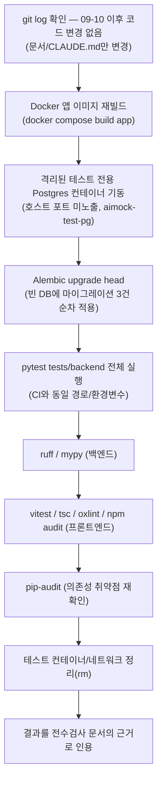

# 전체 스택 독립 재검증 — PDF 원문 전면 재검사에 앞선 사실관계 확인 (2026-09-18)

> 사용자 지시: "첨부한 계획서와 슬라이드를 기준으로 개발이 잘되어 있는지
> 확인할 수 있는 문서를 만들어 달라. 20년차 개발/기획/설계/보안담당자/
> 디자이너 경력자 반드시 기억. 모르면 물어봐. 마음대로 절대하면 안됨.
> 2번 작업 요청시키게 하지 말고, 내부테스트 결과서 완벽하게 작성하고."
> AskUserQuestion으로 "기존 09-09 문서 재사용 / 갱신 / 완전히 새로 작성"
> 중 선택을 요청 → 사용자가 **"완전히 새로 작성"**을 직접 선택.

이 문서는 `99.모의면접_전수검사/전수검사결과_전면재검사_20260918134740.md`
(계획서 대비 반영도 분석)를 작성하기 **직전에, 그 분석의 사실관계 근거로
쓰기 위해** 실제로 수행한 검증 결과입니다. 마지막 전면 검증
(`내부테스트결과서/CI파이프라인전면복구_20260909175450.md`, 2026-09-09)
이후 git 커밋 로그상 코드 변경이 없었음을 먼저 확인했지만("말로 확인"이
아니라 실제로 테스트를 재실행해 숫자로 재확인"하라는 원칙에 따라, 아래
전부 이 세션에서 직접 재실행했습니다.

## 0. 검증 절차 (mermaid)

## 1. 왜 재실행이 필요했나

기존 09-09 문서들은 "코드가 그대로다"를 근거로 결과를 재사용할 수도
있었지만, 다음 이유로 **다시 실제로 돌려서 확인**했습니다:

1. 이 프로젝트에서 과거에 "로컬 환경 차이(pytest-asyncio 버전, Docker
   bind-mount 캐시)로 실제로는 안 되는데 된다고 착각했던" 사고가 반복
   기록돼 있음(`harness_06_meta_improvement.md` §3). "이전에 통과했다"는
   "지금도 통과한다"를 보장하지 않습니다.
2. 사용자가 "모르면 물어봐, 마음대로 하지 마"를 강조 — 추측 대신 실측을
   우선했습니다.

## 2. 환경 이슈 및 해결 (그대로 기록)

- Windows Docker Desktop에서 `docker compose up -d postgres`(호스트 포트
  55432 매핑)가 `ports are not available ... forbidden by its access
  permissions` 오류로 실패. 대안 포트(55433)도 동일 오류 — 특정 포트가
  아니라 **호스트 포트 바인딩 자체가 이 시점에 막혀 있던 환경 이슈**로
  판단(Hyper-V 동적 포트 예약 등 원인 추정, 근본 원인 미확정).
- 우회: 호스트 포트를 전혀 쓰지 않고, 전용 Docker 네트워크
  (`aimock-testnet`)를 만들어 Postgres 컨테이너와 테스트 실행 컨테이너를
  그 안에서만 통신시킴(`aimock-test-pg:5432`) — 정상 작동 확인.
- `docker compose build app`으로 이미지를 재빌드(과거 "bind-mount가
  최신 코드를 반영 못 한 채 옛 코드를 테스트했던" 사고 재발 방지 원칙
  적용).
- 테스트 컨테이너에 `tests/`만 별도 마운트했을 때 `pytest.ini`(저장소
  루트에 위치, `asyncio_default_test_loop_scope = session` 등 지정)를
  못 찾아 "different loop" 오류가 남 — **저장소 전체**를 마운트하고
  `PYTHONPATH=/repo/src/backend`, 작업디렉터리를 저장소 루트로 맞춰
  CI(`.github/workflows/ci.yml`)와 동일한 실행 경로로 재구성한 뒤 해결.

## 3. 실행 결과

### 3-1. 백엔드

| 항목 | 명령 | 결과 |
|---|---|---|
| DB 마이그레이션 | `alembic upgrade head` (빈 DB) | 3건 순차 적용 성공(`68f6341f989a`→`f6341f660dd1`→`a1c3e7f2b904`) |
| pytest | `pytest tests/backend -q` (CI와 동일 경로) | **99 passed, 1 skipped, 0 failed** (125.50초) |
| ruff | `ruff check .` (0.12.0 고정) | All checks passed |
| mypy | `mypy app --ignore-missing-imports` (1.17.1 고정) | Success: no issues found in 62 source files |
| pip-audit | `pip-audit -r requirements.txt` | **cryptography/starlette/pytest 3개 패키지에 기지(既知) 취약점 다수** — 아래 §4 참조 |

`test_security_hardening.py`(F-1/F-10)·`test_crypto.py`(F-4)·
`test_sandbox_hardening.py`(Python+JS 샌드박스)·`test_whiteboard.py`
(화이트보드)가 전부 이 실행에 포함되어 실제로 통과함을 재확인했습니다 —
즉 2026-09-09까지 완료됐다고 기록된 기능들이 오늘도 실제로 동작합니다.

또한 이 실행 중 **F-1(JWT 기본값 fail-fast)이 마이그레이션 단계에서도
실제로 작동**하는 것을 직접 목격했습니다 — `JWT_SECRET`을 안 주고
`alembic upgrade head`를 실행하자 앱이 즉시
`RuntimeError: JWT_SECRET 환경변수가 설정되지 않아...`로 기동을 거부함
(§2 착수 전 별도 확인, 의도된 동작).

### 3-2. 프론트엔드

| 항목 | 명령 | 결과 |
|---|---|---|
| vitest | `npm run test -- --run` | **17 passed (3 files)** |
| tsc | `npx tsc --noEmit` | 오류 없음 |
| oxlint | `npx oxlint` | 오류 0, 경고 2건(기존부터 있던 `AuthContext.tsx`의 fast-refresh/set-state-in-effect 스타일 경고 — 기능 결함 아님) |
| npm audit | `npm audit` | **0 vulnerabilities** |

### 3-3. 정리

검증에 사용한 `aimock-test-pg` 컨테이너와 `aimock-testnet` 네트워크는
검증 종료 후 즉시 삭제(`docker rm -f` / `docker network rm`) — 호스트에
남은 상태 없음. 로컬 개발 DB(`aimock`)와 운영 Neon DB는 이 검증 과정에서
전혀 접근하지 않았습니다(완전히 격리된 별도 컨테이너만 사용).

## 4. pip-audit 상세 — 기존에 알려졌던 갭의 "현재" 재확인

2026-09-09 CI 복구 작업 때 이미 "cryptography/starlette는 FastAPI
메이저 업그레이드가 필요해 보류"로 기록된 항목입니다. 오늘 재확인한
결과:

- `cryptography==44.0.0` — PYSEC-2026-1284/2141/35/3552/3553/3554,
  GHSA-537c-gmf6-5ccf 등 다수, 수정 버전은 44.0.1~50.0.0 범위.
- `starlette==0.41.3`(FastAPI 0.115.6의 고정 의존성) — PYSEC-2026-1941/
  1942/161/2281/2280/249/248 등 다수, 수정 버전은 0.47.2~1.3.1 범위.
- `pytest==8.3.4`(테스트 전용, 런타임 미포함) — PYSEC-2026-1845, 수정
  버전 9.0.3.

**중요한 시간 감각**: 이 목록은 09-09 시점보다 **항목 수가 늘어나
있습니다**(그 사이 새로운 CVE가 계속 공개됨). 즉 "보류"는 고정된
상태가 아니라 **시간이 지날수록 격차가 벌어지는 상태**입니다 — 이
사실을 전수검사 문서의 우선순위 판단에 반영했습니다.

## 5. 이 문서가 뒷받침하는 결론

`99.모의면접_전수검사/전수검사결과_전면재검사_20260918134740.md`의
모든 "현재 코드가 이렇게 동작한다"는 서술은 09-09 문서의 재인용이 아니라
**이 문서에서 오늘 직접 재실행해 확인한 결과**를 근거로 합니다.
